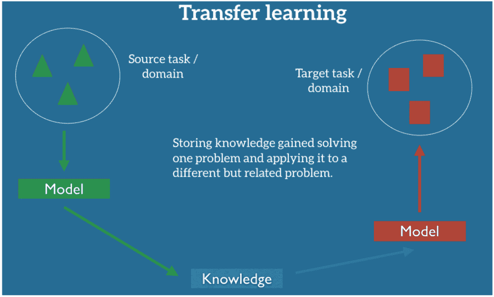

# 迁移学习如何让机器学习更高效

> 原文：<https://thenewstack.io/how-transfer-learning-can-make-machine-learning-more-efficient/>

有没有想过如何扩展训练机器学习模型的过程，而不必每次都使用新的数据集？迁移学习是一种机器学习技术，用于通过利用从解决相关任务中获得的知识来快速解决任务。根据任务的相关性，可以以多种方式重新调整预训练的模型，因此只需要来自新任务的少量标记的示例。迁移学习对于数据科学家和工程师来说都是一个强大的工具，使那些没有办法从头训练模型的人能够从深度模型学习的强大功能中受益。

## 什么是迁移学习？

 [马克·库尔茨

Mark Kurtz 是 Neural Magic 的机器学习负责人。他是一位经验丰富的软件和机器学习领导者，在使机器学习模型成功和高性能方面取得了成功。Mark 管理团队和工作，确保组织从其机器学习投资中实现高回报。他目前正在 Neural Magic 构建一个*软件 AI* 引擎，目标是为商用 CPU 带来 GPU 级的深度学习性能。](http://www.neuralmagic.com) 

[监督学习](https://towardsdatascience.com/a-brief-introduction-to-supervised-learning-54a3e3932590)是学习一个函数的问题，该函数基于示例对将输入(观察)映射到输出(标签)。迁移学习是监督学习的一种变体，当我们面对一项只有有限数量的标记样本的任务时，我们可以使用它。或者，如果数据稀缺不是一个问题，当我们希望避免花费大量资源来训练数据饥渴的模型时，我们可以利用迁移学习。

如果收集或注释标记的示例很困难或很昂贵，则可能会出现训练数据的缺乏，但同时，该任务可能仍然需要大型(因此数据饥渴)的机器学习模型来解决它。由于这些原因，通常没有足够的数据从头开始将模型训练到可接受的精度水平(或另一个性能标准)。

为了克服数据稀缺或避免从头开始训练模型，我们可以利用从相关任务(源任务)的模型训练中获得的知识，有许多标记的例子，来解决手头的原始任务(目标任务)。这是迁移学习的主要自负，当源任务和目标任务需要相似的信息来解决时，它往往是成功的。

一般迁移学习方法示意图([图片来源](https://ruder.io/transfer-learning/))。我们感兴趣的是利用在一个任务上训练的模型中包含的知识来通知用于解决另一个任务的模型。

例如，在图像上训练的机器学习模型[学习相似的特征](https://towardsdatascience.com/how-to-visualize-convolutional-features-in-40-lines-of-code-70b7d87b0030)(边缘、拐角、梯度、简单形状等。)来自不同的图像数据集，表明这些特征可以被重用来解决其他图像识别任务。

AlexNet 学习的 ImageNet 特性示例([图片来源](https://papers.nips.cc/paper/4824-imagenet-classification-with-deep-convolutional-neural-networks.pdf))。

迁移学习可以根据源任务和目标任务之间的相似性和差异性进一步细分:

*   源任务和目标任务可能共享也可能不共享公共输入(特征)空间(例如:源任务的输入是 32×32 RGB 图像，而目标任务的输入是 128×128 灰度图像)
*   源和目标任务特征的分布可能不同也可能不同(例如:源任务是对猫和狗的卡通图画进行分类，而目标任务是对猫和狗的真实图像进行分类)
*   源任务和目标任务可以共享也可以不共享一个公共输出(标签)空间(例如:源任务包括对猫和狗的图像进行分类，而目标任务是围绕(检测)图像中的任何猫或狗绘制边界框)
*   给定特征的源和目标任务标签的条件分布可能不同，也可能不同(例如:源和目标任务都涉及具有相同标签空间的分类，但是在目标任务中，一些标签比其他标签少得多)

## 迁移学习是如何实施的？

假设源任务和目标任务共享共同的特征和标签空间，用神经网络进行迁移学习的基本方法如下:

1.  将神经网络训练到与手边的目标任务充分相关的源任务的高精度水平；这就是所谓的预训练阶段。另一种选择是使用来自模型回购的预训练模型。
2.  使用可用于目标任务的标记示例重新训练神经网络的后面的层；这就是所谓的微调阶段。一种选择是在重新训练之前修复或“冻结”神经网络的早期层(例如，修复网络中除最后一层之外的所有层)。这一步是可选的，根据设置，可以帮助或伤害这个过程。

使用这种方法，步骤#1 结束时的神经网络包含大量与解决源任务相关的信息。步骤#2“保存”网络在其早期层中学习的表示，并且在步骤#3 期间，它被用作学习解决目标任务的起点。这样，我们只需要少量的例子来微调网络后面各层的参数，而不需要大量的例子来预训练整个模型。这种基本方法可以很容易地适应前一节中概述的不同类型的迁移学习。

如果源任务和目标任务具有相似的特征空间，我们可以预期从步骤 3 重新训练的网络将能够利用从源任务学习的表示来解决目标任务。

这种方法的一个引人注目的[例子](https://arxiv.org/abs/1403.6382)涉及使用一个[卷积神经网络](https://cs231n.github.io/convolutional-networks/) (CNN)的学习特征，该网络被训练来对 [ImageNet](http://image-net.org/challenges/LSVRC/2013/) 或[开放图像](https://opensource.google/projects/open-images-dataset)图像数据集进行分类。在这里，CNN 学习的卷积特征被认为是一种通用的图像表示，并被重新用于解决图像分类、场景识别、细粒度识别、属性检测和多样化数据集集合上的图像检索任务——通常匹配或优于最先进的从头开始解决这些问题的方法。这些数据集中，许多数据集的标记示例远少于 ILSVRC13 训练可用的标记示例，从经验上证明了迁移学习提供的[统计效率](https://en.wikipedia.org/wiki/Efficiency_(statistics))。

## 迁移学习将如何使机器学习应用民主化？

正如我们所讨论的，迁移学习在以下情况下是有用的:( 1)我们没有办法筛选足够大的数据集来从头训练模型，或者(2)我们希望避免花费从头训练模型所需的计算资源或时间。在正确的情况下，迁移学习可以为更多的工程师打开大门，让他们尝试新的深度学习应用。例如，一个应用程序(参见本文中的案例研究#1)对一个预训练的 ImageNet 模型进行了微调，以便在猫与狗的图像分类任务中用很少的训练样本实现高性能。

即使没有数据集管理、模型构建和优化的深入知识，现有模型也可以在目标任务领域中的少量标记示例上进行微调，直到达到令人满意的性能水平。迁移学习使个人和小型组织能够受益于深度模型强大的表示能力，而不需要通常所需的时间或预算能力。

通过 Pixabay 的特征图像。

<svg xmlns:xlink="http://www.w3.org/1999/xlink" viewBox="0 0 68 31" version="1.1"><title>Group</title> <desc>Created with Sketch.</desc></svg>