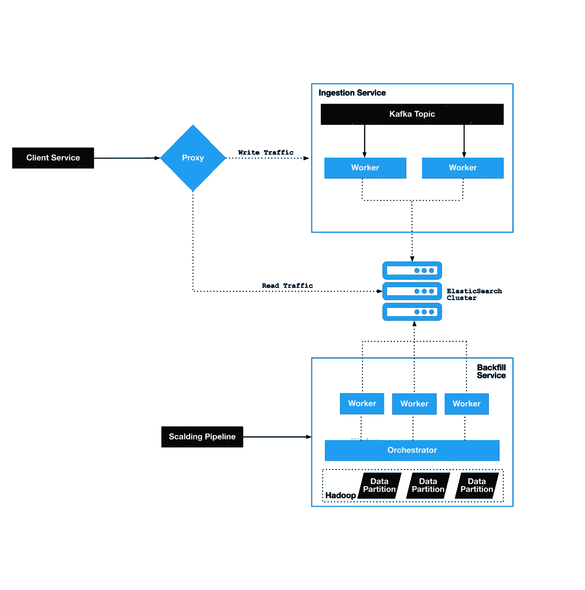

# Twitter 如何扩大搜索规模

> 原文：<https://thenewstack.io/how-twitter-supersized-search/>

任何经历过过去几年的人都知道 Twitter 的使用是如何在瞬间激增的。

该网站的搜索功能也受到重创。在这个兴趣高涨的时代，Twitter 的搜索基础设施工程师们已经在搜索系统的架构中添加了代理、摄取层和回填层，以减少实时平台的延迟。

搜索基础设施团队是 Twitter 上推文、用户、直接消息和所有其他可搜索内容的实时搜索平台背后的工程力量。最近由推特高级软件工程师 [Shelby Cohen](https://www.linkedin.com/in/cohenshelby/) 和推特软件工程师 [Jesse Akes](https://www.linkedin.com/in/jesse-akes/) 撰写的[博客帖子](https://blog.twitter.com/engineering/en_us/topics/infrastructure/2022/stability-and-scalability-for-search)详细介绍了系统架构的更新如何在最大流量压力的情况下降低延迟。

[Twitter](https://thenewstack.io/what-elon-musks-twitter-takeover-means-for-developers/) 在 Elasticsearch 的基础上实施了三个定制解决方案，以弥合搜索引擎与高容量和不可预测流量带来的独特需求之间的差距。

反向代理现在直接位于客户端服务之后并缓解瓶颈，新的摄取服务通过管理流量峰值溢出增加了新的可靠性层，回填服务提供了一种安全的方法来将缺失的数据添加到新的和现有的弹性搜索集群。

## **什么是 Elasticsearch？**

[Elasticsearch](https://thenewstack.io/this-week-in-programming-the-elasticsearch-saga-continues/) 是业界广泛使用的开源搜索引擎，以其分布式、速度、可扩展性和简单的 REST APIs 而闻名。它基于 Lucene 库。

搜索基础设施流公开了所有的 Elasticsearch APIs，因为它们“功能强大、灵活且有据可查”。然后提供插件和工具来确保与 Twitter 服务的一致性和轻松集成。

## **全新的分层架构**

下图说明了新的架构。这清楚地显示了在集群周围添加层如何有助于减轻客户直接与弹性搜索交互的挑战。

## **代理人**

在添加任何新组件之前，查询和索引、请求监控和指标收集都是直接从客户端到 Elasticsearch 的。Twitter 确实实现了一个 Twitter 定制插件，用于额外的安全性/隐私和额外的指标收集，但它没有任何瓶颈缓解功能。

为了缓解 Twitter 规模带来的瓶颈，Twitter 引入了一个反向代理作为摄取服务的前端。这个简单的 HTTP 服务在 Twitter 的客户和他们的 Elasticsearch 集群之间增加了一层。该设计为所有请求创建一个入口点，处理所有客户端身份验证，提高连接性和可观察性，并分离读取和写入。

## **摄取服务**

Elasticsearch 管道只是没有内置的自动节流或降级机制来处理由高调的 Twitter 戏剧导致的流量高峰。默认情况下，针对大流量峰值的通用安全机制(查询、重试和回退)由每个 Twitter 用户的设备来实现。  充其量看起来像增加了索引和查询延迟。在最坏的情况下，它看起来像总索引/集群丢失。

为了应对之前不利的解决方案，搜索基础架构团队创建了摄取服务，该服务为每个 Elasticsearch 集群提供了一个完全专用的 Kafka 主题，内置了处理这些大峰值的功能。工作客户端从主题中读取数据，并将请求从主题发送到集群。摄取服务批处理请求、监听背压、自动调节和回退重试，以减轻群集的流量峰值，避免过载并保持较低的延迟。

## **回填服务**

任何时候丢失的数据被添加，Twitter 都认为是“回填”。这包括一个空的 Elasticsearch 集群，添加或更新模式字段，以及迟到的数据。回填是数百万亿字节的数据，数百万甚至数十亿的文档。吞吐量远高于典型的摄入管道，这意味着回填需要很长时间。前景充满了出错的机会。

Twitter 的旧工作流程没有内置的数据传输护栏，但它以最快的速度做到了。正因为如此，Twitter 无法安全地回填一个动态集群，因为要么一个索引会落后，要么在所有连接和传入数据的压力下崩溃。最好的情况是存在查询性能问题。最坏的情况是整个集群都会死掉。这些失败过了很长时间才显现出来。

回填服务通过分三个阶段将大量数据安全有效地加载到弹性搜索索引中来解决上述问题。接收器(类似于旧服务的入口点)接收要索引的数据流，将其转换为索引请求，并在临时存储中进行分区和分段，然后启动对回填编制器的调用。

回填协调器是回填服务的大脑，它将信息从接收器连接到托管 Elasticsearch 集群的内部 Twitter 服务环境。使用来自接收器的信息，orchestrator 启动动态数量的工作线程来开始回填。回填工作器是小型分布式应用程序，从存储中读取索引请求，并将数据索引到集群中。

接收器对索引数据进行分区，并将其保存在临时存储器上，以便重新运行和恢复回填。如果集群失败，Twitter 不需要重新运行作业来再次准备数据。工作进程通过限制速率和重试批量请求中的单个文档失败来自动响应反压力。这极大地降低了查询性能对活动集群的影响以及索引完全失败的可能性。

回填可以在 Twitter 的所有数据中心同时进行——在多个地区完成一次回填所需的开销更少，工作量更小。

## **结论**

Twitter 的规模可以把 Elasticsearch 推向最大。通过添加解决每个挑战并针对特定需求的定制解决方案，数据流可以被细化为更适合 Elasticsearch 容量的内容。

<svg xmlns:xlink="http://www.w3.org/1999/xlink" viewBox="0 0 68 31" version="1.1"><title>Group</title> <desc>Created with Sketch.</desc></svg>