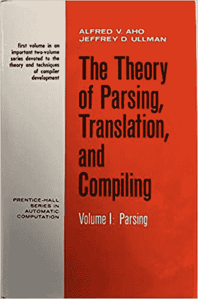
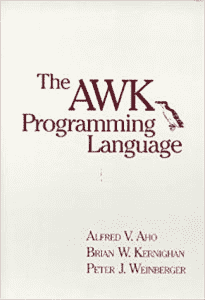

# 两位贝尔实验室的研究人员如何为现代编译器制定规则

> 原文：<https://thenewstack.io/how-two-bell-labs-researchers-set-the-rules-for-the-modern-compiler/>

历史悠久的贝尔实验室研究机构的两位校友最近获得了计算机编程领域的最高荣誉之一。

79 岁的阿尔弗雷德·艾侯和 78 岁的杰弗里·厄尔曼获得了著名的计算机械协会(ACM)颁发的图灵奖，ACM 是一个拥有 10 万名成员的专业团体[，它将](https://www.acm.org/about-acm/about-the-acm-organization)描述为“世界上最大的科学和教育计算协会”自 1966 年以来，该组织每年都会颁发该奖项，以表彰“对计算机领域具有持久和重大技术重要性”的贡献，它被称为计算的诺贝尔奖 ACM 非常重视这一声明。2011 年，网络世界报道说，ACM 甚至一度与诺贝尔基金会[接触，提议资助一项诺贝尔计算奖](https://www.networkworld.com/article/2177705/data-center-why-there-s-no-nobel-prize-in-computing.html)——但遭到拒绝。ACM 奖项委员会的联合主席告诉该出版物，“我们认为我们的奖项质量是可比的。”

Ullman 和 Aho 一生致力于“编程语言实现的基础算法和理论，并在他们极具影响力的书籍中综合了这些成果和其他成果，教育了一代又一代的计算机科学家”，因此被 T4 官方认可

该奖项展示了两位科技工作者如何对世界产生影响，留下了一份遗产，并以简单但不可辩驳的方式提醒人们，我们如何始终以前人的工作为基础。但同样令人振奋的是，这两个人因致力于分享他们所学到的知识而得到认可。

## 翻译技术

在宣布 2020 年奖项时，ACM 注意到获奖者的工作产生了非同寻常的巨大影响。虽然我们今天的技术是由软件驱动的，但“实际上，我们世界上运行的每一个程序——从我们手机或汽车上的程序，到大型网络公司内部巨型服务器农场上运行的程序——都是由人类用高级编程语言编写的，然后编译成低级代码来执行。

“在引擎盖下，为现代编程语言做这种翻译的大部分技术都要归功于今年的图灵奖获得者。”

美国计算机学会的网站甚至认为，高效的编译器“今天的存在在很大程度上归功于 Aho 和 Jeffrey D. Ullman 的工作。”一篇[最近的文章](https://cacm.acm.org/magazines/2021/6/252834-getting-down-to-basics/fulltext)解释了这两者如何基本上为这些代码翻译编译器的工作方式提供了一个早期且有影响力的路线图。它从代码检查“词法分析”开始，接着是语法检查解析器，然后是更大整体的最终语义分析，创建一个中间输出，然后可以优化成适合您的特定机器的高速机器语言。但是 Ullman 和 Aho 首先系统地研究了所有现存的用于编译和解析的模型和算法，Aho 在 ACM 采访中回忆道。然后，他们综合了他们在 1972 年的书[“解析、翻译和编译理论”中学到的东西](https://dl.acm.org/doi/10.5555/578812)

然而，他们也继续他们的工作和研究，一路上为 Unix 工具`Lex`和`Yacc`创建一些组件，帮助编译器的自动创建。事实上，`Yacc`或多或少是根据观察 Aho 的工作方式而发明的。在 1994 年出版的《Unix 的四分之一世纪》一书中，他们在贝尔实验室的同事 Stephen C. Johnson 回忆说，Aho 花了几个小时为 B 编程语言创建了一个庞大的解析表——但随后发现了一个错误，不得不删除该表的大部分内容。(结果发现了另一个错误……)

“所以我说，‘艾尔，你为什么不告诉我你在做什么？’他说，‘嗯，好吧，这真的没那么难。他告诉我怎么做桌子。我说，‘哦，好吧，我可以写一个程序来做这件事。’他说，“真的吗？”于是`Yacc`就这样诞生了。"

## 贝尔的一课:教学的价值

在 ACM 的采访中，阿霍分享了他在贝尔实验室从理查德·海明那里学到的重要人生经验，理查德·海明是一位数学家(前曼哈顿计划科学家)，于 1946 年加入贝尔实验室。根据 ACM 网站上的[传记，海明本人早在 1968 年就获得了第一批图灵奖之一，但到了 1960 年，他已经开始讲授计算机科学，最终在 1976 年完全离开了贝尔实验室，在加州蒙特里的海军研究生院担任高级讲师职务。你得教别人如何使用你的作品。](https://amturing.acm.org/award_winners/hamming_1000652.cfm)

“我发现做研究、写书和教学的结合是一种非常富有成效的结合……”

Aho 开始认识到合作的价值，以及分享你所学到的东西的价值。根据 ACM 的网站，即使在乌尔曼离开加入学术界后，他仍然会每周回到贝尔实验室一次，继续与 Aho 合作。“尽管在不同的机构工作，”ACM 报道说，“Aho 和 Ullman 继续合作了几十年，在此期间，他们共同撰写了书籍和论文，并介绍了算法，编程语言，编译器和软件系统的新技术。”

ACM 指出，Aho 最终在 1995 年获得哥伦比亚大学的教职之前，继续在贝尔实验室工作了 30 多年(在那里他成为了该组织计算科学研究的副总裁)。

在他们的第一本书之后，Aho 和 Ullman 继续研究编译器，这导致了第二本书的出版，书名为*“编译器设计原理”*——这是一本无处不在的书，有时被称为“龙之书”，因为它的封面上有熟悉的龙的插图。随后的版本增加了合作者，像拉维·塞西和林凯玲。

甚至几十年后，在 2016 年的一个视频中，乌尔曼承认“我一直认为我的贡献在于我写的书，以及它如何影响年轻人做他们自己的伟大工作。他们中的许多人已经走上了比我更伟大的事业。”(他指出，他在斯坦福的一个学生是未来谷歌的联合创始人谢尔盖·布林。)

[https://www.youtube.com/embed/rQtPndgbD-4?feature=oembed](https://www.youtube.com/embed/rQtPndgbD-4?feature=oembed)

视频

## 衡量影响

作为关于今年图灵奖获奖者文章的一部分，ACM 还采访了微软研究院量子计算小组的负责人 [Krysta M. Svore](https://www.microsoft.com/en-us/research/people/ksvore/) 。Svore 记得她在哥伦比亚大学上学时上过 Aho 的课，在那里她学到了他和 Ullman 在 20 世纪 60 年代和 70 年代发展的思想，她现在正将其应用于前沿研究。“他们开发的东西对于在智能手机、量子计算机和笔记本电脑上编写程序仍然至关重要。这些技术永远至关重要。”

ACM 网站上的获奖者简介指出，“他们自 20 世纪 70 年代以来的工作影响如此深远，如此普遍，以至于很容易被认为是理所当然的。任何用 C 语言或其衍生语言编程的人；任何使用过 Unix 工具的人，如 AWK、fgrep、Lex 和 YACC；任何上过编译课程的人；或者任何一个仅仅通过阅读龙之书就构建了编译器的人，都被 Aho 和 Ullman 的作品所感动。”

它称赞他们的书“计算机算法的设计和分析”从广泛的算法中锻造了一系列设计方法，包括分治、递归和动态编程，“这些方法早已进入计算机科学家的标准工具箱。”

今年三月，Aho 和乌尔曼图灵奖的[宣布甚至包括来自谷歌高级研究员和谷歌人工智能高级副总裁 Jeff Dean 的一些掌声。Aho 和 Ullman 建立了关于算法、形式语言、编译器和数据库的基本思想，这些思想在今天的编程和软件领域的发展中发挥了重要作用](https://awards.acm.org/binaries/content/assets/press-releases/2021/march/turing-award-2020.pdf)

在同一份声明中，ACM 主席 Gabriele Kotsis 称他们的工作“特别有影响力”。它们帮助我们理解了算法的理论基础，并为编译器和编程语言设计的研究和实践指明了方向。

Aho 和 Ullman 自 20 世纪 70 年代初以来一直是思想领袖，他们的工作一直指导着一代又一代的程序员和研究人员直到今天

<svg xmlns:xlink="http://www.w3.org/1999/xlink" viewBox="0 0 68 31" version="1.1"><title>Group</title> <desc>Created with Sketch.</desc></svg>