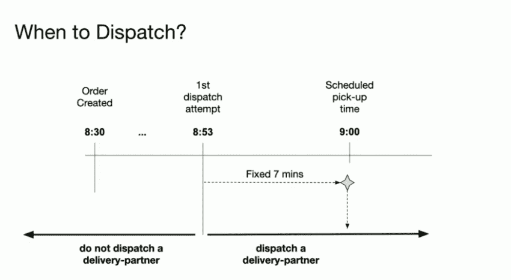
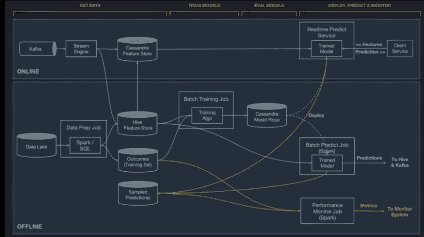
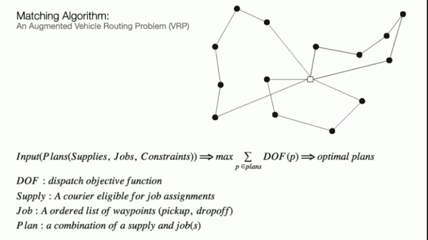
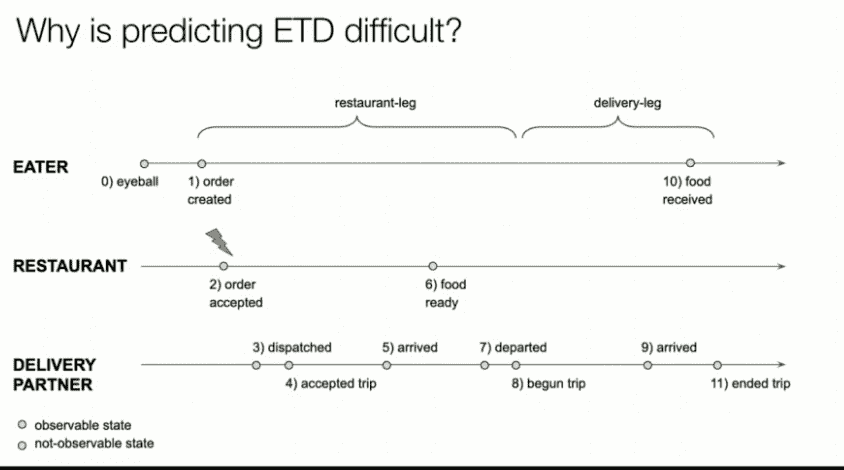

# 优步如何吃饭使用机器学习来估计送货时间

> 原文：<https://thenewstack.io/how-uber-eats-uses-machine-learning-to-estimate-delivery-times/>

估计司机为许多不同餐馆取送餐订单的最佳时间可能是最困难的计算问题之一。把它想象成一个 NP-Hard 组合优化问题:顾客希望食物及时送达，而送餐员希望他们到达时食物已经准备好。如果估计有一点点偏差，那么客户就会不高兴，送货人就会去别处工作。

然而，汽车共享服务[优步](https://www.uber.com/)正在建立一个名为[优步吃](https://www.ubereats.com)的全球服务，这将依赖于准确的预测来取得成功。其成功的秘密将是机器学习，建立在公司内部的 ML 平台上，昵称为[米开朗基罗](https://eng.uber.com/michelangelo/)。

[王梓](https://www.linkedin.com/in/prince6635/)，优步优步高级软件工程师，负责该公司的时间预测工作，[在上个月的 QCON New York](https://qconnewyork.com/ny2019/presentation/automating-ml-deployment-kubeflow-presentation) 上提供了一个解释，解释了使用人工智能进行这些时间估计的过程。

2015 年在多伦多推出的 Uber Eats 已经在全球 400 个城市推出，有 22 万家参与餐厅。它为餐馆提供送餐服务，使用其汽车共享服务中的自由司机。预测配送时间的能力——包括食物准备好的时间和配送时间——对服务的成功至关重要。它在 2018 年预订了超过 80 亿美元的订单。

王的经验可能对新兴 O2O(线上到线下)电子商务供应商的其他业务有价值，这些供应商必须从狭窄和不可预测的公差中挤压利润。

2015 年，王开始在改进公司的调度系统，但这项工作让他进入了 ML。

这项服务的目标是为最终用户提供可靠、轻松、实惠的食品配送。“我们希望确保食品将被无缝交付，这需要我们预测未来，并在订单和交付合作伙伴之间保持平衡，”王说。对于每个订单，系统必须做出三个预测:送货时间、送餐时间和餐厅准备订单的时间。预测变得更加困难，因为优步根本不知道餐馆老板准备一顿饭要花多长时间。

时机是关键。Uber Eats 想在订单准备好的时候派遣送货员刚好到达。如果时间太早，送货员会不必要地等待，因为其他可能的订单而损失金钱。但是等得太久，食物可能会到得太晚，或者对饥饿的顾客来说是冷的。

当用户打开应用程序，仔细阅读选择的餐馆时，他们会得到食物到达的大致估计时间。它还为餐馆提供了估计食物准备需要多长时间的能力，餐馆可以根据需要进行调整。

Kafka 收集所有数据，并将其推送到流媒体引擎进行预处理，然后存储在 Cassandra 数据存储中，由 Spark 进行数据建模处理。经过训练并准备使用的模型存储在 Cassandra 模型库中。

王承认，为调度系统的问题空间寻找最优状态是一个 NP 难的计算机问题。“对于我们做出的每一个决定，我们都会考虑所有的合作伙伴，”王说，他指的是用餐者、送货员和餐厅。最佳状态是每个利益相关者得到最理想的结果:用餐者最快的送货时间，送货者最准确的到达时间，以及餐馆最准确的食物准备估计。

一旦下了订单，调度系统必须生成最准确的时间将司机送到餐厅。

“我们希望送餐伙伴在食物准备好的准确时间到达。我们不想让他们太晚到达，因为食物会变冷。我们不希望他们太早到达，因为他们在那里浪费时间，而且他们会占用餐厅的停车位和用餐空间，”王说。

在 ML 之前，Uber Eats 使用了一种[贪婪算法](https://www.geeksforgeeks.org/greedy-algorithms/)来确定何时派遣送货人，该算法通过估计每次送货的最佳本地答案来解决问题，而没有为该区域的所有司机优化问题空间。这对于整个服务来说并不是很好，因为它导致了延迟交付和送货员在餐厅停车场等待订单完成。
T3

贪婪算法将简单地为特定订单找到最近的驱动程序。相比之下，全局优化将解决所有司机和所有皮卡的最佳时间。王举了一个假设的例子:一个贪婪算法将两个司机匹配到他们最近的订单，总行程时间为 6 分钟，可能会交换这两个司机的皮卡，这样两个订单的总时间将只有 4 分钟。

有了 ML，在给定所有工作和所有可用司机的情况下，可以从该地区所有餐馆的所有旅行时间的历史中估计旅行时间。Uber Eats 的方法结合了历史数据、近实时数据和实时数据。“通过全球匹配算法，我们能够同时考虑所有的工作和供应，”他说。“我们能够在一个单一的全局优化问题中解决整套工作和供应。”

然而，准备点菜的时间可能会很棘手，这在很大程度上是因为优步无法在现场看到厨房工作人员准备食物需要多长时间。它可以通过送货员离开餐厅的时间来估计，尽管这是有限的价值，因为当送货员到达时，食物可能已经吃完了。

这是 ML 可以提供洞察力的地方，具有额外的上下文线索，既有历史的，也有接近实时的:该系统利用这样的因素，如过去一周的平均食物准备时间，未完成订单的数量和每个订单的价格，甚至是星期几。甚至可以使用实时指标，例如当时正在处理多少其他订单，甚至是来自其他交付服务的订单。

“结合所有这些特征有助于我们做出比仅仅依赖其中一个更准确的预测，”他说。

<svg xmlns:xlink="http://www.w3.org/1999/xlink" viewBox="0 0 68 31" version="1.1"><title>Group</title> <desc>Created with Sketch.</desc></svg>