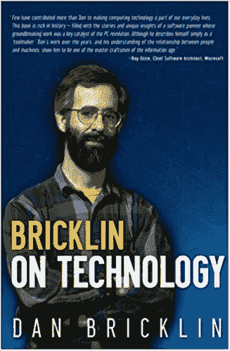

# VisiCalc 的电子表格如何改变世界

> 原文：<https://thenewstack.io/how-visicalcs-spreadsheets-changed-the-world/>

这是第一个流行的电子表格程序 VisiCalc 的 40 周年纪念日，这个周年纪念日引发了对这个杀手级应用程序的一些新的回忆，它忠实于其“人民的力量”的起源，让人们玩数据——并通过普及个人电脑，帮助改变了世界。

VisiCalc 的第一个广告出现在 1979 年 5 月的 *Byte* 杂志上，联合创始人丹·布里克林在他的个人网站上回忆道。另一页记得同一个月 VisiCalc 也在旧金山的西海岸电脑展上展示过[。它于 1979 年 6 月在纽约举行的国家计算机会议上正式向公众公布。](http://www.bricklin.com/history/saiwccf.htm)

“1979 年夏末，我们首次向一些早期客户发送了大约 5 份 1.35 版本的拷贝，”布里克林写道，并补充道:“我手写了标签。”

但故事真正开始于一年前的 1978 年，当时布里克林正看着他在哈佛商学院的教授手动更新黑板上的数字网格…

## 一个概念的诞生

事实上，几年前“电子表格”一词最初的意思是一个手写的表格，潦草地写在一本打开的账簿的两页上。在 2016 年的一次 TED 演讲中，布里克林记得他的父亲巴鲁克·布里克林甚至使用分类账电子表格来经营他在费城的小型印刷业务。“几百年来都是这么做的。”

但是在 1978 年那个灾难性的夏天——在玛莎葡萄园岛骑自行车的时候——布里克林[决定在他获得 MBA 学位后创建一家软件公司，根据他的网站。具有讽刺意味的是，他从实际的分类账电子表格中为 VisiCalc 在纸的背面画了一个图表。](http://www.bricklin.com/history/saiidea.htm)

布里克林写道，他甚至从一些教授那里得到了建议。芭芭拉·杰克逊教授告诉他追求简单的用例场景，因为他将与信封的背面竞争。布里克林在继续他在商学院的学业的同时，与鲍勃·弗兰克斯顿合作——他是在麻省理工学院的本科生时认识的，当时他正在研究 Multics 项目。

很高兴看到布里克林的网站保留了软件的起源故事。这两个年轻的极客在一个周末创造了第一个原型，弗兰克斯顿在借来的苹果 II 上输入代码。它使用 Apple II 的游戏手柄来移动光标，并使用“fire”按钮从水平滚动变为垂直滚动。很快，这就变成了用键盘上的两个箭头键来导航，用空格键来改变滚动方向。

当 VisiCalc 最终准备向公众展示时，布里克林的父亲在家族印刷业务中印刷了一份营销手册。

## 持久的影响

史蒂夫·乔布斯曾称 VisiCalc 的发明是“推动行业前进的一次爆炸”

[https://www.youtube.com/embed/IU96Pd_npn4?feature=oembed](https://www.youtube.com/embed/IU96Pd_npn4?feature=oembed)

视频

事实上，布里克林告诉他的 TED 观众，乔布斯一直很有风度地称赞 VisiCalc 在苹果的成功中发挥的作用，分享了他最喜欢的史蒂夫·乔布斯的两句名言。

*   VisiCalc“比任何其他单一事件都更能推动(苹果)的成功……”
*   "如果 VisiCalc 是为其他计算机编写的，你现在可能正在面试其他人."

“人们普遍认为这是第一个‘杀手级应用’，”BBC 认为——但它的意义可能更大。

布里克林传记后面的简介引用了微软首席软件架构师雷·奥茨的话说，“在让计算技术成为我们日常生活的一部分方面，很少有人比丹贡献得更多”，而且“他的开创性工作是个人电脑革命的关键催化剂。”

在 2012 年发表在《哈佛公报》上的一篇文章中，布里克林记得当时，“电脑不是普通人使用的东西，就像今天普通人使用核反应堆一样。”

回顾过去，那是一个完全不同的世界。“使用键盘，即使是在打字机上，对大多数做生意的人来说并不常见；有秘书或速记池。”

布里克林在他的传记中还写道，即使当个人电脑出现时，它们也“通常被大型大型机和小型机的制造商和用户视为业余爱好者的玩具”

例如，苹果高管让-路易·加西(Jean-Louis Gassée)写道，1981 年他第一次看到 VisiCalc 演示的那一天，“是我意识到使用计算机不再需要成为程序员的那一天。”

流行的 MicroChess 程序的作者和 VisiCalc 公司的联合创始人 Peter R. Jennings 也[在博客上谈论了该程序的意义](http://www.benlo.com/visicalc/visicalc4.html)，称其为赋予个人权力的更大文化使命的一部分。“几乎所有参与个人电脑革命的人都是 60 年代的产物。我们带着改变世界的使命来到现场……”

“VisiCalc 软件将个人电脑的功能带给了普通人。在它出现之前，计算机，甚至个人计算机，只能由努力学习编程语言的人来编程

是的，它放大了商业智能——但那会渗透到每个人。“问‘如果’的能力激发孩子想玩数据的内心，结果是灵感、创造力和轻松的学习。"

布里克林向《公报》描述了他意识到这个软件变得如此流行的那一刻。“我第一次有这种感觉是在《华尔街日报》发表一篇关于里根预算的社论时，它说华盛顿到处都是法律便笺和 VisiCalc 电子表格，试图弄清楚预算将如何运作。”

最终，其他 VisiCalc 衍生的电子表格程序将主导商业和个人数据处理市场——特别是 Lotus 1-2-3 和 Microsoft Excel。但是如果没有 VisiCalc，谁知道它们是否会存在。

## 今天的想法

在哈佛商学院同一演讲厅的某个地方，现在有一块纪念布里克林提出这个想法的地方的牌匾。它告诉未来的哈佛 MBA，VisiCalc 是“信息时代最初的‘杀手级应用程序’”，它“永远改变了人们在商业中使用计算机的方式。”

> 多亏了电子表格，现在的会计人员比 1980 年减少了 40 万，但普通会计师却增加了 60 万。

“但这也是一个提醒，”布里克林在他的 TED 演讲中告诉观众。“你们也应该利用自己独特的背景、技能和需求，构建原型来发现和解决关键问题——并通过这些来改变世界。”

对于今天的技术世界，还有其他的信息吗？在 BBC 系列节目“成就现代经济的 50 件事”中，蒂姆·哈特福德引用了来自 Planet Money 播客的一份报告，该报告发现现在比 1980 年少了 40 万名会计职员——但是也多了 60 万名普通会计。“处理数字已经变得更便宜、更通用、更强大，所以需求上升，”[哈特福德写道](https://www.bbc.com/news/business-47802280)。

“有时自动化会创造就业机会，有时会毁掉就业机会。关键是自动化以比“机器人抢了我的工作”更微妙的方式重塑了工作场所。在电子表格时代，重复的、常规的会计工作消失了。

哈特福德还写道，电子表格的存在创造了新的就业机会，甚至“全新的行业”——例如，为高级金融公司进行场景处理数学建模。他说，这有助于表明技术“通常不会大规模地抢走工作——它会凿掉容易自动化的部分，让人类去适应剩下的部分……

“很难断定这种趋势不会在其他领域延续下去。”

## WebReduce

<svg xmlns:xlink="http://www.w3.org/1999/xlink" viewBox="0 0 68 31" version="1.1"><title>Group</title> <desc>Created with Sketch.</desc></svg>