# 我们如何在 Kubernetes 和 AWS 上构建预览环境

> 原文：<https://thenewstack.io/how-we-built-preview-environments-on-kubernetes-and-aws/>

[Romaric philogène](https://twitter.com/rophilogene)

[Romaric 是 Qovery 的首席执行官和联合创始人，在现场可靠性工程和软件开发方面拥有超过 10 年的经验。](https://twitter.com/rophilogene)

在 Qovery 的两年时间里，我们构建了一个[预览环境](https://www.qovery.com/preview-environments)系统，以帮助开发人员针对每个拉取请求获得其生产环境的完整副本。这意味着当您为一个应用程序创建一个拉取请求时，Qovery 会复制所有其他应用程序和数据库。

构建我们的预览环境系统具有挑战性，因为我们需要充分支持应用程序、数据库、网络、机密和许多其他服务。本文将解释一些组件如何为我们的预览环境系统工作。

一些人称预览环境为“回顾应用”,因为他们有 Heroku 的背景。与 Qovery Preview Environment 系统的主要区别在于，所有应用程序和数据库都在一个环境中运行。每个环境都附属于一个 Kubernetes 集群。我将在下面进行更深入的讨论。

如果您想详细了解 qo every 预览环境是如何工作的，请查看我们的开源[qo every 引擎](https://github.com/Qovery/engine)。

## 环境

每个应用程序和数据库都属于一个环境。它是将所有资源链接在一起的逻辑实体。当打开预览环境功能时，Qovery 将复制现有环境以创建新环境。

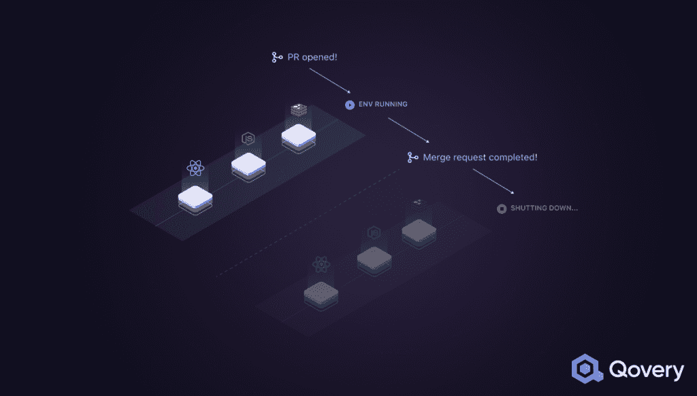

将创建一个新的环境，其中包含每个创建的拉请求的所有资源。然后，您可以在一个新的隔离环境中尝试新功能。没有打破你原有环境的风险；那可以是生产环境。

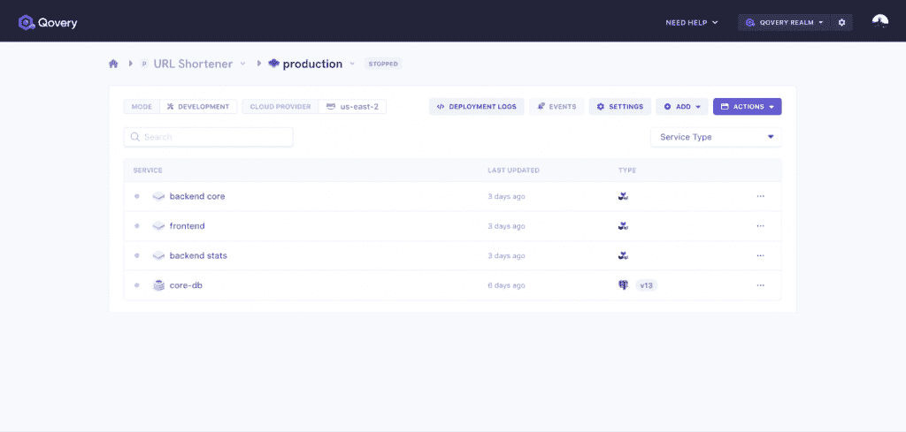

让我们从最简单到最复杂，深入研究所创建的每个服务的细节。

### 克隆应用程序

在 Qovery 上，应用程序是在 Kubernetes pod 中运行的容器。在创建预览环境时克隆这个应用程序会导致创建一个新的 Kubernetes 名称空间，并通过更改名称空间 ID 来复制 Kubernetes 部署配置。

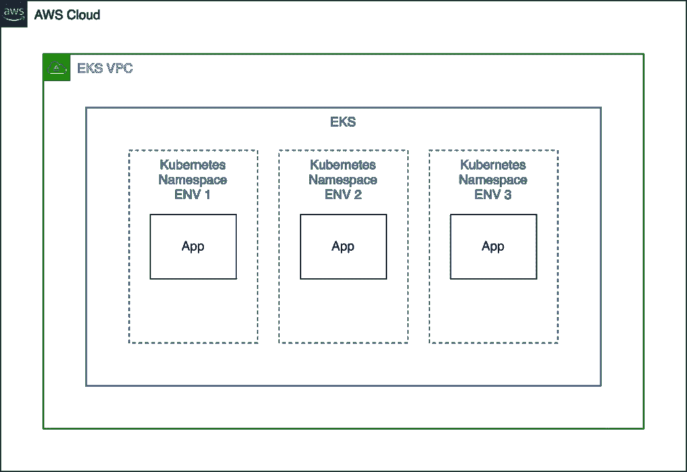

最简单的部分是如果你不考虑网络和环境的变量和秘密。构建一个仅支持容器的 POC(概念验证)非常简单，只需几天就可以完成。这是大多数预览环境系统所提供的。但是对于真实世界的使用，事情开始变得更加复杂。

### 克隆环境变量和秘密

您可能不希望在预览环境中使用您的生产环境变量和秘密，对吗？这就是为什么我们构建了一个继承和作用域系统来管理不同环境中的环境变量和秘密。

**传承**

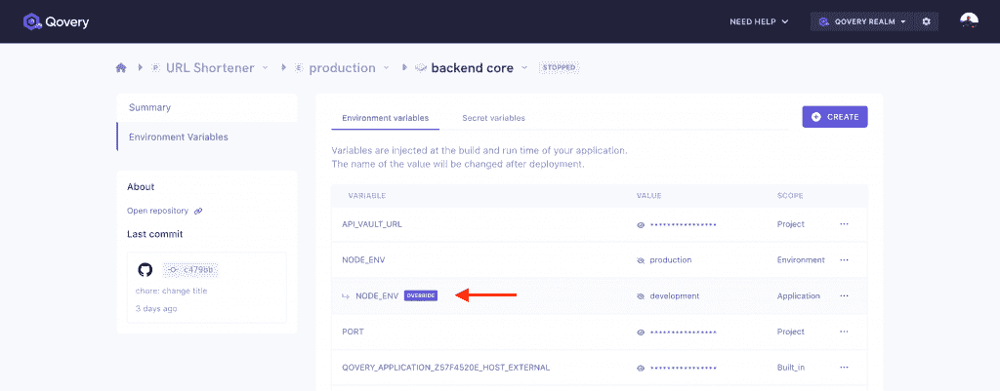

假设您使用环境变量`NODE_ENV=production.`，您可能希望使用值为`development`的相同环境变量。这就是你可以用 Qovery 做的事情，这意味着你需要根据环境动态地映射这些值。

**范围**

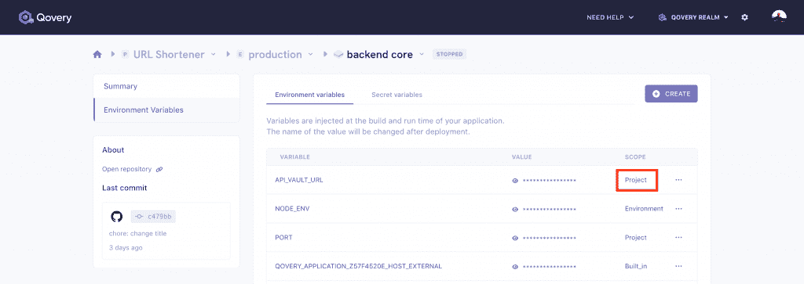

假设您有 20 个环境，您想为所有环境设置一个环境变量。如果没有范围特性，您将不得不为每个环境单独设置它。这就是为什么我们将范围与每个环境变量和秘密相关联。您设置了一个具有“项目”范围的环境变量，它将可用于所有环境。

**秘密加密**

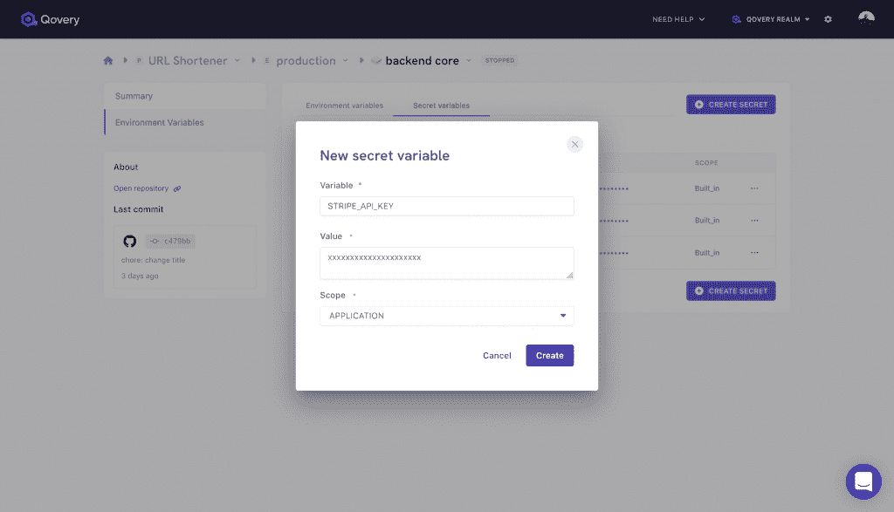

secret 类似于环境变量，只不过不能透露值，这意味着它是只写的。在幕后，Qovery 对值进行加密和加盐，并将其存储在 Kubernetes secrets 服务中。

### 克隆网络

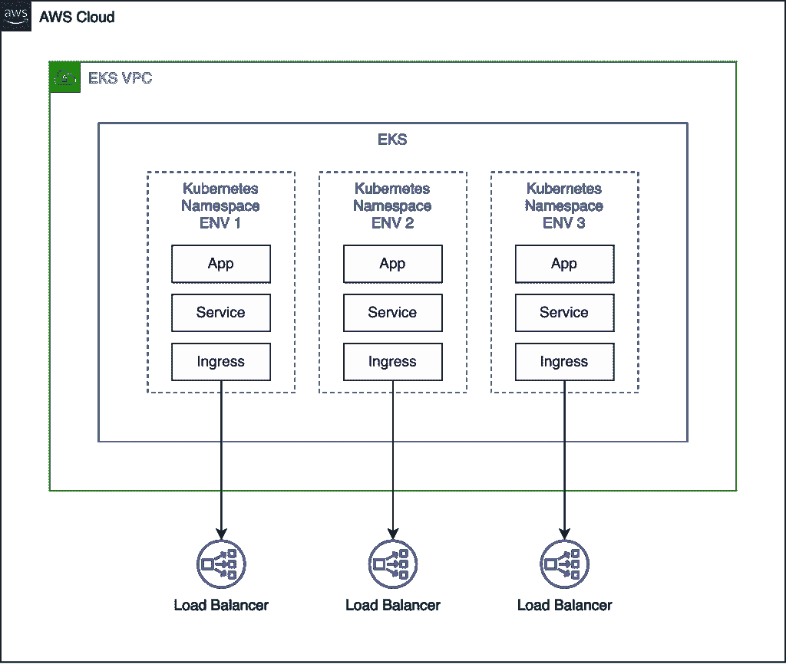

克隆网络会导致克隆内部网络(Kubernetes 服务和入口)和外部网络(负载平衡器、网关等)的配置。).最复杂的是外部网络，因为您必须考虑生成一个新的外部域和 TLS。我们还让我们的用户设置他们自己的域和通配符域，这是确保一切正常工作的额外工作。

### 克隆数据库

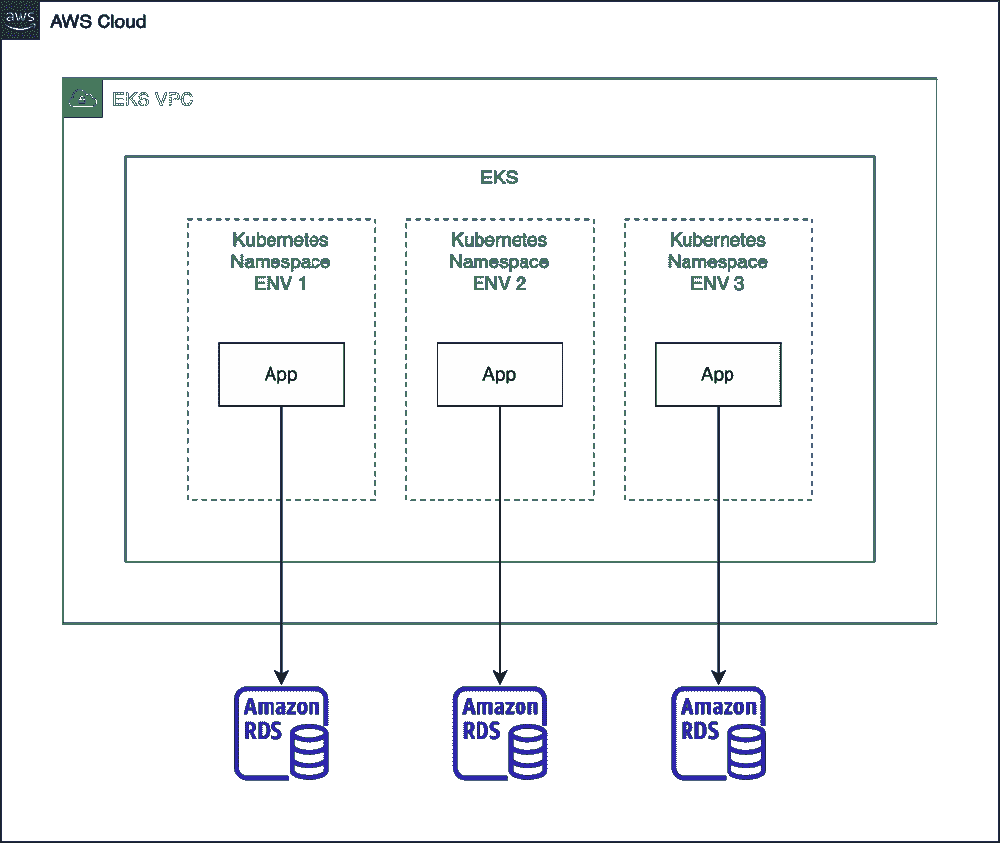

Qovery 提供了两种类型的数据库，托管数据库和容器数据库。AWS 提供托管数据库，例如 AWS RDS Postgres。它非常适合生产，AWS 保证了备份和扩展，Postgres 的容器模式提供了一个带有附加块存储(AWS EBS)的容器实例以实现持久性。

它运行起来更便宜、更快，但是没有备份，这对于开发来说非常好。根据选择的数据库类型，我们将克隆数据库和适当的网络服务。在 RDS 上，我们还需要考虑创建第二个 VPC(虚拟私有云)。这是一切开始变得更加复杂的地方。

克隆数据库也意味着植入预览环境数据库，甚至克隆生产数据库，由于法律或技术原因，这并不总是可能的。我们在每个阶段都必须考虑的一件事是，“如果 X 操作出错会发生什么？”这就是为什么我们构建了一个[事务部署引擎](https://github.com/Qovery/engine)。我很乐意在以后的文章中解释它是如何工作的。

## 资源隔离

根据他们的用途和业务的关键程度，我们的用户选择在他们的预览环境之间使用物理隔离和逻辑隔离。这是一个高级功能，需要我们大量的开发时间。物理隔离比逻辑隔离更安全，但维护起来也更复杂、更昂贵。例如，医疗保健行业的 SaaS 必须符合 HIPAA 安全要求。他们需要在用户之间提供物理隔离，而游戏行业的 SaaS 可以坚持逻辑隔离模式。

### 逻辑隔离

Kubernetes 名称空间在我们的上下文中提供了逻辑隔离。每个环境都有自己的名称空间。删除一个名称空间会导致删除环境中的所有 Kubernetes 资源。在 Qovery，我们不认为 Kubernetes 名称空间适用于多租户应用程序，即使有适当的 RBAC 规则。

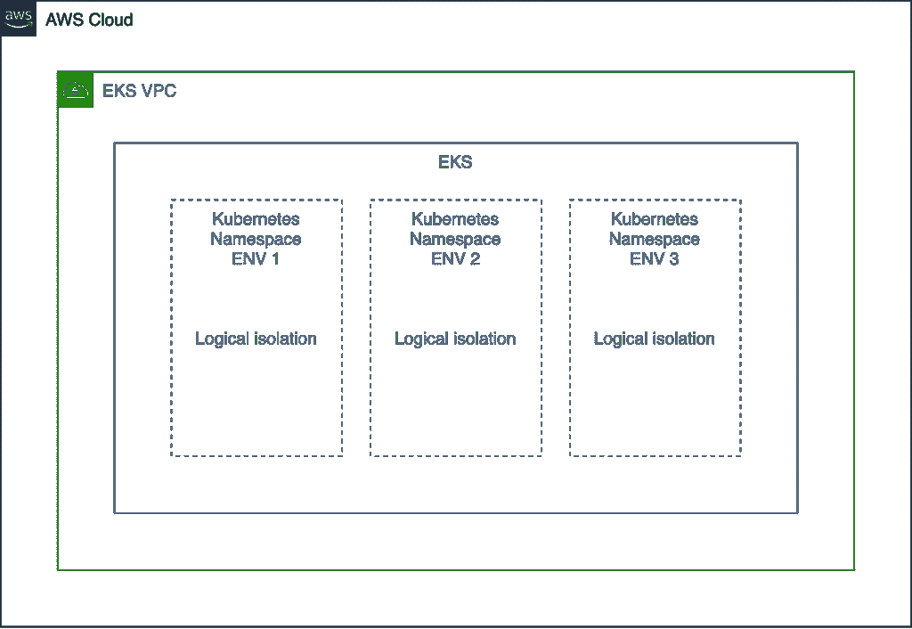

### 物理隔离

对于物理隔离，Qovery 提供了不同的架构选择。

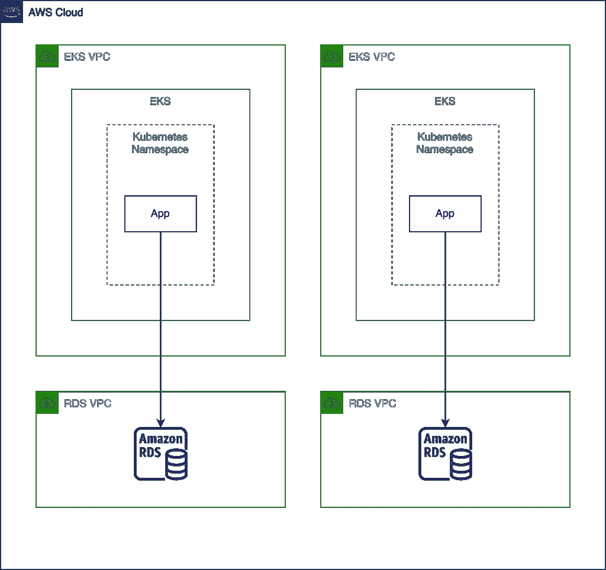

从 VPC 到 Kubernetes 集群和云帐户隔离，Qovery 平台使用高级别的抽象来管理这些架构。

## 测试

构建一个足够健壮的预览环境系统，供成千上万的开发者使用，必须经过充分的测试，并且我们至少要花费 50%的开发时间。我们有成千上万的测试在运行，以验证我们适合所有的正常和边缘情况，从单元测试和功能测试到端到端测试(E2E)。这是我们发展的一个重要部分。

## 结论

我解释了我们如何用 AWS 上的[Kubernetes](https://thenewstack.io/7-tips-for-cutting-down-your-aws-kubernetes-bill/)在 Qovery 上构建我们的预览环境系统。构建一个稳定、安全和高性能的预览环境系统并不容易，而且需要花费大量的时间，尤其是在管理像数据库和网络这样的有状态资源时。然而，对于使用预览环境功能的公司来说，回报是巨大的。

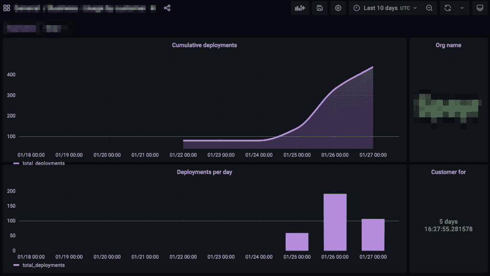

例如，这里有一家公司在不到一周的时间内发布了比以前快 100 多倍的预览环境功能。

有问题吗？欢迎[通过 Qovery](https://www.qovery.com/) 联系我们，或者查看我们的 [Qovery 预览环境](https://www.qovery.com/preview-environments)页面。

<svg xmlns:xlink="http://www.w3.org/1999/xlink" viewBox="0 0 68 31" version="1.1"><title>Group</title> <desc>Created with Sketch.</desc></svg>