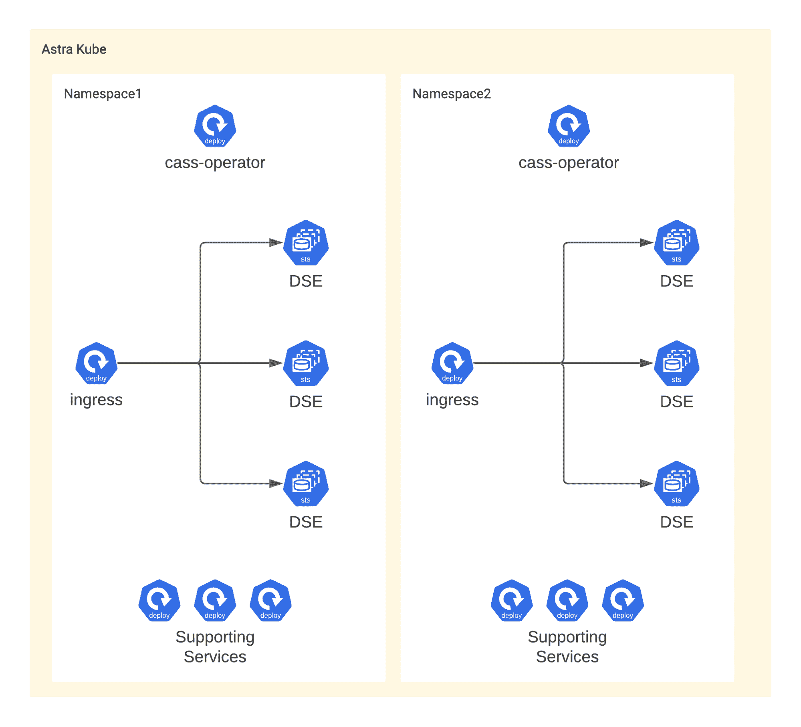

# 我们如何构建 DataStax Astra DB 控制面板

> 原文：<https://thenewstack.io/how-we-built-the-datastax-astra-db-control-plane/>

[](https://www.datastax.com/)

 [吉姆·迪金森

吉姆是 DataStax 的高级软件工程师，专注于 Kubernetes 和数据库编排。](https://www.datastax.com/) [](https://www.datastax.com/)

经过多年的迭代和改进，部署一个 [DataStax Enterprise](https://dtsx.io/3reqiCq) (DSE)集群是一个相当轻松的过程。下载 tarball，运行安装脚本，就完成了。

哦，等等——首先你应该准备几台服务器让它运行。那么最好确保服务器可以在正确的端口上相互通信。当然，还要确保您的外部客户端可以访问某些端口，而不能访问其他端口。监控也很重要。因为我们正在收集用于监控的指标，所以最好能够安全地查看它们。也许部署一个*单个* DSE 集群有点复杂。

现在想象一下，以一种可靠的方式，按下一个按钮，这样做上千次。由于我们是在 DSE 之上构建 DataStax Astra DB，这就是我们需要完成的任务。为了促进 Astra 的这一功能和其他功能，我们建造了 Astra 控制台。

## 支持开发人员

部署数据库可能是控制面板最重要的功能之一，尽管这只是运行 Astra DB 的一小部分。有许多其他的支持服务和工作需要使它成功，包括我们的网络用户界面，计费流程和用户管理。这些领域中的每一个都可以进一步细分为其他更小的服务，所有这些服务都由多个团队开发和维护。不过，它们之间的一个共同点是控制平面。

当我们构建它时，我们的主要目标之一是自助服务。我们希望为支持 Astra 的不同团队提供尽可能自动化地将代码从功能分支转移到生产的能力。这也将满足我们在支持部署数据库所需的多种微服务方面的需求。我们的目标是在像 [Kubernetes](https://kubernetes.io/) 和 [Helm](https://helm.sh/) 这样的工具之上提供一个层，尽管开发人员对这些工具和操作的熟悉程度参差不齐，但他们仍然可以成功。我们的开发人员主要关心的是编写代码和交付特性来支持我们的用户；他们不关心它是如何发布的，也不应该关心。

当我们寻找符合我们需求的东西时(2018 年初)，我们发现大多数工具要么太贵，要么需要太多的操作经验，因此太复杂。因此，我们构建了一个名为 DSCloud 的系统，以抽象出持续集成和持续交付(CI/CD)的复杂性。

我们构建系统的核心是一个名为 dscloud.yaml 的文件，该文件位于每个 git 存储库的根目录下，定义了存储库应该如何部署。因为每个团队负责自己的 monorepo，mono repo 由每个子目录内独立的 Dockerfiles 组成，所以 DSCloud 采用 App、微服务、Jobs、Cronjobs 的组织架构。

*   App:与 git 存储库一对一映射，并作为包含零个或多个部署、作业和 cronjobs 的名称空间部署到 Kubernetes。
*   微服务:monorepo 中的子目录，应该是 Kubernetes 部署(或 StatefulSet ),通过私有或公共服务与入口相关联。
*   job:mono repo 中的一个子目录，应该是 Kubernetes 作业。这个作业保证在每次代码推送时只运行一次。
*   cron job:mono repo 中的子目录，应该部署为 Kubernetes cronjob。

组成 App、微服务、Jobs 和 Cronjobs 的每个组件都有额外的配置选项，可用于定义它们应该如何部署。这三者的共同点是环境配置和秘密值。environmentConfiguration 包含一个环境列表(即开发、测试、生产)以及每个环境变量的值，这些值应该在 pod 上设置。secretValues 是用于在部署时绑定 Kubernetes 秘密的键列表。

```
microservices:
foo-api:
description:  "A backend service responsible for accessing the Foo database"
environmentConfiguration:
dev:
DATABASE_HOST:  example-dev.com
TRACING:  false
test:
DATABASE_HOST:  example-test.com
TRACING:  false
prod:
DATABASE_HOST:  example.com
TRACING:  true
secretValues:
-  DATABASE_USERNAME
-  DATABASE_PASSWORD
...

```

这三个组件的不同之处在于，微服务还有部署、进入和集成测试作为附加选项。部署指定了 Kubernetes 部署所必需的配置，比如内存和 CPU 限制、实例数量以及就绪性和活性探测。

```
...
deployment:
memoryMB:  1526
cpuPct:  200
instances:  3
probes:
readiness:
protocol:  HTTP
port:  8080
path:  /
timeoutSeconds:  10
liveness:
protocol:  HTTP
port:  8080
path:  /health
timeoutSeconds:  10
...

```

接下来，入口定义流量应该如何路由到 pod，例如应该使用什么端口、协议和路径。

```
...
ingress:
-  port:  80
containerPort:  8080
protocol:  HTTP
pathPrefix:  /foo-api/
pathPrefixRewrite:  /
...

```

最后，integrationTests 组件用于定义集成测试应该在哪些环境中运行，以及它们需要哪些环境变量。

```
...
integrationTests:
test:
env:
TEST_TYPE:  full
secrets:
TEST_DB_USERNAME:  foo-api
TEST_DB_PASSWORD:  foo-api
prod:
env:
TEST_TYPE:  happy_paths
secrets:
TEST_DB_USERNAME:  foo-api
TEST_DB_PASSWORD:  foo-api
...

```

这些测试是基于子目录命名的约定驱动的。该目录中的 Dockerfile 文件将用于运行包含您定义的任何测试的作业。部署工具将根据测试退出代码回滚或继续。

转到 Cronjob，它通过添加特定于 cron 的选项扩展了基本配置选项，如下所示。

```
cronjobs:
foo-updater:
schedule:  "*/10 * * * *"
failedJobsHistoryLimit:  1
successfulJobsHistoryLimit:  1
memoryMB:  64
cpuPct:  10
environmentConfiguration:
dev:
DATABASE_HOST:  example-dev.com
test:
DATABASE_HOST:  example-test.com
prod:
DATABASE_HOST:  example.com
secretValues:
-  DATABASE_USERNAME
-  DATABASE_PASSWORD

```

对于任何有 Kubernetes 经验的人来说，dscloud.yaml 的大部分内容应该听起来很熟悉；这是故意的。在创建这个构建系统的过程中，我们试图展现足够多的对我们的高级用户有用的选项，同时仍然为那些没有太多经验的用户抽象出复杂性。

现在，定义一个部署清单当然很好，但是在某些时候我们需要从 git 获取代码并投入生产，这就是我们的处理器服务发挥作用的地方。处理器服务通过以下方式充当我们 CI/CD 流程的协调者:

1.  不断轮询 git，寻找我们的任何存储库中的变化。
2.  当检测到新的提交时触发构建工具，这将构建 Docker 映像并成功发布到我们的存储库中。
3.  基于 dscloud.yaml 文件创建新的舵图。
4.  启动部署工具，将应用部署到每个环境中。

一旦我们能够构建、测试和部署我们的代码，最终是时候开始构建 Astra 了。

## 第一步:云

2018 年，当我们开始 DSE 的按钮式部署之旅时，Kubernetes 运营商刚刚开始受到欢迎，Apache Cassandra 特定的运营商还处于初级阶段。因此，我们决定坚持我们所知道的，即云中的虚拟机。

对于基本案例，我们需要一个三节点 DSE 集群和一个小型 Kubernetes 集群来运行数据库的辅助服务。由于对该平台的熟悉，我们第一次涉足所有领域是在 AWS 上。我们开始创建 [Terraform](https://www.terraform.io/) 脚本，用于配置 EC2 实例、EBS 卷和相关网络。这需要一个自动化的按钮式系统，所以我们开发了一个 Golang 服务来从 REST 请求中调用 Terraform，它还做了大量的模板工作来支持不同的数据库大小和区域。

因为基础设施供应需要一些时间，我们显然不能让我们的客户等到我们完成，所以这必须是一个异步过程。为了实现这一点，我们采用了 [Argo](https://github.com/argoproj/argo-workflows) 作为我们的工作流引擎，使我们能够将基础设施供应分成多个步骤，如果实施正确，可以在失败时轻松重试。此时，我们已经实现了基础设施供应的自动化，尽管这并不令人兴奋，因为还没有部署任何东西。

一旦 Terraform 完成，我们就可以启动另一个工作流，让数据库进入可用状态。为了加快速度，我们使用定制的机器映像来构建包含 DSE tarball 和必要的启动脚本的 EC2 实例。

启动 DSE 节点时，顺序很重要:如果您手动执行此操作，您将启动第一个节点，等待它启动，将第二个节点上的种子设置为第一个节点的 IP 地址，启动第二个节点，依此类推。因为我们的节点是随机启动的，所以我们不能保证这种行为。这意味着我们必须在节点启动时为它们创建自己的锁定和协调机制。由于最初的 DSE 启动是由机器映像处理的，因此我们的工作流可以处理最终的配置和设置，以及将服务部署到小型 Kubernetes 集群。

这个过程在一段时间内对我们很有效，但是我们很快开始遇到问题。从一开始，我们就注意到创建一个新的数据库需要一个小时，考虑到我们准备了六个 EC2 实例(大约 45 分钟)以及所需的其他基础设施，这是有意义的。我们遇到的另一个问题是可重复性。这种创建数据库的方法被证明不是非常可靠，因为我们使用了如此多的基础设施，并且我们的脚本必须处理所有的事情。例如，如果 EBS 卷没有正确连接，我们的脚本必须检测到这一点，然后自己解决问题。当我们引入新的工作流向数据库添加更多节点时，这变得更加棘手。

测试后，我们发现我们在手工修复上花费了太多时间，最后我们意识到这种架构的成本是不可持续的。幸运的是，此时我们自己的 Kubernetes 操作员 [cass-operator](https://github.com/k8ssandra/cass-operator) 已经取得了足够的进展，可以部署用于生产。

## Kubernetes 所有的东西！

随着 cass-operator 的引入，我们可以重新思考我们的部署模型，并转向以 Kubernetes 为中心的架构。



这意味着，我们可以开始为每个新数据库提供一个托管的 Kubernetes 集群，如 EKS 或 GKE，而不是为每个云提供商(即 AWS 或 GCP)建立单独的计算实例。这有三个好处:

1.  简化:它极大地简化了我们的基础架构配置流程，因为我们不再需要配置单个基础架构组件。
2.  减少维护:我们能够减少维护负担，因为我们可以依靠运营商来处理新 DSE 集群的安装和验证以及所有支持服务。
3.  成本降低:我们的云提供商成本降低了，因为我们不再需要为 DSE 安装专用硬件，也不再需要为 Kubernetes 集群安装更多硬件。更少的计算实例意味着更低的成本。

虽然这第一次通过是对我们以前架构的巨大改进，但仍有改进的空间。尽管使用 Kubernetes 简化了我们的部署过程并减轻了我们的维护负担，但创建新的数据库仍然是一个非常缓慢的过程，并且取决于云提供商的突发奇想。任何花时间管理云基础设施的人都经历过呼叫失败和配置不成功的频率，因此我们可以发出的请求越少越好。我们想要的是从我们控制平面的许多现有职责中消除对基础架构管理的需求。

我们通过转向每个数据库一个名称空间的模型来实现这一点。有了这种新的架构，基础设施可以预先配置，因为我们不再需要为每个数据库创建新的 Kubernetes 集群，这将创建数据库的过程简化为一个工作流。现在，每当我们想要创建一个新的数据库，我们所要做的就是启动一个运行 Helm 的工作流，等待操作员，然后做一些最终的配置。此外，通过这一新模型，我们能够利用 bin packing 算法，Kubernetes 通过调度不同大小的最佳数量的 pod 来最大限度地利用计算实例的资源，从而使我们能够更有效地利用我们的计算资源。

## 结论

为了支持我们在 DataStax Enterprise 上创建数据库即服务的目标，我们构建了 Astra 控制平面。为了促进这一点并支持参与该项目的许多不同团队，需要创建一个定制的 CI/CD 工具，我们称之为 DSCloud。

借助 DSCloud，我们的开发团队能够快速高效地交付代码以支持我们的用户，而不会陷入错综复杂的云部署中。然后，我们使用同样的工具来引导我们自己创建 DSE 集群到云的按钮式部署。

一路走来，我们并不总是第一次就把事情做对，但我们继续迭代和改进，就像我们今天仍然做的那样。此外，随着 Astra 的成长和变化，我们的控制平面被证明是灵活的。除了适应沿途数据平面的变化之外，它还可以处理不断增加的流量，包括 [Astra DB 无服务器](https://dtsx.io/3KYHOlV)所需的主要重新架构。由于 Kubernetes 社区的出色工作，我们能够更好地扩展和简化我们的流程，让我们有更多的带宽来为我们的用户构建功能。

<svg xmlns:xlink="http://www.w3.org/1999/xlink" viewBox="0 0 68 31" version="1.1"><title>Group</title> <desc>Created with Sketch.</desc></svg>