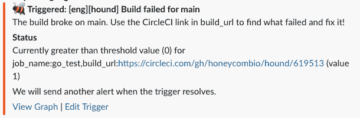
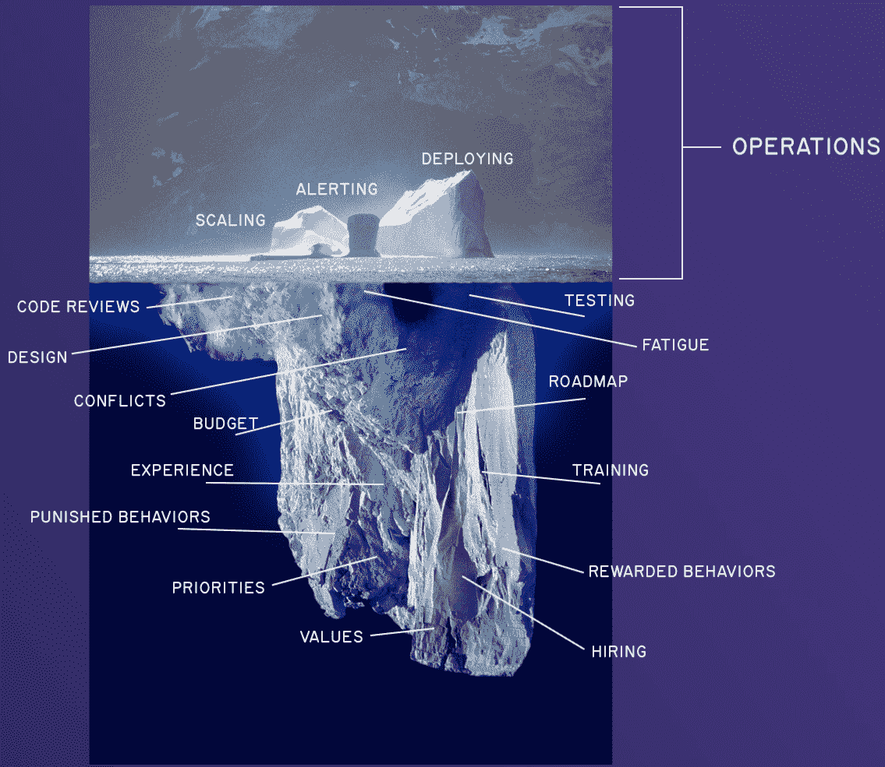

# 我们如何管理蜂巢的事故响应

> 原文：<https://thenewstack.io/how-we-manage-incident-response-at-honeycomb/>

当我两年前加入 Honeycomb 时，我们正进入一个增长阶段，在这个阶段，我们不能再指望有时间在事情变糟之前预防或解决所有问题。

系统的所有早期部分都需要扩展，但我们没有足够的带宽来从容应对其中的一些部分。我们必须选择一些[火来对抗](https://www.honeycomb.io/blog/counting-forest-fires)，一些让它燃烧。

这种系统扩展的方法很自然地扩展到事故领域和总是处于部分故障状态的大型复杂系统。事件是正常的；它们是很久以前做出的决策的汇总历史，然后被扔进需求和人员快速变化的动态环境中。

虽然有些东西昨天可能很好用，但今天可能就不好用了。在相互冲突的目标和压力的重压下，东西会弯曲、嘎吱作响、断裂，这是很正常的。

因此，事故响应是骑在断裂的鞭子的远端。你可以对你的组织甚至你所在的行业过去的决策做出快速反应。这很有挑战性，但也是它如此有趣和有益的原因。这一愿景影响了我在许多同事的帮助下尝试塑造蜂巢处理事件的方式。

本文分为五个部分，提供了事件响应的一致观点:处理未知，管理有限的认知带宽，协调模式，维护心理安全和将信息反馈给组织。

这个列表是不断变化的，但它代表了我认为今天重要的事情的一个相当高层次的快照。

## 应对未知

我们的快速发展使我们从一个每个人都知道一切的小型核心工程团队转变为一个更大的组织，这个组织有几个了解其复杂历史的关键人物，以及一群只知道一点点的新人。我们已经到了这样一个地步，没有人能再把整个系统记在脑子里了。

虽然我们增加和回收专业知识，并通过发现以前没有必要知道的扩展限制来扩展专业知识，但我们必须承认，我们正在一种某些因素不完全在我们控制之下的状态下运营。

当人们进入[待命](https://thenewstack.io/diary-of-a-first-time-on-call-engineer/)时，我们告诉他们我们不能教会他们一切。他们在知道大部分事情之前会带着寻呼机，这没什么。没有人会知道所有的事情。他们被期望做一个快速的评估，并可能修复或减轻他们所能做的，但除此之外的任何事情都是额外的奖励。

他们[作为传呼机管理员](https://thenewstack.io/running-more-low-severity-incidents-is-improving-our-culture/)的角色是代表团队的其他成员处理突发事件和进行分类，而团队的其他成员则承担全部责任。如果他们发现自己处于超出当前能力的情况，升级总是好的。

> 我们并不寻求所有可能打破的方法来先发制人。相反，如果出现问题，我们会想办法降低服务质量或安全地关闭新功能。

这种方法无处不在，不仅仅是在他们开始跟随别人之前我们给他们的演讲中。与我工作过的其他地方相比，我们有更少的详细指导手册和更多的警告，描述他们在寻找什么，以及在事情变得更具挑战性之前响应者有多长时间。

当发布一个新功能时，我们并不寻求所有可能破坏的方式来抢占它们。相反，如果出现问题，我们会想办法降低服务质量或安全地关闭新功能。我们不需要在凌晨 2 点解决这个问题。我们可以优雅地限制影响，这样我们就可以在工作时间一起查看它。

我们希望假设它会出错——我们只是不知道如何出错，并希望有办法应对。什么是手动控制或超控？哪些服务是允许降级的，哪些是绝对不允许被打破的不变量？如果他们真的打破了，什么是可以接受的，以防止它变得更糟？

这要求我们在核心功能、最重要的功能以及如何计划关闭外围组件以挽救核心组件方面保持一致，并鼓励我们就业务和工程优先事项进行诚实的讨论。这样你就能更好地应对意外。

## 管理有限的认知带宽

被闹铃吵醒的人，思考能力不如白天。事故压力的增加——无论您认为停机有多好——都会缩小您的认知范围。在休息时调试系统是困难的，在压力下调试它们，同时还要管理其他各种突发事件，就更难了。

在盛怒之下操作一个系统是由一个更忙碌、更困倦、更有压力的你来完成的，因此相对来说，比正在阅读这篇文章的你更缺乏仔细、冷静和专注的推理能力。

处理未知需要快速可操作的控制，以便它们方便地将我们带到可管理的状态，这创造了更多思考和行动的空间，并支持这一点。

可以在其他级别提供额外的支持，如警报卫生和设计。如果你不得不花时间去了解一个警报是紧急的还是不紧急的，是真的还是假的，是原因还是结果，你就脱离了实际情况。我们在这方面做得并不完美，但我们努力提供有用的警报:

*   低级别警告和高紧急警告有不同的烧伤警报，根据它们需要多少工作/时间通过不同的渠道。
*   关键页面带有一个相关的 BubbleUp 查询(或者是针对服务级别目标(SLO)的自动查询，或者是针对触发器的描述),可以引导您找到好的信号或常见的噪声源。
*   我们试图提高我们现在无法处理的拍打警报的阈值；我们不想在预先触发的警报中隐藏新的升级，我们也想避免警报疲劳。

作为随叫随到的用户，您与系统的交互从警报开始。因此，无论我们在警报中使用什么样的查询或信号，都必须包含关于事件背景的线索，以及事件现在是如何被触发的细节。

例如，在查找失败的构建时，在构建 URL 上添加一个 GROUP BY，这样 Slack 中的错误就已经包含了一个链接，可以让您直接跳转到相关数据。这些小细节可以节省带宽，让你专注于正确的事情。

## 协调模式

到目前为止，我们拒绝采用任何现成的事故指挥框架，尽管我们已经研究过它们，并从中获得了灵感。我们试图平衡的关键问题是:

*   避免事故框架比解决问题对运营商要求更高。我们不再讨论什么是或不是公共事件的严重性或严格规则，而是默认更加开放。
*   为待命经验较少的人提供有效的支持和工具，对于这些人来说，更清晰的规则和指导原则会有所帮助。

作为一种妥协，我们使用 [Jeli 的事件响应机器人](https://www.jeli.io/slack-app)，这是一种轻量级的方式，让我们可以创建专用的调查渠道，分配最少的角色，并为后来加入的参与者以及其他利益相关者保留更新历史。这避免了约束响应模式，但提供了足够的支持来确保信息以有限的开销在内部广播。

在一次事故中，有一些信号和行为暗示了自我组织的文化层面，这是我特别喜欢的:

*   在做某件事之前宣布你要做这件事，这样周围的人都知道这件事，并有机会支持或反对它。
*   使用 Reactji 在不中断任何人流程的情况下快速反应。
*   人们为子调查创建线索，最终“也发送到#channel”消息将调查结果重新注入主讨论流。
*   包含有用信息的蜂巢式查询在频道中被链接起来，来自组织不同部门的人以新的视角协作丰富查询，直到我们获得任何人都无法单独获得的洞察力。
*   有时，线程太深，我们会剥离子通道、视频通话或即兴创作新模式以避免混淆。
*   应急人员密切关注事件的进展，部分是在情绪层面。他们会说“这开始让人感到困惑了”，“现在还有人不知所措吗？”或者“这里人太多了吗？”并以此为信号重新组织反应。
*   有时候，从长远来看，让新人获得经验，即使这会使现在的响应变慢，对团队和产品来说也是更健康的。

这些是你在一般事件框架中找不到的东西，一般事件框架通常试图通过明确责任来给大型和多样化的响应组带来清晰度。我在这里发现的协调模式，也是我现在试图强化的模式，是局部的，是关于当我们需要改变我们正在做的事情时，获得一种良好的感觉。

在此之后，当我们运行事件回顾时，我们可以查看我们遇到的所有挑战，浮现出处理它们的有趣模式，并将其添加到我们的工具包中以备下次使用。

## 维护心理安全

告诉一个组织“我们将确保我们可以快速关闭”或“如果你觉得有太多事情要做，请让每个人都知道”并期望它就这样发生是不现实的。

只有当你的[员工感到安全](https://thenewstack.io/the-need-to-decouple-human-error-from-incident-response/)时，这些行为才成为可能，他们被允许不知道事情，如果我们遇到挑战，我们将一起努力解决它们，而不是寻找谁需要改进和做得更好。

责任是共同的，是整个系统对改善情况负责，而不是谁当时慷慨地同意随叫随到。

当我们最后一次让新工程师加入我们的呼叫轮换时，我们没有解释组件是如何工作的，他们将随着时间的推移而学习，我们[在我们的一次每周会议](https://www.honeycomb.io/blog/oncallogy-sessions-best-practices/)中就这篇帖子中的内容进行了讨论:我们应该不知道正在发生什么，这没关系，责任是共享的，我们完全了解他们所处的情况。

接下来是一轮又一轮的跟踪、反向跟踪、在下班后给人们休息时间，以及确保我们真的呼叫寻呼机升级(一旦有人觉得他们需要帮助)作为一个理想的结果。我们认为值得回顾的任何事件都是通过[遵守这些原则来完成的，同样](https://www.honeycomb.io/blog/incident-retrospective-ground-rules)。

但所有这些工作都是正在进行的工作，维护心理安全是我们在运营工作中最优先考虑的事情之一。

## 将关于结果的信息反馈给组织

事故需要成为反馈循环的一部分。这是橡胶与道路相遇的地方，我们在那里学到的东西与基于组织文化、优先事项和实践的更古老的决策相关。

我们有责任明智地利用事件，作为我们工作的学习机会。

当你能把行动和结果联系起来时，学习是最有效的，而没有花时间去思考它们的影响的事件是在浪费提供给我们的极好的机会(通常是灼热和不愉快的)。

从这种理解出发，通过给予组织内人员足够的信任和代理，我们能够改进我们的流程，改变我们的工作方式，并为迎接未来的挑战做好准备。

## 想了解更多我们做事的方式吗？

虽然我们的事件响应比我介绍的更丰富，也可能比我暗示的更有条理，但这些高层次的抽象优先级指导着我们采用或调整的任何方法。它们会随着时间的推移而变化，如果你想更详细地从地面上看它的样子，[我们可以谈谈这个！](https://www.honeycomb.io/resources/how-honeycomb-manages-incident-response)

<svg xmlns:xlink="http://www.w3.org/1999/xlink" viewBox="0 0 68 31" version="1.1"><title>Group</title> <desc>Created with Sketch.</desc></svg>