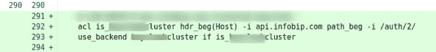

# 我们如何设法测试“不可测试的”

> 原文：<https://thenewstack.io/how-we-managed-to-test-the-untestable/>

将未经测试的变更部署到生产环境中总是会导致一定程度的压力。

压力水平随着你正在改变的系统的重要性而增加。如果你的交通模式有任何季节性，压力也会在“旺季”增加这可能是每天的高峰，一年中的高流量时期，你的公司上市的一周或任何类似的季节性。当你部署一个改变时，你过去的每一个事件也会影响你的压力水平。时间越近，压力越大。

根据我的经验，部署一个经过测试的变更可以将压力降低到几乎为零。即使有了测试，事故也可能会发生，但是您有办法更快地发现它们并且不再重复。

压力的减少足以成为努力测试变更的理由，即使是那些在进入生产之前似乎很难甚至不可能测试的变更。

## **哈普洛克西，测试的克星**

在 [Infobip](https://infobipengineering.gitbook.io/handbook/tech-stack-and-architecture/the-scale-of-our-systems) ，我们每天都会在生产中部署 1000 多种不同的变更。这些变化中的大部分都是代码，它们是可以测试的。但是网络配置、虚拟化或存储层也有变化，这就更难测试了。

直到最近，我们认为不可能测试的东西之一是 [HAProxy](https://thenewstack.io/how-haproxy-streamlines-kubernetes-ingress-control/) 配置。但是我们对它考虑得不够。

我们所有的入站 HTTP 流量都通过 L7 平衡层，在那里我们使用 HAProxy。多年来，我们已经发展到 40 多个数据中心，其中许多都有特定的配置，主要是因为特定数据中心有特殊的客户要求、各种迁移和不同的产品堆栈。不可能有一个处理所有差异的暂存环境。

## **我们在**之前的不足之处

我们在我们拥有的单个试运行环境上测试了一个更改，将配置操作到一个类似于我们想要在生产中更改的状态。这个过程完全取决于工程师做出的改变。

没有硬性的程序要求我们在生产前测试变化。我们认为这是常识，并宣扬它，但是当有人为变更创建拉请求时，我们从未检查它是否被测试过。

将变更部署到生产环境中的唯一要求是一个工程师批准的拉请求。几个事件之后，我们将最重要的系统增加到两个工程师。我们认为这是临时措施，直到我们想到更好的办法。当然，这是一个纯粹的基于“氦”的策略。

这是一个与 HAProxy 相关的事件的例子:

这一变化导致了我们平台的严重退化。在应用了这个之后，api.infobip.com 端点上的一些请求被路由到了错误的后端。如图所示，这是一个简单的改变。

两名工程师批准了它，两人都认为 HAProxy 的行为与它不同。其中一个是新员工。想象一下他们所经历的压力，以及下一次需要改变时他们所有的闪回。我们决定显著改进这一流程。

## **新方法:只抓痒处**

起初，我们认为在生产之前测试 HAProxy 配置是配置类型和我们使用它的方式所固有的。

*“但是每个* *HAProxy 配置对于特定的数据中心都是唯一的！”* *“我们不能伪造* *所有后端的* *响应！”* *“在我们的 HAProxy 配置中，有许多* *特定于客户端的上下文* *，您必须了解这些上下文才能正确执行*

 *多年来一些代价高昂的事件让我们更加努力地寻找解决方案。找到它并不困难。在这个过程中，我们了解到，虽然这些陈述仍然是正确的，但它们不会使配置不可测试。

我们的 HAProxy 配置由许多访问列表组成，根据正则表达式将流量路由到特定的后端。当我们仔细观察这些事件时，我们注意到大约 90%是由于正则表达式配置错误或访问列表顺序错误造成的。

这时我们意识到，我们不需要测试 HAProxy 配置的每一行，也不需要让[测试过程](https://thenewstack.io/a-better-developer-experience-requires-better-testing-tools/)比它应该的更复杂。我们应该只测试我们有问题的东西！只挠痒的地方！

如果我们这样做，这个痒的部分可以被测试。所以，我们做到了。

我们在 HAProxy 配置上的每一个改动都要通过一系列的测试，但还是要有人认可。在一些 HAProxies 上，我们现在对每一个变化都要进行 3000 多次测试。一部分是自动生成的，一部分是手工编写的。

## **流水线阶段**

每次对 git 存储库的推送都会触发一个 Jenkins 构建，它会创建一个特别的 Docker 环境，为测试准备 HAProxy 配置并运行所有测试。没有经过测试的 HAProxy 指令被替换为通用值。如果任何测试失败了，我们就认为构建失败了，并且变更不能被合并到生产分支中。

## **测试套件**

### **投掷**

我们已经尝试了几种工具来评估对 HTTP 请求的响应，我们选择了 [Hurl](https://github.com/Orange-OpenSource/hurl) ，因为它具有良好的断言引擎、简单的文件格式和测试执行速度。

Hurl 是一个命令行工具，它运行以简单的纯文本格式定义的 HTTP 请求。它可以执行请求、捕获值并评估对标题和正文响应的查询。它的用途非常广泛:既可以用于获取数据，也可以用于测试 HTTP 会话。它可以断言 JSON 响应和 HTTP 响应头。此外，您甚至可以测试整个 HTML 页面，甚至字节内容。

### **HTTP 响应器**

一个简单的 web 服务器，它只是响应 HTTP 200 OK，反映它收到的所有信息。http 响应者收到的每个 HTTP 请求头都以 JSON 结构返回给客户机。

在配置准备期间，HAProxy 配置中的所有后端服务器都指向 http 响应器*。*此外，后端名称作为报头注入到每个请求中。这使我们能够检查我们的请求是否被路由到预期的后端，或者反向代理是否注入了一些必需的头，或者它是否像我们配置的那样阻止了 HTTP 头中包含恶意内容的请求。

### **测试**

我们测试的内容包括:

*   访问列表和请求路由
*   HTTP 响应状态代码
*   HTTP 请求标头注入
*   HTTP 响应标头注入
*   HTTP 头或 URL 路径重写

### **编写测试**

要测试反向代理的行为，您只需要描述特定请求的预期结果。

例如，我们的配置中有以下指令:

为了翻译，所有在`*test.api.infobip.com*`端点上路径以`*/mobile/*`开始的请求都应该被路由到`*iam-mobile*`后端。

现在我们只是写下这句话作为测试。

每次更改时都会执行该测试。因此，如果我们引入一些有问题的正则表达式，使得/mobile 上的流量在另一个后端终止，这个测试就会失败。

## **零事故成就:解锁**

将测试管道引入到我们的配置变更流程中，提高了我们平台的质量，相关事件的数量降到了零。我现在的压力水平也相当接近那个数字。

我鼓励您检查您的变更部署过程，并尝试找到一个自动测试的地方。记住:你不需要测试所有的东西。测试什么是重要的。我保证会有回报的。

<svg xmlns:xlink="http://www.w3.org/1999/xlink" viewBox="0 0 68 31" version="1.1"><title>Group</title> <desc>Created with Sketch.</desc></svg>*