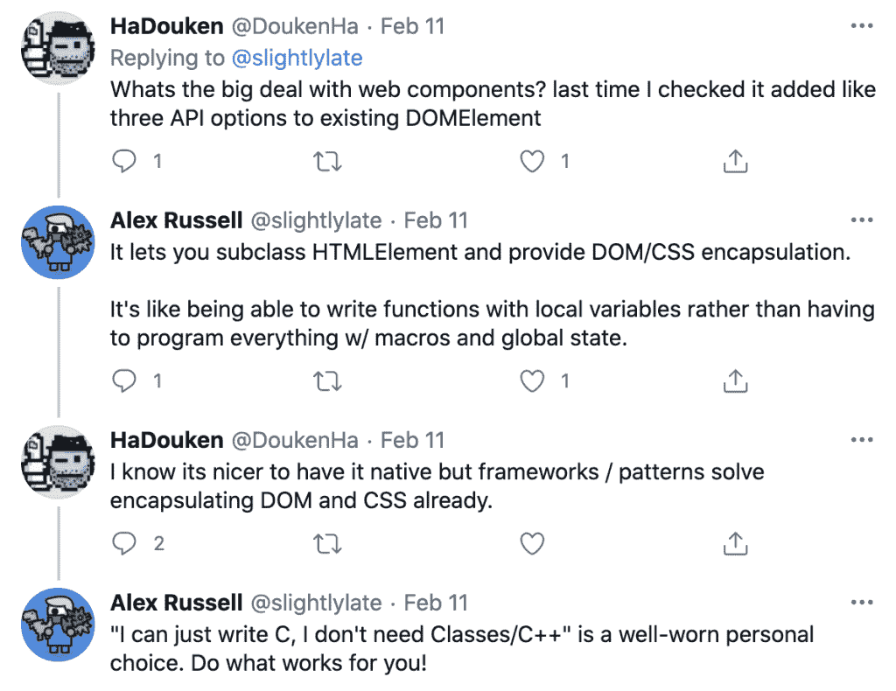

# GitHub 和 Salesforce 如何使用网络组件

> 原文：<https://thenewstack.io/how-web-components-are-used-at-github-and-salesforce/>

[网络组件](https://developer.mozilla.org/en-US/docs/Web/Web_Components)是一种新兴的网络标准，允许开发人员为他们的网页和应用程序创建可重用的定制元素。只是最近,“T2”在主流浏览器中获得了支持,“网络组件”的使用没有,(例如)“T4 反应”组件,“T5”组件近年来受到了很多关注。出于这个原因，我决定和几个已经实现了网络组件的公司谈谈:GitHub 和 Salesforce。

## 网络组件与反应

 [Richard MacManus

Richard 是《新堆栈》的资深编辑，每周都会写一篇关于网络和应用程序开发趋势的专栏。此前，他在 2003 年创建了读写网，并将其建成了世界上最有影响力的技术新闻和分析网站之一。](https://twitter.com/ricmac) 

首先，让我们来解决这个问题:当你可以使用流行的前端框架时，为什么要使用 web 组件呢？

WebComponents.org 社区网站[将](https://www.webcomponents.org/introduction) web 组件定义为“一组 web 平台 API，允许您创建新的定制的、可重用的、封装的 HTML 标签，以在网页和 web 应用程序中使用。”它的用例之一是创建可重用的用户界面元素；尽管许多 web 开发人员目前使用 reactor(或类似的 JavaScript 库或框架)来实现这个目的。关键区别在于 web 组件是可移植的，因为它们基于 HTML，而 React 组件只能在 React 环境中使用。

公平地说，并不是所有的开发人员都能看到 web 组件的价值。当谷歌高级员工工程师[亚历克斯·罗素](https://www.linkedin.com/in/alexrussell/)(这项技术的创始人之一)[在推特上发布](https://twitter.com/slightlylate/status/1359579082871119873)网络组件现在被“12%载入 Chrome 的页面”使用时，他得到了一系列积极和消极的回应。讨论中的这个片段说明了为什么框架的拥护者不一定对 web 组件有信心:

[](https://cdn.thenewstack.io/media/2021/02/5784a192-screen-shot-2021-02-20-at-9.23.52-am.png)

显然，前端框架目前非常流行。但是这使得探究为什么一些公司决定不使用它们变得更加有趣。GitHub 就是这些公司之一。

## GitHub 和 Web 组件

[GitHub](https://www.github.com) 现在有大约 50 个 web 组件，[发推文](https://twitter.com/Keithamus/status/1359614465763901441) GitHub 高级应用工程师 [Keith Cirkel](https://twitter.com/Keithamus) 。“我也不认为我们会放缓，”他补充道。

“GitHub 从未使用过 Angular、Backbone 或 React 这样的框架，”当我寻求更多信息时，Cirkel 告诉我。他解释说，GitHub 一直在使用 JavaScript 库 jQuery，但最终他们用“本地 web 平台特性——包括 web 组件”取代了它

“对我们来说，Web 组件并不一定会取代 jQuery，”他继续说道，“它们只是代码库常规现代化的自然结果。Web 组件给我们带来了“组件模型”，这是一种软件范式，可能是 React 最受欢迎的一种。”

将软件组件化的能力是一种广为接受的编程规范。尽管 JavaScript 本身有一个组件模型，但更广泛的网络平台(HTML、CSS 和 JavaScript)传统上没有组件模型。这是 web 组件背后的动机，它是在 Google 内部创建的，并继续由 Chrome 开发团队在今天进行。

我向 Cirkel 要了一些在 GitHub 上运行的 web 组件的例子。他强调了三点。

“任何带有选项卡的 UI 都使用[选项卡容器元素](https://github.com/github/tab-container-element)，对话框使用[细节对话框元素](https://github.com/github/details-dialog-element)，任何显示相对时间的东西都使用[时间元素](https://github.com/github/time-elements)之一——这是我们最早的元素，可以追溯到 2014 年左右。”

下面是用于选项卡组件的 HTML 代码:

```
<tab-container>
  <div role="tablist">
    <button type="button"  role="tab"  aria-selected="true">Tab one</button>
    <button type="button"  role="tab"  tabindex="-1">Tab two</button>
    <button type="button"  role="tab"  tabindex="-1">Tab three</button>
  </div>
  <div role="tabpanel">
    Panel  1
  </div>
  <div role="tabpanel"  hidden>
    Panel  2
  </div>
  <div role="tabpanel"  hidden>
    Panel  3
  </div>
</tab-container>

```

当然，你也可以用 React too 创建一个 tabs 组件[，这样开发者就有了很多选择。然而，GitHub 的选择](https://www.digitalocean.com/community/tutorials/react-tabs-component)是依赖网络标准——为了避免技术债务，加速页面加载，等等。

## 关于框架的一个注记

即使 GitHub 选择使用 web 组件而不是前端框架，它也没有完全避免使用[框架](https://thenewstack.io/case-against-web-frameworks/)。

“GitHub 仍然使用 Ruby on Rails 作为服务器端框架，”Cirkel 说，“我们只是没有客户端 JS 框架。我们用 web 组件逐步增强页面的各个区域。”

Cirkel 还指出，他并不反对使用前端框架；他认为它们“对于像水疗这样需要复杂用户界面的应用很有用。”但是由于 GitHub 不是一个 SPA(它有许多网页)，他认为 web 组件“完全能够满足同样的需求。”

Cirkel 向我保证说，Web 组件的伸缩性也很好。

“它们提供良好的组织、隔离和封装；这些都是可扩展技术的标志。”

## Salesforce 的 Lightning Web 组件

另一家使用 web 组件的大型互联网公司是 Salesforce。为了了解更多，我联系了[格雷格·惠特沃思](https://twitter.com/gregwhitworth)，他在 Salesforce 领导[闪电网络组件](https://developer.salesforce.com/docs/component-library/documentation/en/lwc)【LWC】团队。此前，惠特沃思曾在微软团队工作，开发了现代浏览器 Edge。

“LWC 的设计理念是在 Web 组件 API 之上创建最薄的抽象层，”惠特沃思解释道。“这个抽象层非常固执己见，以符合 Salesforce 平台的限制和开发理念。从长远来看，我们的目标是尽可能缩小 LWC，以便能够越来越多地依赖网络平台原生 API。”

他指出，Salesforce 积极参与包括 web 组件在内的 web 标准组，“以确保 web 平台朝着支持我们客户用例的方向发展。”

LWC 被用来构建 Salesforce CRM 的所谓[闪电体验](https://trailhead.salesforce.com/en/content/learn/v/modules/lex_migration_introduction/lex_migration_introduction_whatis)版本，这是对“经典 Salesforce”界面的升级。

“[闪电体验]的每一个基础组件都建立在 LWC 之上，”惠特沃思说，并补充说，“《闪电体验》(非经典)的每一页都有 LWC。"

web 组件对 Salesforce 的吸引力很大一部分是互操作性。

“客户可以构建他们自己的组件或应用程序，并将其部署到 Salesforce，”惠特沃思说，“这实际上是 web 组件互操作性的亮点，也是我们对在 Salesforce 平台上启用 LWC 本地 web 组件感到兴奋的原因。”

至于 web 组件的可扩展性，惠特沃思说他们“在 Salesforce.com 上的各种属性中扩展和使用它们几乎没有问题。”LWC 本身被超过 150，000 家公司使用，到去年年底有超过 2000 万个 LWC 客户部署的组件。所以毫无疑问，它在大规模上运行良好。

## 结论

在这篇文章中，我只触及了 web 组件的表面，但是希望 GitHub 和 Salesforce 的案例研究能够启发许多其他公司向 web 组件转移——与前端框架相比，web 组件提供了可移植性和互操作性的优势。它们的伸缩性也很好。

<svg xmlns:xlink="http://www.w3.org/1999/xlink" viewBox="0 0 68 31" version="1.1"><title>Group</title> <desc>Created with Sketch.</desc></svg>