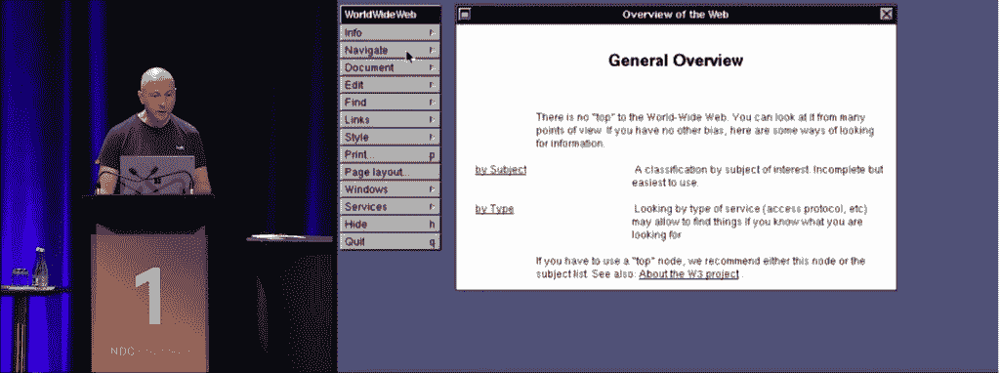
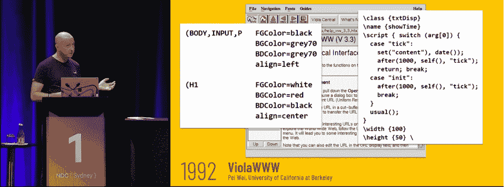

# 网络技术是如何发展成这样的，以及它在未来会如何发展

> 原文：<https://thenewstack.io/how-web-tech-got-this-way-and-how-it-may-evolve-in-the-future/>

自 2016 年以来，挪威开发者大会一直在澳大利亚悉尼举行配套会议。上个月，它的一个演示是一个关于网络历史及其开发工具的旋风之旅——带来了一个关于是什么导致了我们现代网络开发前景的详细而深刻的观点。

[https://www.youtube.com/embed/3QEoJRjxnxQ?feature=oembed](https://www.youtube.com/embed/3QEoJRjxnxQ?feature=oembed)

视频

在这一过程中，观众得到了世界上第一台 web 服务器的演示，该服务器由 1989 年的原始源代码和过去三十年的其他 web 开发工具编译而成，以解释我们是如何走到今天这一步的。

但是在演讲的最后，听众也听到了一些关于这一切最终走向的有根据的推测。

简而言之，这次演讲让听众们看到了我们过去的样子，以及我们可能会成为的样子。

## 浏览器的诞生

这个演讲是由[史蒂夫·桑德森](http://blog.stevensanderson.com/)发表的，他是 web 应用框架 [Blazor](https://en.wikipedia.org/wiki/Blazor) 的创始人。(史蒂夫网站上的一份简历提到，他参与了从 JavaScript 库到新的 Azure 管理门户网站的所有工作。)Sanderson 最近重新加入了微软网络应用框架 ASP.NET 的核心团队，“目标是让这个平台成为 JavaScript 开发者的纯粹快乐和喜悦。”

但是他演讲的标题承诺告诉网络开发者“为什么网络技术是这样的。”

在运行世界上第一个网络浏览器之前，桑德森开始为世界上第一个网络服务器编译代码——这是 700 行 C 代码，早在 1989 年就为蒂姆·伯纳斯·李的 TCPServer.c 提供了动力。它创建了一个名为 *httpd* 的 22 千字节二进制文件，该文件监听端口 2784，而不是端口 80。桑德森说:“显然，这些是伯纳斯-李父母电话号码的最后四位数字。”。

还包括诊断，如控制台跟踪，用于查看各种格式的 HTML 文件的源代码。桑德森说:“所以我们在一开始就有早期的浏览器开发工具。

它不是唯一一个内置开发工具的早期软件。裴頠 1991 年的纯 Unix 浏览器甚至有样式表。“现在显然不是 CSS——CSS 还没有被发明出来。但这就是他想出来并放进去的东西，”桑德森说。

“但更令人印象深刻的是，”桑德森继续说道，“它有内置脚本。再说一次，不是 JavaScript——那时还没有发明出来——但是整个浏览器都是用这种脚本语言构建的，他允许你在你的页面中嵌入相同的脚本语言来动态地改变内容。所以这确实为网页能做什么设定了一些方向。”

这些不仅仅是历史上的奇闻，而是桑德森提出的一个更大观点的例子:“我们可以改变网络的进程。”

“做出这些决定的人，在某些情况下，他们是大公司，但很多决定都是由工程师个人做出的，”他说。

## 开发开发工具

不管是好是坏，这些个人的决定会在几十年间产生影响。例如，1995 年，当[布伦丹·艾希在 10 天内创建了 JavaScript](https://webdevelopmenthistory.com/1995-the-birth-of-javascript/) 时，马克·安德森已经明确表示他想要一种非编译语言，以便人们可以直接将代码输入到他们的 HTML 中。桑德森说:“这是一个一直伴随着我们的设计决策，直到 WebAssembly 最终被创造出来。”

然而就在 2006 年，“你能得到的最接近任何浏览器开发工具的东西就是在记事本中查看源代码，”他说。

2007 年 Joe Hewitt 的浏览器插件 Firebug 带来了改进——包括控制台、HTML 视图、CSS、脚本调试器和网络跟踪器。桑德森说:“这种设计很大程度上一直伴随着我们。"谷歌一发布 Chrome 浏览器，它就几乎被抄袭了."

桑德森的演讲贯穿了移动优先设计的兴起，伴随着 2007 年 iPhone 的发布，直到它到达了一个转折点。Sanderson 认为 JavaScript 在 2005 年到 2008 年间“重生”,寻求吸引用户生成内容的界面。谷歌地图的发布展示了异步 JavaScript 在后台处理请求和动态更新页面方面的潜力——而且“这一点一直伴随着我们”Sanderson 强调了另一项“当时的主要使能技术”:2006 年的 jQuery。

但是在 Sanderson 的讲述中，真正的转折点似乎是在 2010 年左右，那时 JavaScript 无处不在——尽管仍然在那些庞大而混乱的 jQuery 应用程序中。随着 Ryan Dahl 在 2009 年发布 Node.js，Sanderson 认为 O'Reilly 的书“JavaScript: the Good Parts”引发了对 JavaScript 的新的尊重，导致了框架版本的显著融合:

“一大群人在同一时间有大致相同的想法”——将训练有素的开发模型(如模型-视图-控制器或其他模式)引入 web 开发的想法。

桑德森说:“这些事情没有一件是相互协调完成的。“这只是一个为世界准备好的想法。它必须出来，一大群人同时这么做了。”

有趣的是，他将我们的现代 web 开发时代总结为“web 开发人员复杂性快速增长的时期”他甚至拿出一张幻灯片，上面有 TypeScript、webpack…和 Kubernetes 的标志。

coffee script(2009 年首次发布)更流行编译 JavaScript 的想法。在此基础上，TypeScript 添加了一个类型系统，并成为“一个令人难以置信的成功故事”和“为开发人员解决实际问题的有效方法”但是随着编译 JavaScript 的激增，“我们现在需要编译和捆绑系统，所以 webpack 应运而生。”

Sanderson 说他把 Kubernetes (2014)包括进来是因为“它只是给了你一个提示，让你知道现在网络开发者应该知道多少东西。这不仅仅是前端开发和后端开发和造型，并建立系统和东西。它现在也是云流程编排。这是一个非常非常复杂的时代。”

“现在开始到了人们需要稍微抵制这种做法的时候了。”

## 面向未来

在演讲结束时，桑德森拿出一张题为“现在和未来”的幻灯片，给了他一个发表意见的机会。展望未来，桑德森预测“网络开发人员应该知道的复杂性和数量将会减少。也许我们正在触及某种极限。”

“一些正在出现的技术可能会开始帮助我们减少一点。”

Sanderson 称赞浏览器可以在 web 开发人员更少的准备下处理更多的内容，并特别引用了[原生 CSS 嵌套](https://blog.logrocket.com/native-css-nesting/)，它“允许我们通过在浏览器中烘焙越来越多的这些功能，获得像 less 和 Sass 这样的东西所带来的许多好处。”他还看到了类型擦除的提议:“一种在浏览器中直接运行 TypeScript 等语言而不必编译它们的方法，只需教会浏览器忽略类型注释和其他浏览器不理解的东西。”

但是我们的世界正在以其他方式演变。桑德森注意到了一个新的趋势，即向云边缘内容交付——“不只是在世界上某些地方的几台服务器上交付您的 web 应用程序，而是在世界各地成千上万的地方。”优势？“用户的响应时间只有个位数的毫秒级，而且几乎永远不会停机，因为在这种情况下，如果要关闭网站，就必须关闭整个全球基础设施。”

Sanderson 提到了 HTTP/3 协议和 WebTransport API 带来的较低延迟。“您不必再捆绑内容了。为许多小文件提供服务与为一个大文件提供服务一样高效。”

另一个大趋势是像 Sveltekit、Astro 和 NextJS 这样的元框架的兴起。“现在的基本想法是，特别是在 JavaScript 世界，人们正在使用如此多的框架，以至于他们需要一个框架来管理他们的框架…通过拥有一个了解服务器端、客户端、构建系统和 ide 的单一框架，您可以将所有这些放在一起，然后您可以构建跨越所有这些东西的新功能，如果您只是在自己的小筒仓中拥有框架，这是不可能的。”

元框架带来了新类型的特性。而。NET 开发人员可能已经有了使用组合服务器/客户端/IDE 构建解决方案的经验，”事实上，这些想法现在正在进入 JavaScript，这激发了许多关于这些特性的新创新，整个 web 社区都可以从中受益。所以我认为这非常令人兴奋……”

在演讲的最后，Sanderson 强调，工程师个人可以做出影响 web 开发未来的决策。“你就是那些工程师。你们在这里参加这个会议，你们可以互相聊天，提出一些关于我们下一步要去哪里的想法。我很高兴看到它，并希望成为你创造的一部分。”

<svg xmlns:xlink="http://www.w3.org/1999/xlink" viewBox="0 0 68 31" version="1.1"><title>Group</title> <desc>Created with Sketch.</desc></svg>