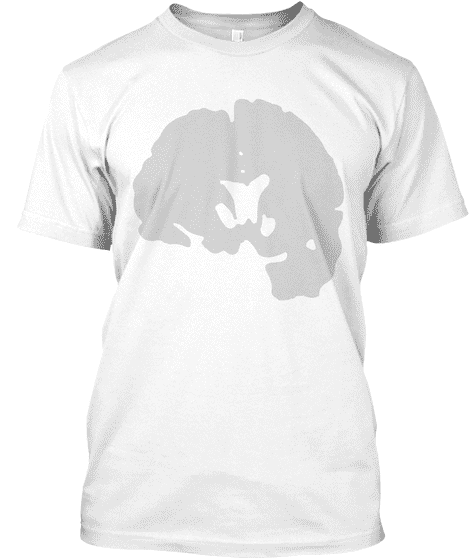

# YouTube 的机器人女王将如何对抗脑瘤

> 原文：<https://thenewstack.io/how-youtubes-queen-of-robots-will-fight-a-brain-tumor/>

Simone Giertz 可能是互联网上最受欢迎的业余机器人专家，因为她的[系列有趣的 YouTube 视频](https://www.youtube.com/channel/UC3KEoMzNz8eYnwBC34RaKCQ/videos?disable_polymer=1)而成为许多人熟悉的面孔。但她关于建筑技术的鼓舞人心的故事现在已经变成了一个更大的故事，关于面对重大医疗程序的勇气。

她带着她的观众。

“我是吉尔兹家的西蒙妮·斯韦博恩，”她在自己的网站上开玩笑地写道，称自己是“低劣机器人的女王，晶体管的断路器，故障的女主人，可怕发明的母亲…

“我真的很擅长建造非常糟糕的东西。”

她因愿意开展有趣的科技实验而出名。吉尔兹最具标志性的机器人可能是她的“[唤醒机](https://www.youtube.com/watch?v=mXLzfAHl4-k)”——这个塑料手闹钟会拍打她的脸来叫醒她。但正是她聪明的幽默感——以及愉快的面无表情的演讲——使她成为 YouTube 上的明星，在 YouTube 上，一个又一个视频记录了似乎是她的生活的滑稽冒险。

[https://www.youtube.com/embed/ab47XHidvwQ?feature=oembed](https://www.youtube.com/embed/ab47XHidvwQ?feature=oembed)

视频

[https://www.youtube.com/embed/G6n7oA5yoPY?feature=oembed](https://www.youtube.com/embed/G6n7oA5yoPY?feature=oembed)

视频

她的许多视频已经获得了数百万的点击量。甚至有一个视频，她试验了“携带婴儿的无人机”的想法但是 2018 年的一个视频与其他视频不同，“[进入脑部手术](https://www.youtube.com/watch?v=gS1DbvHHVH0)”

2018 年 4 月，吉尔兹向她的隐形在线观众宣布，她被诊断出患有缓慢生长(非癌症)的脑瘤。当时 27 岁的她已经为这个令人痛苦的医疗过程做好了准备——7 月份，她再次用一段视频向观众宣布了好消息，同时展示了她新的头部伤疤。“我有太多的事情想告诉你，”她笑着说，“还有太多的事情我真的不想告诉你。”

“但底线是我很好。手术进行得很顺利。我两只眼睛都看得到！我的大脑似乎和以前一样好或一样差。”

[https://www.youtube.com/embed/-INz4XVeyJ4?feature=oembed](https://www.youtube.com/embed/-INz4XVeyJ4?feature=oembed)

视频

很快，她甚至开始出售印有她大脑扫描照片的 t 恤，并回去制作她有趣的科学实验视频。

但在 1 月 8 日，吉尔兹向她的 Patreon 粉丝更新了一个“盛大的假期计划”——飞往墨西哥的瑜伽/冥想营地——之前是“我的医生传来的坏消息”。

“我还没有谈到的一件事是，我还有很多脑瘤……”

她给自己的肿瘤取名为“布莱恩”，这给了她一个可以抱怨的有形敌人。“如果你说出它们的名字，事情就不会那么可怕，”她在 7 月的一段视频中解释道。现在，讲述她故事的下一章变得更容易了。“有些部分切除起来太危险了，所以神经科医生把它们留在了那里，因为布莱恩是一个温和而没有野心的混蛋。”

但现在，很不幸，布莱恩长大了。"这并不紧急，但我需要放射治疗和进一步的治疗."

上周，吉尔茨在 Patreon 上发布了一个非常坦率的视频，名为“健康更新”。它以她将手机绑在三脚架上拍摄的镜头开始，然后是她妈妈的镜头。“她在这里是情感上的支持……”西蒙妮说，然后补充道“发生了很多事情。这一周过得有些艰难。”

在她的视频中，她解释说肿瘤生长在“一个太危险而不能进行手术的区域”当她提醒观众她现在将接受放射治疗时，她的声音似乎被抓住了，但当她透露她的放射肿瘤医生名叫“Deep 医生”时，她笑了。她仍然笑着说，“我们已经制定了一个治疗计划，我将需要从周一到周五进行为期六周的放疗。”周三开始的。

“吉尔茨认为肿瘤可能会复发，”[《新闻周刊》后来对](https://www.newsweek.com/simone-giertz-brain-tumor-back-youtube-returned-1297804)解释说，“但她没想到在她初次手术后仅八个月就复发了。”

她在视频中承认放射疗法很可怕，它有“非常可怕的副作用”，她只是“试着不为此烦恼……但是，是的。她说:“要处理的事情太多了。

“因为我真的很兴奋，因为我可以回去工作，只做项目，而不用去想脑瘤布莱恩……”

她把它比作一部电影的糟糕续集。“这是脑瘤 2 布莱恩……感觉就像有人把这个专营权经营得一塌糊涂……”但更严重的是，她补充道，“感觉我真的不能依赖任何东西，因为在任何给定的时刻，地毯都可能从我身下被拉出来。”

她表示，有 Patreon 赞助商让她如释重负，这样她的房租和医药费仍有着落。“当你经历这样的事情时，只要知道有人愿意陪你度过难关，即使你不能像有趣的叔叔一样，我也不能说这对我有多重要。”

她的 Patreon 账户支持者激增，现在显示有 6357 名顾客，即使在每月 3 美元的最低水平，也能给她带来每月 19000 美元的收入。

然后，她将与观众分享更多的科学知识——她将戴上“奇怪的辐射面罩”，“看起来像是低成本科幻小说中的东西”，这将使她的头每天保持在完全相同的位置。"幸运的是，我得到了它！"她补充道，找到了一些让她充满热情的事情。“所以我只是在努力想——这就像是一件事。我想，‘哦，我能用这个做什么项目？’你知道吗？"

她的视频很快收到了数百条支持评论。"布莱恩不知道他的对手是谁！"一位 Patreon 捐助者写道，并补充道“请踢这个东西想象中的屁股！”

她在 YouTube 上为她的非 Patreon 观众录制了第二个视频，提出了勇敢积极的态度。“好消息是我现在不用再做手术了。我将不得不接受放射治疗。”

当她解释她的情况时，成千上万的网上粉丝跟随着她。“尽管这不是我为自己选择的，但这并不一定意味着它就一定是坏的，”吉尔兹富有哲理地说。“我一直试图提醒自己的是，这是一件从外表上看起来非常糟糕的事情，但我对生活的了解太少，无法确定……”

她不知道放射治疗后是否还能继续她的 YouTube 事业。“我也许可以工作和制作视频。但我也可能不会。我只是想让你知道，如果我不在你身边，并不是因为我不想在。是因为我不能。”

本周，她开始在 Twitter 上发布更新，一个接一个地倒数 30 次放射治疗。

不清楚接下来会发生什么。吉尔兹在她的视频中说:“辐射本身应该是真正无痛的，但有很多潜在的副作用，我尽量不去想。”虽然成功率为 90 %,但在某些情况下，健康细胞受损会导致失明、耳聋、脱发，甚至痴呆症。“但是我在尽力忘记那件事……”

不管接下来发生什么，吉尔兹的故事最终提醒我们，没有人是孤独的，因为在互联网上，日复一日——在脸书、Reddit、Patreon 和 YouTube 上——吉尔兹的粉丝不断给她发送无尽的鼓励。

一名粉丝在 Reddit 上发帖称:“我渴望像你一样情商高，精神稳定。”他还鼓励道:“保持坚强。

“你的旅程是一种激励。”

* * *

# WebReduce

<svg xmlns:xlink="http://www.w3.org/1999/xlink" viewBox="0 0 68 31" version="1.1"><title>Group</title> <desc>Created with Sketch.</desc></svg>