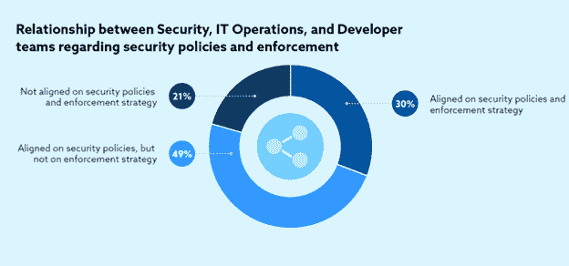

# 零信任模型如何在容器安全中工作|新堆栈

> 原文：<https://thenewstack.io/how-zero-trust-models-work-in-container-security/>

在本系列的第一篇文章中，我们讨论了[什么是零信任安全](https://thenewstack.io/what-is-zero-trust-security/)以及它为什么重要。在本系列的第二篇文章中，我们讨论了[零信任网络访问](https://thenewstack.io/what-is-zero-trust-network-access-ztna/)的好处。在这第三篇文章中，我们将深入探讨在容器安全中使用零信任模型。

容器为组织带来了许多好处。这些优势包括更高的效率、应用程序的快速部署和扩展，以及更少的系统需求。然而，这些好处并非没有巨大的成本和一些挑战。容器通常依赖于复杂的网络，随之而来的是一系列的安全挑战，如脆弱的防火墙、容器镜像漏洞和未经授权访问的风险。

有没有一种解决方案可以减轻安全团队面临的挑战，同时增加数据保护的范围并降低网络安全风险？零信任可能是一个伟大的解决方案，许多组织正在转向这些天。

## 零信任模型有什么帮助？

在大多数传统安全环境中，传统防火墙的网络复杂性和局限性给组织带来了最大的风险。任何网络中过多的连接都会导致某些热点被忽略。此外，传统的防火墙在检测和缓解网络内外攻击者的活动方面往往做得不好。

这就是[零信任安全](https://thenewstack.io/how-zero-trust-service-meshes-and-role-based-access-control-can-prevent-a-cloud-based-security-mess/)模型可以发挥最大作用的地方。由于零信任建立在不信任任何事物或任何人的策略之上，因此围绕用户访问和工作负载身份的策略有助于组织了解谁在访问什么信息，以及什么信息在整个网络中传输。

由于许多企业不再在内部收集和存储数据，因此对零信任安全模型的需求越来越大。内部和外部平台和服务现在都托管数据，并且可以通过位于不同地理位置的各种不同设备访问这些应用程序。这使得传统的安全模式不适合保护许多组织。

## 容器如何管理网络

容器以多种方式管理网络系统。例如，Docker 需要一种引入容器的方法，所以它使用网络地址转换(NAT)来实现。NAT 改变了网络地址信息，掩盖了网络的复杂性，但使进出比以前更加模糊。因此，容器具有与父 IP 不同的 IP 地址。

此外，Docker 子网可以与底层网络分离。在这种情况下，容器网络可以在不同平台之间自由迁移和移动。例如，主要服务可以在内部运行，而额外的容器可以在 Amazon Web Services (AWS)上运行。这使得组织能够高效运行并拥有合适的带宽量，即使在网络流量较大的情况下，例如在工作日而非下班后。

另一方面，桥接更加开放和可用。所有容器在同一网络中按照一致的 IP 地址框架运行。底层网络对 IT 团队完全可见。虽然有些连接是主机，有些是容器，但容器可以在组织内的 IT 经理或 IT 团队完全了解的情况下在主机之间移动。

随着覆盖网络的使用，容器可以有效和方便地与其他容器通信，从而创建一个更加分布式的网络。在这种情况下，由于需要负载和性能指标，整个基础架构将转移到不同的主机上。

虽然容器网络是非常可定制的，但其复杂性使得围绕防火墙和其他更传统的安全边界的策略非常难以创建。

根据云安全联盟 2021 年的“云安全风险、合规性和错误配置状况”，只有 30%的组织拥有符合安全策略的 IT 运营、开发和安全团队。

对于一个组织的安全策略是什么，通常会有一致的看法，但是对于如何在多个环境中实际执行它们，就不那么一致了。根据云安全联盟 2021 年的[“云安全风险、合规性和错误配置的状态”，](https://cloudsecurityalliance.org/artifacts/state-of-cloud-security-risk-compliance/)只有 30%的组织的 IT 运营、开发和安全团队就其安全策略以及如何通过 DevSecOps 实施这些策略达成一致。零信任策略提供了更加一致的执行承诺，但是这也需要不同团队之间的一致同意。

## 网络安全策略和横向移动的复杂性

如果网络罪犯想要访问主机的安全数据库，在安装了防火墙的情况下，只有数据包会从主机端显示出来。主机被授权信任这台机器，因此它会让数据包通过。然后，攻击者将能够在网络上移动，通过加密数据或数据泄漏更接近他们的目标。

组织可以使用防火墙构建传统的安全框架，并采用零信任安全模型来确保容器和微服务相互连接和通信。在这种情况下，零信任是根据几个原则开发的。

1.  容器之间不存在隐含的相互信任。取而代之的是，需要强制认证，这可以防止网络攻击者从一个受损的容器横向移动到另一个容器。当网络攻击者被卡住或看不到从一个容器到下一个容器的方法时，攻击者很可能会被挫败。
2.  代码和基础结构通过本地服务器证书托管。这些日志提供了一个记录，有助于在出现网络安全攻击的情况下进行故障排除。
3.  身份和访问管理以及其他安全策略和基准可识别用户、访问、证书、时间表和基于角色的控制，以防止内部和外部的入侵者。

建立安全和保障准则允许容器在多云环境中运行。底层基础设施可以加强容器的安全控制。基于云和基于容器的应用将继续推动人们对零信任网络访问的兴趣。

通常，安全团队和 IT 主管必须在应用程序、网络和平台之间实施一致的安全控制。建立一种方法来保护对容器的访问比以往任何时候都更加重要，因为防火墙根本不足以管理容器的网络 IP 内的变化。

<svg xmlns:xlink="http://www.w3.org/1999/xlink" viewBox="0 0 68 31" version="1.1"><title>Group</title> <desc>Created with Sketch.</desc></svg>