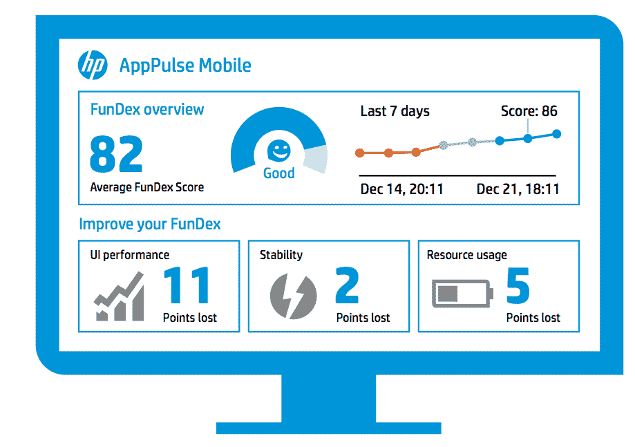

# 惠普用监控移动应用的工具吸引开发者

> 原文：<https://thenewstack.io/hp-courts-developers-with-tools-for-monitoring-mobile-apps/>

惠普正在利用基于其大数据平台的新工具来吸引移动开发者。

惠普生命周期和优质产品营销总监 Kelly Emo 表示:“这一切都是为了让移动开发人员和测试人员拥有尽可能多的大数据、分析和洞察力，以做出正确的决策来快速推出应用，然后不断监控用户体验，以便您可以提前解决下游的潜在问题。

核心是惠普应用 Pulse Mobile，它可以监控和分析移动应用的性能、稳定性和资源使用情况。它提供了一个“FunDex”分数，提供了问题的顶级视图。惠普应用性能管理高级产品营销经理 Eric O'Dell 解释说，分数从 100 分开始，但随着应用程序出现的每个问题而下降。

【T2

你可以看到它因崩溃损失了 8 个百分点，因加载速度慢损失了 12 个百分点，因大量使用电池损失了 4 个百分点。它会查看出现问题的屏幕，识别操作系统和设备。

“它会告诉你，当他们点击这个按钮时，它就在姜饼和三星上，”他说。“您可以更深入地研究异常代码，并获得有关堆栈跟踪的信息。因此，现在你可以看到具体的问题，并确切知道有多少用户受到了那次崩溃的影响。”

如果您知道有 3，000 个用户受到影响，您可以优先修复仅影响 100 个用户的问题。

“你可以与开发团队分享崩溃日志，其中的信息可以深入到代码行，[说]‘这个操作系统，这个设备，这一行代码——让我们现在就修复它，’”他说。

Emo 表示，公司对在应用程序投入生产之前优先进行测试以及优先处理积压工作的能力表现出了浓厚的兴趣。

此外，新版本的[惠普移动中心](http://www8.hp.com/us/en/software-solutions/mobile-testing/index.html)提供了软件驱动的功能，可以在支持原生 iOS、Android 和混合应用的设备之间进行测试，包括常见的 JavaScript 框架，如 JQM、Angular 和 Sencha。它已经与 HP LoadRunner 和 HP Performance Center 的新版本集成，整合了从收购网络虚拟化初创公司 Shunra 获得的技术，以提供一个网络行为特征实验室。

“您可以在任何网络中进行测试，包括 2G、3G、特定区域、高速无线网络，您可以看到该网络对您应用的整体性能有何影响。它有抖动吗？这是否会导致应用程序停止运行？你可以在生产前改变性能，”Emo 说。

此外，该公司宣布:

*   新版惠普[敏捷管理器](http://www8.hp.com/us/en/software-solutions/agile-project-management-software-development/index.html)支持与惠普[应用生命周期管理](http://www8.hp.com/us/en/software-solutions/alm-software-development-testing/index.html)软件的实时集成，以提供数据驱动的洞察，确保每个版本的质量。它还集成了惠普 [Fortify 应用安全](http://www8.hp.com/us/en/software-solutions/application-security/index.html)套件。
*   HP [网络虚拟化](http://www8.hp.com/us/en/software-solutions/network-virtualization/index.html)的新版本，具有增强的用户界面和更新的性能优化功能。
*   新版本的 HP [服务虚拟化](http://www8.hp.com/us/en/software-solutions/service-virtualization/index.html)扩展了对流行协议的支持，如 Websphere MQ、SAP RFC/IDOC。
*   惠普基于云的负载测试服务的新更新:惠普 [StormRunner Load](http://www8.hp.com/us/en/software-solutions/stormrunner-load-agile-cloud-testing/index.html) 改进了性能分析，并扩展了国际地理覆盖范围，以创建本地负载。

不过，除了大量投资惠普产品的企业之外，还不清楚谁会使用这些工具。

“所有的大型科技公司都在移动领域，他们试图找出自己的特定利基市场，但我认为，如果你愿意，移动领域的大型巨头的格局将会有所改善，”杰夫·科尔宾说，他是纽约市的一家专注于授权业务部门创建自己的应用程序的公司的创始人兼首席执行官。

据技术分析师 Rob Enderle 说，惠普的一个问题是，它生产了许多杂乱无章的工具，客户必须弄清楚如何将它们组合在一起。

他说:“惠普的声明看起来像是一记猎枪子弹，而竞争公司往往会领先于解决方案并回到组件上，这是一个更好、更以客户为中心的销售过程。”

Emo 表示，新工具将为目前使用测试工具和生命周期管理的惠普客户提供很大的优势，但独立商店也可以立即受益。她说，可以免费试用的 AppPulse Mobile 和 Mobile Center 可以插入他们的测试环境，不依赖于其他惠普产品。惠普提供研讨会和专业服务来支持客户使用产品。

惠普在 2014 年 5 月推出了基于 OpenStack 的 Helion 云平台。大数据平台 Haven 运行在 HP Helion 云上，并结合了惠普多年来收购的各种技术，如 Autonomy、Vertica、Operations Management 和 ArcSight。

惠普在二月宣布 [Haven 预测分析](http://www.informationweek.com/big-data/big-data-analytics/hp-goes-open-source-for-haven-predictive-analytics/a/d-id/1319133)，基于其开源语言“R”的版本，被称为分布式 R。

惠普还提供自己的平台即服务(PaaS)技术，称为 Helion 开发者平台，以及 Helion VPC 精益，这是一种面向中型企业的云服务，旨在将应用开发、测试和其他工作转移到托管基础设施即服务(IaaS)环境中。

上周，它宣布了其 [Helion Rack cloud-in-a-box 系统](http://www.forbes.com/sites/paulmiller/2015/03/24/with-helion-rack-hp-sticks-cloud-in-another-box/)，结合了 ProLiant 服务器、惠普的 Helion 开发平台和 OpenStack 云编排软件。

该公司[在最近一个季度没有达到收入目标](http://www.nytimes.com/2015/02/25/technology/hewlett-packard-quarterly-earnings.html?_r=0)，并降低了年度收益预期。虽然几乎所有产品领域的销售都持平或下降，但其移动开发产品一直是表现较好的开发产品之一。

首席执行官梅格·惠特曼曾表示，该公司多年来的扭亏为盈和 11 月前拆分为两家公司的计划正在进行中。她还表示，公司将继续在研发和收购方面投入巨资。

惠普是新堆栈的赞助商。

通过 Flickr Creative Commons 的特色图片。

<svg xmlns:xlink="http://www.w3.org/1999/xlink" viewBox="0 0 68 31" version="1.1"><title>Group</title> <desc>Created with Sketch.</desc></svg>