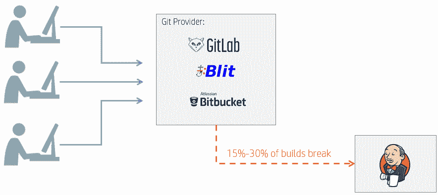
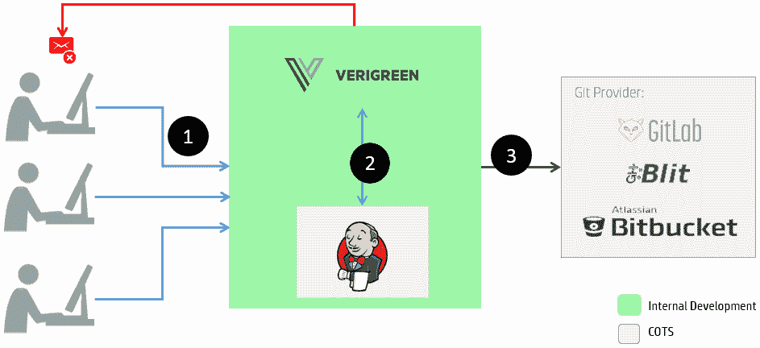
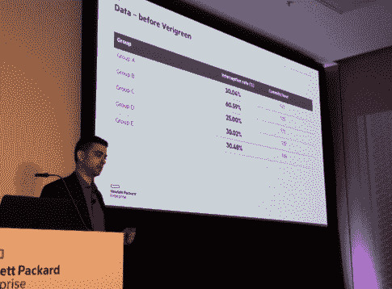
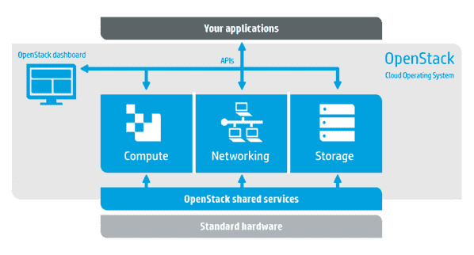
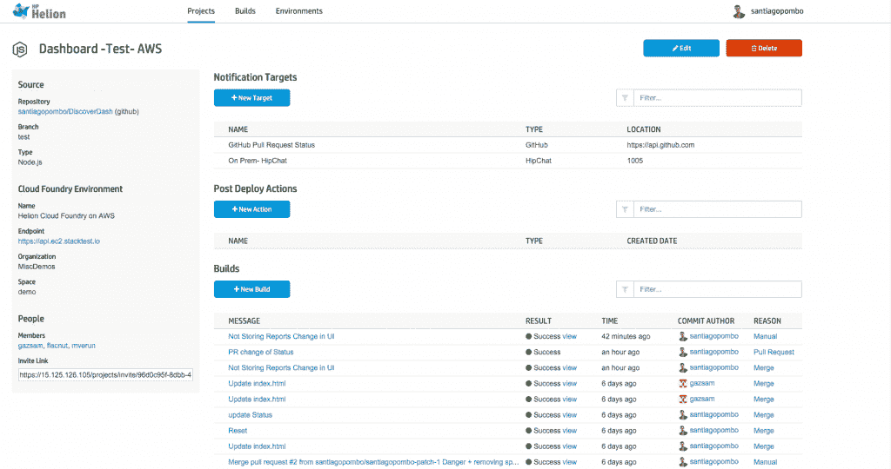

# HPE 探索 2015:关于企业开发，减少测试失败的构建

> 原文：<https://thenewstack.io/hpe-discover-2015-enterprise-devops/>

随着基于云的技术继续影响企业，越来越多的解决方案被提供出来，这些解决方案不仅让客户受益，也提高了开发人员的生活质量。简化生产流程不仅对解决挑战有重大影响，还能确保潜在问题不会影响整个代码分支。

在 2015 年 HPE 探索大会上，HPE 展示了 Verigreen、StormRunner 及其 Helion 云服务，所有这些都可以缩小开发者、工程师和运营人员之间的差距。

## DevOps 的力量

在 HP Discover 大会上，[Tripwire 的联合创始人、全方位 DevOps 专家 Gene Kim](http://www.realgenekim.me/) 发表了一篇关于通过拥抱 DevOps 所能提供的一切来领导企业的演讲。随着开发人员不断将工作流多样化，工程师、开发人员和运营之间的差距不断缩小。当在企业级环境中采用新技术时，开发人员往往会参与到可能需要跳出框框思考的运营任务中。

“DevOps 对运营和发展都有好处，”Kim 说。

在 DevOps 中工作时，每天的部署是衡量团队生产力的标准。亚马逊和 Etsy 等公司正在部署以秒为单位的代码，而不是以分钟、小时或周为单位。[惠普 Verigreen](https://github.com/Verigreen/verigreen) 是一款开源门控检查解决方案，提供了一种自动化的测试、CI 和 CD 方法，同时还旨在减少测试失败的构建数量。

图为:Verigreen 旨在解决的构建/测试问题。

“DevOps 不仅适用于独角兽，也适用于马。这些大型、复杂的组织已经存在了几十年，现在采用谷歌或脸书的相同原则，并得到相同的结果，”金说。

最初，惠普企业开发人员的内部 R&D 是与 Verigreen 一起进行的，希望评估[开发管道](https://github.com/Verigreen/verigreen/wiki)并替换任何发现的薄弱环节。Verigreen 中使用的门控签入系统防止坏代码破坏整个组织的环境。

Verigreen 拦截传入的请求，评估它们是否包含在存储库的受保护分支中。如果验证了提交是针对受保护分支的，则拒绝提交，通知提交的开发人员验证已经开始。

随着检查的继续，从最新的代码中创建一个临时分支，然后将提交的代码验证合并到 Jenkins 中。如果验证成功，该分支将成为新的代码，所有以后的提交都将基于该代码。在大规模工作时，临时分支机构有助于减少詹金斯使用的资源。自从在内部实施 Verigreen 以来，惠普已经有 300 多名开发人员使用该软件，该软件拦截了 30%的构建中断，同时将提交率提高了 20%。

图为:Verigreen gate 检查阻止被污染的代码进入构建。

随着企业变得越来越以开发人员为中心，必须在生产力和设置其他系统或软件所花费的时间之间取得平衡。Verigreen 完全在服务器端运行，开发人员不必安装任何东西，能够从任何平台提交，并且仍然可以拦截他们的提交进行验证。

Kim 指出，对于希望使用 Verigreen 的公司来说，已经有一个成熟的 Jenkins 堆栈运行是有帮助的，它还应该有一个成熟的 CI 系统，并有一个短的反馈循环。gate check verification 概念允许开发人员基于实际已经更改的代码运行部分构建，这对于那些在混合或遗留系统中工作的人很有帮助。由于 Verigreen 是开源的，对于企业如何调整该软件以适应自己的需求没有限制。

听听金的谈话:

[吉恩·金，作者兼 DevOps 爱好者:在 HPE 发现](https://thenewstack.simplecast.com/episodes/gene-kim-author-and-devops-enthusiast-at-hpe-discover)

## 全押 Verigreen

开源 Verigreen 的旅程是“伟大的”，据 HPE DevOps 架构师 Eitan Schichmanter 说，他在会议上接受了 New Stack 创始人 Alex Williams 的采访。最初，选择开源软件是基于推广 gate check verification 概念的愿望，为开源软件社区做出贡献，并使惠普工程师成为社区中值得信赖的资源。

图为:Eitan Schichmanter 在 2015 年 HPE 探索大会上讨论 Verigreen 前后的团队生产力。吉恩·金的照片。

来自社区的接待是一个惊喜，因为 Verigreen 团队很快就看到朋友和同事在传播这个项目。很快，外部客户打来电话，询问如何将 Verigreen 应用到他们自己的技术堆栈中。与惠普企业软件首席技术官 Jerome Labat 一起开发 Verigreen，看到人们使用它，这是 OSS 社区支持的一种值得赞赏的表现。

“目前，有 300 多名开发人员在使用 Verigreen，提交了 9，200 份申请。Schichmanter 说:“我们拦截了高达 21%的构建中断，每天的提交量增加了 24%。Verigreen 不仅帮助提高了开发人员的效率，还减少了批量大小和代码中断。随着越来越多的项目继续采用它，Schichmanter 亲眼看到了 Verigreen 的 gate check 验证的影响。

使用该软件的团队变得更有弹性和生产力，能够更快地推出新功能。然而，Schichmanter 指出，Verigreen 最好的一点是它的适应性。无论一个人的项目是运行在混合系统上还是完全集成到云中，Verigreen 仍然可以安装来帮助他的团队完成与惠普内部软件测试相同的目标。

请听亚历克斯·威廉姆斯对席克曼特的采访:

[Eitan Schichmanter，惠普企业:Verigreen，内部门控签到解决方案](https://thenewstack.simplecast.com/episodes/eitan-schichmanter-hewlett-packard-enterprise-verigreen-the-internal-gated-check-in-solution)

## 太阳神和风暴使者

在 HP Discover 期间，Williams 还与 HPE 产品高级总监 Manav Mishra 就[HP Helion](http://www8.hp.com/nz/en/cloud/helion-overview.html)和惠普基于云的企业产品网络进行了交谈，包括惠普的企业级 PaaS Helion Stackato、[Helion Open Stack](http://techcrunch.com/2015/10/28/hp-launches-version-2-0-of-its-helion-openstack-platform/)和 CI/CD 平台 Helion 代码引擎。

基于云的软件继续成为企业级组织更主流的选择。惠普已经积累了各种产品，帮助政府、金融机构和大型机构将云技术带入他们之前可能拒绝在云中工作的领域。“软件正在塑造世界，推动它在生活的各个方面向前发展。如果你不解决一个问题，别人会解决的，”米什拉说。

图为:惠普 Helion OpenStack 架构

混合环境在当今的企业中已经变得司空见惯。组织通常使用 PaaS 设置来平衡私有云和公共云，以便在遗留项目和那些用于在云中工作的工具之间部署代码。

“我们希望增强转型的概念。转型是一个过程。这是一个事件，而不是一项活动，”米什拉在讨论将企业堆栈转变为未来时说道。随着越来越多的企业转向采用基于云的产品，升级开发堆栈的各个部分同时不丢失多年的前期工作的需求仍然是许多企业关注的问题，特别是对于较旧的遗留应用程序和专用物理服务器设置。

企业开发人员通常被视为各自领域的专家，他们拥有多年的实践经验，这些经验只能通过长期使用语言、框架或工具来获得。Mishra 和 HP Helion 团队指出，他们被要求创建一个与语言和框架无关的云计算平台，以满足这些团队成员的需求。

许多开发人员在。NET 编程语言，超过 45%的开发人员不仅需要 Helion 支持。NET，但运行本机 windows 应用程序。Helion 通过采用容器得到了进一步的支持，允许将许多较小的项目组件统一到一个中心位置，可以跨各种平台(私有云和公共云)访问和运行。

图为:惠普 Helion 公有云服务器演示项目。

当开发人员向 Helion 中的应用程序提交更改时，存储库上的监听器会检测到这些更改，并自动开始构建过程。一旦构建发生，Helion Code Engine 就接受测试框架，挑选测试用例并运行它们。

如果这些测试通过，还可以选择警报测试。StormRunner 也被集成到 Helion 中，允许在部署之前测试应用程序如何处理负载。米什拉说:“使用容器提供多种云解决方案使惠普能够在当前的位置与开发人员见面，而不是指着他们未来的某个时间点说，‘到那里来见我们吧。’”。

请听威廉姆斯对米什拉的采访:

[马诺夫·米什拉，惠普:惠普 Helion at HPE Discover](https://thenewstack.simplecast.com/episodes/manav-mishra-hewlett-packard-hp-helion-at-hpe-discover)

米什拉指出，当与企业合作时，开发人员现在与高管一起参与决策过程。与过去的决策相比，这也许是对未来最清晰的定义之一。开发人员被视为流程的关键部分，能够提供他们在业务改进、团队士气和生产力方面的专业知识。

随着技术的不断进步，DevOps 将成为企业级软件开发的重要组成部分，需要能够适应日常不断变化的场景需求的技术堆栈。HPE 发现 2015 不仅展示了一些可供希望升级到基于云的软件平台的企业使用的技术，还强调了开发运维人员的需求。

TNS 编辑亚历克斯·威廉姆斯对此文亦有贡献。

要订阅新 Stack Makers 播客或查看其他剧集，请访问新 Stack 的播客部分[。](https://thenewstack.io/podcasts/)

HPE 是新堆栈的赞助商。

专题图片作者:Unsplash，获得[知识共享协议 CC0](http://creativecommons.org/publicdomain/zero/1.0/deed.en) 的许可

<svg xmlns:xlink="http://www.w3.org/1999/xlink" viewBox="0 0 68 31" version="1.1"><title>Group</title> <desc>Created with Sketch.</desc></svg>