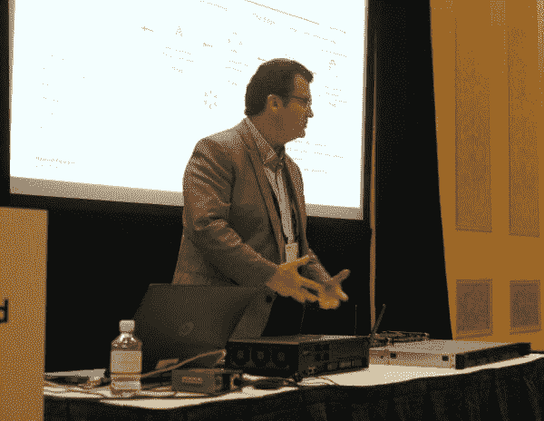
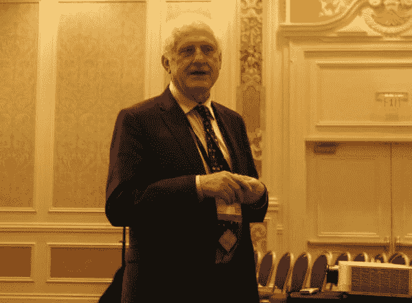

# HPE 在“边缘”精心打造物联网

> 原文：<https://thenewstack.io/hpe-orchestrates-internet-things-edge/>

我们经常谈论混合云计算，好像每个服务器都可以被同质化；每个工作负载都可以分解，无论任务是在冲绳还是在 Okmulgee 进行，都不会影响其性能甚至结果。我们谈论大规模的流程编排，就好像一个放大的数据中心不会变得更容易受物理定律的影响。

但是，正如我们在去年 3 月的[英特尔云日](https://thenewstack.io/intels-plan-bring-deterministic-performance-complex-server-workloads/)上看到的，有些组织的工作负载更容易受到不断扩展的工作负载和可变大小的处理器高速缓存带来的延迟的影响。他们无法在普通云平台上处理工作负载。

我们有时将这些组织描述为规则的例外，或者少数用例。但是，正如 IBM、英特尔和现在的 [HPE](https://www8.hp.com/us/en/solutions/business-solutions.html) 向我们展示的那样，这些都不是离群值。在财富排行榜上，他们的名字旁边至少有零，也许只有一个。

“我们都听说过 IoT[*物联网*，很多时候，我们从消费者的角度来考虑它。我戴了一块手表，可以记录我走了多少步。这是一种消费者的观点，”HPE 软件和解决方案总监罗恩·内兰在最近的 HPE 探索大会上解释道。“我们专注于工业世界的边缘事物。我们正在努力帮助我们的客户获取他们以前没有获得和收集的信息，并实际引入这些信息，获得新的见解，帮助他们增加业务价值。”

奈兰德正在描述 HPE 现在描述的边缘计算场景:该公司提出的一个用例，将处理器和应用程序工作负载放在离客户端更近的地方比放在一些遥远的数据中心或公共云中更有意义。这是“智能客户端”的论点，重生。

## 不仅仅是汉堡

“在一个我们不断被告知‘从物联网获取数据并将其发送到云’的世界中，这并不坏，请不要误解我的意思，但当我们只有一个选择时，我们为什么不将其发送到云，而是在边缘进行计算？”HPE 的副总裁兼服务器产品线 Edgeline 的总经理 Tom Bradicich 问道。

“为什么您要将所有数据发送回数据中心，而数据中心可能在数英里之外，跨越国界，使您面临安全威胁、腐败、耗费大量时间、成本高昂并消耗带宽？当您可以从事物中获取所有大数据，并在边缘进行计算时，您为什么要一直这样做？”

我给了 Bradicich 反驳的理由，就像集装箱化和编排领域的专家经常向我展示的那样。他们相信偶尔被称为“联邦快递物流”的系统，形象地说，所有的包裹都被送到一个中心源(如果你愿意，可以称为“孟菲斯”)，然后再被重新分配到他们的终端源。他们说，如果你把工作负载集中在一个主干网上，你就省去了中间人，消除了许多多余的中间件，整体上减少了带宽消耗，而且因为减少了流程中的步骤，所以更容易保护。

此外，他们认为，物联网传感器通常不是实时运行的，因为它们是低功耗的，所以它们定期批量发送数据，而不是以流的形式发送。然后我问布拉迪奇，为什么他们错了？

“这个答案就像我谈论美食，并向你解释一个汉堡，然后停下来，”这位老惠普和 IBM 的老将回应道。“意大利菜怎么样？汤呢？物联网非常庞大。天真地说不需要实时响应！不管是谁说的，都有可能卖出去。他们只卖汉堡，所以他们说你三餐都要吃汉堡。”

在互联网路由中，“边缘”指的是离客户端最近的服务器。Akamai 运营的内容交付网络将大量内容转移到更容易访问的位置。这里几乎是 T2，布拉迪奇博士指的是这里。想象一下互联网中的边界线，它是服务提供商域和客户域之间的分界点——如果有帮助的话，想象一下这两者之间的一条河。CDN 的边缘在河的对面。布拉迪奇的优势在你这边。

诚然，HPE 从事的是硬件销售业务。Edgeline 是一系列面向物联网应用的服务器。它的价值主张基于这样一个想法，即 x86 服务器是物联网应用中分布式传感器和嵌入式设备的更好的中心，而不是[一些专用设备](https://www.theguardian.com/technology/2016/feb/08/samsung-smartthings-hub-review-internet-of-things)——或者最近更常见的是[云中的虚拟物联网设备](https://azure.microsoft.com/en-us/documentation/articles/iot-hub-what-is-iot-hub/)。

但是 Bradicich 的用例可以说是有一定道理的。在物联网应用中，数据会定期从传感器设备(或智能手机或平板电脑等带传感器的设备)发送，通常会发送到运行 Hadoop 大数据引擎或 Apache Spark 分析引擎的服务器，但有时也会发送到数据仓库。在那里，数据由分析引擎不断评估，在越来越多的部署中，由机器学习系统评估。

## 沙漠里有很多

当您考虑需要由多个客户端同时作为单个连续卷寻址的数据量时，您会意识到异步网络方案(即互联网)可能并不总是对您有利。

一个恰当的例子来自观众中的一位工程师:[阿塔卡马大型毫米/亚毫米阵列](http://www.space.com/543-huge-observatory-andes-takes-shape.html)——这是一个大型射电望远镜阵列，位于智利北部安第斯山脉的 Chajnantor 高原上。这是一个物联网应用程序，但直到你仔细观察，才知道“东西”是什么。

为了让射电望远镜保持固定在目标信号上，大约 800 面被称为*八角形*的镜子需要以协调的方式移动。它们的移动如此确定，它们的位置如此精确，以至于气温都起了作用。实时采集和控制是绝对需要的。有许多因素阻止控制程序驻留在阿塔卡马沙漠中部海拔 16000 英尺的数据中心。

这个用例引起了布拉迪奇博士的长期同事、美国国家仪器公司创始人兼首席执行官[詹姆斯·特鲁查德](https://www.ni.com/company/our-vision/leadership/truchard.htm)的注意。这是一家数据采集和测量系统制造商，也是 HPE 实施分布式过程架构的合作伙伴，Bradicich 称之为“深度计算”

“视觉是杀手级应用，”特鲁查德告诉我，“它将提供正在使用的处理带宽，因为你将把视觉放在任何地方。没有理由不这样做。它很便宜，相机也很便宜，但是你需要在某个地方进行处理。如果你在盖房子，你会在每个地方都装上摄像头，这样你就可以看到房子的建造过程。因此，摄像头将安装在机器上——任何你想监控的东西。你可能也想自主监控。”

## 谁的烹饪至高无上？

Bradicich 证实，从技术角度来看，没有什么可以阻止一个组织在边缘计算系统上部署像 OpenStack 这样的私有云平台。事实上，这样做可能有充分的理由。因此，这不是一个关于限制云动态范围的争议。

然而，HPE 现在同时推广三种计算模式。一种是“云”，它将资源集中在一个流动的数据中心，其大小和位置是可变的；有“机器”，该公司重新设想记忆和存储目的的模型，其解释最近由一群星际舰队军官提出；现在有了“边缘”，CPU 和 GPU 从集中式数据中心吸收分布式工作负载。

在一次 HPE 高级副总裁的聚会上，我问他们一种模式在哪里结束，另一种模式在哪里开始。

从左至右:HPE·SVP/存储总经理马尼什·戈埃尔；HPE·SVP/Ric Lewis 数据中心基础设施总经理

“我们认为所有这些都是有效的，”HPE 高级副总裁兼数据中心基础设施总经理 [Ric Lewis](https://www.linkedin.com/in/ric-lewis-37713b4) 回应道。“我们认为没有一个是至高无上的，我们认为试图描绘这样一幅画面的供应商，其中之一就是答案，或者‘云’是一切的答案，或者物联网是答案——他们只是错过了它。这是一个非常非常大的生意。数据的大规模爆炸式增长将会使这些领域的需求饱和，甚至超出我们所能提供的范围。所以我不认为这是一个非此即彼的选择；我认为这是数据爆炸，需要新的架构来应对这种爆炸。”

“物联网是一种工作负载，”HPE 高级副总裁兼存储总经理 [Manish Goel](https://www.linkedin.com/in/manishgoellosgatos) 详细阐述道，他在回答我的后续问题时，将三种模式重新划分为环环相扣的部分。“机器是技术还是产品。云是一种交付模式或消费模式。它们并不一定相互冲突。可能是，工作负载使用*的*技术和*的*消费模式。但是，可能有另一种工作负载需要不同的技术或不同的消费模式。

“物联网很可能使用边缘处理，”他继续说道，“它存储在永久存储器上，类似机器的架构，由服务提供商提供，无论是公共云还是私有云，每天每云 10pb。”

这些 HPE 的工程师和高管刚刚提出的观点是，没有适合所有用例的同质数据中心架构。当然，对于生产各种不同硬件类型的人来说，这是个好消息。但这是一个令人信服的反驳论点，即[每一个可以想象的运营模式都可以有机地转移到同一个平台](https://thenewstack.io/openstack-summit-giving-cloud-computing-back-enterprise/)。因此，如果您看到云的某些部分部署在离您不远的河的另一边，现在您知道为什么了。

[HPE](https://www8.hp.com/us/en/solutions/business-solutions.html) 是新堆栈的赞助商

专题图片:[阿塔卡马大型毫米/亚毫米阵列(ALMA)](http://www.eso.org/public/images/ann12092a/) 由欧洲南方天文台提供，在公共领域。

<svg xmlns:xlink="http://www.w3.org/1999/xlink" viewBox="0 0 68 31" version="1.1"><title>Group</title> <desc>Created with Sketch.</desc></svg>