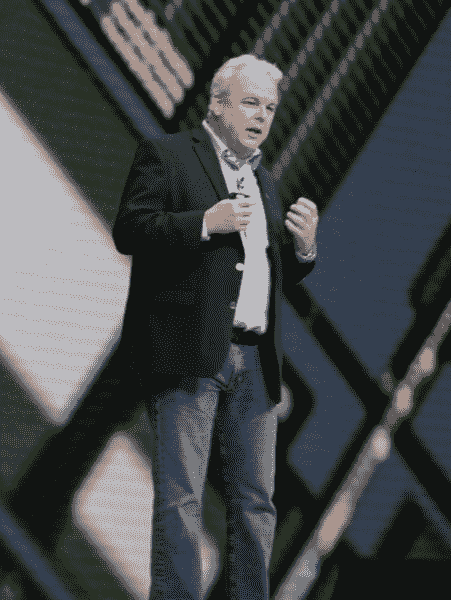
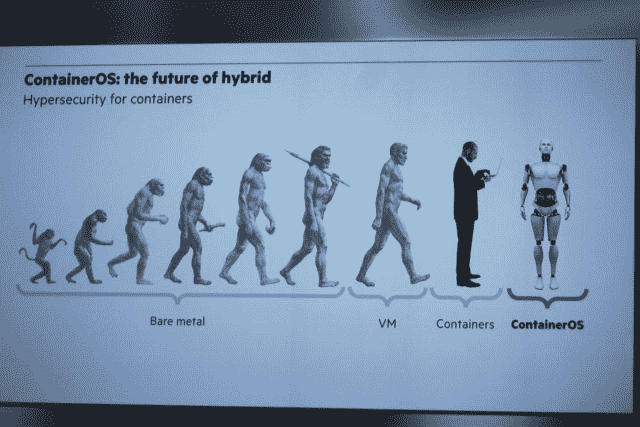

# HPE 为集装箱安全的弊病开出新的集装箱规则

> 原文：<https://thenewstack.io/hpe-prescribes-new-containeros-ills-container-security/>

CoreOS 首席安全工程师 Matthew Garrett 去年 9 月写道:“容器简化了应用程序及其依赖关系的部署和管理，但容器提供的隔离也通过减少应用程序的交互程度来提高安全性。”

在周三下午于伦敦举行的 Discover 2015 上介绍其公司新的“可组合基础设施”平台的关键软件组件时，惠普企业 CTO Martin Fink 也提到了容器隔离和安全性。

“有些人认为容器有一些缺点，”芬克说，“即安全性和隔离性，以及大规模管理。

HPE 首席技术官马丁·芬克

“我们开始向混合基础设施转型，”芬克在提到前惠普公司及其客户的合并历史时表示，“我们认为这里的问题是规模。请思考几分钟:您的业务将继续要求从更多数据中获得更快的洞察力。更多的数据意味着更多的应用。更多的数据和更多的应用意味着更多的基础设施。反过来，这意味着更多的开发人员，更多的管理员，更多的精力。

“如果你坚持下去，这些东西都不会扩展，”他解释道。

## 芯片上的管理

这是芬克演讲的另一面，他把容器的力量比作进化尺度上的*智人*，而 VMware 时代的虚拟化看起来更像克鲁马努人。本周 HPE 发现 2015 的主要亮点是推出了一种新的服务器架构，称为 Synergy，其混合云堆栈将通过其 OneView 管理平台的新版本实施，该平台实际上印在定制硬件中。

进化尺度上的 HPE·ContainerOS。

Synergy 于周二宣布，让一些与会者质疑 OneView 将如何处理容器编排问题。HPE 显然正在与 Docker Inc .合作。它是否也会与谷歌在 Kubernetes 上建立类似的合作关系，或者与 Mesosphere 在 DCOS 上建立类似的合作关系？或者它会自己处理编排问题吗？

“有些人认为容器有一些缺点，”CTO 曾说。"即安全和隔离，以及规模化管理."

这里的一些惠普官员告诉新的堆栈，这些问题的答案将被推迟到四阶段公司“转型”计划的第三阶段，协同作用代表第二阶段，HPE 本身从旧惠普公司的形成代表第一阶段。但周三，与会者被介绍了 ContainerOS 的想法——如果不是技术本身的话——芬克将其描述为后*智人*时代的第一项容器技术。

紧随 CoreOS 和 VMware Photon 之后，HPE 将为容器开发自己的 Linux 内核。

“我们正在增强 Linux 内核，以使用虚拟机用于创建安全性和隔离的相同芯片功能，这是大家都非常了解、喜爱和信任的，”他对 IT 专业人士和一些首席信息官说。“但现在我们可以在容器级别为您提供安全性和隔离，而无需虚拟机的开销。我们正在增强我们领先的文件系统，以便我们可以为您提供跨数万个容器的单一全局名称空间。最后，我们正在开发管理和运营能力，以便您的运营团队可以轻松管理成千上万个容器，并像您的开发人员一样爱上容器。”

## 相同的平台，第二节

芬克没有详细说明 ContainerOS 的技术细节，HPE 也没有在网上或通过任何其他方式提供细节。周三，在回应我们的问题时，其他 HPE 官员不止一次地告诉我们，在没有让芬克做出这一宣布之前，他们不能进一步透露细节。

但我们可以从 Fink 最终透露的一些零碎信息中推测出:通过“虚拟机使用的相同硅功能”来实现安全和隔离，一名 HPE 工程师周四在展会上向新的堆栈证实，Fink 指的是[英特尔 VT](https://software.intel.com/en-us/articles/the-advantages-of-using-virtualization-technology-in-the-enterprise) ，这是一组基于硬件的库，由英特尔 CPU 用来在操作系统内核以下的级别实现进程隔离。(AMD 生产了一种对应的技术，一度被称为 AMD-V，尽管自公司规模缩小以来，该公司的研究工作大幅放缓。不过，AMD 是今年 HPE 欧洲会议的主要赞助商，因此出于对 AMD 的尊重，Fink 可能省略了对英特尔的任何具体提及。)英特尔在 2012 年将进程隔离特性引入其虚拟化服务(仍以其最初的代号“Vanderpool”命名)，VMware 现在依靠英特尔虚拟化无缝地将 BIOS 功能和其他低级硬件资源展示给来宾虚拟机。

“CPU、内存和 I/O 的隔离现在是在硬件级别完成的，”2014 年 1 月的 VMware 白皮书 [PDF]中的[写道，“虚拟机管理程序管理虚拟机可以使用多少硬件资源，类似于一个编排者或交通官员。虚拟机管理程序的这一部分称为虚拟机监视器(VMM)。由于能够利用这些 CPU 扩展，虚拟机管理程序的攻击面大大缩小了。”](http://www.vmware.com/files/pdf/techpaper/vmw-wp-secrty-vsphr-hyprvsr-uslet-101.pdf)

当 [VMware 在 9 月推出其两个容器平台](https://thenewstack.io/vmwares-photon-platform-and-how-it-treats-containers/)(vSphere Integrated Containers 和 Photon Platform)时，这两个平台不仅会向容器中注入该公司自己的 Photon OS，还会将它们包装在名为 jeVM(不是一个错别字)的信封中，旨在使容器在 VSP here 中显示为虚拟机。这两种突变也将使英特尔虚拟化技术能够像虚拟机一样为这些代码胶囊提供服务。英特尔今年早些时候推出的 Clear Containers 项目[利用了一个非常相似的方案](https://blogs.intel.com/evangelists/2015/05/19/clear-linux/)，目的完全相同。

当然，HPE 的容器管理系统将超越其 Synergy 硬件平台，进入 ProLiant 等主流企业服务器系列。另一名 HPE 工程师周四告诉新的堆栈，该公司打算让 OneView(软件和 Synergy 服务器的“组合模块”(硬件)最终支持多种虚拟机管理程序，如 KVM 和 Microsoft Hyper-V。这些扩展没有给出时间表，但目前，HPE 将支持 VMware 的 ESX (vSphere)虚拟机管理程序，以及 Docker 容器。

然而，与 vSphere Integrated Containers 不同，一位 HPE 产品营销经理周四告诉新堆栈，OneView/Synergy 计划不会将 Docker 容器或任何其他容器(OCI 格式)包装在保护涂层中。(他实际上在我们提到 jeVM 时退缩了，好像在咬一个柠檬。)同一基础设施上的虚拟机和容器之间的共存将通过进程隔离来实现，HPE 的一名工程师告诉新的堆栈肯定会使用英特尔 VT 来实现。

然而在周三，首席技术官马丁·芬克抛出了一个重磅炸弹。或者，正如我们第二天无意中听到的一些描述，他肯定掉了什么东西。

芬克称该公司的“前沿文件系统”很有可能是惠普-UX 的“T1”，这可以追溯到“U”代表 Unix 的时代。Fink 表示，他的公司将扩展其文件系统，以便将集群中运行的所有容器合并到一个名称空间中。这样的举动可能不会让*看起来*剥夺集装箱的隔离——至少从集装箱的角度来看不会。但它可能会为容器提供一种“虚拟隔离”，因为没有更好的词，通过英特尔 VT 提供服务。

换句话说，它将使用英特尔和 VMware 隔离来取代 Docker 和其他容器的隔离，这可能是为了实现英特尔和 VMware 试图独立实现的相同目标:促进虚拟机和容器共存于同一环境中的单一环境。

隔离是容器化的优点之一——能够在独立于内核的名称空间中运行工作负载。它本身并不是一个完美的安全解决方案，但它首先是容器的一部分。诚然，隔离环境的密封性质让寻求构建安全和监控工具的开发人员感到头疼 Sysdig 等公司在最近几个月通过在部署前[将监控代理代码注入容器的内核](https://thenewstack.io/no-agents-needed-to-monitor-containers-says-sysdig-just-linux-kernel-changes/)来解决这些头疼的问题。

然而，Martin Fink 似乎描述的是第一代和第二代虚拟化工作负载的共存解决方案，以及安全人员面临的头痛问题的解决方案-该解决方案将剥离容器的本机隔离，以便使用与第一代相同的安全和管理工具来管理它们。

“将 ContainerOS 与 HPE 协同技术结合起来，”芬克说，“你可以大规模地安全、隔离、动态地组合和重组你的基础设施和应用程序。”

一名 HPE 工程师告诉 New Stack，Fink 周三的披露是容器工程团队第一次听说这种通用命名空间方案，或者任何剥离容器原生隔离的概念。这位工程师确实描述了英特尔 VT 提供的容器进程隔离，但向我们解释说，启用这种隔离不需要对容器或容器运行的平台进行任何更改。

虽然该工程师同意 Docker 集装箱安全系统可能存在某些理论缺陷，就其仅依赖于隔离而言，但他也同意这种理论似乎没有在野外被成功利用。他接着指出，利用英特尔虚拟化技术可以提供额外的优势，而不是替代优势。但他对通用命名空间的启示感到困惑，并思考这样一个附加功能(如果可以称之为附加功能的话)可能会带来什么额外的好处。

标题图片“注意差距”，作者 Robert S. Donovan，通过知识共享 3.0 许可。

<svg xmlns:xlink="http://www.w3.org/1999/xlink" viewBox="0 0 68 31" version="1.1"><title>Group</title> <desc>Created with Sketch.</desc></svg>