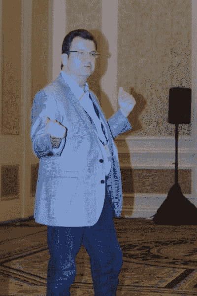

# 未来的 HPE 计算:云、边缘和机器

> 原文：<https://thenewstack.io/hpethe-cloud-edge-machine/>

问题就这么简单:工作负载属于哪里？是的，我知道供应商的回应是什么:这取决于客户。但是当顾客问这个问题时，像“这取决于顾客”这样的回答就像你问你的配偶你是否看起来身材走样，而被告知情人眼里出西施。

在 Discover 2016 用户大会上， [HPE](https://www8.hp.com/us/en/solutions/business-solutions.html) 为工作负载的部署提供了不少于三种选择。一个自然是“云”，指的是在网络中的一组服务器之间集中工作负载，但在这些服务器之间分配功能，以便可以非常容易地为来自任何地方的客户端提供服务。另一种选择，与此形成鲜明对比的是， [The Edge](https://thenewstack.io/hpe-orchestrates-internet-things-edge/) ，这是一种 HPE 一直在宣传其效率和速度的模式。它必须将工作负载尽可能靠近使用它的客户端，*将功能分散到网络中以减少延迟。*

## 要人

然后是“[机器](http://www.labs.hpe.com/research/themachine/)”HPE 的“机器”一直是一个非常模糊的概念，至少在公众看来是如此。如果 cloud dynamics 可以有效地将内存和存储资源集中在一起，那么“计算机”可以吗？被重新发明，任何可以通过主板上的迹线连接的东西都可以通过网线连接。

正如 HPE 的高级副总裁兼存储总经理 Manish Goel 在 Discover 的一次简报中所描述的那样，最初的“堆栈”是将大型机计算的基本功能(计算、存储、网络)分解成层的结果。Goel 说，我们今天所拥有的各层是通过将大型机模型分解成 PC 的基本功能，使 PC 处理器、PC 服务总线和 PC 网络能够处理不断增长和发展的任务集。

【从左至右:HPE·SVP/通用存储马尼什·戈埃尔；HPE·SVP/通用数据中心基础设施 Ric Lewis]

Goel 说:“技术驱动因素是我们有一个相关的客户机/服务器架构。“因此，我们拥有各种各样的共享存储，这些存储需要成为跨多个 x86 服务器体系结构的真实来源。这导致了网络层的出现，因为您必须放置许多许多终端服务器，并将它们与数据服务层集成。所有这些都导致了堆栈每一层的分解。存储成了它自己的一层；网络成了它自己的一层；计算成为了它自己的一层。”

但是，除了维护遗产之外，这种特定的层分离可能不再合理，他继续说道，因为记忆进化成为存储的主要形式。这引发了 Goel 所描述的“堆栈的崩溃”(谢天谢地，对我们来说，他指的是最古老的堆栈)。由于处理器执行线程涉及从内存中获取数据，因此消除了过去将内存与存储分开的界限，这就对计算——即“计算”工作负载的执行——的本质提出了质疑。

“永久记忆将变得越来越重要，”Goel 继续说道。“从某种意义上来说，具有足够持久内存并可以以横向扩展方式进行管理的服务器可能会成为完美的基础架构。”

[HPE 公司高级副总裁兼数据中心基础设施总经理 Ric Lewis](https://www.linkedin.com/in/ric-lewis-37713b4) 详细阐述了这一点:“我们的目标不是让机器成为我们推出的大盒子或什么东西。机器实际上是技术的集合，是基于这些技术重新评估计算机架构的驱动力。当您拥有大量永久内存池时，您并不真正需要挂在其上的一堆驱动器。”

刘易斯所说的“驱动力”在这里可能也指“体积”当我们提到存储卷时，包括在容器化环境和微服务的上下文中，我们使用某种映射来寻址网络上的设备，在某种程度上，这可能会替代“C:\”如果我们不需要驱动器或卷，并且世界上到处都是对象存储，那么实际上机器可能是唯一存在的机器。

## 中量级

除了，在 HPE 校园的另一边，你会发现边缘。

“在这个世界里，我们经常被告知，‘从[物联网]中获取数据，并将其发送到云端’，而我们只有一个选择，”HPE 传奇工程师兼 Moonshot 产品线总经理[汤姆·布拉迪奇](https://twitter.com/tombradicichphd)问道，“为什么我们总是*不*将数据发送到云端，而是在边缘进行计算？”

这是布拉迪奇给他的听众的一个小测验，他相信他们有足够的经验来提供一组知识渊博的答案。有七个他会接受。第一，云通信消耗带宽。它引入了安全问题。它插入潜伏期。它创造了新的成本中心。它跨卷复制数据，也许是冗余的。它将反馈环路引入通信方案。这为法规遵从性带来了新的难题。

针对每种工作负载的反对云的论点可以重新表述为针对任何工作负载的反对机器的论点。

HPE 副总裁兼 Moonshot / IoT / Edgeline 业务部总经理 Tom Bradicich 博士

“在这些任务关键型应用中，例如，当你需要 1 毫秒的周转时间时，”Bradicich 解释说，“你不能去 10、20、30 英里以外的云。有多少云离边缘这么近？”

Bradicich 负责一系列名为 Edgeline 的 HPE 服务器。尽管它们是去年为解决物联网用例而推出的，但在 Discover 上，他和他的同事重新推出了它们，他将其描述为一种全新的产品类别，称为“融合物联网系统”。他认为这些边缘系统的一个用例结合了机器学习和实时情况下的预测分析，如初级医疗保健服务(我们将在新堆栈中的一个故事中进一步详细讨论这个用例)。

Bradicich 为边缘计算绘制的路线是与机器相反的架构发展方向，以云为起点。然而，这三者都被描述为某种*趋同*。当我问 Ric Lewis 和 Manish Goel，这些方向中的哪一个代表了计算的真正发展道路时，Lewis 首先回答说，所有这些方向都同样有效——正如您所料，这取决于客户。

“我们认为所有这些都是有效的，”刘易斯说。“我们认为它们都不是至高无上的。我们认为，那些试图描绘出‘其中一个就是答案……’的供应商只是错过了这一点。这是一个非常非常大的生意。数据的大规模爆炸式增长将会使这些领域的需求饱和，甚至超出我们所能提供的范围。所以我不认为这是一个非此即彼的选择；我认为这是一场数据爆炸，需要新的架构来应对这种数据爆炸。”

## 配重

然后我接着说，如果三个方向是发散的，它们就不可能是收敛的。为什么我们不称之为“选择”

“它们并不一定相互冲突，”戈尔回答道。“有可能，工作负载使用该技术和消费模式进行交付。但是，可能有另一种工作负载需要不同的技术或不同的消费模式。”例如，物联网应用可以使用所有基于边缘的处理，存储在“类似机器”的架构中，由云服务提供商提供。

所有这些体系结构试图解决的更深层次的问题是工作负载在数据中心的适当放置。当虚拟化第一次支持云计算时，[第一批云平台提供商正在论证](http://readwrite.com/2012/05/11/how-cloud-platforms-change-everything-and-which-ones-matter-most/)每个工作负载最终都将迁移到云中，包括那些实时执行的应用程序。我们被告知，带宽和延迟已经不再是问题。

只不过它们是问题。我们过去被告知，一个组织的哪些 IT 工作负载适合云迁移，哪些工作负载最好离客户更近，最好由客户自己决定。除非存储在无处不在的卷中，否则邻近性不是一个因素，而延迟是一个常数。

我们越是努力解决延迟问题，试图消除它，它就越是一个*问题，特别是对于实时工作负载。这一事实使得边缘计算成为一个有力的竞争者。*

可能还有第八个因素需要考虑，添加到 Bradicich 的列表中:现代工作负载必须始终与遗留软件共存。我们已经在努力解决让虚拟机管理程序托管的虚拟机与容器共存的问题。如果我们曾经迁移到一个“类似机器”的平台，那只能是因为我们首先解决了如何让机器执行云或边缘等工作负载的问题。换句话说，我们必须让它先运行 OpenStack、Docker、vSphere，或许还有 COBOL。

这就是融合的程度:不像马尼什·戈尔预测的那样，在堆栈崩溃后，我们所有的平台都融合在一起。我们所有的工作负载和软件必须共存。它就像计算架构的三个不同概念在一次会议上汇聚一样汇聚。将工作负载从执行它们的机器上解绑需要抽象层(大写“M”与否)。这就是为什么，如果当堆栈崩溃时，不可避免地，一些平台将再次拾起它。

[HPE](https://www8.hp.com/us/en/solutions/business-solutions.html) 是新书库的赞助商

图片来自斯科特·m·富尔顿三世。

<svg xmlns:xlink="http://www.w3.org/1999/xlink" viewBox="0 0 68 31" version="1.1"><title>Group</title> <desc>Created with Sketch.</desc></svg>