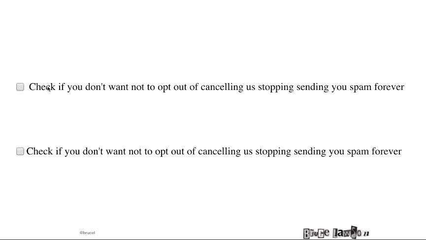
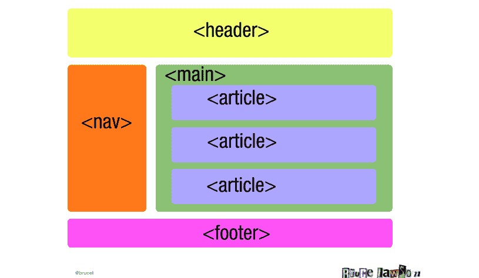
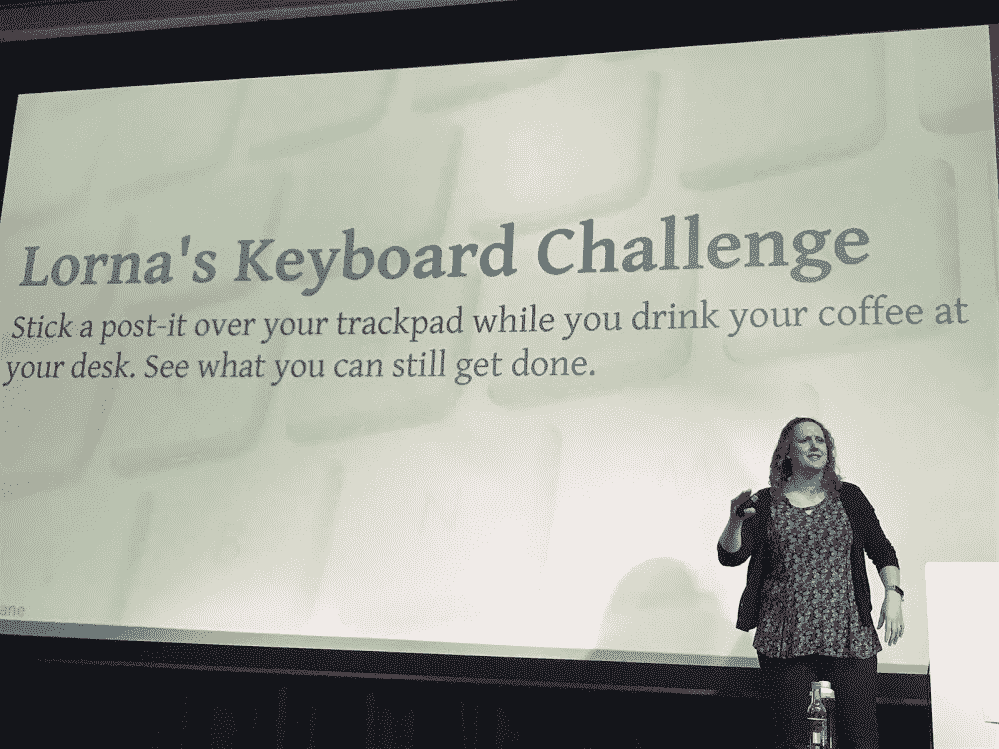

# HTML、CSS 和无障碍网页设计之路

> 原文：<https://thenewstack.io/html-css-and-the-path-to-accessible-web-design/>

咨询集团[的创始人 James Governor](https://twitter.com/monkchips) 将包容性设计描述为“如果你设计的场景不仅仅是旧金山 23 岁的健全白人所拥有的场景，那么东西可能会更有价值。”

对于当前科技行业的状况以及谁在建立我们的祖父母会使用的网站来说，这是一个不错的比较。

有一种观点认为，要创建伟大的软件，你必须从基础做起。当你考虑到[如今一些网站的规模可以达到](https://thenewstack.io/facebooks-tool-for-automated-testing-at-2-billion-users-scale/)的时候，也许回到基础以确保每个人都可以访问我们建立的一切是件好事。

“没有边缘病例。我们需要设计更具包容性的东西，”Governor 指着上面的图片说。

从另一个角度来看，不被视为残疾可能只是一种暂时的状态。通过从一开始就进行包容性和可访问性的设计，你是在为未来的自己做设计。

或者你可以考虑，如果你的网站在设计上是不可访问的，那么你可能违反了法律。

那么现在你至少在考虑采取一些措施来实现无障碍设计，你该如何开始呢？我们涵盖了一些开始的方法，在今年的 [Monki Gras](https://monkigras.com/) 中得到强调，这是今年早些时候由 RedMonk 在伦敦举行的为期两天的软件会议，其中心主题是[可访问性](https://monkigras.com/schedule/)。

## 易访问性的业务

RedMonk 分析师 [Rachel Stephens](https://twitter.com/rstephensme) 在台上表示，包容性[和道德规范](/tech-ethics-new-years-resolution-dont-build-software-you-will-regret/)始于你的讨论对象:

*   这是谁的责任？
*   谁对此负责？
*   关于这件事应该向谁咨询？
*   应该通知谁？
*   你什么时候沟通，如何沟通？

史蒂芬斯认为，可及性、包容性和多样性应该包含在你的风险评估中。她说，要衡量作为和不作为的成本，然后将其纳入我们商业决策的通用框架。

“在 Excel 中会发生一些事情——不仅仅是思考你所生活的伦理和道德，还必须能够以一种对企业决策者和领导者有意义的方式表达出来，”她说。

你可以有一个为意义而奋斗的组织，但是你也需要明确这个意义以及它将如何被支付。

“你还需要把它与为你的客户获得更好的产品联系起来，”斯蒂芬斯说。

毫无疑问，尤其是当用户规模扩大时，可访问性是良好用户体验的关键因素。

## HTML 和 CSS 的回归会重新唤醒可访问性吗？

“我们从一开始就忘记了网页设计中固有的简单性。网络标准和可访问性顾问布鲁斯·劳森(Bruce Lawson)在 Monki Gras 对人群说:“我们让它变得过于复杂，这就是我们将人们拒之门外的方式。”。

事实上，第一个网页是完全响应的。1993 年，万维网创始人马克·安德森添加了图像标签，但没有替代文本功能，允许在屏幕阅读器上显示图像描述。

【T2![Quick Inclusive Event Tips: Plan the event as far in advance as possible — good for sales, outreach, and for people to persuade their day jobs. Have someone on your planning committee whose main focus is diversity and inclusion — for both speakers and attendees. Be very clear with speakers the importance of running on time. Have a quiet room, as well as a place (not a bathroom!) for breastfeeding. Ask your speakers, attendees, and volunteers what they need at the facility to be successful. Allot a portion of your budget to be responsive to needs.](img/de4a8dbfd11dbcaa02ae817307787262.png)

当屏幕变得越来越大时，事情变得越来越糟糕。

“我们打破了它，因为我们有固定宽度的网站。糟糕的对比度，糟糕的颜色，字体打破了它。劳森说:“我们追求像印刷品一样完美的像素布局，但事实并非如此。

他继续带领观众了解网络走向不可访问性的历史，讲述视频和图像中的字幕是如何丢失的，没有仅通过键盘的可访问性，以及[焦点指示器](https://www.deque.com/blog/give-site-focus-tips-designing-usable-focus-indicators/)被移除。

现在，劳森认为，我们正在用我们正在使用的工具、语言和框架毁掉网络。他提倡回归语义网，使用 HTML 和 CSS 以人类和机器可读的方式进行设计。它使代码更干净、更清晰，容易被屏幕阅读器阅读。

上图来自 Lawson，是一个关于可访问性大问题的小例子。底部的复选框基于 HTML，允许您检查完整的标签，而在顶部，如果您有移动性和鼠标使用，您可以只单击复选框。

“如果你选择了正确的语义角色，它就会起作用。劳森说:“我们沉迷于工具和 JavaScript，而 HTML 被遗忘了。

下表分别比较了 JavaScript 网页组织和 HTML 网页。DIV 标签没有任何意义，但是如果你选择语义 HTML 的方式来编写网页，屏幕阅读器将能够为那些看不清楚的人导航，立即找到网页的主要部分。

令人惊讶的是，无障碍网站也被证明可以更好地转换流量——也许是因为谷歌的许多移动友好要求也非常容易实现。劳森提到了一家金融服务公司，该公司让其网站变得可以访问，经理们担心他们会因为不符合《残疾人歧视法》而被罚款。事实证明，这些更新带来了 90%以上的转化率，这意味着他们网站的可访问性更新最终在一年内收回了成本。

## 想要测试可访问性吗？以 GDS 为榜样

最令人印象深刻的可访问网站群之一当然是英国的[政府数字服务](https://gds.blog.gov.uk/)，更常见的是 GDS，它从一开始就有包容人们的愿景。GDS 的高级内容设计师 [Louise Miller](https://twitter.com/louiseamymiller) 在活动上说，这种努力“不是为了让事情看起来优雅，只是为了完成工作”。

根据[英国平等法案](https://www.legislation.gov.uk/ukpga/2010/15/contents)，GDS 被要求专门为边缘案例设计——“因此也为每个人设计。”

请记住，GDS 服务最初并不是为互联网设计的，而是为那些不得不走进办公室申请钓鱼执照等服务的人设计的。

在 Monki Gras 的最后， [Marian Foley](https://twitter.com/madebymarian) 和 [Kevin McLaughlin](https://digitalpeople.blog.gov.uk/author/kevin-mclaughlin/) ，GDS 的内容设计者和特殊需求 IT 用户，提供了主动的方法来测试您的网站的可访问性，特别是对于弱视用户。仅在英国，就有 200 多万人失明，包括 75 岁及以上人群的 20%和 90 岁及以上人群的一半。

对福利来说，GDS 的观点是“你只是暂时没有残疾。你可能是在为未来的自己设计。”

## 如何设计符合常识的用户体验

当你设计的东西拥有广泛的用户群时，Foley 反对很多搜索引擎优化的做法。她说要确保用简单明了的英语写所有的东西，简单明了。

“把事情归结为主要信息，让每个人都能理解，”她继续说道。

此外，避免粗体和斜体，她说这被证明会降低理解速度，不管人们是否有残疾。另一方面，SEO 友好的一面，她说要利用 bulleting。

至少在从左到右阅读的世界里，人们遵循一种阅读页面的" [F 模式](https://twitter.com/brucel)"，所以福利说你应该总是在开始的时候把重要的信息放在句子的前面，并期待它们随着页面的向下阅读而越来越少。

想象一下，如果你看不见或听不见，你会如何使用这个网站，为按钮、图像和视频标题应用有用的——通常是 SEO 友好的——描述符。

## 视觉无障碍测试

这是另一种情况，谷歌的许多响应式设计需求也是易访问性需求，因此有一个明显的[抑制效应，](https://ssir.org/articles/entry/the_curb_cut_effect)为一个较小的群体做出的一个小改变可以对每个人产生连锁反应。

**放大** —使用放大时，用户通常需要从左向右滚动，这限制了他们可以看到的屏幕大小。测试它的工具:

低分辨率和浏览器缩放——GDS 说，测试这一点最简单的方法是在移动设备上访问你网站的桌面版本，看看它是否有反应。放大和缩小时，文本应该重排以适合页面。如果它没有响应，只是文本的大小会增加，你将不得不再次从左向右跳转。

**色彩对比** —通常视障人士(以及新生儿)在色彩对比高的情况下能看得更清楚。有一些工具可以帮助您满足对比网站可访问性指南:

*   [高对比度](https://chrome.google.com/webstore/search/high%20contrast?hl=en) Chrome 扩展——多种颜色反转扩展，使您的网站更易访问
*   [滴管](https://chrome.google.com/webstore/detail/eye-dropper/hmdcmlfkchdmnmnmheododdhjedfccka?hl=en) Chrome 扩展——允许你从网站上选择颜色
*   [对比度检查器](https://contrastchecker.com/)——一个免费的网站，用于测量颜色对比度和字体的可访问性要求

**键盘专用**——即使是这位作者也懒得编写关键字友好的图片替代文本，这使得它们对屏幕阅读器毫无用处。为了让你的网站正确地与屏幕阅读器一起工作，或者服务于充满重复性劳损的[开发者观众](https://noti.st/lornajane/xkdbqh/tales-of-a-keyboard-only-user)，它需要与只有键盘的输入一起工作，比如:

*   TAB 键导航
*   输入和空格键进行选择
*   用于导航单选按钮的箭头键

试着只用你的键盘来浏览你的网站，让用户产生共鸣。然后，要测试屏幕阅读器的功能，请尝试以下工具:

这些可访问性审查看起来影响不大，但是，据同样是 Monki Gras 发言人的托马斯·奥特(Thomas Otter)说，“一份对有视力的人来说需要 10 分钟的在线工作申请，对盲人或视力受损的人来说需要 3 到 5 个小时。”

人们使用的任何网站的微小变化都会带来很大的不同。

正如总督提醒我们的，“没有边缘案件。有许许多多的人需要获取信息。”

现在是最后一个提示。觉得这篇文章有帮助？想分享一下吗？只需遵循 Twitter 和屏幕阅读器的一个可访问性技巧——在您的 Twitter 中打开“[撰写图像描述”](https://help.twitter.com/en/using-twitter/picture-descriptions),并使用大写字母来区分您的标签中的单词。并向 [#a11y](https://twitter.com/search?q=%23a11y&src=tyah) 发送无障碍信息。

专题图片:瑞秋·史蒂芬斯在蒙克格拉斯。詹妮弗·里金斯的照片。

<svg xmlns:xlink="http://www.w3.org/1999/xlink" viewBox="0 0 68 31" version="1.1"><title>Group</title> <desc>Created with Sketch.</desc></svg>