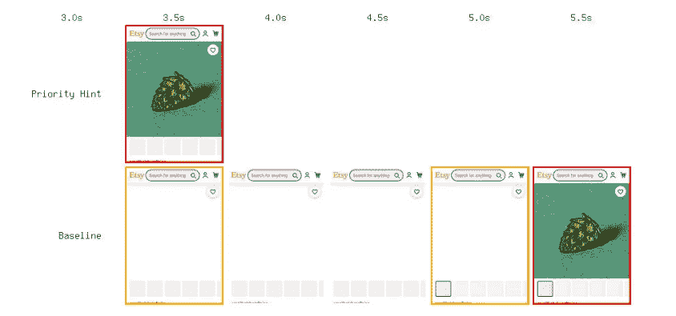
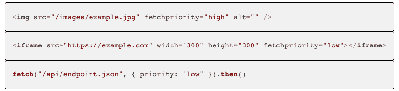

# HTML 优先提示帮助 Etsy 面对谷歌核心网站的生命

> 原文：<https://thenewstack.io/html-priority-hints-help-etsy-rock-the-google-core-web-vitals/>

一个简单的 HTML 属性告诉浏览器首先加载哪些资产，称为[优先级提示](https://wicg.github.io/priority-hints/)，根据谷歌的[最大内容丰富绘画](https://web.dev/lcp/)指标，它将 [Etsy](https://www.etsy.com/) 的产品列表页面上最大图像的加载时间缩短了 4%。

简而言之，现在开发人员可以明确地告诉浏览器哪些资产是优先加载的资产，并消除浏览器加载中的猜测。

Etsy 的高级 web 性能工程师戴维·罗斯在他最近的博客文章中把快速网页定义为“一个视觉上完整的、完全交互式的页面，几乎即时呈现，不会比完成服务器请求有更多的延迟。”

他揭示的下一个最好的东西是，“一个至少给人以瞬间印象的页面。”

尽管随着页面权重和网站复杂性的不断增加，速度或速度的幻觉变得越来越具有挑战性。眼前的挑战是找到一种方法来增量加载这些动态网页，同时为用户提供到达目的地的体验，并且即使一些较重的组件继续在后台加载，站点本身也能完全运行。

## **问题又名 OG 浏览器加载**

当今的网页由 HTML、JavaScript、CSS、图像和视频的某种组合组成。读取完整的代码文件，包括额外的 decencies，然后请求额外的资产的过程将使跳出率极高。

知道了这一点，浏览器丢失过程由读取文件和请求资产的交错孪生过程组成。在这个过程中，浏览器会进行有根据的猜测，直到它在这个过程中走得足够远，可以将整个布局放在一起，组成页面的结构。

图像，除非它们在页面的初始视图中，否则是低优先级的。这是一个主要问题，原因有二:首先，这有可能失去用户的兴趣。有罪！但它也有可能降低该页面的谷歌搜索排名，因为它将大量内容丰富的绘画时间推过了 2.5 秒的“好”阈值，这是决定谷歌搜索排名的重要因素。

## **优先级提示的解决方案**

消除浏览器加载中的猜测。

Etsy 测试了产品列表页面上的优先提示，因为这是 Etsy 的主要页面类型之一，设计清楚地表明了哪个图像最重要。

Ross 解释说，他们在其内部实验平台上设计了一个 50:50 的 AB 测试并运行了它。最终，工程师们在产品列表页面上的最大内容图中看到了 4%的改进(在第 75 个百分位时为-83 毫秒)，并且没有检测到对关键业务指标的损害。

测试指标非常成功，Ross 说它“在一次测试中获得了 1-2 个月的开发收益，超过了现有的工作和常规的产品特性展示。”

在用大量内容丰富的油漆巩固 Etsy 的搜索排名安全方面，加载持续低于 2.5 秒，以至于 Etsy 现在能够测试其他变化，同时继续保留其核心网站的活力。

## **提示如何工作**

优先级提示不是预加载链接——它们实际上更简单，并且比预加载链接有好处。预加载链接需要在单独的 HTML 源中维护，且该工作流会导致其他问题。

优先级提示是直接附加到资源链接或请求的属性。这允许浏览器使用修改后的优先级作为其现有呈现流的一部分。

该提示清楚地说明了哪些资产是浏览器加载的高优先级，并且消除了猜测。浏览器现在可以立即加载优先级资产，就像在 JavaScript 请求完成之前一样。这在加载 Angular 或 React 文件时非常强大，因为它们包含大量 JavaScript。

优先级提示的另一个例子是，为响应用户交互而加载的资源设置优先于后台项目的优先级，以及取消惰性加载和底层内容的优先级。

## **简史和激动人心的未来**

虽然优先提示在 2018 年首次推出，但直到 2021 年[谷歌的核心网络生命指标](https://support.google.com/webmasters/answer/9205520?hl=en)将网站性能作为搜索排名的一个因素，并将焦点放在大型内容丰富的图片和其他用户体验指标上，才获得了很大的吸引力。优先级提示，特别有用，因为它可以优先加载英雄图像，开始在更多的网站上流行。

随着成功测试指标的确认和与他们合作的开发人员的积极总体反应，优先级提示被批准为 Chrome 和 Edge 的完整功能。Mozilla Firefox 对优先级提示感兴趣。反馈也提交给了 W3C 技术架构组。由于 Chrome 和 Edge 都是 Chrome 浏览器，第三个浏览器将需要采用它们作为一个特性，但是一旦采用，它们将有资格终止 HTML 和 JS Fetch 规范。

<svg xmlns:xlink="http://www.w3.org/1999/xlink" viewBox="0 0 68 31" version="1.1"><title>Group</title> <desc>Created with Sketch.</desc></svg>