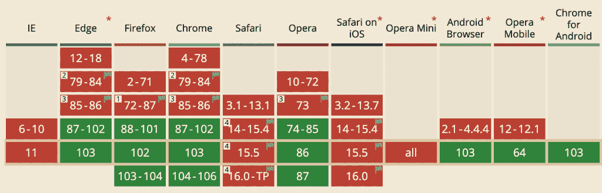

# HTTP/3 现在是一个标准:为什么使用它以及如何开始

> 原文：<https://thenewstack.io/http-3-is-now-a-standard-why-use-it-and-how-to-get-started/>

我敢肯定，你和我一样，欢迎这个消息:超文本传输协议的第三个主要版本，即 T2 HTTP/3，上个月被采纳为 T4 IETF 标准 T5(互联网工程任务组)。不，当然，你没有——网络就是在工作，所以为什么要担心呢？但是如果你对为什么会发生这种变化有点好奇，这里有一个简短的历史分析。然后，我们将进入为什么你应该为你的公司采用它的理由。

> 💡HTTP/3 是超文本传输协议(HTTP)的第三个版本，以前被称为 HTTP-over-QUIC。QUIC 最初由 Google 开发，是 HTTP/2 的继承者。像谷歌和脸书这样的公司已经使用 QUIC 来提高网络速度。

## HTTP 的简短历史

过去，有两种互联网协议可供选择。甚至在网络出现之前，我们仍然需要通过互联网从一台机器向另一台机器发送信息包(或数据报)。对于游戏开发者来说，重要的协议是 UDP(用户数据报协议)。这就是快速、一劳永逸的标准:你在网络上扔一个包，它会被捕获，或者有时不会。这是完美的表现(例如)一个游戏玩家的子弹，因为它来自你的枪，通过网络，显示在你的目标的机器上。即使一颗子弹在途中丢失了，至少游戏作为一个整体还是很好的。

但是对于像 web 这样更稳定的系统，正确的底层协议是 TCP(传输控制协议)。这是一个更正式的系统，它保证了数据包的传递和正确的顺序。因此，它创造了可靠的连接，以及后来可靠的信息流。在 web 之前连接互联网(是的，之前有)，我记得使用小号 Winsock —而这被描述为“TCP/IP 堆栈”。在一家早已倒闭的公司，我们用这个和 CIX 合作，这是一个英国在线会议系统(留言板)。今天，当然，CIX 是一个韩国男孩乐队。这就是进步。

最终，写在 TCP/IP 之上的万维网和 HTTP 成为互联网的主要用途。另一个缺失的缩写是 **TLS** (传输层安全性)，它提供了加密元素，并在 HTTP/2 准备就绪时成为事实上的安全标准。

在那些日子里，pc 机之间的连接通常是有线的，任何损失都是由于旧铜线上的噪声造成的。TCP 很适合收集偶尔出错的数据包。随着网络的普及，使用 UDP 的理由越来越少。

## 输入 **QUIC**

今天的互联网是一个非常不同的地方。是的，我家里的个人电脑有很好的光纤连接和线路，但大多数用户是通过手机或笔记本电脑上网的。当你从一个桅杆移动到另一个桅杆时，从阻挡或反射信号的墙后面，连接通常被切断并重新开始。这不是 TCP 喜欢的——没有正式的介绍和有力的握手，它真的不想交流。事实上，事实证明，TCP 的严格核算和等待最后一个流浪包只是意味着用户必须等待网页加载和新应用程序下载，或者重新建立连接超时。

因此，为了利用 UDP 的非正式性，并允许网络在运行中使用一些智能的东西，新的 [**QUIC**](https://en.wikipedia.org/wiki/QUIC) (快速 UDP 互联网连接)格式得到了更多的关注。

虽然我们不希望在网络本身中看到太多的智能，但如今我们对自动决策更加放心。QUIC 知道一个站点是由多个文件组成的，它不会因为一个文件没有加载完就破坏整个连接。

QUIC 跟进的另一个趋势是内置安全性。以前加密是可选的(如 HTTP 或 HTTPS ),而 QUIC 总是被加密。如今，每个网站都应该加密——尽管有开销。这不仅仅是为了确保坐在中间的人看不到你点的是哪种橙汁；它确认你确实在和你真正的橙汁供应商交谈。

格式几乎总是在改进，但它们真正做的是随着时间的推移解决不同的问题。

## 积极使用

那么实施情况如何呢？这里要考虑三个方面。浏览器、云基础设施和用户代码。

第一，浏览器。这是来自[“我能用吗”网站](https://caniuse.com/)的表格:

显然，谷歌很热衷于此——从 v 87(2020 年末)开始的 Chrome 版本已经能够使用 HTTP/3 协议。不出所料，考虑到苹果浏览器开发的近期历史，Safari 是落后者。

您现在可以使用这些网站来检查您的浏览器是否符合 HTTP/3(可能需要重新加载):

但是现有的网站呢？您的站点目前正在使用它吗？所以，要测试一个现有的网站，试试 https://geekflare.com/tools/http3-test 的。在你问之前，不 [thenewstack.io](https://thenewstack.io) 目前不支持它！***更新，2022 年 7 月 25 日:**我们现在就做！但是在这方面我们有很多公司。好消息是，如果你的网站在 HTTP/2 下运行良好，那么在 HTTP/3 下也会很好或者更好。*

## 谁在推广 HTTP/3？

现在，是谁在推 HTTP/3？嗯，你已经知道了；是谷歌。还有 cdn，例如 Cloudflare 和 Fastly。他们的面包和黄油是网络响应速度。因此，实现 HTTP/3 最简单的方法是通过 CDN。这也是一个让移动用户受益更多的变化。

确实存在使用 QUIC 构建的服务器(例如， [L itespeed](https://www.litespeedtech.com/products/litespeed-web-server) ),但是采用情况并不均衡。许多服务器依赖于第三方库，因此在这种情况下，重用现有的、经过验证的工作的模式就失效了。现有的服务器，如 Node.js、NGINX 和 Apache，在开始实现新的内部时，就失去了用户体验优势。相反，新的库相对来说是未经验证的。使用网络服务器的意义在于它是可靠的，经过良好测试和维护的。

## 采用 HTTP/3

在正常情况下，我会钻研一些代码——但我觉得在这个阶段这样做有点为时过早。有太多的项目可能都是定期变化的，所以只管钻研吧。

查看一些简单的最小工作示例(例如，一个简单的服务器和一个简单的客户端)，我们可以识别出几个级别的工作。

第一，联系。这个较高级别的信道最初是在两个端点之间建立的。建立**连接标识符**。一旦建立，如果下面的协议改变(例如，电话切换 wi-fi)，连接保持，以避免必须重新开始协商。

然后连接打开**流**，这些流携带它们自己类型的数据，并且不会互相干扰。

下面仍然是数据包。每个包，就像一封写好地址的信，都有它的连接和密码信息。信封里面是**帧**。这些代表正在传输的实际数据。

正如我前面所说，进步实际上只是反映了使用模式的变化。今天，我们重视安全和速度，因为我们不再把网络视为不可信任的魔法——因此用它来管理我们的个人事务。HTTP/3 将有助于解决这些问题。房间里的大象可能是 Web3 和新兴的富裕元宇宙世界。也许来自这些领域的新想法将来会对 HTTP/4 有所贡献。

<svg xmlns:xlink="http://www.w3.org/1999/xlink" viewBox="0 0 68 31" version="1.1"><title>Group</title> <desc>Created with Sketch.</desc></svg>