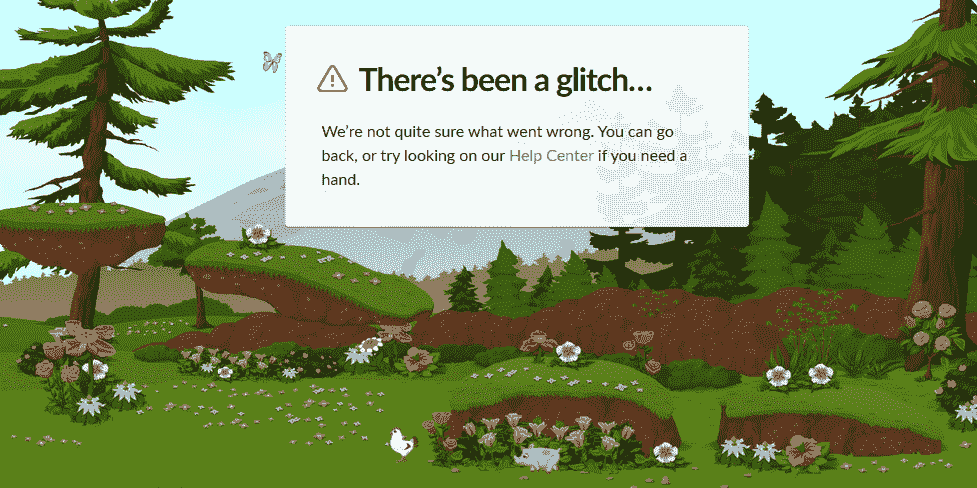
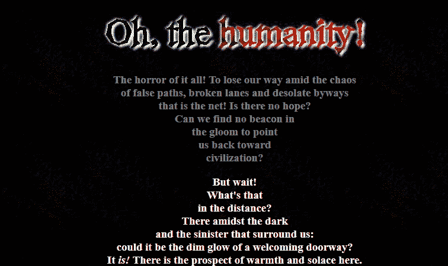

# 找不到 HTTP 404:Web 开发人员利用错误消息制作了一种艺术形式

> 原文：<https://thenewstack.io/http-404-not-found-web-developers-make-an-art-form-from-error-messages/>

当请求的页面找不到时，web 服务器发送的不起眼的响应，HTTP 404 Not Found 错误长期以来一直是网站管理员向 web 浏览器发送自行开发的有趣消息的基础。

例如，进入 IpSwitch.com 任何一个不存在的页面，映入你眼帘的是一张引人注目的图片，图片上是英国极客情景喜剧《IT 人群》(The IT Crowd)中倒霉的技术支持人员莫斯(Moss)面前燃烧的大火

当 NASA 的服务器没有你请求的网页时，他们会怎么做？它们显示了来自银河系深处的美丽星空图像，告诉你“你正在寻找的宇宙物体已经消失在视界之外。”

也许这才是极客文化真正存在的地方——在那些希望永远不需要被阅读的网站管理员留下的隐藏信息中。硅谷开发人员汉克·希夫曼[决定尝试富有诗意](http://www.disordered.org/404.html):“这一切的恐怖！迷失在错误的道路，破碎的小巷和荒凉的小路的混乱中，那就是网！没有希望了吗？难道我们在黑暗中找不到指向文明的灯塔吗？”

Slack 只是展示了一幅真正出色的田园乡村插图——蓝色的蝴蝶、一只鸡和一只猪，蜿蜒穿过鲜花、树木和浅蓝色的山空——他们温和地解释说“出了点小故障……”

“我们不太清楚哪里出了问题。您可以返回，或者如果需要帮助，可以尝试访问我们的帮助中心。”

【T2

我喜欢的是它对细微细节的关注。如果移动鼠标，视口将向不同的方向滚动。如果你把焦点转移到地址栏(或 alt-tab 移开)，颜色会变成黑白的…

## 当 Web 服务器受到攻击时

有史以来最复杂的 404 消息之一，包含了 JavaScript 中的几十个文本字符串，一行一行地喷涌而出，就像一个绝望的 web 服务器发出的独白。

我真的很沮丧……
我是说，我甚至都不认识你。我怎么知道你想从我这里得到什么？你凭什么告诉我该展示什么？
*就因为我是个网络服务器*
*而且可能是个狂躁抑郁的人？为什么你有权利告诉我该做什么？*
*嗯？我太沮丧了…*
*我想我会爬进垃圾桶分解掉*
*我的意思是，我会在两周内被淘汰吗？那是怎样的一种生活…？然后我会被一个. 01 版本的*
*所取代，它认为这是上帝给 web 服务器*
*的礼物，只是因为它没有一些微不足道的*
*安全漏洞和它的 HTTP POST 实现*
*或什么的*

这条信息的另一个版本出现在德国 t 恤网站 CamoDesign.de 上——这一次是由[发布的，是一个皱着眉头的绿色网络生物](http://www.camodesign.de/nonsense/)的超现实主义插图。

17 年前，一些网站开始实施一种更奇怪的独白。这看起来像一个典型的错误信息，直到你意识到它夹杂着大量的脏话和一些令人惊讶的人身攻击。

*你告诉你的朋友，你从 1994 年就开始上网了，但是“自从阿尔·戈尔发明了它，我就一直在上网”先生似乎在凌晨 2 点给我打了很多电话，问你需要在 outlook express 中设置什么才能收到你的@home 电子邮件，或者“我如何在 icq 和即时消息中发送一些东西*[原文]。*..?"不，我不是你的私人微软热线，当我去你那里吃饭时，请不要问我是否可以“只是看一看”你一直有问题的东西…*

但是许多网站将他们的创造力倾注在一些更视觉化的东西上…

*   NBC 新闻的背景图片是一个人在雪地里滑倒的电影。
*   英国地铁展示了一只玩滑板的北极熊。
*   罗兰网页设计展示了一辆涂有“错误 404”的卡车侧面
*   “歌词游乐场”网站展示了一幅漫画，画中一位教授指着一块黑板，上面写着如何从 404 错误信息中幸存下来的[指示。](https://lyricsplayground.com/404/labore404.html)
*   托比·布劳恩信息设计公司展示了一幅悲伤猴子的图画。
*   极客新闻网站 The Register 向你展示了一幅睡着的秃鹰的漫画。
*   SudFTW 展示了[来自*的机器人*](http://www.sudftw.com/custom404.html) 迷失在太空中。

YouTube 曾经告诉你“一队训练有素的猴子被派去处理这种情况。”但现在他们只是在搜索区域展示一只拿着放大镜的猴子，并附有道歉和“尝试搜索其他东西”的建议

事实上，一些 404 错误信息无意中成为事情发生了多大变化的尖锐提醒。Flash 网站 Homestar Runner 2003 年的错误信息漫画在我心中永远有一个特殊的位置。这看起来就像一个标准的 Internet Explorer 警告“该页面无法显示”——直到卡通人物走到页面上，对其混乱的错误投以困惑的目光，并低声说“嗯……”然后大声问，“这里发生了什么事？”

漫画中的墨西哥摔跤手斯特朗巴德迎接了他，他实事求是地解释说“系统崩溃了，唷”——开始了 68 秒的超现实对话。

[https://www.youtube.com/embed/HP0cOv71Gxk?feature=oembed](https://www.youtube.com/embed/HP0cOv71Gxk?feature=oembed)

视频

但是现在，视频的原始网址实际上已经死了，就像网站本身的大部分一样，似乎[已经迁移到 YouTube](https://www.youtube.com/watch?v=HP0cOv71Gxk) 。

## **被遗弃的名人堂**

这还不是唯一的伤亡…

有趣的 404 错误页面是一个自网络诞生以来就一直存在的传统——但最近我发现它们许多巧妙的信息现在已经失传了。这些年来，我一直把它们保存在一个文件中，却发现许多我最喜欢的“找不到页面”信息实际上再也找不到了。他们也很难在 archiving 找到——因为他们为什么要为不存在的页面存档占位符页面呢？

404lounge.net 已经有近 20 年了。注册于 2001 年，它曾经接待过成百上千的游客，但显然很久以前就被遗弃了。其“新闻”页面上的最后一个条目是 2006 年的。就像一件漂浮的文物，它仍然有一个带有教程链接的页面，加上一个带有其他四个 404 收集网站链接的页面——所有这些都可以追溯到 21 世纪初。然而，最后一个网站甚至已经不存在了——讽刺的是，它变成了一个大约 404 页的网站，被一个 404 页取代了。

而第一个(在 404Lab.com)甚至没有给你。它只会导致[一个完全空白的主页](http://www.404lab.com/)。

但幸运的是，第三个网站是 pay dirt——一个 404 条错误信息的旧集合，这些错误信息被认为是对每条错误信息进行截图，从而永远保留了它们的创造力。

第二个网站(托管在 SendCoffee.com)开玩笑地扰乱你的大脑，警告信息说“404 未找到——等等，是的…”

*"请求的对象在此服务器上存在。你跟随的链接既没有过时也没有不准确，服务器已经被指示让你拥有它。请敬畏地鞠躬，向引用页面的网站管理员献祭…。”*

 是的，他们仍然有一个非常酷的 404 错误页面。

事实上，SendCoffee 声称早在 1996 年就创建了互联网上第一个 404 感谢网站，“来展示那些努力让 404 不再是一个烦恼的人。”在 1998 年 5 月 15 日的《今日美国》周末版上，它甚至被宣布为互联网的“热点网站”之一。

二十多年后，它仍然在线，并且仍然分享它的链接到去年的 404 错误信息。但同样，几乎每一个现在只是一个普通的旧的，普通的死链接。

尽管至少有一个人仍然异想天开地宣称“404-不要 gefunden！”—然后显示一个幽默吓人的 [12 行数学方程式](http://web.archive.org/web/20190403082445/http://www.snix.com/404.html)。

很难准确地计算出损失了什么。它就像一个秘密的第二张网，只存在于我们意图之外的那个奇怪的地下世界——只有在我们迷失的时候才会出现。就像黎明门口的风笛手一样，它在我们跌落网络边缘之前向我们打招呼，然后总是把我们安全地带回家，这是来自网络陌生人的自发善意，来自网络极客的地下问候…

但从这个意义上说，它真的会消失吗？也许“404 网站”只是那些还没被发现的网站管理员的创造力的总和。

他们都还挤在网络的某个角落，等着下次我们迷路时给我们一个友好的、夸张的问候。

* * *

# WebReduce

Laurent Laffineur 多媒体网页设计音乐。

<svg xmlns:xlink="http://www.w3.org/1999/xlink" viewBox="0 0 68 31" version="1.1"><title>Group</title> <desc>Created with Sketch.</desc></svg>