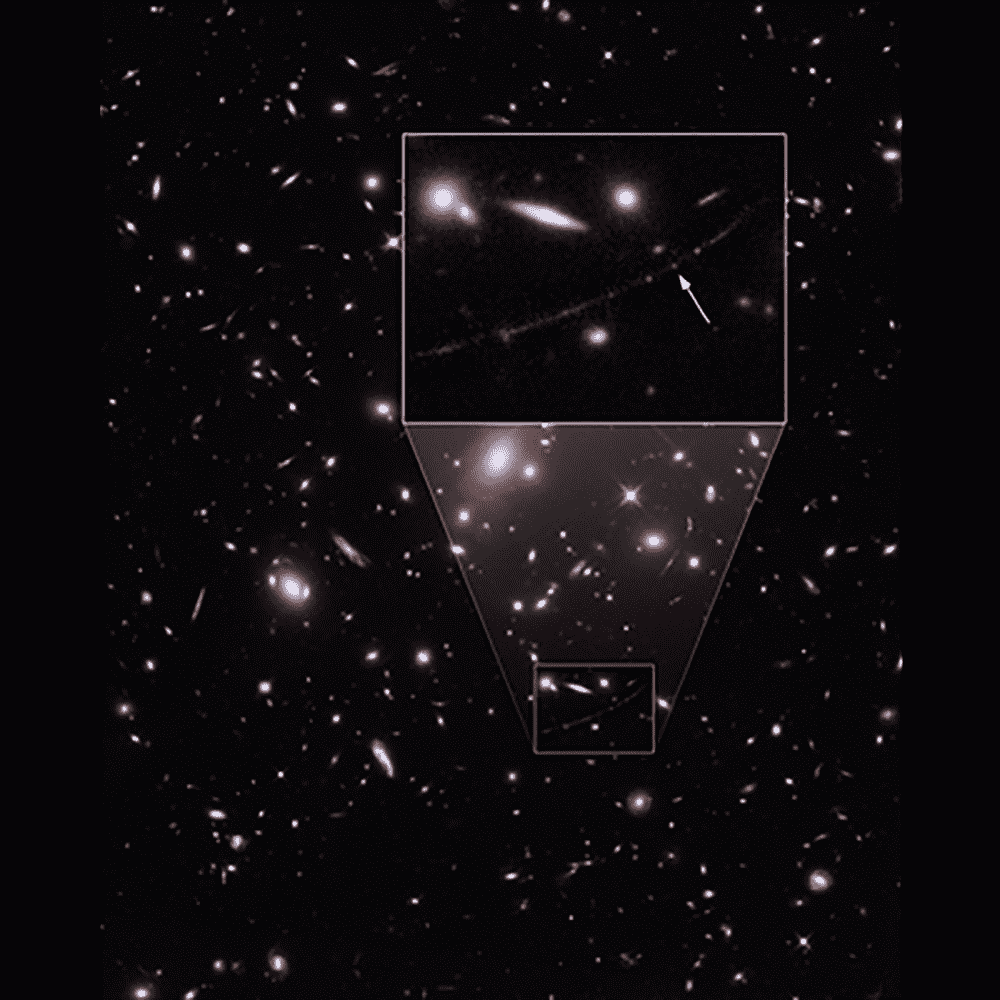

# 可观测性:哈勃发现了有史以来最遥远的恒星

> 原文：<https://thenewstack.io/hubble-telescope-spots-the-most-distant-star-ever-seen/>

自从三十多年前发射以来，[哈勃太空望远镜](https://hubblesite.org/)已经成为人类观察宇宙的眼睛，让我们能够更深入地观察我们星球之外的浩瀚星空。

这个漂浮在我们大气层上方的巨型太空望远镜已经完成了许多第一次，最近打破了另一项记录，来自约翰·霍普金斯大学和[太空望远镜科学研究所](https://www.stsci.edu/) (STScI)的一个团队使用哈勃望远镜发现了迄今为止探测到的最遥远的恒星，距离我们大约 129 亿光年。

在[发表在 *Nature* 上的论文](https://www.nature.com/articles/s41586-022-04449-y.epdf?sharing_token=BI1SUe7sAbp_ezQp-JZdINRgN0jAjWel9jnR3ZoTv0P6q5E3aMDmDm6_7kNMpV01BwhsqzdYg1h-Wbl7t7VGDFphyk3Li6IHVAOmUE-ToeZqaGER-Nsyje4iYv24arL3iZ11N-zvrxyjGQ-v1TauAS8h6IFmyDQj4pqfUCEKIWu5-he2xYZXC3AzGwyapl8LCSSyQH3RfP0mzRTm87_w8w%3D%3D&tracking_referrer=mashable.com)中，研究小组描述了他们如何能够观测到这颗正式名称为 WHL0137-LS 的恒星，现在也被昵称为“埃伦德尔”，在古英语中的意思是“晨星”或“升起的光”。

根据该团队的发现，埃伦德尔已经在宇宙的第一个十亿年中发出了光，这意味着我们现在看到的来自它的光看起来就像宇宙只有其当前年龄的 7%时一样，或者按照天文学家称为“红移 6.2”的度量标准。

红移的发生是因为随着宇宙逐渐膨胀，远离我们的遥远物体发出的光发生了偏移，并在向我们传播的过程中显示出更长更红的波长。科学家研究红移来确定空间中的物体相对于我们的位置是如何运动的。

## 引力透镜

这一新发现超越了哈勃之前在 90 亿光年外观测最遥远恒星的 2018 年记录。

太空望远镜对这两项发现都有帮助，这是一种被称为[引力透镜](https://earthsky.org/space/what-is-gravitational-lensing-einstein-ring/)的自然现象，其中大量的物质——如一个星系团——产生了一个强大的引力场，它弯曲并放大了来自身后遥远光源的光，因此当它向观察者传播时可以被检测到。

引力透镜的效果类似于通过一个大放大镜看东西——但通过外层空间——并允许科学家看得比我们目前的技术可能看得更远。

正如天文学家和论文的主要作者约翰霍普金斯大学的 Brian Welch 在 T2 的新闻发布会上解释的那样，这些发现是一个幸运的事情，因为该团队最初专注于研究另一个被称为日出弧的空间物体的引力透镜效应。

“起初我们几乎不相信它，它比之前最远、红移最高的恒星要远得多，”韦尔奇说。“通常在这些距离上，整个星系看起来像小污点，来自数百万颗恒星的光混合在一起。这颗恒星所在的星系被引力透镜放大和扭曲成一个长长的新月形，我们称之为日出弧。”

箭头指示埃伦德尔的位置，在日出弧的红月中间。

该团队的发现是基于在[哈勃遗迹(再电离透镜化星团调查)计划](https://relics.stsci.edu/)期间收集的数据，该计划由论文合著者、来自巴尔的摩的 STScI 的科耶领导。利用这些数据，研究小组估计埃伦德尔的质量至少是我们太阳的 50 倍，亮度可能是太阳的数百万倍。

但是研究小组指出，如果没有某种帮助，如引力透镜提供的助推力，即使如此巨大、明亮的恒星也不可能在这么远的距离看到。

“以前发现的透镜星是在放大倍数暂时增加时发现的，因此观察到的亮度也暂时增加了，”研究小组说。“这些瞬态依赖于微透镜，其中绑定到透镜星团的恒星暂时与恒星的透镜图像对齐，从而短暂提高放大率。”

在这种情况下，研究人员能够发现埃伦德尔，因为它与宿主星系团空间结构中的波纹偶然对齐，提供了引力透镜效应。这种波纹被称为“焦散线”，有助于高度优化放大和增亮的效果，从而使埃伦德尔更加明亮一千倍。

> “研究埃伦德尔将是一扇通向我们不熟悉的宇宙时代的窗户…”

但是看到这颗遥远的恒星只是第一步。现在，该团队正在努力确定埃伦德尔是哪种恒星，他们猜测它可能是一颗单独的恒星，或者是一颗至少与一颗较小的恒星物体配对的双星。

该团队希望在美国宇航局最近于 2021 年发射的詹姆斯·韦伯太空望远镜的帮助下，确认这些细节，以及埃伦德尔的温度、亮度和恒星生命周期的阶段。该小组认为，埃伦德尔很可能是一颗大质量恒星，缺乏通常在年轻恒星中形成的重元素。更令人兴奋的是，埃伦德尔可能是宇宙大爆炸后形成的那些罕见的“[人口 III](https://astronomy.swin.edu.au/cosmos/p/Population+III) ”恒星之一。

韦尔奇说:“埃伦德尔存在的时间太久了，它可能没有和我们今天周围的恒星一样的原材料。”“对埃伦德尔的研究将是一扇通向我们不熟悉的宇宙时代的窗户，但这导致了我们所知道的一切。这就像我们一直在读一本非常有趣的书，但我们从第二章开始，现在我们将有机会看到这一切是如何开始的。”

<svg xmlns:xlink="http://www.w3.org/1999/xlink" viewBox="0 0 68 31" version="1.1"><title>Group</title> <desc>Created with Sketch.</desc></svg>