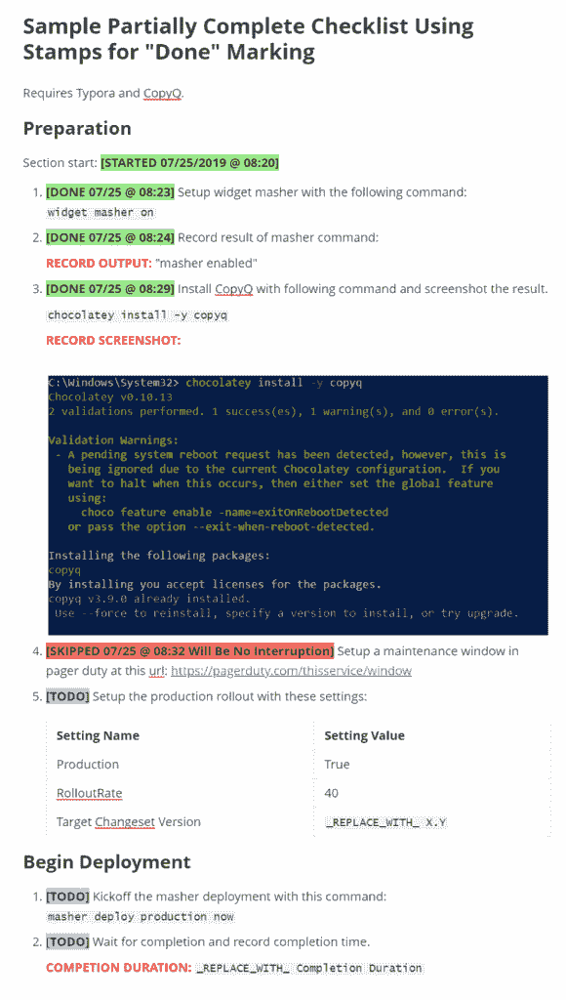
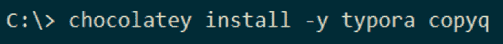
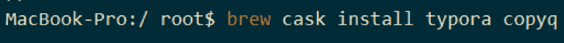

# 人工处理的代码第 3 部分:用于降低清单的多平台工具集

> 原文：<https://thenewstack.io/human-processed-code-part-3-a-multiplatform-toolset-for-markdown-checklists/>

[GitLab](https://about.gitlab.com/) 赞助本帖。

本文是系列文章的第三篇。[第 1 部分](/why-human-processed-source-code-belongs-in-git/)证明了人工执行的 DevOps 清单本质上是源代码，根据 GitOps 原则，就像成功管理软件堆栈所需的任何其他代码一样，属于 Git。[第 2 部分](/part-2-how-checklists-on-github-and-gitlab-can-help-team-collaboration/)挖掘 GitHub 和 GitLab 上丰富但经常被忽略的对交互式清单的支持。在本文中，我们深入探讨为什么以及如何使用丰富的桌面编辑工具来创建和完成清单。

### 清单编写、导航和完成，无需双重降价编辑器

 [达尔文·萨诺伊

Darwin 是 GitLab 的高级解决方案架构师，在他专注于自动化的职业生涯中，他对云、DevOps 和 CI/CD 充满热情。他和他的两个孩子和妻子住在费城附近。当他不在路上试图弄坏他的山地车时，他就在车库里调音。](https://www.linkedin.com/in/DarwinSanoy/) 

“双重痛苦”在这里没有拼写错误——虽然开发人员可能认为实时渲染窗口是对 raw markdown 中编码的升级，但对于那些没有开发人员角色，但需要编写模板清单或完成跟踪清单的人来说，这非常麻烦。

GitHub 和 GitLab 上清单的交互性通常应该用于跟踪清单，因为它们通过即时的共享更新来促进协作，并且在实时操作事件期间不需要 Git 提交或合并。

有时候，基于桌面的可视化实用程序比这种模式更具优势，例如:

*   用于轻松创建清单。
*   用于在完成复杂清单时以大纲模式导航它们。
*   用于完成在 GitHub 和 GitLab 上不交互的可视化 markdown 结构(比如填充字段或表格)。
*   用于实现更精细的“完整标记”(例如，添加日期-时间标记和/或颜色)。

### Typora + CopyQ

结合 Typora 和 CopyQ 扩展了清单执行和编写选项。CopyQ 允许使用热键插入标准化的降价片段，Typora 可以直接接收降价并立即呈现它。这允许添加以下额外的完成标记功能:

*   应用 Markdown 格式完成标记(如粗体)。
*   插入当前日期和时间作为“完成标记”的一部分
*   提示输入信息，并将其作为插入文本的一部分。在提供的 CopyQ 代码中，有提示创建模板清单和跟踪清单执行的示例。
*   应用 HTML 或 CSS 格式，例如，彩色文本背景。HTML 和 CSS 格式在 Typora 中可以很好地呈现，但在 GitLab 和 GitHub 中却不行。

## **取消繁琐的降价编辑**

在过去，我用许多 markdown 扩展加载了我最喜欢的代码编辑器(VS Code)——每一个都以不同的方式完成了这个难题的不同部分。有时他们会因为不再识别特定的按键而抵触甚至阻止编辑 markdown。我已经删除了这些插件，转而运行一个插件，它只是在我的操作系统的默认应用程序中打开一个文件类型用于减价文件，并配置 Typora 来处理操作系统中的减价扩展。

### 在清单和认知负荷中记录信息

在有压力的活动中消除认知负荷，例如管理 IT 变化，也是一个巨大的好处。无论你有多聪明，人类在任何情况下都能应付的事情都是有限的——但生产变化的纯粹风险甚至会削弱一些能力，因为我们会格外警惕，以确保一切都按计划进行。在这种情况下，弄错一些 markdown 代码或者不得不不断回忆正确格式化的需要会非常分散注意力。

解决这一难题的主要方法是尽可能在变更事件之前准备一份模板清单。填写版本、标题、更改日期通常可以提前几天完成。Typora 可用于此目的，只需复制问题或合并/拉取请求的正文部分，并在完成编辑后将其粘贴到正文内容上。

如果您的清单执行过程需要插入屏幕截图、日志数据或插入姓名、日期和版本，那么就需要编辑 markdown，这就是 Typora 的亮点，它使之几乎像使用 Google Docs 或您最喜欢的文字处理器一样简单。使用 Typora 执行不允许简单的实时协作——因此，如果协作使用清单，可能会有一个潜在的折衷。

### 面向开发人员的多平台开发人员工作站

在我的专业和个人项目中，我使用所有的 Windows 10、Mac OS (Catalina)和 LinuxMint 来编辑代码和 markdown。我使用 Visual Studio 代码作为我的主要文本编辑器。这些操作系统在开发运维团队中也很常见——很多时候，同一个团队至少会有两个这样的操作系统。

Typora 和 CopyQ 都可以在所有三个操作系统上运行，并在所有平台上提供一致的用户体验。

### 该解决方案的成本

付费清单 SaaS 解决方案代表了团队工具的大量采用摩擦——不仅仅是因为成本，还因为:

*   在第三方系统中建立新的系统用户。
*   将重要的审计记录交由第三方保管。
*   不能与 GitLab 和 GitHub 内置的核对表交互性直接集成。

Typora 和 CopyQ 是免费的，解决方案中没有其他需要付费的元素。

### 标准降价清单片段的 CopyQ

如果您有不喜欢 Typora 的团队成员或团队，CopyQ 本身可以提供价值，因为可以通过 Git 中的 CopyQ 配置文本文件定义和共享一组标准化的 Markdown 插入。这可以允许建立一些用于创作和执行检查的约定，而不考虑所使用的编辑器。

### 需要“完成标记”上的每个步骤的时间日期戳

“完成标记”上的时间日期戳可能是您的清单执行方法所需要的。有些清单可能需要多天或长时间运行——即使是一次性完成的。时间-日期戳通过创建完成时间和运行时间的历史时间记录来增加价值，这允许在更改出现问题时预测 ops 事件持续时间和事件相关性。

如前所述，GitLab 的 markdown interactivity 确实在讨论日志中提供了这些标记——但是，如果您曾经不得不审核复选框的完成或计时，您必须查看整个日志中有问题的复选框的所有切换以获得信息。此外，如果您的复选框有重复的相同文本，将很难在审计日志中找出哪些被操纵。

### 何时使用 Typora 胜过其他编辑器或 Web 编辑器

*   用于编写核对清单，即使它们存储为问题或合并/提取请求模板。
*   当需要或要求高级格式时，您会更愿意创作有用的结构，如表格和插入图形。使用 Typora 插入图形与 git 特别兼容，因为它允许您无缝地将插入的图形复制到与插入图形的 markdown 相同的目录中。
*   用于完成有大量数据记录或需要更复杂的完成标记的清单。这抑制了文档上的实时协作，因为您必须在发布或合并/拉取请求中进入编辑模式。

### Typora 和 CopyQ 的工作示例(带代码)

这里提供的预制邮票都有 CSS 颜色，但也使用标准的 markdown 粗体，以便它们在有或没有 CSS 渲染的情况下都相当突出。

### 设置 Typora 和/或 CopyQ

以下指令已在 Windows 10、OSX 和 Linux (LinuxMint 19.x)上测试。

在 Windows 上安装(巧克力)

在 Mac 上安装(Brew)

## 在 Linux (Ubuntu)上安装

Typora 只在 Ubuntu 上测试过[。](http://support.typora.io/Typora-on-Linux/)

下面是 Linux 的安装说明:http://support.typora.io/Typora-on-Linux/

公开包回购中的 CopyQ 为[发布为“CopyQ”【https://copyq.readthedocs.io/en/latest/installation.html】](https://copyq.readthedocs.io/en/latest/installation.html)

## 配置类型

这些设置是可选的，但有助于降低清单的概念。从文件访问这些设置= >首选项:

**图像插入** = >“将图像复制到当前文件夹(。/)"
* *保存&恢复** = >“自动保存”
* *隐私** = >“发送匿名使用信息”
用 TODO、DONE、SKIPPED 和 RECORD HERE 标记配置 CopyQ

以下片段为您提供了最基本的入门知识，也可作为定制您自己工作的示例。使用分发你自己的命令的技术允许你在你的团队中标准化。

当我们将 CopyQ 与 Typora 配对时，它可以很好地与任何 Markdown 编辑器配合使用。

导入此 CopyQ 设置导入文件:[https://git lab . com/Darwin js-ideas/gitopsforhumanprocessed checklists/-/blob/master/CopyQ-command-import . ini](https://gitlab.com/darwinjs-ideas/GitOpsforHumanProcessedChecklists/-/blob/master/copyq-command-import.ini)

1.  从菜单中启动 CopyQ，它就成为内存常驻。
2.  如果 UI 没有显示，通过单击图标并选择“显示/隐藏”，从“托盘”区域打开 CopyQ
3.  在 CopyQ UI 中，打开“文件= >命令/全局快捷方式”
4.  使用“加载命令”按钮加载 INI。

这是热键。它们在 Typora(渲染 CSS)中使用背景色渲染，在 Github 和 Gitlab 等网站上不使用背景色。粗体和方括号使图章在没有呈现颜色时可以识别。

*   ALT-SHIFT-S:*[TODO]* *
*   ALT-SHIFT-D:*[完成于 07/28 @ 10:42]**
*   ALT-SHIFT-Z:*[跳过 07/28 @ 10:42 <whatever was="" typed="" in="" response="" to="" the="" prompt="">]**</whatever>
*   ALT-SHIFT-X:*[在此记录结果]**
*   ALT-SHIFT-R: `_REPLACE_WITH_ <whatever was typed in response to the prompt>`

## 测试于

*   Windows 10
*   马科斯
*   LinuxMint 19.1

## 结论

本系列文章阐述了在 GitOps 环境中管理 DevOps 过程的一些基本思想。

首先，我们确定我们在 DevOps 解决方案中发现的“人类代码”和计算机代码一样重要，因此属于 git。

我们继续声称“人类代码”可以被识别，因为它采取了清单的形式，清单重新组合了计算机代码，因为它们是精确的、有序的，有时是有条件的指令，用于完成期望的结果。

我们提到了备受推荐的书[“清单宣言”](http://atulgawande.com/book/the-checklist-manifesto/)中有证据支持的观点，即清单的有用性和必要性会对所有个人和团队产生积极影响，无论他们有多聪明。

GitHub 和 GitLab 的模板和交互式复选框功能被强调为将清单集成到 GitOps 软件变更管理工作流中的关键使能因素，并作为两者的工作示例库。

最后，我们讨论了一些丰富的多平台桌面工具，它们有助于简化模板清单创建和跟踪清单完成的编辑和标准化。还提供了配置 CopyQ 的工作代码示例。

我希望这个由三部分组成的深入探讨能帮助你、你的团队和你的组织体验协作清单这个简单概念所带来的巨大质量改进。

## 本系列文章的代码、示例和架构

[“人工处理清单的 GitOps(第 1 部分)”](https://gitlab.com/darwinjs-ideas/GitOpsforHumanProcessedChecklists)

[“人工处理代码的 GitOps(第二部分):GitHub 和 GitLab 上的交互式降价清单”](https://thenewstack.io/part-2-how-checklists-on-github-and-gitlab-can-help-team-collaboration/)

[CopyQ 命令为本文中讨论的图章导入文件。](https://gitlab.com/darwinjs-ideas/GitOpsforHumanProcessedChecklists/-/blob/master/copyq-command-import.ini)

[该解决方案的产品选择架构图](https://gitlab.com/darwinjs-ideas/GitOpsforHumanProcessedChecklists/-/blob/master/DesktopTools.md)

[“此解决方案的架构启发:需求、约束、需求、意外发现、适用性、限制和替代方案”](https://gitlab.com/darwinjs-ideas/GitOpsforHumanProcessedChecklists/-/blob/master/DesktopTools.md#appendix-architecture-heuristics-requirements-constraints-desirements-serendipities-applicability-limitations-and-alternatives)

[GitLab 样本库](https://gitlab.com/darwinjs-ideas/GitOpsforHumanProcessedChecklists)

[GitHub 样本库](https://github.com/darwinjs/GitOpsforHumanProcessedChecklists)

[《清单宣言》](https://www.amazon.com/dp/B0030V0PEW/)

通过 Pixabay 的特征图像。

<svg xmlns:xlink="http://www.w3.org/1999/xlink" viewBox="0 0 68 31" version="1.1"><title>Group</title> <desc>Created with Sketch.</desc></svg>