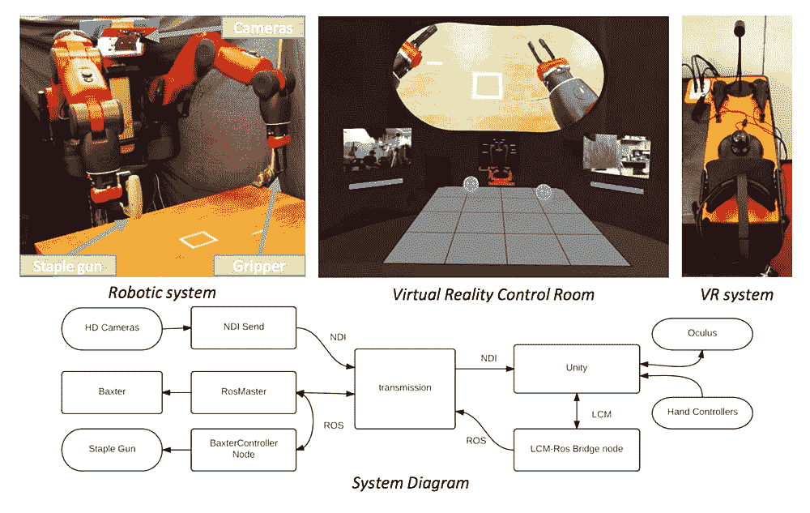
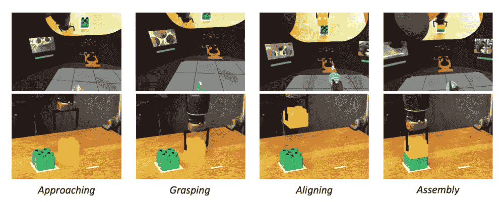

# 人类工人如何在家里用虚拟现实控制机器人

> 原文：<https://thenewstack.io/human-workers-can-control-robots-virtual-reality-home/>

随着机器人和人工智能领域的最新发展，自动化不仅仅会给工厂带来革命，这一点变得越来越明显。很有可能这些技术也会扰乱高技能的白领行业，如金融、T2 和医药行业——引发了这样的问题:一旦机器人接管 T4，大量的人失业，政府是否应该征收机器人税？还是推出某种全民基本收入？

还不清楚会发生什么，但也有可能存在中间道路。人类可以融入这个等式，与协作机器人或通过虚拟现实操作机器人并肩工作，而不是直接取代机器人。

然而，这些基于虚拟现实的遥操作系统往往是专业化的，因此成本高昂，这给它们的开发和部署带来了一些限制。但是，通过整合现成的商业解决方案，它们可能变得更加可行，正如麻省理工学院计算机科学和人工智能实验室( [CSAIL](http://csail.mit.edu/) )的研究人员在他们的霍尔蒙克斯模型系统中提出的那样，该系统采用了一套 [Oculus Rift](https://www.oculus.com/rift/) VR 设备，允许人类虚拟地“进入”机器人的大脑并控制它。更值得注意的是，该系统可以远距离工作，这意味着蓝领工人可以在家远程办公和控制他们的机器人同事。

## 新型远程机器人体系结构

正如研究人员在他们的[论文](https://arxiv.org/pdf/1703.01270.pdf)中描述的那样，他们的系统为远程机器人提供了一种新的架构，将用户置于一个“虚拟现实控制室”(VRCR)，该控制室配备有各种虚拟传感器显示器。这给用户的感觉是，他们嵌入了机器人的头部，看到它看到的东西，并告诉它该做什么。这项研究使用了由 Rethink Robotics 制造的名为 Baxter 的人形机器人，此外还有 Oculus Rift VR 头戴设备和将他们的运动与机器人的运动联系起来的手控器。

“像这样的系统最终可以帮助人类从远处监督机器人，”CSAIL 的杰弗里·利普顿说，他是该论文的第一作者。“通过在家遥控机器人，蓝领工人将能够远程办公，并像现在的白领工人一样受益于信息技术革命。”

[https://www.youtube.com/embed/4a-W3Od5-t8?feature=oembed](https://www.youtube.com/embed/4a-W3Od5-t8?feature=oembed)

视频

## 机器人背后的人类

该团队的系统暗指所谓的“[侏儒思维模式](https://en.wikipedia.org/wiki/Cartesian_theater)”(拉丁语意为“小人”)——想象一个小人(或非物质的自我)坐在大脑的舵上，控制着身体。正如研究人员指出的那样，这种对身心悖论的二元论方法提出了一种[逻辑谬误](https://en.wikipedia.org/wiki/Homunculus_argument)，它未能解释认知和智力的起源，但却适用于将人放入机器人“大脑”和控制室的特殊情况。

该团队的提议解决了其他利用虚拟现实的遥操作方法出现的许多问题。在直接模型中，交互的设置使得用户的视觉与机器人的状态直接耦合，从而导致所谓的“[模拟器疾病](https://en.wikipedia.org/wiki/Simulator_sickness)”的潜在可能性——一种令人作呕的运动病，当行动和反馈之间存在延迟信号时就会发生。

然而，在遥操作的信息物理模型中，用户感觉是分离的，并与机器人和环境的虚拟表示进行交互。这种方法的缺点是，由于机器人和环境的映射，它的数据更加密集，并且需要专门的空间用于遥控操作。

相比之下，CSAIL 的技术通过将机器人的空间映射到虚拟空间，创建用户与之交互的“虚拟副本”，消除了延迟问题。这给用户一种与机器人同时占据相同空间的感觉。CSAIL 的模型没有被从机器人的二维眼睛摄像头转换来的三维数据过载，而是仅仅使用显示在人类用户每只眼睛上的二维图像，人脑可以自动将其转换为三维图像。通过手控器，用户可以与虚拟空间中的控制器进行交互，促使机器人操纵物品并执行简单的任务，如捡东西、钉电线和叠积木。

结果令人印象深刻:该团队发现，该系统允许用户在 95%的时间内执行这些简单的动作，相比之下，使用其他 VR 遥控系统的时间为 57%。

不出所料，该团队还发现，有经验的游戏玩家在实验中表现得更好。但更令人瞩目的是从数百英里外控制机器人的能力，正如该团队在华盛顿的一个酒店房间使用酒店的无线网络成功控制机器人时所做的那样。

关于自动化将如何严重影响制造业和其他蓝领行业，已经有很多人感到绝望。但情况不一定是这样:有了这样的新发展，人类仍然可以以一种经济有效的方式被掌握在信息中，这种方式可以让工人和雇佣他们的公司受益。事实上，这种工作也可能由失业的游戏玩家来完成，这给了它另一个明显的优势，允许游戏玩家以较少的体力劳动完成繁重的工作。该团队现在希望扩大他们的研究，探索该系统如何适应不同的商业虚拟现实和机器人平台。

图片:麻省理工学院 CSAIL

<svg xmlns:xlink="http://www.w3.org/1999/xlink" viewBox="0 0 68 31" version="1.1"><title>Group</title> <desc>Created with Sketch.</desc></svg>