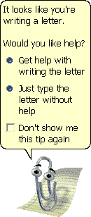

# 人性与 Clippy:微软虚拟助手失败的教训

> 原文：<https://thenewstack.io/humanity-vs-clippy-lessons-from-microsofts-failed-virtual-assistant/>

Clippy 上个月重新出现在人们的视野中，这是一个从 20 世纪 90 年代被遗忘的幽灵。作为微软最早的虚拟助手之一——也是其最引人注目的失败之一——动画说话回形针活在 Twitter 用户的记忆中([尤其是微软员工](https://twitter.com/jknepfle/status/1099313122559565824%20))。但是 Clippy 的生活为我们人类如何与技术互动提供了一些有趣的见解。

多年来，许多科技思想家都在思考到底是什么让 Clippy 如此不受欢迎。

## “有史以来最糟糕的发明”

早在 1995 年，微软就想为 Windows 开发一个更简单的替代界面，一个特殊的虚拟环境，里面有舒适的装备，比如一张桌子或一只乐于助人的狗，每个都能启动相应的应用程序。

“微软的问题是如何让计算产品更容易使用和有趣，”[拜伦·里维斯](https://news.stanford.edu/pr/95/950106Arc5423.html)写道，他是斯坦福大学两名通信教授之一，曾作为顾问参与该项目。“我们说过，人们擅长建立社会关系——彼此交谈，并解读面部表情等暗示。他们还擅长处理自然环境，如房间里的物体和人的移动，所以如果一个界面可以与用户互动，以利用这些人类的才能，那么你可能就不需要手册了。”

不幸的是，这个[并不是他们希望的突破](http://hackeducation.com/2016/09/14/chatbot)。Clippy 是从微软 Bob 中分离出来的，它是一个覆盖层，试图为 Windows 95 的各个方面提供帮助。《时代》杂志曾写道:“想象一下围绕 Clippy 设计的整个操作系统，你就明白了微软 Bob 的症结所在。”臭名昭著的不受欢迎的界面持续了不到一年——《时代》称之为有史以来 50 个最糟糕的发明之一。鲍勃甚至[导致了字体漫画 Sans](https://en.wikipedia.org/wiki/Comic_Sans#History) 的产生，它经常被批评为缺乏严肃性。但是微软并没有气馁，在 1996 年秋天向[推出了他们的第一个版本“Office 97”](https://www.thewindowsclub.com/history-evolution-microsoft-office-software)，其中包括第一个动画虚拟助手——包括鲍勃剩下的动画说话纸夹。

微软前高管史蒂文·辛诺夫斯基在 2005 年写道:“在开发过程中，Office 助手被命名为 TFC，这很有名。”他还补充道，“‘C’代表小丑。我会让你活跃的想象力弄清楚 TF 代表什么。”

## 在焦点小组之后

Clippy 是为 Bob 设计的近 250 个不同角色中的一个。“通过与斯坦福大学的一些社会心理学家合作，我们花了六个月的时间对他们进行了审查，通过焦点小组等方式对他们进行了筛选，”Clippy 的设计师凯旺·阿特贝里[在 2017 年](https://motherboard.vice.com/en_us/article/xyj55a/microsoft-clippy-creator-interview-kevin-atteberry)接受 Vice 采访时表示，“[Clippy]成为了他们当中最值得信赖、最迷人和最可爱的角色。”因此，尽管至少有八个其他虚拟助手可用，“他成了默认。”

> "大多数女性认为这些角色太男性化了，并对他们暗送秋波。"——罗兹·何，爱立信副总裁

具有讽刺意味的是，Atteberry 告诉 Vice，Clippy 是在 Mac 上设计的。

但据爱立信副总裁罗兹·何(Roz Ho)说，即便如此，这个想法也没有得到一致支持。罗兹·何曾是微软的高管，最终领导其 Mac 业务部门。在 2015 年的纪录片“[代码:调试性别差距](https://www.youtube.com/watch?v=jlb6Qrvgt0Y)”中，她表示，在“一系列焦点小组测试之后……”已经有迹象表明对 Clippy 和其他虚拟助手的负面反应

"大多数女性认为这些角色太男性化了，并对他们暗送秋波。"

最终，这个反馈被忽略了——她是小组中唯一的女性，据《纽约客》的一篇文章称，男工程师回答说，“我没看到”。但是今年夏天，阿特贝利认为问题不在于他的作品。“他不受欢迎的原因是功能性；程序员让他做的事。好东西的功劳都归我，”他[告诉 my northwestern](http://mynorthwest.com/1081661/clippy-microsoft-history-kevan-atteberry/)。

斯坦福大学传播学教授克利福德·纳斯(Clifford Nass)也曾为 Clippy 做过咨询，他后来承认了这个问题。在看完腹语表演者莎莉·刘易斯用她的手偶羊排向国会作证后，纳斯开始重新审视克利皮的行为，并决定用一个词来形容它:糟糕透顶。

他[告诉 Gizmodo](https://gizmodo.com/how-i-made-clippy-lovable-5632237) “他完全不知道如何恰当地对待他人。”。Clippy 一遍又一遍地重复同样无用的信息，甚至没有开始对用户行为做出反应。"事实上，克利皮明确表示，他根本没有兴趣去了解他们。"

或者，正如纳斯告诉 RGB Filter 的另一名采访者的那样，“我们发现他的所作所为以一种通常只有斯大林或类似人物才会有的激烈方式激怒了人们。”

甚至 Clippy 的插画师告诉 Vice，他完全理解烦恼的因素——尽管“我自己并没有真正经历过，因为我是一个 Mac 的家伙。”

## 加入黑帮

Visual Basic 的创始人艾兰·库伯曾经认为 Clippy [是对一些好的研究](https://archive.org/details/g4tv.com-video4080)的“悲剧性曲解”。这两位斯坦福大学的教授得出结论，人们看待与计算机的交互的方式与他们看待与人的交互的方式是一样的——但显然，这并不意味着我们需要添加人脸。“如果人们对计算机的反应就像对人类一样，你不需要做的一件事就是把它们拟人化。因为他们已经在使用大脑的这一部分了。”

有办法挽回局面吗？早在 2001 年，微软就试图利用这种仇恨来推广新版 Office。在 Microsoft.com 的一个网页上，Clippy 告诉访问者,“Office XP 工作起来如此简单，以至于[它让像我这样的办公室助理变得毫无用处](https://web.archive.org/web/20020223143258/http://www.microsoft.com/office/clippy/)。过时了。而且，我听说，非常没有吸引力。”

Clippy 还分享了他写的一首新歌——“看起来你在写信。”

为了这次活动，微软还发布了一系列在线漫画，其中 Clippy 的声音由吉尔伯特·戈特弗里德提供。有一次，他问“XP”是否代表“前回形针”？

https://www.youtube.com/watch?v=kAvwknckn6c

根据 Gizmodo 的说法，应微软的要求，Clifford Nass 确实设计了一个成功的策略，让人们更喜欢 Clippy:Clippy 与沮丧的用户合作，给微软写愤怒的电子邮件。“我们向 25 名电脑用户展示了这个系统，结果是一致的:人们爱上了新的 Clippy！”

不幸的是，有一个关键群体不喜欢他的建议:微软。“虽然我们让 Clippy 变得可爱的能力给公司留下了深刻的印象，但公司没有继续我们的做法，”纳斯[在 2010 年的一本书中写道](https://www.amazon.com/Man-Who-Lied-His-Laptop/dp/1617230049/)，记得那是末日的开始。"当微软在 2007 年让 Clippy 退休时，它邀请人们在他最后的葬礼前向他射击订书钉."

上个月，在接受《商业内幕》采访时，前微软高管史蒂文·辛诺夫斯基回忆起，最终公司甚至在三藩市为 Clippy 举办了一场正式的退休派对——据《商业内幕》报道，在那之后，一名摄影师发现了失业的曲别针乞讨零钱。

但他的恶名永存。在 Clippy 去世 10 周年之际，作家 Jame Fallows 在《大西洋月刊》上称赞了一个恶作剧程序，该程序安装了一个类似 Clippy 的程序，它会在受害者的电脑上更频繁地弹出[，甚至会有更不恰当的中断——比如“你的电脑似乎是开着的。”](https://www.theatlantic.com/technology/archive/2009/04/this-too-is-puerile-but-pretty-funny/9880/)

2015 年，周六夜现场的一部短剧设想了一个更令人讨厌的微软虚拟助手——名为 Pushy the push pin。

[https://www.youtube.com/embed/EpWbTogEEhg?feature=oembed](https://www.youtube.com/embed/EpWbTogEEhg?feature=oembed)

视频

## 神秘的来世

但是 Clippy 在享受一个秘密的来世吗？“人们告诉我，当你在微软园区时，Clippy t 恤仍然是他们商店里的热卖品之一，”Atteberry 告诉 Vice。

Clippy 还被发现向至少一名微软新员工打招呼。

阿特贝利呢。自从[为几本儿童图画书画了插图](https://www.amazon.com/s?i=digital-text&rh=p_27%3AKevan+J.+Atteberry&s=relevancerank&text=Kevan+J.+Atteberry&ref=dp_byline_sr_ebooks_2)——但不要问他是否得到了任何与 Clippy 相关的版税。“伙计，噢，伙计，我希望我做到了。每台电脑开一便士，我就可以过一辈子了。不。当时我的报酬很好，也很公平……他们为此付给你的费用相当合理。”

但是当他回顾这一有趣的现象时，他补充道“老实说，并不是每个人都讨厌他。我收到了十几封粉丝来信，他们都喜欢 Clippy，”

一个粉丝是[克洛伊·康登](https://twitter.com/ChloeCondon)，一个微软云开发者的倡导者，她在她的新名片上使用了一个 Clippy 主题，这在互联网上引起了很大的兴趣。

上周，她在推特上发布了一张贺卡的照片，收到了 6000 多个“赞”微软研究院的首席研究员 Nancy Baym 发帖称，她目前正在写一篇关于 Clippy 相关模因的论文，很明显她甚至一度装扮成了回形针头像。

康登的新名片似乎给了前微软高管史蒂文·辛诺夫斯基一种真正的自豪感。

辛诺夫斯基在推特上写道:“我想如果你活得足够长，其他人会把你的失败作为荣誉徽章。”

* * *

# WebReduce

<svg xmlns:xlink="http://www.w3.org/1999/xlink" viewBox="0 0 68 31" version="1.1"><title>Group</title> <desc>Created with Sketch.</desc></svg>