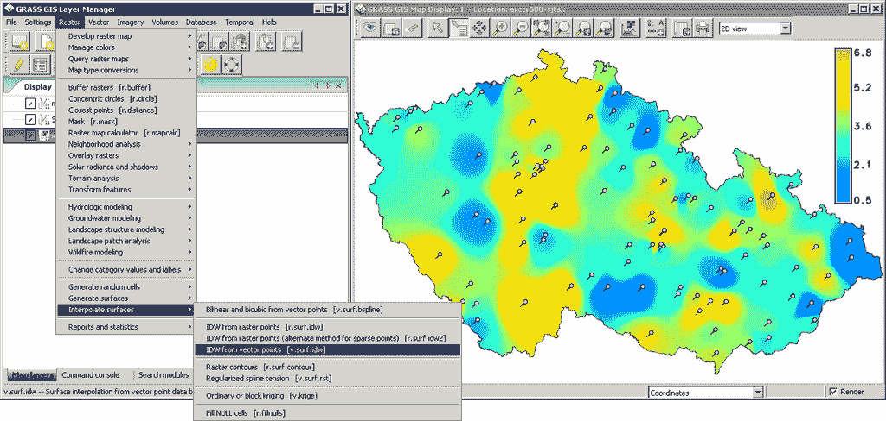
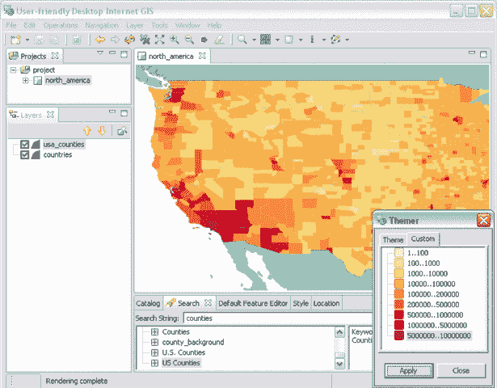
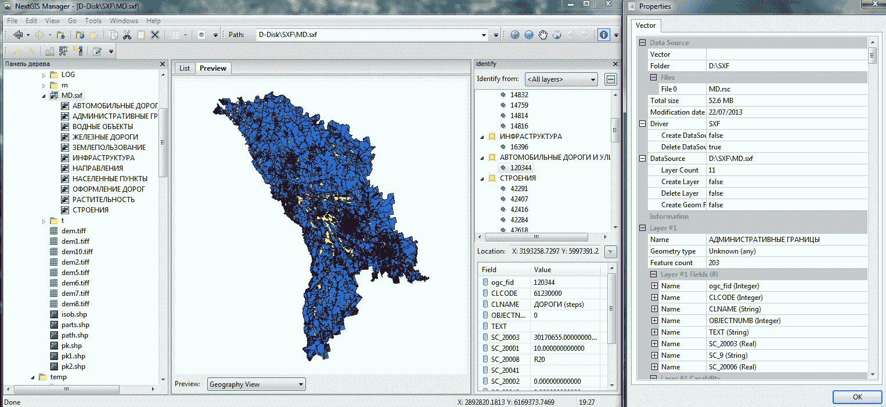
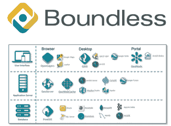
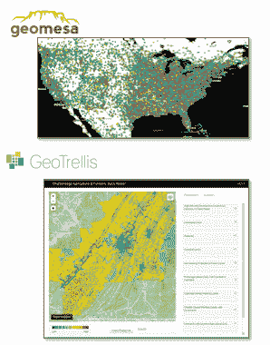

# 开源 GIS 的历史，从卑微的开始到改变世界的应用

> 原文：<https://thenewstack.io/humble-beginnings-world-changing-applications-history-open-source-gis/>

[Anthony harbor o](https://boundlessgeo.com/)

[Anthony harbor o 担任 unlimited 的首席传道人，负责产品战略和推广、教育计划和培训项目。安东尼还担任公司的联邦首席技术官，管理公司与美国联邦政府的关系。](https://boundlessgeo.com/)

数字地图和地理空间信息系统(GIS)的出现彻底改变了人类思考和与周围世界互动的方式。在 20 世纪 60 年代，景观设计师伊恩·麦克哈格(Ian McHarg)首次提出了用于决策的位置信息重叠离散层的概念。大约在同一时间，[罗杰·汤姆林森](http://www.ucgis.org/roger-tomlinson)——众所周知的“地理信息系统之父”——完成了他的博士论文，重点是地理空间信息叠加计算方法的使用。罗杰随后致力于创建第一个计算机化的地理信息系统，加拿大地理信息系统，主要用于测量。

开源 GIS 的根源可以追溯到 1978 年美国内政部。从那时起，开源 GIS 已经渗透到许多行业，包括政府和商业，并且自然有着不同于其专有的、基于许可的对应物的轨迹和影响。美国劳工部将地理空间技术列为 21 世纪三大最重要的高增长行业之一。开源 GIS 在过去四十年中的发展已经导致了它今天的许多突破性和有影响力的应用。

## 地理信息系统的起源:苔藓和草

1978 年，美国内政部创建了地图覆盖和统计系统(MOSS)。创建 MOSS 的目的是跟踪和评估矿山开发对环境、野生动物和迁移模式的影响。它是第一个广泛部署的基于矢量的交互式 GIS，也是第一个部署在小型计算机上用于生产的 GIS。

[GRASS](https://grass.osgeo.org/) (地理资源分析支持系统)紧随其后，拥有 350 多个模块，用于处理栅格、拓扑矢量、图像处理和图形数据。该软件最初是为美国军方创建的，用于帮助土地管理和环境规划。GRASS 如今在科学和商业环境中广泛用于地理空间数据管理和分析、图像处理、空间和时间建模以及图形和地图的创建。

## GeoTools、GDAL、PostGIS 和 GeoServer 进一步推进了地理信息系统倡议

1996 年，利兹大学[启动了一个项目，创建一个基于 Java 的 GIS 库，可以根据需要集成到不同的应用程序中。最终的结果是，](https://www.leeds.ac.uk/) [GeoTools](http://geotools.org/) ，它是一个用于操作地理空间数据的开源库，目前广泛应用于地理空间 web 要素服务器、web 地图服务器和桌面应用程序。

四年后，一个名为[地理空间数据抽象库](http://www.gdal.org/) (GDAL)的跨平台地理空间库出现了。GDAL 使得 GIS 应用程序能够支持 GIS 世界中存在的各种数据格式。它还附带了各种有用的命令行实用程序，用于处理数据和将数据转换成各种格式。它支持超过 50 种栅格和 20 种矢量数据格式，是世界上使用最广泛的地理空间数据访问库，支持诸如 [Google Earth](https://www.google.com/earth/) 、[地理资源分析支持系统](https://grass.osgeo.org/) (GRASS)、 [QGIS](http://www.qgis.org/en/site/) 、[要素操作引擎](https://www.safe.com/) (FME)和 [ArcGIS](https://www.arcgis.com/features/index.html) 等应用。

2001 年，[折射研究](http://www.refractions.net/)开发了开源程序 [PostGIS](http://www.postgis.net/) 来空间化存储在 [Postgres](https://www.postgresql.org/) 数据库中的数据。同年， [GeoServer](http://geoserver.org/) ，一个将数据发布为基于标准的 web 服务的 Java 应用程序也被创建。PostGIS 和 GeoServer 都是非常成功的项目，是当今使用最广泛的开源 GIS 数据库和 GIS 服务器。

## 开源项目进一步推动创新和教育

QGIS 被广泛认为是首屈一指的开源桌面 GIS。它于 2002 年发布，将 GRASS 的分析功能以及 GDAL 的数据格式支持整合到一个用户友好的桌面应用程序中，用于执行数据编辑、制图和分析。例如，QGIS 可以与其他开源 GIS 应用程序互操作；管理 PostGIS 数据库中的数据并将数据作为 web 服务发布到 GeoServer。

随着开源 GIS 在 2000 年代初继续获得牵引力， [OSGeo](http://www.osgeo.org/) 和 [LocationTech](https://www.locationtech.org/) 被创建来孵化开源项目。OSGeo 于 2006 年启动，旨在支持开源地理空间软件的合作开发，并促进其广泛使用。LocationTech 是 Eclipse Foundation 的一个工作组，旨在促进学术界、工业界和社区之间的 GIS 合作。

2011 年， [Geo for All](http://www.geoforall.org/) 是开源地理空间基金会的教育推广计划，旨在让每个人都能获得地理空间教育和机会。由于基金会的工作，许多开源 GIS 的教育资源现在可以在互联网上免费获得，包括 [FOSS4G Academy](https://github.com/FOSS4GAcademy) 和 GeoAcademy。Geo for All 最终导致在世界各地建立开源地理空间实验室和研究中心，以支持开源地理空间软件技术、培训和专业知识的发展。

## 开源 GIS 的商业支持

2013 年，我工作的公司 unlimited 成为第一家在数据库、服务器、桌面、web、移动和云级别为世界上最受欢迎的开源 GIS 应用程序提供商业支持和维护的公司。“无限”产品套件确保在运营环境中利用开源 GIS 的组织获得成功所需的技术支持。该公司为最流行的开源 GIS 软件提供持续的增强和维护补丁。

## 未来和未来

当今的现代计算挑战要求软件在云中工作，并支持正在创建的海量数据所带来的需求。旨在应对这些挑战的两个开源 GIS 软件解决方案包括 [GeoMesa](http://www.geomesa.org/) ，一个开源的分布式时空数据库，以及 [GeoTrellis](https://geotrellis.io/) ，一个用于高性能应用的地理数据处理引擎。

这两种解决方案均于 2014 年推出，支持在云中处理地理空间大数据。由于它们构建在开源框架上，不需要许可证，用户可以根据需要进行扩展，而不会受到惩罚。

开源 GIS 具有巨大的前景和潜力，因为它允许增加协作、共享有价值的数据和访问关键资源。凭借其在环境、政府、公共安全和健康方面的众多应用，开源 GIS 及其支持的项目有可能改变世界。

<svg xmlns:xlink="http://www.w3.org/1999/xlink" viewBox="0 0 68 31" version="1.1"><title>Group</title> <desc>Created with Sketch.</desc></svg>