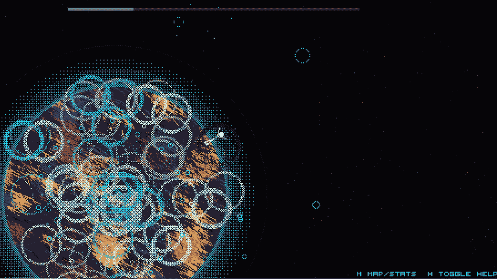

# 数百名开发人员为 JS13K 开发微型 JavaScript 游戏

> 原文：<https://thenewstack.io/hundreds-of-developers-build-tiny-javascript-games-for-js13k/>

连续第 10 年，数百名业余游戏开发者竞相用 13 千字节的 JavaScript 开发出最好的游戏。

“如果你仔细想想，13kB 真的不算多，”[在 GitHub 博客上的一篇帖子](https://github.blog/2021-10-05-13-tiny-and-terrific-entries-from-the-js13kgames-competition/)中提到， [Lee Reilly](https://www.linkedin.com/in/lreilly) 是 GitHub 开发者关系的高级项目经理，该活动的众多赞助商之一。但是 233 名无所畏惧的开发者接受了挑战，他们被竞赛独特的乐趣、奖励和社区结合所诱惑。

今年比赛中的一个新类别——去中心化——也为游戏制造商提供了探索更现代技术的机会。

这个节日不仅给了开发者一个展示他们技能的机会，还展示了当今科技文化中一个更大的主题:总有大量开发者愿意模糊游戏和学习之间的界限，但分享被融入到这个过程中——既包括完成的游戏，也包括构建游戏所需的工具和信息。

当然，创造力比比皆是。赖利也是该活动的评委之一，他在帖子中写道，今年的主题太空“促使许多小行星和太空入侵者的克隆体(有些在游戏中有重大转折)，令人困惑的使用和滥用空白空间的益智游戏，以及需要大量混合空格键的游戏！”

官方规则提供了一些灵活性:“你可以自由地解释主题，并以你认为最好的方式实现它。”

因此，从 8 月 13 日到 9 月 13 日，开发者试图创造小型游戏杰作，本月早些时候宣布了获胜者。

## 创意竞赛

参与者同意遵守一些简单明了的规则。没有闪光灯；只开放 JavaScript、HTML、CSS 之类的 web 技术(还有 WebGL)。虽然 HTML 5 技巧不错，但游戏应该只使用 JavaScript——而不是 CoffeeScript 或 TypeScript。(但 WebAssembly 和 Rust 被认为是可以的，因为“这些都是网络技术，如果使用得当，可以很好地与 JavaScript 游戏配合使用。”)

根据比赛的官方博客[，](https://medium.com/js13kgames)的说法，比赛的“有趣部分”是文件大小的限制。

决定获胜者的标准是什么？？“创新、乐趣、主题、游戏性、图形、音频和控制，”竞赛创始人安杰伊·马祖尔在官方博客中解释道。"总体排名是所有这些属性的总和."

获胜者分为六类——三类由参与者自己选择，三类由专家小组评判。最佳桌面、移动和服务器游戏(由参与者选出)是[太空花园](https://js13kgames.com/games/space-garden/index.html)、[黑洞广场](https://js13kgames.com/entries/black-hole-square)和[清洁行动](https://js13kgames.com/entries/operation-cleanaholeic)。

但也有三个专业类别的获胜者由专家选出:网络货币化、分散化和 WebXR(虚拟/增强/“混合”现实)，比赛让参与者有机会尝试一些新技术。

服务器类要求参赛作品托管在云平台 Heroku 上。(过程在官方规则中详细说明[:使用免费或付费的 Heroku 服务计划，开发人员创建了一个新的 Heroku WebApp，然后将其连接到他们的 GitHub 存储库以部署他们的代码。)](https://github.com/js13kGames/js13kserver)

竞赛维护了一个官方的开发服务器(和一个可下载的“框架”对象来促进交流)，加上其他一些这个类别特有的古怪行为。(允许持久存储，但是“键和值的大小也算在限制内！”规则警告。)

与此同时，在 WebXR 类别中，参与者被允许使用几个框架，而不将它们计入 13 千字节的总量。

JS13K 网站宣称:“WebXR 让网络开发者参与进来成为可能，”——让游戏玩家沉浸在更完整的体验中，甚至可能涉及他们周围的世界。

“四年前，我们引入了一个全新的 A-Frame 框架类别，三年前(我们)将 Babylon.js 作为第二选项，去年我们将 Three.js 添加到组合中，今年又添加了 PlayCanvas，所以你有很多选项可以选择，”该网站报道说。“我们迫不及待地想看看你创造了什么！”

尽管竞赛的规则没有指定外部库(或远程托管的图像或数据文件)，但分散类别允许连接到协议实验室(如 IPFS、Filecoin、NFT.storage 等)、近协议或 Flux technologies 的特定分散技术。

“每一年我都在努力提高和发展竞争，”马祖尔在博客文章中写道，“2021 年的大新闻是引入新的类别:去中心化。”(尽管马祖尔知道这些技术有其批评者，“你不能否认区块链游戏和游戏相关的非功能性技术正迅速流行起来。”)

竞赛网站[将类别](https://js13kgames.com/decentralized)描述为“一项实验，采用 Web 3、区块链、加密、NFTs 和所有类似的流行词汇，将它们与游戏开发混合在一起，看看会有什么结果。”奖金以加密货币支付，奖池“由 73 个 FIL，1，460 个 NEAR 和 4，000 个 FLUX 组成，目前总价值约为 10，000 美元。”

网络货币化类别(2019 年推出)要求游戏制造商包括一个支付流(通过一行 HTML 代码添加一个指定其支付指针的 meta 标签来实现)。该活动的赞助商之一 Coil 提供了一种特殊的浏览器扩展，可以在浏览器中浏览这些内容。(每个 JS13K 参与者都获得了两个月的免费 Coil 订阅，而其网络货币化类别的参与者则获得了六个月的订阅。)

获胜的游戏最终获得了由网络基金[提供的现金奖励，这是一个促进网络货币化的基金。第一名获胜者获得 600 美元，而接下来排名高的参赛作品分别获得 300 美元、150 美元、75 美元、50 美元；排名中接下来的五个游戏都赢得了 25 美元。](https://www.grantfortheweb.org/)

另外一名获奖者由马祖尔亲自挑选，获得“超级特别”欣赏奖，以表彰一件具有原创性和独特性的作品——一件从其他作品中脱颖而出的作品。今年的赢家:游戏[q1k 3</a——将经典游戏《雷神之锤》的致敬压缩到了 13 千字节。](https://js13kgames.com/entries/q1k3)

但是今年最大的桌面/整体赢家是游戏[太空花园](https://js13kgames.com/entries/space-garden)，在这个游戏中，一个代表“行星传粉者”的简笔画在太空中遨游(有一个很酷的 MIDI 主题，巧妙地闪烁的图形和一些渲染得很好的行星)。“像素艺术真的很有趣，非常符合音乐和‘空间’的总体感觉，”软件开发人员/YouTube 教育家、竞赛评委之一 Ania Kubów 写道。

*太空花园一瞥，今年 JS13k 比赛的总冠军。*

## 创意社区

真正体现出来的是围绕比赛成长起来的小而支持的社区中的强烈热情。

官方规则指出，团队合作是可以的:“只要记住奖品的数量是固定的，所以你必须与你的队友分享你的奖杯。”

在 YouTube 上，游戏博主[朱庇特·哈德利](https://jupiterhadley.com/)甚至一直在给[直播她打完所有 233 场游戏](https://www.youtube.com/watch?v=KBb9yP7FPgs&list=PLYKU1lvSF85fITmDh5Akb_AvQ7mk84SVb)的努力。

比赛在正式的 JS13KGames 颁奖典礼上达到高潮(在 YouTube 上播出[)，马祖尔和](https://www.youtube.com/watch?v=z6blrKix7So)[萨斯卡·德波德](https://github.com/sdepold)(易贝有限公司的工程经理，自第二届以来一直是该活动的长期支持者)也参加了颁奖典礼。

“我真的很高兴比赛逐年增长，”马祖尔在活动中说。尽管今年提交了 223 份参赛作品，接近去年的 227 份，但投票数增加了 29%以上，达到 6086 张(高于 2020 年的 4682 张)。

乐趣还没有结束。一名自称为 [Slashie](https://www.linkedin.com/in/slashie/) 的哥伦比亚视频游戏开发者承诺，在接下来的 233 天里，每天都会在官方 [JS13K Slack 频道](https://slack.js13kgames.com/)上重点展示一款游戏，“让社区关注它，并给开发者反馈和鼓励！”

尽管活动要到周一才开始，Slashie 在博客文章[中指出，“我们将迎来几乎一整年的有趣游戏。是不是很刺激？”](https://medium.com/js13kgames/one-js13k-per-day-96a4a5a431b0)

* * *

# WebReduce

<svg xmlns:xlink="http://www.w3.org/1999/xlink" viewBox="0 0 68 31" version="1.1"><title>Group</title> <desc>Created with Sketch.</desc></svg>