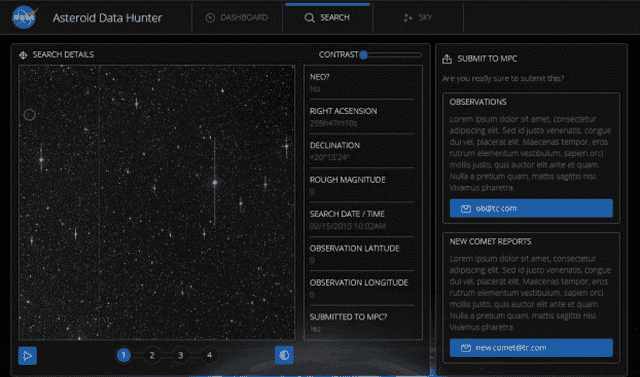

# 用机器学习和程序员世界搜寻小行星

> 原文：<https://thenewstack.io/hunting-down-asteroids-with-machine-learning-and-a-world-of-programmers/>

太空中有数百万颗小行星。如果其中一个命中，我们知道结果。它可能会在到达地球表面之前解体，或者该空间物体可能有[彗星苏梅克-利维 9](https://en.wikipedia.org/wiki/Comet_Shoemaker%E2%80%93Levy_9) 那么大，该彗星于 1994 年与直径两公里的小行星撞击木星表面，速度约为每小时 216，000 公里。大约是 134000 英里每小时。

这一发现稍微改变了我们对如何探测这些小行星的看法。但是我们的检测率仍然没有完全提高。截止日期正在迅速临近。2004 年，美国国会要求美国宇航局在 2020 年前发现 90%以上直径大于 140 米的近地天体。我们正在实现这一目标，但不仅仅是因为我们有杰出的研究人员和强大的望远镜。我们现在有成千上万的开发人员和业余天文学家，他们可以使用编程来帮助完成曾经完全由穿着白大褂的人完成的研究。

NASA 决定向程序员寻求一些帮助。他们与 [TopCoder 网站](http://www.topcoder.com/)组织了一场竞赛。这类似于 [Netflix 奖](https://en.wikipedia.org/wiki/Netflix_Prize)，一个用来帮助向客户提供更好推荐的公开竞赛。

美国宇航局和 TopCoder 小行星数据猎人项目从 2014 年 3 月持续到 2015 年 1 月，目标是改进探测小行星的算法。竞赛获胜者比目前识别火星和木星之间轨道运行的小行星的方法提高了 15%。

TopCoder [小行星数据猎人](http://www.topcoder.com/asteroids/asteroiddatahunter/ "Link to Asteroid Data Hunter on topcoder.com")网站提供包括源代码的下载，也可以在 Github 上作为开源[获得。420 MB 的下载包括 Windows 和 Mac 的图像、文档和安装程序。注意，也有 Linux 的源代码，只是还没有安装程序。主要的猎人软件是用 Java 编写的，算法用 C++编码。该算法可以在笔记本电脑或台式机上运行。](https://github.com/nasa/NTL-Asteroid-Data-Hunter "Link to Asteroid Data Hunter on Github")

## 它是如何工作的？

代码分为两个不同的部分。第一部分—数据管理、上传等。—全部用 Java 编写，包括一个在 8080 端口上运行的本地 web 服务器，用于浏览器用户界面。执行比较的第二部分是用 C++编写的。

在你理解它是如何工作的之前，你需要了解一点关于[灵活图像传输系统(FITS)](https://en.wikipedia.org/wiki/FITS) 文件格式的知识。这是保存天文图像的一种流行格式，得到了 T2、美国国家航空航天局和国际天文学联合会的认可。这是一种奇怪的格式，因为它包括一个人类可读的头和图像数据，并且可以有多个数据部分，包括非图像数据。简而言之，你可以放入任何你想要的结构化数据。现代望远镜可以输出 FITS 格式的数据，所以我们鼓励你也可以用你自己的数据来使用这个程序。

小行星数据猎人包括四个 FITS 图像文件的例子和一个读取它们的 Java 类。前五名得分者编写的算法都在一个头文件中，长度从 1，021 到 14，328 行不等，但大多数都在 2，000 行以下。五种算法中的每一种都进行了不同的比较，尽管有几种使用了相同的算法:随机森林分类器。这是一种用于分类和回归的机器学习技术。在这种情况下，分类是确定观察到的像素是恒星还是小行星。

竞赛获胜者预处理输入 FITS 图像以生成背景图像，在每个像素周围制作一个区域以获得中值。然后，他过滤这些照片，试图检测出可以从背景中去除的物体。之后，他的算法试图将不同图像中的物体联系起来，从而让他移除静止的物体，并希望留下移动的物体。通过观察与运动速度和方向相关的七个特定特征来识别运动物体:

*   总(欧几里得)速度。
*   全(欧几里得)运动。
*   RA-分量([右提升](https://en.wikipedia.org/wiki/Right_ascension "Link to Wikipedia about Right ascension"))速度。
*   RA 组件移动。
*   DEC-分量(变分)速度。
*   DEC-组件移动。
*   运动的角度(atan2)。

在两张图像上确定了一个移动物体的路径后，他的代码通过比较另外两张图像的像素值来验证它是一颗小行星。FITS 图像包括时间戳，因此可以通过计算小行星在时间间隔内沿直线移动的距离来确定小行星在其他两幅图像中的位置。

这不是一个探测小行星的静态程序，而是一个从输入中学习的改进算法，并对在其他数据集中探测小行星做出预测。

## 结论

我们需要探测小行星，这既是为了发现，也是为了保护我们所知道的地球。这种兴趣使我们有可能考虑如何建造一台重力拖拉机，轻轻地推动一颗巨大的小行星，使它不会与地球相撞。与此同时，机器学习技术的简化使程序员能够以新的方式参与进来，因此我们可以检测小行星，避免好莱坞式的灾难，例如天空中的"[大火](https://www.imdb.com/title/tt0077553/)"或者天文学家喜欢说的:"小行星吃掉了凤凰城。"

专题图片[通过](http://www.topcoder.com/asteroids/asteroiddatahunter/) BBC。

<svg xmlns:xlink="http://www.w3.org/1999/xlink" viewBox="0 0 68 31" version="1.1"><title>Group</title> <desc>Created with Sketch.</desc></svg>