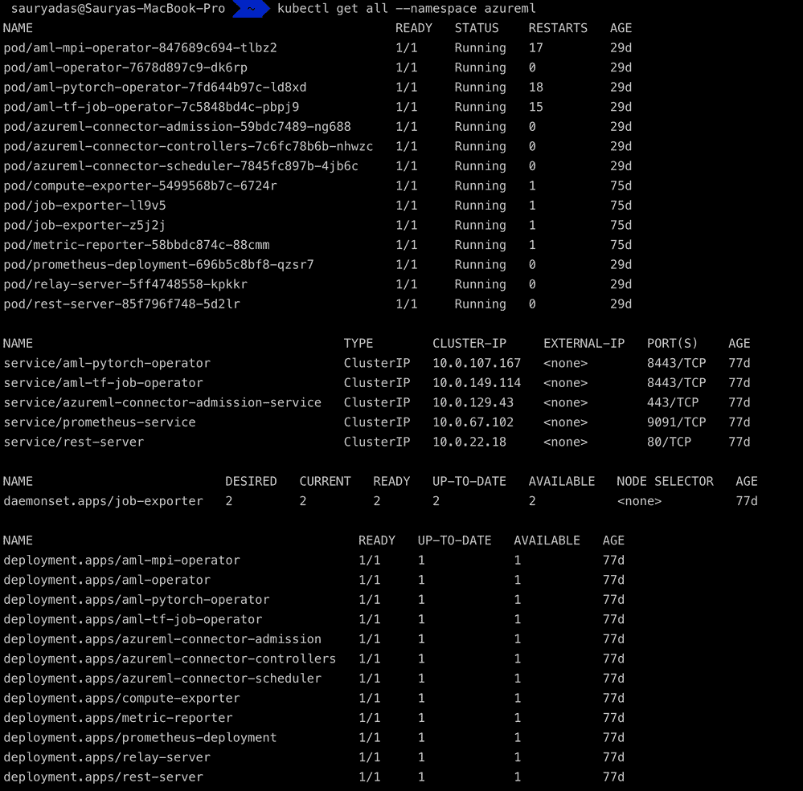
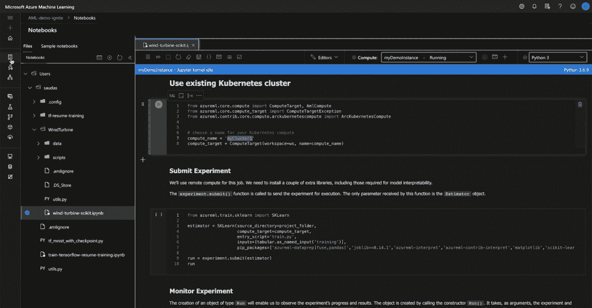

# 基于 Kubernetes 和 Azure Arc 的混合云机器学习

> 原文：<https://thenewstack.io/hybrid-cloud-machine-learning-on-kubernetes-with-azure-arc/>

Azure Arc 是微软的混合解决方案，通过在 Azure 中放置该[基础设施的表示，以便在云中工作的自动化、监控和策略工具也可以管理它，从而在任何基础设施上获得云服务的简单性和价值。](https://thenewstack.io/azure-arc-is-a-control-plane-to-orchestrate-hybrid-cloud-systems/)

Arc 从服务器、虚拟机、Kubernetes 和 SQL Server 数据库(相当于内部部署的 IaaS)开始，然后将云 PaaS 服务引入到您使用 Arc 管理的基础架构中，首先是将 Azure 数据服务放在 Kubernetes 容器上。这是一种“常青树”数据库服务(针对 SQL Server 或 PostgresDB ),具有云服务的持续更新、自动化和灵活性，只需在您自己的硬件或其他云中的基础架构上运行即可。

Arc 的下一个 Azure 服务是机器学习，你现在可以用它在本地运行你用 Arc 管理的数据库中的数据的训练。这可能是您不想复制到 Azure 的不同云中的数据，从而导致数据出口成本和延迟，也可能是您出于监管原因希望保留在自己的数据中心的数据，或者是您希望在边缘处理以便可以立即采取行动的数据。

Arc 支持的机器学习将在工作负载的边缘非常有用，如预测性维护、监控现场资产的故障或分析零售场所的活动，在这些地方，您没有连接或带宽来使用云服务。

“今天利用机器学习的客户在一系列广泛的场景和环境下运营，”微软发言人告诉新堆栈。“他们可能处于金融服务或医疗保健等受监管行业，因此有特定的要求。我们希望支持我们的客户和他们的场景，这样他们现在就可以在有数据的地方进行机器学习。凭借 Kubernetes 和 Arc 支持的 ML 的灵活性，他们可以利用现有硬件，在边缘场景中或当他们的数据位于其他云中时，跨数据驻留要求工作。”

Arc 展示了本地 Kubernetes 环境中的 ML 框架。

微软在 Arc 上建议了一些机器学习的典型客户；银行业、医疗保健——医学成像分析或药物研发——以及风力发电场等可再生能源基础设施。“银行通常有内部数据。他们经常需要运行金融风险建模预测(针对资本、信贷等)。)并严重依赖机器学习模型。他们通常受到高度监管，希望在内部运行 ML 以满足要求。鉴于组织间的协作结构，医疗保健组织通常需要多云支持。”

“风力发电场是一种很好的可再生能源，但会因风速和其他环境因素而大幅波动。他们还会在现场持续生成数 Pb 的数据。ML 模型可以帮助预测能量容量和做出功率承诺。有了 Azure Arc 支持的 ML，模型可以在没有数据移动的情况下进行内部训练，随着数据的变化，模型会重新训练自己并保持准确性。”

它还将允许组织使用其他工作负载当前不需要的现有本地基础设施来运行机器学习培训，否则他们将付费在 Azure Machine Learning 中运行。如果他们暂时需要更多的资源，他们也可以爆发到 AKS 集群。

“以这种方式编排培训工作和 Kubernetes 集群的生命周期管理由客户完成，以符合他们的 DevOps 流程和偏好的方式，”微软解释说。

## 机器学习管道

用相同的工具管理所有不同的机器学习模型也是操作化机器学习的一个重要部分。Azure 管理总监 Jeremy Winter 在微软 Ignite 活动上解释道:“你的所有模型，无论是在哪里建立的，都可以在 Azure 机器学习的一个中心位置进行存储和跟踪，以实现共享、可再现性和审计合规性。”

支持 Arc 的机器学习在 Kubernetes 集群上运行(任何集中应用的 Arc 策略都应用于工作负载)，使用本地 Kubernetes 对象，并坚持标准的 Kubernetes 概念，如角色分离。

这有助于解决 Kubernetes 上机器学习的一个难题；这是一个可扩展的分布式基础设施，非常适合机器学习培训，但机器学习专业人士很少拥有 Kubernetes 的专业知识。

数据工程师使用 Arc 不需要学习 Kubernetes 它只是 Azure Machine Learning Studio、Azure Machine Learning Python SDK、Jupyter 笔记本或 SciKit、TensorFlow、PyTorch 或 MPI 等框架的另一个计算目标。

“Azure 机器学习为许多开源框架提供内置支持，如 SciKit、PyTorch、TensorFlow 等。客户可以使用 Azure Arc enabled ML，通过对这些开源框架的内置支持来训练模型，”微软告诉我们。

但是 Kubernetes 的操作人员不需要了解那些机器学习工具。Azure 机器学习代理可以从命令行部署，也可以使用 GitOps 等常见的 Kubernetes 模式，并且可以在 Arc 支持的任何 Kubernetes 集群上运行。该代理扩展了 Kubernetes API，因此 PyTorch 和 TensorFlow 等工具的操作符在 kubectl 中显示为 Kubernetes 对象，这也是 Azure 机器学习服务如何与您的集群对话并为您部署培训作业。

管理员可以在 Azure 门户中看到他们支持 Arc 的 Kubernetes 集群，无论他们是在 Azure、谷歌云平台、[亚马逊网络服务](https://aws.amazon.com/?utm_content=inline-mention)、edge 设备上还是在数据中心中，并选择他们希望在其上运行支持 Arc 的机器学习。“IT 运营商将需要提供对 Kubernetes 集群的存储访问，根据他们的要求在内部为他们的数据端点设置网络安全配置，然后运行 Azure 机器学习代理，”微软告诉我们。

他们还可以使用这个门户来选择他们想要访问的数据工程师——使用熟悉的 Kubernetes 模式访问整个集群或部分集群。

“支持 Arc 的机器学习的设计有助于 IT 操作员利用本地 Kubernetes 概念，如运算符、自定义资源定义、名称空间和标签。通过让 IT 操作员管理这种设置，我们为不需要学习或直接使用 Kubernetes 的数据科学家创造了无缝体验。灵活的设计还帮助我们支持广泛的客户场景，例如当数据在不同的云中时使用 AKS 集群进行培训，在 Azure Stack Hub 上进行培训，等等。”

当那些数据工程师使用 Azure Machine Learning Studio 来构建和部署机器学习模型时，他们可以看到他们的数据集、笔记本、实验、模型和管道，以及他们可以使用的计算位置。这包括他们可以访问的支持 Arc 的 Kubernetes 集群，他们可以直接选择它作为一个位置，或者在 [Jupyter 笔记本](https://thenewstack.io/jupyter-notebooks-the-web-based-dev-tool-youve-been-seeking/)中使用它作为训练模型的位置。

Jupyter 笔记本中的目标弧簇。

该模型的任何训练运行都显示在实验列表中，因此他们可以比较在不同位置或不同开发阶段训练模型的性能和结果。这对于远程站点和分散的员工来说特别方便，他们可能在不同的位置在家工作，但仍然可以通过云协作构建机器学习系统，而数据不必离开远程站点。

启用 Arc 的机器学习尚不支持其他机器学习编排模式，如流行的 Kubeflow，但微软正在研究如何实现这一点。“我们正在与客户讨论他们的 Kubernetes 环境，并希望获得更多反馈，了解他们希望 Kubeflow 支持的内容，例如管道、笔记本电脑或超参数调整等。”

Arc 支持的机器学习现在在公共预览中可用:[点击此链接](https://forms.office.com/Pages/ResponsePage.aspx?id=v4j5cvGGr0GRqy180BHbRwZd_QnDizlCvqcJ1wm7dEFUMjQxVlVDUlVZWkxPNTAxSFc4SFVaVUhESi4u)申请，给出一些你感兴趣的工作负载类型的细节。

## Arc 路线图

从长远来看，Arc 是微软将越来越多的 Azure 服务引入混合模式的方式。Arc 团队在 [Ignite](https://myignite.microsoft.com/sessions/43a8f6f6-92d5-4729-b16c-315b5d92b2af?source=sessions) 上证实，微软将在今年晚些时候宣布一些额外的 Azure Arc 支持的服务。我们预计其中一个是 Arc 应用服务，它将 Azure 功能和事件网格结合到 PaaS 部署平台中，但也有很多客户对将 Azure Key Vault 引入 Arc 感兴趣。

虽然你可以使用 Arc 来管理任何经[云本地计算基金会](https://cncf.io/?utm_content=inline-mention)认证的 Kubernetes 发行版，但微软也在与供应商合作，认证 OpenShift、Charmed Kubernetes 和 RKE 等平台，以运行支持 Arc 的 Kubernetes 集群，现在它又将 VMware Tanzu 和 Nutanix 的 Karbon Kubernetes 管理解决方案添加到列表中，供使用超融合系统的客户使用。

特征图像:训练从 Azure ML 中的 Arc 集群运行。所有图片均由微软提供。

<svg xmlns:xlink="http://www.w3.org/1999/xlink" viewBox="0 0 68 31" version="1.1"><title>Group</title> <desc>Created with Sketch.</desc></svg>