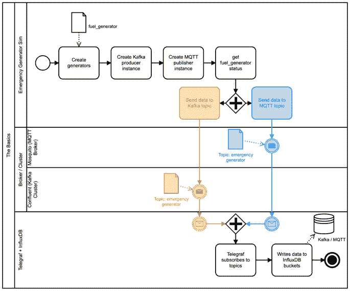
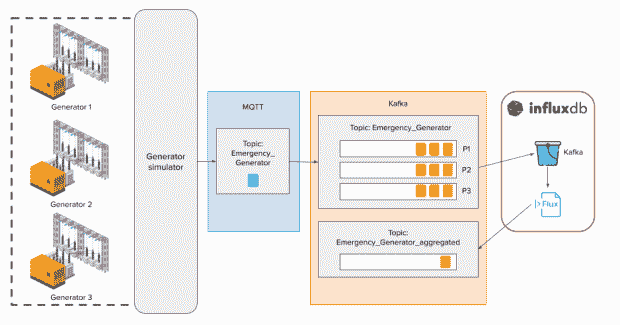
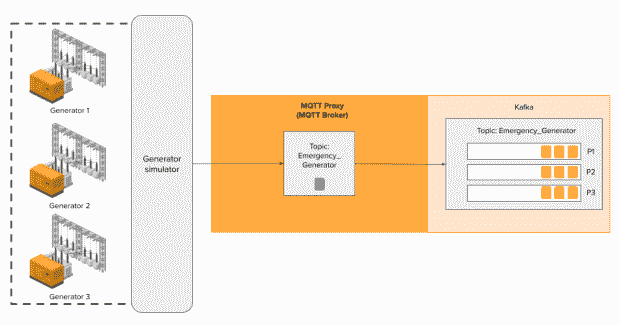
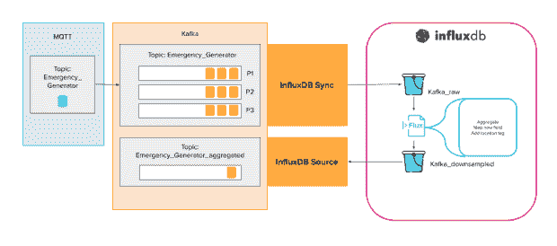

# 使用 MQTT 和 Kafka 从物联网边缘收集混合数据

> 原文：<https://thenewstack.io/hybrid-data-collection-from-the-iot-edge-with-mqtt-and-kafka/>

使用数据库时，数据收集是最大的挑战之一。如果你不能把数据输入数据库，那么其他任何东西都不起作用。虽然这对于任何用例都是正确的，但物联网是一个特别具有挑战性的领域。这些用例通常涉及大量的系统、传感器和数据源，它们并不总是以相同的格式输出数据或使用相同的协议。

对于时间序列数据，这一挑战变得更加严峻，因为数据源数量庞大，而且它们生成数据的速度意味着您可能需要每秒接收数百万个数据点。因此，构建可靠的数据摄取是物联网和工业物联网用例的关键步骤。可以考虑的几个选择是 MQTT 和 Kafka。

## MQTT

[MQTT](https://www.influxdata.com/mqtt/?utm_source=vendor&utm_medium=referral&utm_campaign=2022-10_spnsr-ctn_iot-edge-hybrid-data-collection_tns) 是一种在许多物联网环境中使用的流行协议，它依赖于发布/订阅模型。MQTT 可以在有效负载交付期间按需生成主题。如果一个主题已经存在，MQTT 会将数据发送给该主题。如果主题不存在，MQTT 会创建它。

MQTT 有效负载非常灵活，这意味着您不需要为数据定义严格的模式，但这也意味着您的订阅者需要能够处理超出常规的主题。简而言之，MQTT 易于配置、可靠且极其灵活。

## 卡夫卡

Kafka 是一个事件流平台，也是基于发布/订阅模型，具有数据持久性的额外优势。对于物联网用例，Kafka 还提供高吞吐量和高可用性，并且它可以与许多第三方系统很好地集成。

虽然 Kafka 在某些关键方面与 MQTT 相似，但它并不是物联网架构的万灵药。这是因为 Kafka 是为部署了良好基础设施的稳定网络而构建的。物联网设备通常涵盖所有领域；单个系统中的设备可能具有大量资源和出色的连接性，而其他设备可能占用空间有限，连接性时断时续。 [Kafka](https://www.influxdata.com/influxdb-templates/kafka-monitoring/?utm_source=vendor&utm_medium=referral&utm_campaign=2022-10_spnsr-ctn_iot-edge-hybrid-data-collection_tns) 也没有部署 Keep-Alive 和 Last Will 等关键数据交付功能。

## 使用 MQTT 和 Kafka 进行混合数据收集

这里的目标是创建一个数据管道，利用每个协议的优点来帮助减轻另一个协议的缺点。如果你想玩这个项目的代码，你可以[从 InfluxData 社区 GitHub repo](https://github.com/InfluxCommunity/kafka_mqtt_tutorial) 获取。

在本例中，我们将模拟监控应急燃料发电机。我们希望从生成器中收集数据，将其存储在 [InfluxDB](https://www.influxdata.com/products/?utm_source=vendor&utm_medium=referral&utm_campaign=2022-10_spnsr-ctn_iot-edge-hybrid-data-collection_tns) 中，处理并分析这些数据，然后将处理后的数据发送到其他地方使用。

我们可以将 MQTT 和 Kafka 直接连接到生成器，但是已经强调了各自的优缺点，我们需要一个更持久的解决方案。从架构的角度来看，我们可以在这个模拟中看到这两个协议之间的差异。



一种更符合逻辑的方法不是以这种方式连接所有内容，而是遵循以下原则:



在这里，我们使用 Kafka MQTT 代理直接从我们的边缘设备收集数据，这实际上是一个附加了 Kafka 功能的 MQTT 代理。这允许我们的 MQTT 客户机直接连接到它。鉴于此，我们可以修改上面的图表，以更好地反映这里发生的事情。



MQTT 代理将数据发送到 Kafka 集群。我们这样做是为了利用 Kafka 分区，它为性能目的提供了一致的记录排序和并行性。这意味着我们可以为来自单个设备或设备组的数据创建单独的队列。

假设每个生成器每秒产生 1，000 条记录，我们有一个微服务试图消费这些消息并执行一些逻辑。我们知道微服务每秒只能处理 500 条记录，所以我们的消费者永远无法与我们的生产者保持一致。使用分区允许我们根据需要增加微服务的实例，以便彼此并行地使用这些记录的一部分。这实现了更高的吞吐量。

我们还可以使用分区进行主题复制。在这种情况下，我们可以保留分区来保存记录的副本。因为这些协议可以将我们的主题分布在许多服务器上，所以这种方法有助于防止由于停机造成的数据丢失。如果一个分区不可达，那么我们的消费者将简单地从备份分区获取记录。

回到这个例子，我们使用 InfluxDB Sync 连接器将 Kafka 分区的数据写入 InfluxDB，在这里我们可以使用 [Flux 语言](https://www.influxdata.com/products/flux/?utm_source=vendor&utm_medium=referral&utm_campaign=2022-10_spnsr-ctn_iot-edge-hybrid-data-collection_tns)对数据进行下采样和聚合。然后，我们使用 InfluxDB 源连接器将降采样后的数据发送回 Kafka，以便进一步分发和使用。

## 不仅仅是数据存储

让我们打开最后一部分。我们在这里得到的不仅仅是一个简单的数据存储。相反，我们使用 Flux 将数据分析工作下推到数据库中，以提高效率。



如图所示，我们使用 InfluxDB Sync 将原始数据写入一个名为``kafka_raw` `in InfluxDB. We’re going to use Flux to get data from the raw bucket, enrich it and write that data to the ``kafka_downsampled` `bucket.````

 ```Our Flux script looks like this:

```
import  "influxdata/influxdb/tasks"

option task  =  {name:  "kafka_downsample",  every:  1m,  offset:  0s}

from(bucket:  "kafka")
    |>  range(start:  tasks.lastSuccess(orTime:  -1h))
    |>  filter(fn:  (r)  =>  r["_measurement"]  ==  "genData")
    |>  pivot(rowKey:  ["_time"],  columnKey:  ["_field"],  valueColumn:  "_value")
    |>  group(columns:  ["generatorID"],  mode:  "by")
    |>  last(column:  "fuel")
    |>  map(fn:  (r)  =>  ({r  with alarm:  if  r.fuel  <  500  then  "refuel"  else  "no action"}))
    |>  set(key:  "region",  value:  "US")
    |>  to(
        bucket:  "kafka_downsampled",
        tagColumns:  ["generatorID",  "region"],
        fieldFn:  (r)  =>
            ({
                "alarm":  r.alarm,
                "fuel":  r.fuel,
                "lat":  r.lat,
                "lon":  r.lon,
                "power":  r.power,
                "load":  r.load,
                "temperature":  r.temperature,
            }),
    )

```

So what does all this mean? Here’s what’s happening.

*   The **range() + tasks.lastSuccess** function collects the data from the ``kafka` `的桶中，这个桶是自上次任务运行以来的。如果这是任务第一次运行，则默认为过去一小时的静态值(-1h)。``
``*   接下来，我们过滤数据，这样我们只返回测量 genData 的值。*   我们使用 **Pivot()** 将垂直存储的值转换成水平格式。这使得它更像使用 SQL 数据库，并且水平格式对于 map 函数很重要。*   我们按我们的 generatorID 列进行分组()。这将每个生成器的数据分离到自己的表中。*   **Last()** 选择并返回每个表格的最后一行。*   然后，我们使用 **map()** 以及一些条件逻辑来检查我们当前的燃料水平，并创建一个名为 alarm 的新列。该函数根据条件逻辑填充报警值。*   **set()** 允许我们创建一个新列，并用相同的值手动填充每一行。*   **to()** 函数将我们的数据传输到 kafka_downsampled。我们提供了一些映射逻辑来定义哪些列是字段和标签。``

 ``要在 InfluxDB UI 中[创建这个任务](https://docs.influxdata.com/influxdb/cloud/process-data/manage-tasks/create-task/?utm_source=vendor&utm_medium=referral&utm_campaign=2022-10_spnsr-ctn_iot-edge-hybrid-data-collection_tns)，点击 CREATE TASK 按钮，命名您的任务并设置您希望它运行的频率。然后，您可以在任务窗口中编写任务脚本。

## 利益

这个架构设计完成了几件事情。利用 MQTT 可以很容易地从分布式边缘设备获取数据。它是轻量级的，所以它几乎可以去任何地方，并且它可以处理成千上万的连接，所以物联网数据的数量和速度不是问题。另外，MQTT 考虑到了连接性问题，这对于分布式设备来说是至关重要的。换句话说，它可以灵活地弥合物理世界和数字世界之间的最初差距。

利用 Kafka，我们可以在数据通过数据管道时对数据进行组织。Kafka 提供高可用性，因此我们知道，只要我们的边缘设备具有连接性，它们就能够到达 Kafka。分区提高了数据吞吐量，因此在 Kafka 企业级连接器的帮助下，我们可以确保所有物联网数据都真正进入数据存储。

InfluxDB 通过提供数据转换功能和存储增强了整个数据管道。

要了解关于这个例子的代码和创建这个混合架构的旅程的更多信息，请查看本系列的。

<svg xmlns:xlink="http://www.w3.org/1999/xlink" viewBox="0 0 68 31" version="1.1"><title>Group</title> <desc>Created with Sketch.</desc></svg>`````