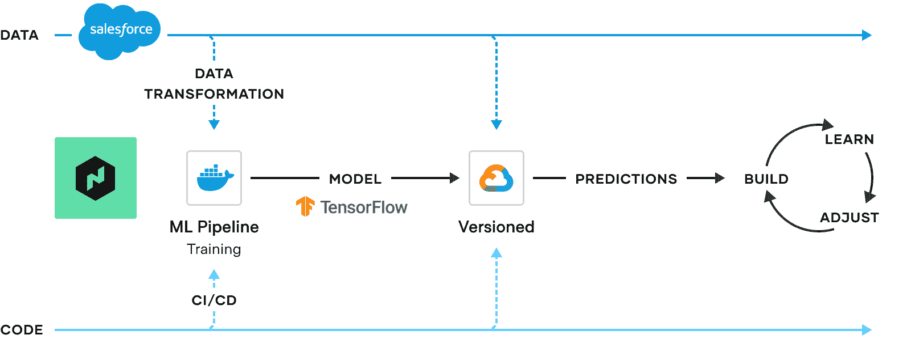
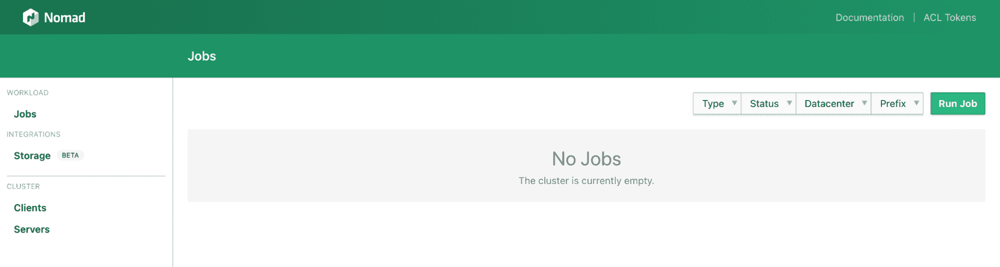
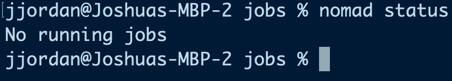
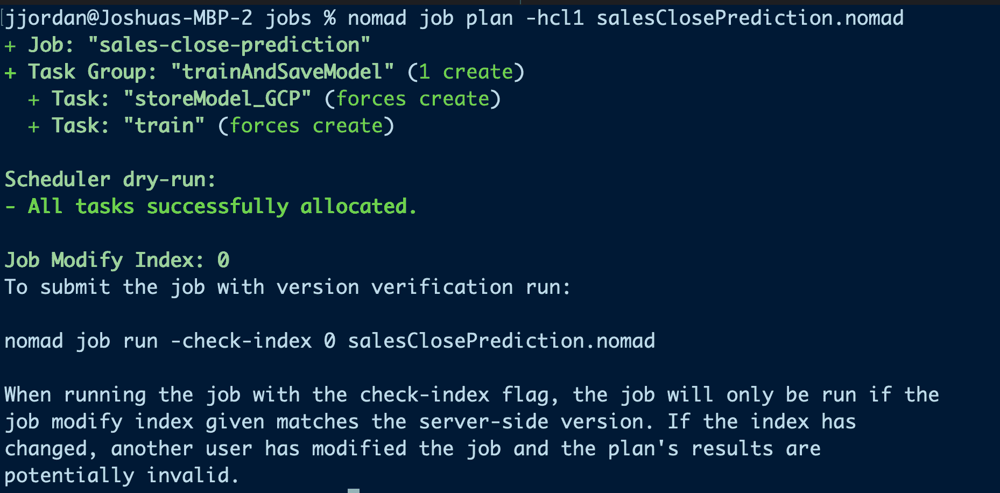
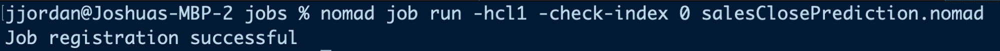
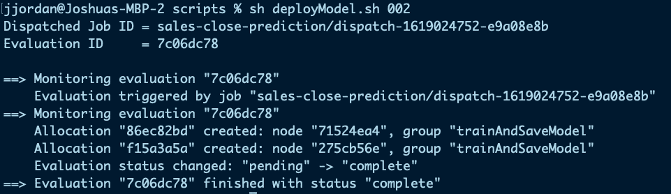
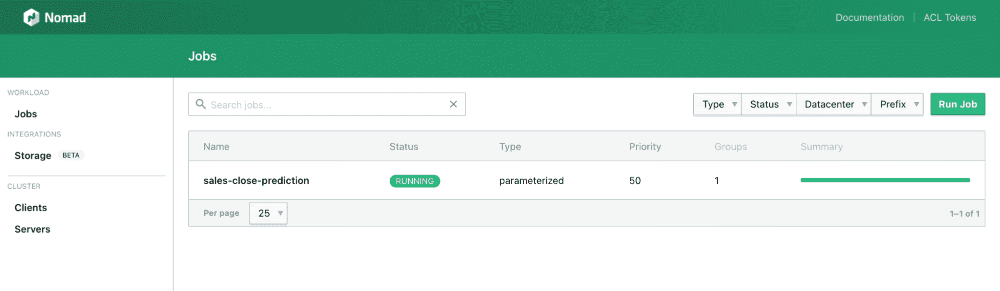
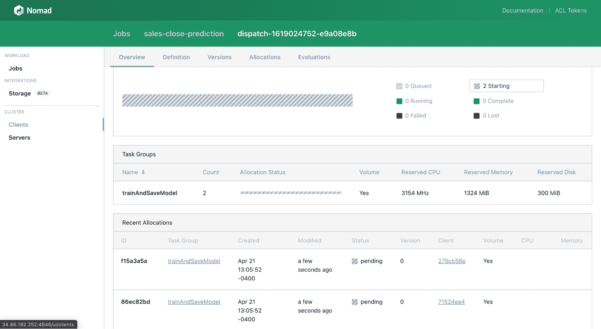
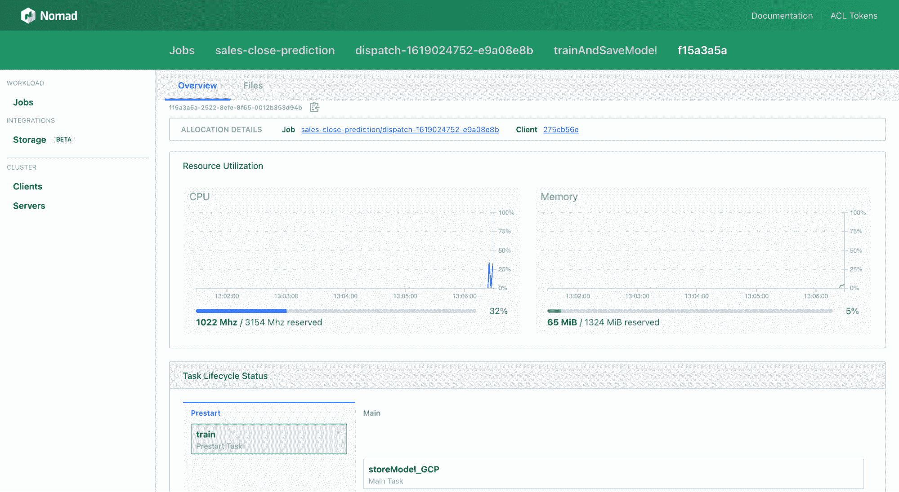
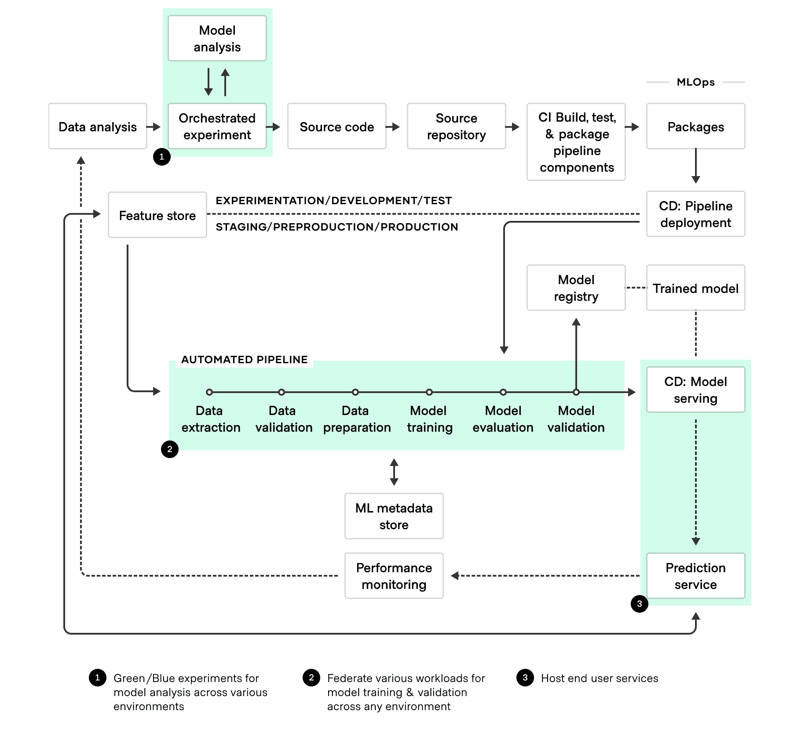

# 与 HashiCorp Nomad 的混合 MLOps

> 原文：<https://thenewstack.io/hybrid-mlops-with-hashicorp-nomad/>

[](https://www.linkedin.com/in/joshuanjordan/)

 [乔希乔丹

乔希喜欢数据、工程、养猫和吉他转到 11 岁。](https://www.linkedin.com/in/joshuanjordan/) [](https://www.linkedin.com/in/joshuanjordan/)

数据科学家是非常受欢迎的专业人员，他们可能不想在主要工作职责之外构建和设置自己的基础架构。在他们的盘子里放太多，你可能会失去他们。

这就是为什么最近的机器学习操作(MLOps)范式有助于希望减少数据科学家流动的组织，因为它旨在[自动化端到端的基础设施支持和围绕 ML 模型的 CI/CD](https://cloud.google.com/solutions/machine-learning/mlops-continuous-delivery-and-automation-pipelines-in-machine-learning)。更高的生产力意味着组织可以建立有效数据实践的团队需求，并停止寻找无所不能的独角兽。

一旦一个有能力的团队到位，组织就需要工具和工作流来推动 MLOps 实施的价值。在数据科学工具领域越来越多的人当中，简单灵活的[工作负载调度器](https://copyconstruct.medium.com/schedulers-kubernetes-and-nomad-b0f2e14a896)比如 HashiCorp 的 [Nomad](https://www.nomadproject.io/) 可能看起来很奇怪。然而，Nomad 固有的灵活性使其成为在复杂的混合环境中构建 ML 管道的资产。

我想展示 Nomad 在自动化 ML 管道的所有移动部分中的位置，以便更容易做出是否使用 Nomad 的决定。

要做到这一点，我们需要一个初始项目(如图 1 所示)，我们可以构建这个项目作为概念验证:一个用于训练和部署机器学习模型版本的管道。

## 构建自动化 MLOps 管道



图 1:培训和部署模型版本的管道。

该项目的子任务是:

1.  从外部来源提取数据。
2.  将数据转换成可用的形式。
3.  根据我们的总体 ML 目标建立一个模型。
4.  训练模型。
5.  根据我们的数据子集测试模型，以对模型的有效性执行伪集成测试。
6.  存储模型(版本化)以供将来参考和使用。

这个项目的最终目标是建立一个机器学习模型，并将该版本化模型保存到一个云桶中，以便我们将来可以从其他来源利用它。图 2 最右边的构建-学习-调整圈代表了我们在使用端到端解决方案时迭代这种设计的愿望。

云平台和内部框架提供了一些模型存储解决方案，所以我在这里介绍的内容在功能上没有什么新意。然而，如果您曾经使用过这些解决方案，您就会知道它们不能很好地互操作。因此，如果您管理混合云 MLOps 生态系统，了解模型存储的具体细节可能会变成一项令人惊讶的艰巨任务。然而，使用 Nomad，我们获得了开箱即用、跨环境编排单一管道的好处。

如果你决定自己运行，Nomad 的[参考架构](https://www.nomadproject.io/docs/install/production/reference-architecture#system-reqs)是集群系统需求的有用指南，但要知道我在[谷歌云](https://cloud.google.com/) (GCP)中使用了最小的推荐 n1 系列虚拟机。这取决于您是指向并点击集群，还是使用配置工具，如 [Terraform](https://www.terraform.io/) 配置[这里是](https://github.com/joshuaNjordan85/terraform-enterprise-sass-demos)。

所使用的模型并不重要，因为我们最终关心的是部署它所需的操作。尽管如此，重要的是要注意我使用了 [jsforce](https://jsforce.github.io/) 、 [Tensorflow.js](https://js.tensorflow.org/api/latest/) 和 [Node.js](https://nodejs.org/en/) 运行时来构建必要的特征工程、模型训练和模型代码。然后，我将这些组件部署到一个 [Docker](https://www.docker.com/) 容器中。(你可以在这里阅读更多关于 Docker 的内容，因为它与 ML 建模和测试相关[。)](https://link.medium.com/OskIj8OEB7)

### 游牧配置

在 Nomad 中，用户通过声明性规范定义应用程序应该如何部署:Nomad 作业。作业代表以 JSON 或 HCL 格式定义的所需应用程序状态。在游牧工作中，任务是最小的部署单位。任务可以是 Docker 容器、Java 应用程序或批处理作业。每个[任务](https://www.nomadproject.io/docs/job-specification/task)运行在一个被称为[任务驱动](https://www.nomadproject.io/docs/drivers)的执行环境中。组定义了一组必须在同一节点或虚拟机上运行的任务。分配是在节点上运行的组的实例化。如果作业中需要指定一个任务组的三个实例，Nomad 将创建三个分配并相应地放置它们。

Nomad job specification[reference](https://www.nomadproject.io/docs/job-specification)对那些不熟悉小节定义的人很有帮助。在本例中，我们可以看到销售结束预测作业是一个[批处理](https://www.nomadproject.io/docs/schedulers#batch)类型，由一个[组](https://www.nomadproject.io/docs/job-specification/group) (trainAndServeModel)组成，该组有两个任务:`train`和`storeModel_GCP`。

我们用来定义 Nomad 作业规范的文件如下:

```
job  "sales-close-prediction"  {
datacenters  =  ["dc1"]
  type  =  "batch"
// Send payload parameters that are passed to top level job
// Could also use a file here
  parameterized  {
 meta_required  =  [
 "save_path",
 "data_path",
 "prediction_path",
 "data_url",
 "gcp_creds",
 "gcp_bucket_path",
 "model_version"
 ]
 meta_optional  =  ["batch_size",  "epochs"]
  }
group  "trainAndSaveModel"  {
  count  =  1
  volume  "models"  {
 type  =  "host"
 source  =  "models"
  }
  task  "train"  {
 driver  =  "docker"
 // Expose the versioned model data via expected directory
 // See dockerfile for specifications
 volume_mount  {
 volume  =  "models"
 destination  =  "/usr/src/app/models"
 }
 resources  {
 cpu  =  3054
 memory  =  1024
 }
 lifecycle  {
 hook  =  "prestart"
 sidecar  =  false
 }
 env  {
 VERSION  =  "${NOMAD_META_model_version}_${NOMAD_ALLOC_ID}"
 SAVE_PATH  =  "${NOMAD_META_save_path}"
 DATA_PATH  =  "${NOMAD_META_data_path}"
 DATA_URL  =  "${NOMAD_META_data_url}"
 PREDICTION_PATH  =  "${NOMAD_META_prediction_path}"
 }
 config  {
 image  =  "joshuanjordan/tensornode:0.7.2"
 }
  }
  // Storage related activity
  task  "storeModel_GCP"  {
 leader  =  true
 driver  =  "exec"
 env  {
 TARGET_DIR  =  "${NOMAD_META_save_path}_v${NOMAD_META_model_version}_${NOMAD_ALLOC_ID}"
 }
 volume_mount  {
 volume  =  "models"
 destination  =  "/tmp"
 }
 config  {
 command  =  "/bin/bash"
 // Store the versioned model
 args  =  [
 "-c",
 "gsutil cp /tmp/${env["TARGET_DIR"]}/model.json gs://${env["NOMAD_META_gcp_bucket_path"]}/${env["TARGET_DIR"]}.json"
 ]
 }
  }
}

```

`train`和 [Docker](https://www.nomadproject.io/docs/drivers/docker) 驱动一起运行，`storeModel_GCP`和 [exec](https://www.nomadproject.io/docs/drivers/exec) 驱动一起运行。作为先决条件，Docker 是在配置过程中安装在 Nomad 客户机上的。

因为所有 GCP 虚拟机都是与底层 SDK 一起烘焙的，所以没有理由预装它。但是，如果 exec 驱动程序需要其他二进制文件，那么该二进制文件需要预先安装在 Nomad 客户机上。如果需要，可以使用[工件节](https://www.nomadproject.io/docs/job-specification/artifact)从外部来源获取依赖项。

在正常情况下，Nomad 保证在部署作业时，组合在一起的任务将在同一个虚拟机上运行。组内嵌套的任务将在部署后并行运行。你需要分组的任务按顺序运行，所以我添加了[生命周期挂钩](https://www.nomadproject.io/docs/job-specification/lifecycle)来整合这个功能。

### 任务和生命周期挂钩

对于火车任务，我使用了不带边车的[预启动](https://www.nomadproject.io/docs/job-specification/lifecycle#lifecycle-parameters)挂钩。这一节告诉 Nomad 训练任务应该在主任务开始之前运行。`sidecar = false`表示该任务完成后不会重启。主任务`storeModel_GCP`对 Nomad 来说是可识别的，因为它没有相关的生命周期挂钩。

此外，我使用共享的[卷](https://www.nomadproject.io/docs/job-specification/volume)和[卷挂载](https://www.nomadproject.io/docs/job-specification/volume_mount)。这些分别在组和任务级别指定。在组级别，它们指向 Nomad 客户端上预先存在的目录路径，您可以在其中跨任务共享文件。你可以用 Nomad 的内置分配[任务目录](https://www.nomadproject.io/docs/runtime/environment#task-directories)做类似的事情，但是我想用 Docker，因为它是一个流行的工具。

### 利用参数化作业

关于 Nomad 配置最后要注意的是[参数化的](https://www.nomadproject.io/docs/job-specification/parameterized)节。这告诉 Nomad，当您运行作业时，您不希望立即执行它，而是在其他时间用参数调用作业，就像函数一样。在 Nomad 术语中，这种调用被称为调度；参数作为[元数据](https://www.nomadproject.io/docs/runtime/interpolation#node-variables-)传递。元数据在运行时被解释，因此，您可以通过[插值](https://www.nomadproject.io/docs/runtime/interpolation)在作业文件中引用它。

因为我希望能够并行运行多个作业(例如，训练和存储 1000 个模型版本)，所以我使用了`$NOMAD_ALLOC_ID`参数作为惟一标识符。如果在 group stanza 中将 count = 1 改为 count = 2，Nomad 会生成两个分配 id，这两个 id 通过变量`$NOMAD_ALLOC_ID`引用并插入到任何任务中。不用太深入模型代码的细节，就知道生成的模型的保存路径是:`models/$VERSION_$NOMAD_ALLOC_ID/model.json`。

您这样做的原因是，您不希望这个作业的 1000 次执行只存储一个模型版本。如果您不使用一些唯一的标识符，您就不能存储模型的多个版本，并且您不能满足我们项目的主要目标。

### 分派游牧作业的步骤

现在我们已经发现了 Nomad 配置文件的重要选项，我们可以执行必要的步骤来运行我定义的作业。我们已经有了一个启动的环境，可以使用 UI(图 3)或 CLI(图 4)来验证一切正常。



图 Nomad 的用户界面



图 3:游牧状态的 CLI 验证

现在我们知道 Nomad 已经启动并运行了，我们可以计划工作了。



图 4:计划 salesClosePrediction 作业和相关输出

运行带有版本验证的作业并不是必需的，但这是一个合理的复制/粘贴步骤。



图 5:游牧者的奔跑(索引)

如前所述，作业是参数化的，所以它不会立即执行。运行参数化作业时，您希望在调度作业时将参数传递给作业。在这里，我将调度抽象成一个 shell 脚本:

```
##!/usr/bin/env bash
VERSION=$1
CREDS=$(cat  /path/to/gcp/creds)
nomad job dispatch  \
-meta save_path=trainedWinPrediction  \
-meta data_path=./opportunityHistory.json  \
-meta data_url=<gcp cloud function url>  \
-meta prediction_path=./predictions.txt  \
-meta model_version="${VERSION}"  \
-meta gcp_creds="${CREDS}"  \
-meta gcp_bucket_path=<gcp-bucket-name>  \
sales-close-prediction

```

这个简单的脚本只有一个参数:`$VERSION`。我们这样做是因为我们可能希望用我们正在培训的版本来标记我们的派单。即使我们运行 1000 个并行分配也是如此；我们仍然希望引用我们稍后运行批处理所针对的版本。

接下来，我们可以分派作业(图 7)。虽然我们可以从 CLI 监视任务的分配和状态，但是 Nomad UI(图 8)是一个更简洁的面板，用于查看任务的进度。



图 6:作业的分派



图 7:在 Nomad UI 中运行的销售成交预测作业

前面我们讨论了如何使用`$NOMAD_ALLOC_ID`变量来标识相同模型版本代码的单独运行。我们可以在图 9 中看到这一点:两个分配运行相同的作业组，因为它们使用相同的文件。在计划、运行和调度作业之前，我们通过将 Nomad 配置中的 count = 1 参数更改为 count = 2 来指定此行为。



图 8:同一作业的两次分配

通过点击任一个分配，我们可以查看生命周期状态(图 10)，以及指定分配的资源利用率。请记住，带有预启动挂钩的任务在主任务之前运行；这由绿色阴影表示。一旦 train 任务完成，`storeModel_GCP`任务将模型文件(train 的输出)复制到我们在调度脚本中指定的 GCP 存储桶中(图 11)。由于它与计算利用率有关，我们可以在作业运行时查看内存占用情况，并在后续运行之前进行调整。



图 9:任务生命周期(预启动)和 main


图 10:部署到 Google Cloud 中的模型——相同的版本，不同的分配 id

## 走向

至此，我们完成了我们的目标。该项目不是一个生产就绪的端到端管道，但它确实说明了为什么 Nomad 是 MLOps 过程中的一员。在图 13 中，您可以看到 Nomad 有一个目标领域(管道),在这个领域中，简单的编排是有价值的，并且需要跨多个环境以相同方式操作的灵活性。Nomad 独特的本机联合功能使其成为大型复杂环境的更好调度器，在这种环境中，您可以全面了解跨多个集群、云区域或数据中心的批处理，并可以通过单个作业文件跨所有环境部署和更新任务。

[](https://cdn.thenewstack.io/media/2021/05/80123d71-image10.png)

图 Nomad 在 MLOps 中的位置。

对于像 [MLOps](https://www.forbes.com/sites/cognitiveworld/2020/03/08/the-emergence-of-ml-ops/) 这样的新兴领域，基础工作已经很难协调，使用不降低操作复杂性的工具没有意义。组织所采用的工具和工作流必须支持任何未来的[最佳实践](https://youtu.be/20h_RTHEtZI)的样子。现在说 Nomad 在机器学习操作的完整拼图中的确切位置还为时过早，但很明显，如果简单性、灵活性和[更快乐的数据科学家](https://link.medium.com/PkHeYkYiF7)是你的目标，它的作用是有价值的。

*有些熟悉 HashiCorp 的读者可能会奇怪，为什么我没有提到社区* [*插件*](https://www.nomadproject.io/docs/internals/plugins) *。我没有走这个方向，因为我想在不需要任何插件的情况下展示 Nomad 的能力。任何对用插件或工具链增强这个工作流程感兴趣的读者都被鼓励这样做。*

<svg xmlns:xlink="http://www.w3.org/1999/xlink" viewBox="0 0 68 31" version="1.1"><title>Group</title> <desc>Created with Sketch.</desc></svg>