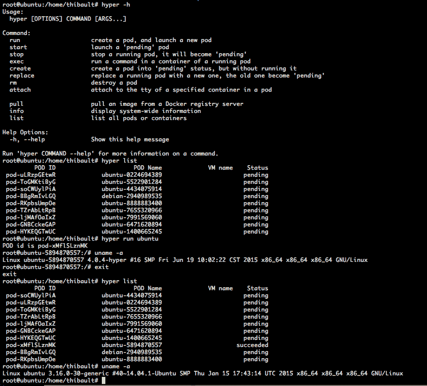
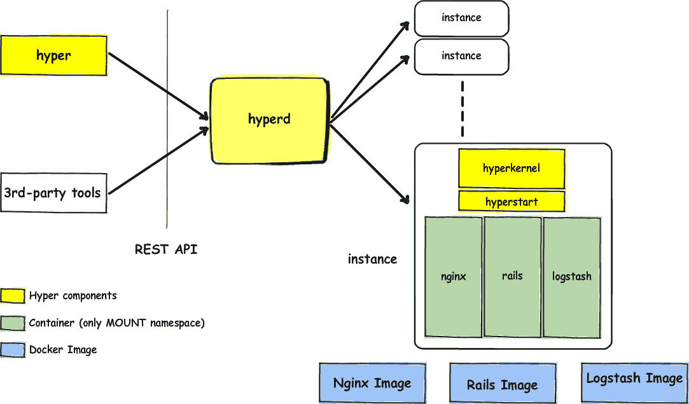
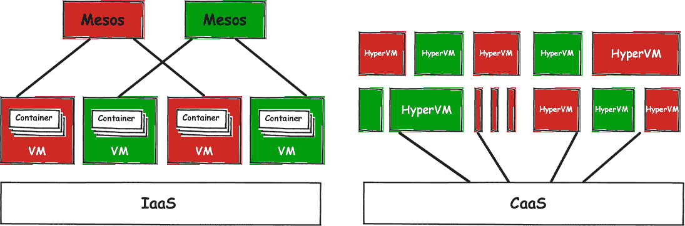

# Hyper，一个虚拟机管理程序无关的 Docker 引擎

> 原文：<https://thenewstack.io/hyper-a-hypervisor-agnostic-docker-engine/>

我们将考虑与大规模应用程序开发和管理相关的新项目的提交。超级适合这个要求。它使用 Linux 内核来调度容器，避免了初始化客户操作系统的需要。这是管理容器的一种不同方式，似乎值得解释一下。更新:作者今天联系了我们，对故事进行了一些更新，以更准确地反映 HyperD 的运作方式。上一篇:HyperD 守护进程运行在超级内核之上的虚拟机中。更新:HyperD 守护程序直接在裸机服务器上运行，以确保远程客户端和虚拟机(VM)之间的通信。

Hyper 是一个包含 Linux 内核、init 进程和管理工具的集合，它对容器进行虚拟化，以改善它们对多租户应用程序的隔离和管理。

## 【Hyper 如何工作:结合虚拟机和容器

Hyper 只做一件事:提供隔离的环境(虚拟机),可移植的环境(容器)可以在其上轻松调度。Hyper 使用共享和专用内核环境，认为这是部署多租户平台的正确方法。

Hyper 有四个组件:

### 来宾内核(超内核)

*   Hyper 的主要组成部分。超级内核是一个定制的 Linux 内核。
*   它可以由一个管理程序运行(目前是 KVM 和 Xen，这个列表还在增加)。
*   超内核运行 HyperStart 和 HyperD。

### 带有 REST APIs 的守护程序(HyperD)

*   HyperD 守护程序直接在裸机服务器上运行，以确保远程客户端和虚拟机(VM)之间的通信。
*   HyperD 能够与 HyperStart 和 Hyper CLI 通信。

### 来宾初始化服务(HyperStart)

*   HyperStart 是一个加载在 init RAM 文件系统(initramfs)中的微型 init 服务，由超级内核启动。
*   它启动 Docker 图像。

### CLI(超级)

*   Hyper 通过使用提供的 REST API 与 HyperD 守护进程通信来调度容器。
*   Hyper 直接在虚拟化的 Linux 内核上调度容器，消除了对客户操作系统、其配置及其带来的所有沉重组件的需要。

## Hyper 的方法

性能下降通常与虚拟机有关。以下是一些原因:

*   根据定义，模拟硬件比裸机硬件慢，因为虚拟机管理程序需要将指令从模拟硬件“翻译”到真实硬件(CPU、RAM、硬盘驱动器等)。).
*   虚拟机启动时需要初始化来宾操作系统，想想启动一台机器需要多长时间。
*   来宾操作系统加载的后台进程会消耗资源。

Hyper 带来了一种不同的方法:

*   虚拟机管理程序比过去强大得多，内核是“虚拟化优化的”，硬件虚拟化是“ [”硬件辅助虚拟化](https://www.google.com/url?q=https%3A%2F%2Fen.wikipedia.org%2Fwiki%2FX86_virtualization%23Hardware-assisted_virtualization&sa=D&sntz=1&usg=AFQjCNE7OX_p6iUQVQunIHdgJIWiUuu9og) ”(即，英特尔 VT-x 允许客户操作系统直接访问 CPU)。由硬件仿真引起的性能损失是有限的，在某些情况下可以忽略不计。问题出在别的地方:软件。
*   通过使用 Linux 内核来调度容器，Hyper 避免了初始化客户操作系统。Linux 内核的加载很轻，不到半秒钟就能启动。
*   HyperD 直接调度容器；因此，没有额外的进程正在运行(严格来说是最少的)，从而避免了资源消耗。

## Hyper 的打火方式

部署容器即服务(CaaS)平台并不简单。虽然容器的隔离还没有遇到严重的问题，但是在同一个内核上运行数百(甚至数千或数百万)个容器听起来确实很可怕。在多租户应用程序的情况下，需要第二级隔离。

一种典型的方法是构建一个混合解决方案，既有虚拟机又有容器。工作流程如下:

首先，作为用户，您必须构建一个虚拟机集群来运行您的容器。然后，用一个调度器(Mesos 加马拉松，Swarm 等。)，您可以在集群中调度容器。

Hyper 为建筑过程和工作流程提出了一种更轻松的方式:

### 

### 更容易管理

通过消除来宾操作系统的存在，并保持 HyperD 与 Linux 内核紧密相关，容器可以直接在虚拟化内核旁边调度。这组在虚拟机内调度的容器遵循[pod](https://www.google.com/url?q=https%3A%2F%2Fdocs.hyper.sh%2Fget_started%2Fpod.html&sa=D&sntz=1&usg=AFQjCNGjYS1pgXnhecVzmpeU3Z_de65QnA)的原则。消除来宾操作系统的存在表明需要构建一个虚拟机集群，因此需要配置一个“来宾操作系统”

### 性能

Hyper 的性能比虚拟机更接近本机容器。

初始化一个 pod 需要不到半秒钟的时间，并且正在运行的进程是非常被动的。在标准(英特尔至强四核、32GB 内存、400GB 固态硬盘、Ubuntu 14.04 x64)服务器上，性能测量如下:

### Pod 启动时间

运行一个新的 pod 只需要 336 毫秒。

### Pod 中的内存使用量

当使用最小启动内存启动一个 pod 时，一个正在运行的 pod 中会有 9 MB 剩余的空闲内存，因为 HyperKernel 只占用 11 MB 内存。

### CPU 性能

资源分配:2 个 CPU，2048 GB 内存。

下表是 sysbench CPU 性能测试的结果。Hyper 中的 CPU 性能非常接近主机操作系统。

更多详情可以访问 Hyper 的  [演出页面](https://www.google.com/url?q=https%3A%2F%2Fdocs.hyper.sh%2Fperformance.html&sa=D&sntz=1&usg=AFQjCNHLcLY_kZTn7lRxi2SGDVcLIaKAgw) 。

### 最佳安全性

通过提出第二级隔离，使用 Hyper 构建的平台确保了比裸机容器解决方案更高级别的安全性。

## 虚拟化容器…但是，为什么呢？

容器不是虚拟机。是的，容器是主机操作系统中的隔离环境，共享相同的内核和资源。但是内核本身执行容器的隔离。虚拟机也是隔离的环境，但它们在虚拟化硬件上运行自己的操作系统。

主要区别在于容器依赖于主机的内核，而虚拟机依赖于虚拟机管理程序，虚拟机管理程序运行自己的内核。

### 共享内核与专用内核

在 Linux 操作系统中，内核是系统的一部分，它管理驱动程序和库，然后创建硬件和软件之间的通信。

在多个隔离的环境之间共享同一个内核，实际上是在来宾环境中的上下文切换，而不是适当的虚拟化。Linux 内核，通过类似于  [名称空间](https://www.google.com/url?q=http%3A%2F%2Fman7.org%2Flinux%2Fman-pages%2Fman7%2Fnamespaces.7.html&sa=D&sntz=1&usg=AFQjCNF1Q-LghTaLNriC1Zh6T2kp7q0rBw) 和  [cgroups](https://www.google.com/url?q=https%3A%2F%2Fwww.kernel.org%2Fdoc%2FDocumentation%2Fcgroups%2Fcgroups.txt&sa=D&sntz=1&usg=AFQjCNGAUtV7EN8hdLh9SrXqlt2iQSddZA) ，这样的特性，无形中隔离了一组进程和库，并赋予了对主机硬件的直接访问。创建的环境——由内核直接管理——具有不改变性能的优势。

另一方面，专用内核环境需要  [管理程序](https://www.google.com/url?q=https%3A%2F%2Fen.wikipedia.org%2Fwiki%2FHypervisor&sa=D&sntz=1&usg=AFQjCNFzStcH-mj2U-1f_1k-hJ3G_bSODQ) 来运行。管理程序负责模拟硬件，以便运行一个客户操作系统，该系统由一个专用内核和一组工具和库组成。由于硬件虚拟化，使用专用内核的环境通常会出现性能下降。但是它们有一个很大的优势:它们提供了更好的隔离。

### 容器格式

我们讨论过容器是共享相同内核的“虚拟环境”。但是容器不仅仅如此。今天，容器由  [图片](https://www.google.com/url?q=https%3A%2F%2Fdocs.docker.com%2Fuserguide%2Fdockerimages%2F&sa=D&sntz=1&usg=AFQjCNGph7WwPZCwv8HF7PuZj3GJ2vn01Q) 提供。这些图像是 Hyper 的本质。“虚拟化容器”背后的想法是提供高度隔离的环境来运行高度可移植的容器。它们是分发高度可移植的应用程序的新方法，并且已经被一些人认为是新的包管理系统。

Docker 是新堆栈的赞助商。

专题图片:[默罕默德·苏丹](https://www.flickr.com/photos/mralsultan/)的《[试图尽快找到你……尽快](https://www.flickr.com/photos/mralsultan/3579132008/in/photolist-6sgZfy-8xrCmy-6DfEHh-dB22EZ-5tWu3y-9dUQkw-sgU2d4-3nbnzX-5ikFKB-7JreyG-2ojA8h-7gpxDj-nz2Pv5-5vSzB1-7abZW9-3fF6HV-bkRtyp-8vBW8X-6Ftxea-8DDnkP-nvBRCq-3bUvm7-8vBW9D-7QffZN-4zExYe-pvTJXY-aYXzNz-o51tbH-a2iA6W-9enQPC-bhuWhD-dpPYN5-58nHNW-7zzitS-NvRUK-i8QTdU-4KmTZ7-ekBTR1-6edFYV-bWDHha-9gub9D-9gub74-Hp82w-ca22iy-ihw43N-9QL1sd-9yuX22-6p7pNb-9gxgfQ-9zrYy7)》由 2.0 授权 [CC。](https://creativecommons.org/licenses/by/2.0/)

<svg xmlns:xlink="http://www.w3.org/1999/xlink" viewBox="0 0 68 31" version="1.1"><title>Group</title> <desc>Created with Sketch.</desc></svg>