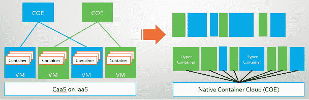
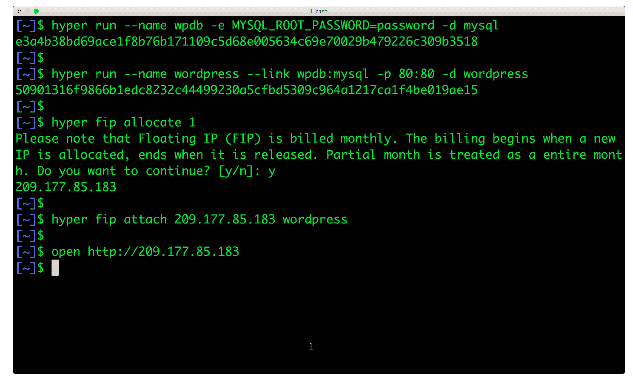
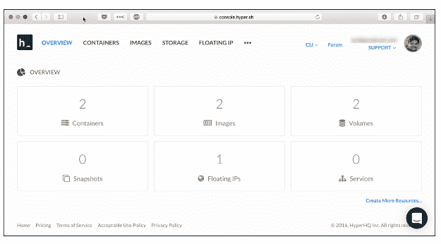

# hyper Docker 的做法正确吗

> 原文：<https://thenewstack.io/hyper-docker-done-right-way/>

最近，我偶然发现了一个名为 Hyper 的新的容器即服务(CaaS)产品。注册并安装了他们的 CLI 后，我喜欢管理容器化应用程序的整体工作流程。在容器方面做了大量工作后，我觉得 Hyper 做对了很多事情。在某种程度上，这就是 Docker 最初应该被设计的样子。

首先，Hyper 不是 Docker 的替代品。它使用从 [Docker Hub](https://hub.docker.com/) 获取的 Docker 图像。但是最吸引人的是你启动容器的方式，而不需要启动 VM 来托管容器。

几乎每个 CaaS 都处理集群的创建。Hyper 让您[专注于容器](https://thenewstack.io/hyper-sh-mixes-containers-hypervisors-something-called-hypernetes/)，而不用担心集群的大小和配置。换句话说，Hyper 正试图对容器做 Amazon EC2 对服务器做的事情。如果 EC2 是 IaaS，Hyper 就是真正的 CaaS。

那么，Hyper 与其他产品有什么不同呢？从技术上讲，Hyper 用 hypervisor 替代了容器运行时。它公开的 Docker 兼容 API 直接与管理程序对话，而不是与运行在主机中的容器引擎对话。这听起来类似于 VMware 和微软试图采用的基于虚拟机管理程序的容器化策略。Hyper 的关键区别在于容器不在主机内核上运行。相反，每个容器都有自己独立的客户内核。使用这种方法，内部运行的应用程序与主机和其他容器完全隔离。

Hyper 背后的核心技术是一个名为 [HyperContainer](https://github.com/hyperhq/hyperd) 的开源项目，这是一项独立于虚拟机管理程序的技术，可以直接在底层虚拟机管理程序上运行 Docker 映像。HyperContainer 的官方文档将其定义为 hypervisor、内核和 Docker 映像的组合。HyperContainer 目前运行在 [KVM](http://www.linux-kvm.org/page/Main_Page) 、 [QEMU](http://wiki.qemu.org/Main_Page) 和 [Xen](https://www.xenproject.org/) 上。对其他虚拟机管理程序的支持正在酝酿中。

几乎任何在云环境中运行的工作负载都需要一些原语，如公共 IP 地址、持久存储、基本日志记录和监控。甚至一个简单的 WordPress 博客或 Drupal 网站也依赖于这些核心特性。在 IaaS 中部署的生产环境中启动容器化工作负载从虚拟机、数据块存储、虚拟 IPs 和监控开始。管理员和开发人员需要管理主机和容器。Hyper 以有效的方式处理这个工作流程。

由于无需管理主机和虚拟机，容器直接从 Docker Hub 启动。它们可以安装在基于固态硬盘的永久块存储上。每个容器可以与一个公共 IP 相关联。可以配置安全组来允许或限制流量。卷支持用于时间点备份任务的实时快照。

与传统的每小时或每分钟计费相比，客户是按秒计费的。

我想通过启动一个 WordPress 应用程序来尝试一下 Hyper。下面是我运行的命令的截图。

MySQL 和 WordPress 容器都有一个 SSD 磁盘支持，当它们启动时会自动挂载。每个用户帐户都有一个基于虚拟专用网的独立子网。Hyper 不向客户收取网络流量和带宽费用。

不到四分钟，我就有了一个可以公开访问的 WordPress 站点，可以进行配置了。很明显 Hyper 使用了 Docker 工作流。这也是我立刻迷上它的原因之一。此工作流程在技术上与在 VPC 的公共子网内启动 CoreOS EC2 实例相同，该子网由 SSD EBS 卷和弹性 IP 提供支持。

Hyper 有一个用于启动和管理容器化工作负载的简单控制面板。

对于运行多容器应用程序和微服务，Hyper 与 [Docker Compose](https://docs.docker.com/compose/) 文件兼容。我在 Hyper 上运行了著名的 [Docker 投票样本](https://github.com/docker/example-voting-app)应用程序，没有做任何修改。

当运行多个同质容器副本时，用户可以创建一个服务，该服务是将流量路由到所有符合特定标准的容器的抽象。这个功能给了我一个提示，Hyper 可能在幕后运行 Kubernetes。

Hyper 立即吸引了两类受众:熟悉 PaaS 的开发人员和使用虚拟专用服务器(VPS)服务的管理员。

虽然 Docker 在容器民主化方面做得非常出色，但是 Dev 和 Ops 之间的差距仍然很大。Docker 最近的一些投资，如微软 Windows 和 Mac 的原生引擎，使容器离开发者更近了。但是在开发环境中管理容器所涉及的工作流与在生产环境中管理容器有很大的不同。

Hyper 的独特之处在于保留了 Docker 定义的工作流。过去使用 PaaS 的开发者，熟悉 Docker 的会马上与之对接。他们会在源代码上触发 Docker build 命令，推送到 Docker Hub，然后切换到 Hyper，在公有云中启动同样的应用。这个工作流给开发者带来了类似 PaaS 的体验。

使用像 Linode 和 [DigitalOcean](https://www.digitalocean.com/) 这样的 VP 的系统管理员会发现 Hyper 有很多相似之处。即使他们过去没有使用过容器，他们也会觉得工作流很熟悉。

Hyper 将支持构建连接多个环境的复杂 CI/CD 管道的新场景。它与 Docker API 和 CLI 的兼容性将使轻松扩展用于管理复杂构建过程的 [DevOps](/category/devops/) 工具链成为可能。

Kubernetes、Marathon 和 Swarm 等成熟的容器编排引擎旨在管理生产中运行的大型基于微服务的应用程序。但并不是每个工作负载都需要 web 级容器平台的规模和可靠性。对于他们来说，Hyper 提供了一种简单、直观的方式来运行生产中的容器化应用程序。

亚马逊、谷歌、微软等超大规模云提供商将继续投资容器和 CaaS。但与 Hyper 的用户相比，他们的目标受众非常不同。虽然在这些公共云上有大量投资的企业将更喜欢使用它们提供的容器管理平台，但开发人员、系统管理员和企业将使用 Hyper。

CaaS 市场的竞争正在升温。我们将看到针对不同用例、场景和用户的各种产品。

<svg xmlns:xlink="http://www.w3.org/1999/xlink" viewBox="0 0 68 31" version="1.1"><title>Group</title> <desc>Created with Sketch.</desc></svg>