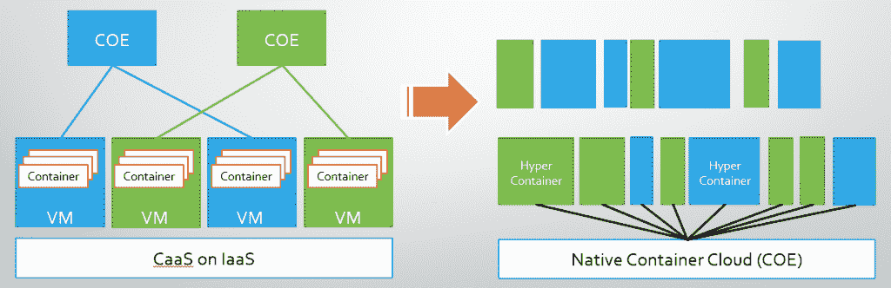

# Hyper.sh 混合了容器、管理程序和一种叫做“Hypernetes”的东西

> 原文：<https://thenewstack.io/hyper-sh-mixes-containers-hypervisors-something-called-hypernetes/>

一种被称为 Hyper.sh 或简称为“Hyper”(以前叫 HyperHQ，不要与微软的 Hyper-V 混淆)的新集装箱技术可能会改变集装箱化的进程。与最终成为 Docker 的 dotCloud 一样，Hyper 是一种容器化的工作负载部署和托管服务。这是一个自称为“CaaS”(容器即服务)的 PaaS。它的基础设施是完全开源的，并且发布在 GitHub 上。

像 Docker 一样，Hyper 目前支持开放容器倡议标准格式的容器，据 [CRI-O](https://github.com/kubernetes-incubator/cri-o) 项目的贡献者称——该项目的目标是为 Kubernetes 开发一个独立的、只运行的容器引擎——[Hyper 的工程师已经成为关键贡献者](https://thenewstack.io/cri-o-make-kubernetes-center-container-ecosystem/)。通过参与 OCI 和最近的 CRI-O 项目，Hyper 慢慢地、反复地获得了 Red Hat、Google 和 CoreOS 的关注，他们都承认了它的贡献。

> “虚拟机的问题不在于虚拟化；问题是机器。它总是试图模拟整个机器，”—赵彭，首席执行官，Hyper.sh

正如 dotCloud 平台背后的技术真正革新了数据中心一样，Hyper 背后的技术可能会改变集装箱化的进程。像 VMware 的 VIC 一样，Hyper 不会取代 Docker 或 CoreOS 容器引擎。但是它会改变容器运行时，以一种与 OCI 兼容的方式改变它。这种改变的结果是一个真正的虚拟机，兼容 [KVM](http://www.linux-kvm.org/page/Main_Page) 或 [Xen](http://xenserver.org/) 。

## 等式的其余部分

去年，Hyper 平台作为一种“让虚拟机像容器一样运行”的方式向世界推出了自己。这种措辞导致了对其目的的一些令人遗憾的误解。Hyper 不是一种将 VMware 风格的虚拟机扩展到容器环境中的方法，尽管共存可能是其目标之一。

Hyper.sh 的首席执行官赵彭可能太谦虚了，不敢自称为 Hyper 之父——所以我们会这样称呼他。在接受新堆栈的采访时，赵仔细解释了 Hyper 的工作方式和原因。

“就其理念而言，Docker 最大、最具独创性的部分，”赵告诉我们，“它实际上让我们从将应用程序视为服务器或机器的角度，转向以应用程序为中心的角度。

“虚拟机的问题不在于虚拟化；问题是机器。它总是试图模拟整个机器。你得到成熟的 Linux 或 Windows 你模拟了所有的硬盘和设备。但就云托管或服务而言，你不需要所有这些东西，”赵说。

超级容器的核心是它的运行时。名为 **runV** ，它是 OCI runC 容器运行时的[的变体，产生一个可由 KVM 或 Xen 虚拟机管理程序管理的微型虚拟机。赵说，因为与兼容，Docker 自己的命令行界面可以控制的 runV。如果您认为容器环境缺少一个 hypervisor，因此在设计上是不完整的，那么 **runV** 会完成它。](https://runc.io/)

“任何人都可以使用 runV 在其基础设施中运行安全容器，”他补充说，并指出这个小管理程序已经获得了中国主要网络设备制造商华为的支持。他还告诉我们，IBM 正在将 Hyper 用于其自己的虚拟机管理程序驱动的 Docker 系统(IBM 在两年前首次展示了这一系统作为概念验证)。这些不仅仅是 x86 服务器，还有 [System z](http://www-03.ibm.com/systems/z/) 大型机。

## 低温学

从容器引擎的角度来看，超级容器只是另一个容器。由于 **runV** 的行为与 **runC** 完全一样，引擎察觉不到任何差异。引擎不知道或者不必知道的是，Hyper 通过首先创建一个*微型 VM* ，然后将 Docker 容器映像注入其内存空间来实例化映像。虽然可以说该图像可能来自容器存储库，但是在 Hyper.sh 平台的上下文中，该图像只是一个文件。

一旦注入到微型虚拟机中，容器映像就与 Linux 内核共享空间。“虚拟机中没有传统的客户操作系统，”赵说。“虚拟机中没有 CentOS 或 Ubuntu，甚至没有 CoreOS，只有一个来宾内核。”

这个访客内核不是容器通常使用的内核。它实际上比小型化的 CoreOS 还要小，功能更少。他将这个组件描述为 Hyper 的“秘密调味汁”(作为一个开源组件被允许的秘密)。

尽管 micro-VM 是为了与现有的开源管理程序兼容而设计的，但 Hyper.sh 平台以自己独特的方式实例化了它们。赵描述了他所谓的 KVM VM fork，其目的是实现非常快速的可伸缩性。在这里，客户内核的主要功能变得更加清晰。

“我们在主机中有一个冻结的 Hyper VM 来宾内核，而不是从头启动每个单独的 Hyper VM，”他解释道。“因此，当您尝试启动新的超级虚拟机时，我们只需转移冻结的虚拟机并恢复它。”赵自吹自擂地说，他的平台通常在不到 20 毫秒的时间内解冻一个超级虚拟机。

## 融合爵士乐

从赵的角度来看，Docker 解决了大问题的第一部分:将虚拟工作负载压缩到可管理的规模。Hyper 解决了剩下的问题:将这些工作负载打包到一个可供世界其他地方使用的虚拟机中。

“现在，人们实际上是在 VMs 中运行他们的容器，比如 EC2 或 DigitalOcean，”他说。他认为，Linux 容器需要一个额外的隔离层来实现多租户，这是标准容器环境所不具备的(VMware [也提出了这个观点](https://thenewstack.io/context-vmwares-plan-lead-enterprises-virtualization-jungle/))。

> “但如果你能以某种方式保护运行时，你可以用安全容器代替虚拟机，作为公共基础设施的构建模块。这可以改变很多事情，”Hyper.sh 首席执行官赵彭

在 VM 环境中，虚拟机管理程序封送主机操作系统和客户机之间的所有事务。在 Hyper 中，虚拟机管理程序没有什么不同。这样，容器对托管它们的 Linux 内核的依赖性——正如一些人认为的那样，这是当今容器系统中最危险的未被利用的漏洞——被消除了。

Docker 的流行带来了将工作负载编排为可互操作组件的愿景，而不是管理支持真实应用程序的虚假网络。但是在解决这个问题的过程中，Docker 创造了一个新的问题——一个关于谁或者什么负责每个过程的两难问题，这个问题一度威胁着[将容器化开发者的社区](https://thenewstack.io/coalition-for-app-container-spec-shows-docker-is-not-the-standard-for-everyone/)分裂成碎片。

现在，整个 systemd 的争论——分裂集装箱化社区的挥之不去的楔子之一，几个月前激起了[关于可能的 Docker fork](https://thenewstack.io/docker-fork-talk-split-now-table/) 的谈论——可能会变得毫无意义。

由现有虚拟机管理程序管理的超级容器还可能重新引入许多容器环境中缺失的元素，这种元素的缺失阻止了当今的组织想要将它们转移到完整生产环境中:策略。将安全策略应用于容器的方式与应用于虚拟机的方式相同，这可能会消除对[所谓的*无特权容器*](https://thenewstack.io/quest-build-unprivileged-container/) 的需要，这将阻止容器在默认情况下以 root 特权运行。

在 VM 环境中被管理可能意味着容器发现它们比以前更不可伸缩。但是 Hyper 可能已经有了一个解决方案，这就是为什么这个团队一直致力于容器运行时接口项目。

赵彭称之为 Hypernetes。这是一个编排环境，融合了 Kubernetes 的代码和 OpenStack 的代码，融合了 Kubernetes 以应用为中心的观点和 Neutron 管理软件定义网络的天赋。

“展望未来，我们希望确保引擎的编排是多租户和安全的，”他告诉新堆栈。“因此，我们实际上正在开发一款名为 Hypernetes 的新产品，它是 Hyper container 加 Kubernetes 加 OpenStack 组件，就像他们的存储和软件定义的网络(SDN)组件一样。我们将使用 Hypernetes 产品将我们的容器原生云服务 Hyper.sh 部署到生产中。”

历史上有很多次，多元化的开源社区花时间准备争论，而单个的开源贡献者悄悄地解决这些争论。让历史记录下来，即使是在未来历史倾向于自我修正的时候，Hyper.sh 可能是我们谁也没有想到的最终解决方案。

CoreOS、Docker、IBM、Red Hat 是新堆栈的赞助商。

湖北省博物馆的一个中国古代*堆*容器(盛放食物)的标题图片， [Zhangmoon618](https://en.wikipedia.org/wiki/Chinese_ritual_bronzes#/media/File:Bronze_dui_vessel_with_inlaid_geometric_cloud_pattern.JPG) 拍摄，通过知识共享 3.0 获得许可。

<svg xmlns:xlink="http://www.w3.org/1999/xlink" viewBox="0 0 68 31" version="1.1"><title>Group</title> <desc>Created with Sketch.</desc></svg>