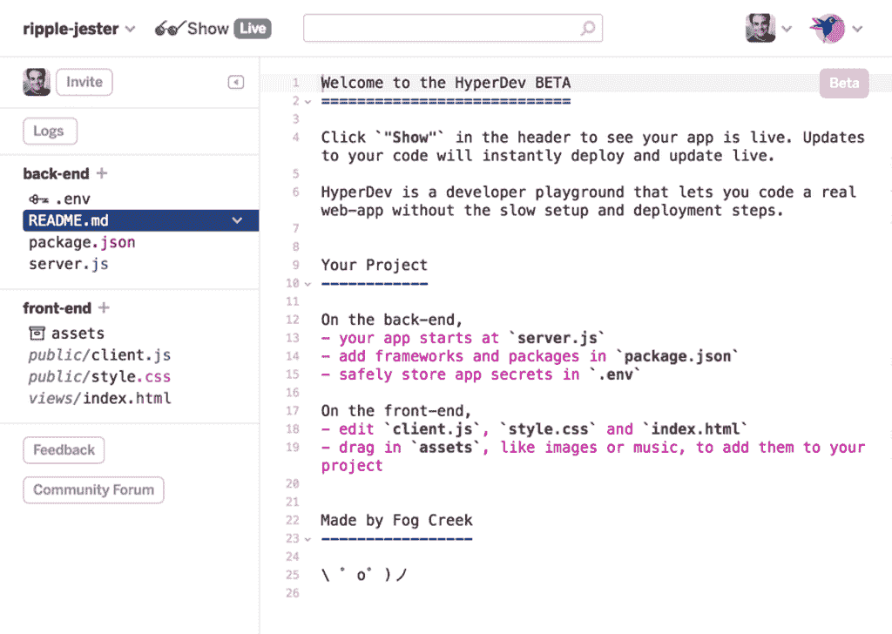
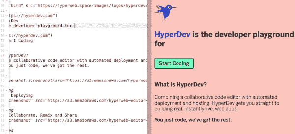

# HyperDev:Fog Creek 新的快速 Web 开发平台初探

> 原文：<https://thenewstack.io/hyperdev-first-look-hood/>

“你只是代号。它只是运行。”

作为一名新开发的 web 开发人员，front end variety，我发现这个推销很吸引人。我喜欢创建 web 应用程序的实际过程，但不太喜欢其结果。所有这些决定——FTP？克朗工作？第三方 PaaS？—调试无论你选择哪条路都不可避免的混乱。请不要让我陷入官僚主义的部署地狱。伙计，我只想编码。

现在又来了 [HyperDev](https://hyperdev.com/) ，一句标语告诉我它理解。

由 [Fog Creek Software 为您带来的 HyperDev，](https://www.fogcreek.com/)是一个开源平台，旨在为开发人员提供一站式、全栈解决方案，这些开发人员更多地将自己视为编码人员，而不是管理人员。基于 web 的平台，目前处于测试阶段，允许开发人员快速无缝地建立 Web 应用程序，而无需建立服务器堆栈…或者摆弄 SSH 密钥，或者担心 Git 和 Jenkins 在这个特定的下午是否在相互交谈，或者任何其他类似的繁琐细节。

HyperDev 将典型的 IDE(集成开发环境)工作区与专用的虚拟 Web 服务器结合起来，在您工作时实时部署变更。没有保存，没有刷新— 只是你辉煌的代码，成就了它的神奇。不仅在本地浏览器中生活，因为这有什么特别的，而且同时在互联网上生活，供任何访问 HyperDev 在用户启动新项目时自动生成的自定义 URL 的人使用。

我们谈论的也不仅仅是内容或风格的改变。不，儿子。检查“back end”文件夹，并打开驻留在其中的 server.js 文件。摆弄一下里面的 JavaScript，看看您对服务器端 JS 代码所做的更改会不会出现在 web 浏览器上(没错，就是您指向的那个定制的 HyperDev URL)。

所有这一切都发生在一瞬间:保存并上传更改，用新代码重启服务器，刷新浏览器——甚至不用按回车键(尽管第一次让 HyperDev 显示结果时，需要单击小太阳镜图标才能看到“实时显示”。此后，它保持活动状态)。没有 Git 回转，没有配置，没有对 SIGHUP 大神的祈祷。你只需修改代码，服务器就能提供服务。

谈论启动和运行。

## 现在都在一起

首先想到的是，这听起来绝对像是一场独唱。如此精简的东西怎么可能不是单一开发人员的解决方案呢？然而，HyperDev 的目标绝对是成为一个面向社区的项目空间。因此有一个闪亮的“邀请”按钮；点击这个会生成一个链接，你可以发送给同谋。当你的朋友出现在链接上时，他们在 HyperDev gates 里面，和你一起编辑同一份文档。这和 Google Docs 的工作方式是一样的:同时生产，每个人一起编写代码，或者单独处理不同的任务。

这听起来非常有效，也非常可怕。因为 HyperDev 目前没有提供任何形式的版本控制。据 [Fog Creek Software](https://www.fogcreek.com/) 联合创始人[乔尔·斯波尔斯基](https://twitter.com/spolsky)称，计划正在增加“世界上最简单的‘分支’功能，因此你可以选择同时拥有‘开发’和‘活’分支。”不过，在那之前，HyperDev 平台上的用户将在没有网络的情况下工作。虽然这个平台内置了一个令人印象深刻的弹性和深远的“撤销”功能，但这并不像一个美好的长期提交历史那样温暖舒适。

斯波尔斯基——顺便说一句，他也是 Stack Overflow 的首席执行官——坚持认为“持续合并和可靠撤销最大程度上解决了版本控制问题。”然而，他欣然承认，目前处于测试阶段的 HyperDev 是针对承担相对简单的开发项目的小团队的。“听着，这不是所有软件开发的未来，”他[在他的博客](http://www.joelonsoftware.com/items/2016/05/30.html)Joel On Software 上写道，同时介绍了该平台，并补充道，“专业的软件开发团队将继续使用专业、健壮的工具，如 Git，这很好。”

显然，HyperDev 最吸引人的资产是整个即时满足的东西——老实说，即使作为一个单一开发人员的解决方案，这也是非常棒的。Foggy Creek 希望该平台的瞬间响应能力也能为小团队提供动力。根据斯波尔斯基的说法，HyperDev 的目标是创造“一种令人疯狂上瘾的协作形式，它能提高你的团队生产力。”

显然，检验这个假设的唯一方法是在 HyperDev 上建立一个项目，让六个 web 开发人员同时处理相同的代码。这个确切的场景正在进行中；请在此处查看结果的后续报告。然而，现在让我们把注意力集中在单用户 HyperDev 体验上。

乍一看，HyperDev 和其他 ide 没有太大区别。GUI 被剥离，除了 Fog Creek 开发团队对表情符号的明显喜爱之外，没有任何无关的东西。到目前为止，唯一可用的用户选项是在深色和浅色主题之间切换的能力。直螺母和螺栓很好，这使得开始编写代码更加容易。将资产或代码块拖放到适当的文件夹中。该容器是一个运行 Node.js 的通用 VM，所以你可以简单地通过编辑 package.json 来添加任何你想要的包。从 [Stack Overflow](http://www.stackoverflow.com) 中剪切并粘贴任何你喜欢的 JS——不会有任何问题。您可以从 [GitHub](https://www.github.com) 导出或导入。

(尽管目前的测试版是公开和开源的，但 HyperDev 确实包含一个“秘密”。用于存储专有机密和配置变量的 env 文件夹，只有被邀请的合作者能够看到)。

尽管如此，Hyperdev 在功能上与 CodePen 并没有实质性的区别，除了那种甜蜜的即时在线状态。这确实是个大问题。

例子:我的 HyperDev 测试驱动包括为一个客户端项目构建一个快速原型站点。一旦主要部分就绪，我就可以邀请他通过 HyperDev 生成的 URL 进行远程查看。当我们为主产品页面迭代几个不同的功能可能性时，客户在现场观看。他能够在现场看到什么最有效，他喜欢什么，决策是如何制定的——项目就这样向前推进了。没有无休止的会议或电子邮件链。

这是一个直线式的开发人员→客户场景，但是考虑一下在大型基础设施环境中应用的同样的敏捷性。快速原型化对现有应用程序的更改或添加，同时接收几乎实时的反馈，这种能力具有巨大的潜在价值。没有连接到数据库，没有持久性，只是纯粹的实验:这可行吗，用户怎么想？HyperDev 开发主管 Daniel Moore 表示，这是该平台最引人注目的优势之一。

“你制造的东西和真正想要的或有用的东西并不总是一样的，”摩尔在最近的[新播客](https://thenewstack.io/agility-at-scale/)中解释道。“当你可以在一个小时内完成原型并投入使用时，如果你有这个快速版本，并且看到人们甚至不会说点击动作按钮，你可能会节省几个月的生产时间。”

尽管 HyperDev 的公司和企业版本仍在开发中，但 Moore 认为大型、复杂的组织——不断面临将大型基础设施的无数移动部分整合在一起的挑战——是该平台的理想目标市场。即使他们还不知道。“有时候你只需要一点胶水就能把它们抹平，”摩尔说。“HyperDev 就是那种胶水。”

换句话说，HyperDev 是关于敏捷性的——或者，正如他所说的，“快速迭代”你做出改变，你在世界上得到一些东西，你从世界上得到实时反馈，然后利用这些数据推动项目前进。起泡，冲洗，重复。

不得不说，这对我很有效。

请继续关注 HyperDev 的后续表现，届时我们将在小组黑客马拉松中测试该平台。

专题图片:布鲁克林大桥，由亚历山大·罗特克拍摄，[通过](https://hd.unsplash.com/photo-1467521335787-2f0fc0f0e9a0) Unsplash。

<svg xmlns:xlink="http://www.w3.org/1999/xlink" viewBox="0 0 68 31" version="1.1"><title>Group</title> <desc>Created with Sketch.</desc></svg>