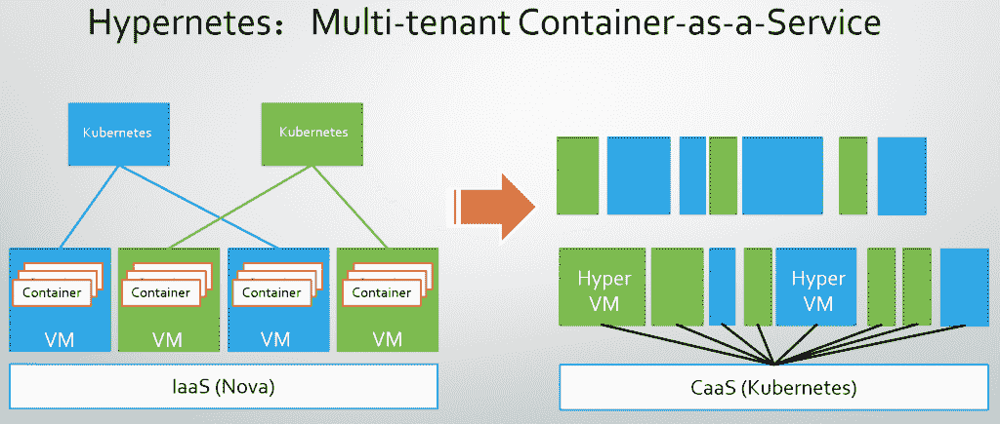
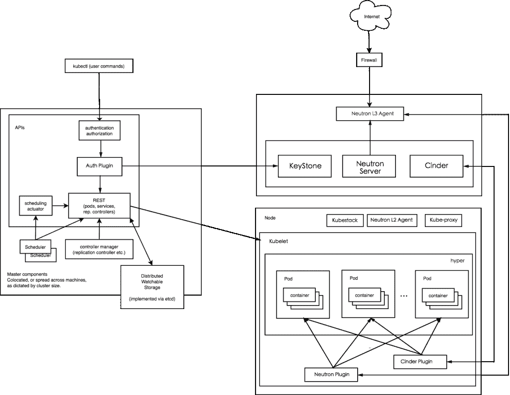

# Hypernetes 如何为微服务架构带来多租户

> 原文：<https://thenewstack.io/hypernetes-brings-multi-tenancy-microservices/>

编者按:以下是 Thibault Bronchain 的投稿，他是

[Hypernetes](http://hypernetes.com)

，它解释了这个用于运行安全的多租户 Docker 容器的开源软件是如何基于

[Hyper](http://hypernetes.com)

基于虚拟机管理程序的 Docker 引擎。

微服务是一种架构，其中应用程序的每个功能彼此分离，并通过 API 和协议(通常通过 HTTP REST APIs 或 WebSockets)进行通信。它不同于单片应用程序，在单片应用程序中，应用程序的所有功能都位于同一代码中。

关于使用网络套接字和 HTTP 协议进行通信是否是最佳选择还存在争议，因为它们很容易成为某些体系结构的瓶颈。然而，如果设计得当，微服务会带来一些不可忽视的优势:

*   易于开发:一旦设计完成，每个特性就可以明显地相互分离，帮助开发团队专注于他们的工作，而不受其他部分的影响
*   灵活扩展:说到扩展，微服务表现出了真正的实力。在单片基础设施中，每当需要更好的性能时，就会启动一个完整应用的新“实例”,从理论上来说，使能力加倍。实际上，这就像当你需要一个额外的房间时，你又买了一栋一模一样的房子。借助微服务，可以只扩展需要扩展的部分，从而优化基础架构的成本和总体效率。

## 集装箱是对的

设计微服务架构的第一步是将整个架构的每个组件或角色分成独立的小块。

Docker 之类的容器可以在许多方面提供帮助:

*   从哲学上讲，通过将应用程序的每个组件分离到不同的容器中。
*   实际上，通过将这些组件及其必要的库打包成易于发布的包:容器映像。

尽管 Docker 容器有很多优点，但它们的运行时执行架构有一个安全弱点。Docker 容器的执行依赖于 [runc](https://runc.io/) (原 *libcontainer* ，原 [LXC](https://linuxcontainers.org/) )，是一套围绕 Linux 内核隔离技术(cgroup，namespaces…)的绑定和优化。它们为许多应用程序提供了很好的隔离，但是，在多租户环境中，它们是一个有风险的选择。同一主机上的所有容器与该主机共享相同的 Linux 内核，这首先扩大了可能的攻击面，但也将运行的应用程序限制到一个公共的唯一内核。

换句话说，正如我们所知，Docker 容器是很好的微服务打包解决方案，但是，它们缺乏针对多租户环境的关键运行时特性。

## 多重租赁

如果我们严格关注隔离部分，有两种方法可以确保基于多租户容器的基础设施具有更好的安全性。

*   我们自己提供经过岩石测试的容器；创建一个 PaaS，用户可以通过提供源代码来部署他们的应用程序。这就是 Heroku 使用的方法。在这种情况下，由于用户没有运行时的访问权限，安全漏洞和问题的风险会有所降低。然而，如果运行时环境受到损害，特权升级风险仍然存在。此外，从用户的角度来看，限制可用运行时的选择意味着限制和最终约束。
*   为了让任何用户在没有任何控制的情况下部署他们自己的容器，有必要提供一个真正的底层隔离环境。我们可以在 Google Container Engine 或 AWS ECS 中看到的一种常见方法是让每个用户构建自己的虚拟机集群，在调度器的帮助下可以在其上调度容器( [Kubernetes](http://kubernetes.io/) 、 [Mesos](http://mesos.apache.org/) 、 [Swarm](https://docs.docker.com/swarm/) )。

这里的问题——尤其是第二个选项——是关于扩展的。如今的集群由完全相同的虚拟机组成，可按需扩展和缩减。然而，这种方法可能会导致微服务优势之一的丧失:灵活的伸缩性。在当前的集群方法中，每台机器都必须满足最“昂贵”的容器(存储、内存、CPU)的要求。这样做，为需要更多 RAM 的容器提供一台新机器会导致存储的浪费，为数据库容器提供一台机器会导致计算资源的浪费，等等。否则，您可能必须根据容器大小创建虚拟机(数据库容器的数据库实例，缓存容器的缓存实例，等等。)，并确保调度程序将适当的容器放在适当的虚拟机上。然后你会面临这样的问题:“为什么我需要这个调度程序？”

此外，如果我们看一下定制部分，我们会发现没有真正灵活的解决方案来为您的容器定义或调整特定的内核版本。这在一些应用程序中可能是一个真正的缺点(如[网络功能虚拟化](https://thenewstack.io/de-ossify-the-network-with-function-virtualization/))，在这些应用程序中，新技术和成熟技术不断相互混合。

## Hypernetes:多租户 Kubernetes 发行版

为了解决这一困境，我们构建了 [Hypernetes](http://hypernetes.com/) 作为 [Kubernetes](http://kubernetes.io/) 的发行版，后者是谷歌容器服务的容器调度程序。Kubernetes 是 Docker 容器的开源编排系统。它处理计算集群中节点的调度，并主动管理工作负载，以确保它们的状态与用户声明的意图相匹配。使用“标签”和“容器”的概念，它将组成应用程序的容器分组到逻辑单元中，以便于管理和发现。

我们相信 Kubernetes 凭借其易用性、可靠性、强大的功能和贡献者社区，将成为集装箱调度和编排的未来。

[Hypernetes](http://hypernetes.com/) 基于 Hyper，即基于虚拟机管理程序的 Docker 引擎。Hyper 允许使用任何虚拟机管理程序(KVM、Xen、Vbox、ESX)运行 Docker 映像。Hyper 与 CoreOS 等极简 Linux 发行版的不同之处在于，Hyper 运行在物理机器上，并将 Docker 映像从 metal 加载到按需创建的 VM 实例中，其中不存在来宾操作系统。Hyper 没有虚拟化一个完整的操作系统，而是在虚拟机中启动一个极简内核来托管 Docker 映像。简而言之，你的 Pod 是一个虚拟机。

通过这种方法，Hyper 能够带来一些令人鼓舞的优点:

*   300 毫秒启动一个新的 HyperVM 实例，其中包含一组 Docker 映像。
*   对于 HyperVM 实例的最小内存占用，20MB。
*   不可变的 HyperVM，只有内核+映像，充当调度的原子单元(Pod)。
*   不受 LXC 共享内核问题的影响，即被虚拟机隔离。
*   由于虚拟机管理程序的性质，可与 OpenStack 组件(如 Neutron、Cinder)无缝协作。
*   BYOK，自带内核对公共云平台来说有点强制性。

Hyper (Hyperd)直接在所有裸机上运行，可在一毫秒内配置 hyperm(带有 Docker 映像)。在虚拟机中，“Hyperstart”初始化进程在超级内核(或任何兼容的 Linux 内核)之上启动，以作为 Pod 运行 Docker 映像。Kubelet 代理运行在每个裸机主机上，并使用 Hyperd 的 API 管理 hyperm。形成的“Kubernetes”集群在“Kubernetes 主”服务器的帮助下进行管理。

Hypernetes 建筑。

我们只看到[超级网络](http://hypernetes.com/)“pod”是虚拟机(VM)。虚拟机的构造与 Linux 容器不同，而且外部设备(网络、存储等)的管理也不能像容器那样进行。

为了确保可靠和强大的网络和存储管理，Hypernetes 依赖于两个主要的 OpenStack 组件: [Cinder](https://wiki.openstack.org/wiki/Cinder) 结合 Ceph 用于存储，以及 [Neutron](https://wiki.openstack.org/wiki/Neutron) 用于网络。此外，Hypernetes 使用 [KeyStone](http://docs.openstack.org/developer/keystone/) 进行身份管理，支持多租户功能。

依赖虚拟化和 OpenStack 组件的最大优势在于它们的模块化、可靠性和互操作性。

多年来，虚拟化技术一直被用于构建可靠的系统，而[大规模部署的成功](https://www.openstack.org/user-stories/)向我们展示了其重要性。此外，通过使用 OpenStack 语言，Hypernetes 可以将现有的和已部署的 OpenStack 附件(即网络插件)与容器结合起来。换句话说:不要扔掉你当前架构的伟大部分！

正如我们之前看到的，由于非常快速的网络基础设施，微服务在部署到云中时可以发挥所有作用。Docker 图像是微服务打包的完美格式。但是对于多租户公共云，您需要在低定制 PaaS 式方法和资源开销集群化方法之间做出选择。

Hypernetes 来自于另一种方法是可能的想法。Hypernetes 允许您按照容器的方式管理虚拟机，通过根据当前需求按需配置定制的虚拟机，提供可比的配置性能和资源优化。

Hyper 和 [Hypernetes](http://hypernetes.com/) 是开源的，我们热烈欢迎在我们的 [GitHub](https://github.com/hyperhq) 上的贡献，以及在我们的 Slack 社区上的讨论。

<svg xmlns:xlink="http://www.w3.org/1999/xlink" viewBox="0 0 68 31" version="1.1"><title>Group</title> <desc>Created with Sketch.</desc></svg>