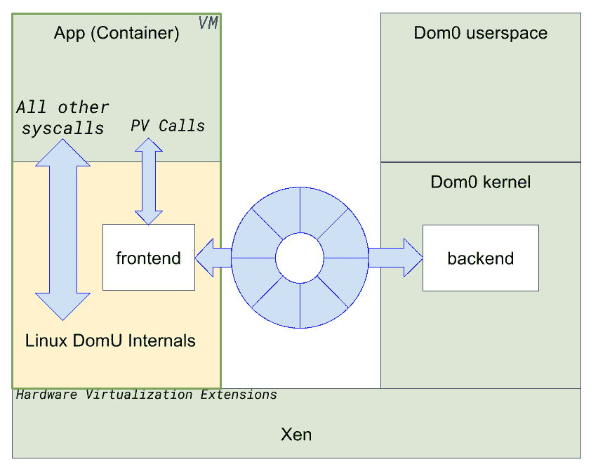

# 基于虚拟机管理程序的容器的威力

> 原文：<https://thenewstack.io/hypervisors-container-era/>

[Stefano Stabellini](https://www.aporeto.com)

[Stefano Stabellini 在 Aporeto 担任虚拟化专家和 Linux 内核主管，apore to 是一家由风投资助的湾区早期初创企业。此前，作为 Citrix 的高级首席软件工程师，他领导着一个由热情的工程师组成的小组从事开源项目。Stefano 从 2007 年开始参与 Xen 开发。他在 2009 年 11 月创建了 libxenlight，并在 2011 年启动了 Xen port 来武装虚拟化扩展。现在，他是 Xen 项目的提交者，负责维护 ARM 上的 Xen 以及 Linux 和 QEMU 中的 Xen 支持。](https://www.aporeto.com)

云原生应用的现代趋势似乎是要用漫长的缓慢死亡来杀死虚拟机管理程序。矛盾的是，正是虚拟机管理程序和基础架构即服务在过去 15 年中的巨大成功促成了这一趋势。虚拟机管理程序引入了一些工具，允许系统管理员和开发人员高效地为每个应用部署一台(虚拟)服务器。web 服务器、中间件和数据库是整个行业的常见做法，它们都有自己独立的虚拟机。

云原生应用只是向前迈出的自然一步。用户不再考虑虚拟机和 Linux 发行版(认为它们是理所当然的)，开始关注对他们来说重要的东西:云应用程序。像 Google 这样的大型技术公司很快意识到，随着 Linux 内核的成熟，容器可以提供显著的应用程序部署和性能优势。Docker 通过在正确的时间提供正确的工具和正确的命令行界面普及了这一概念。

> Linux 容器向每个应用程序公开完整的 Linux 系统调用接口。

Docker 最大的创新是一个简单的框架，允许在驱动程序、名称空间和 Linux 内核细节的复杂基础设施上高效地打包、分发和执行应用程序，没有开发人员想了解这些细节。所有这些功能都是 Linux 基础设施的一部分已经有一段时间了，但是如果不深入了解所有细节，就没有一种统一的方式来使用它们。Docker 把复杂的东西抽象成简单的东西；本身就是一门艺术。

更重要的是，Docker 的应用程序打包技术极大地简化了应用程序开发人员一直苦苦挣扎的依赖“地狱”。某种程度上是静态二进制的报复。Docker 提供了一种简单的机制，将所有应用程序依赖项打包到一个二进制文件中。开发人员可以不用担心库的不兼容性了。不可变的基础设施，即用新的映像代替软件而不是进行升级的概念，变得可行。应用程序的最终状态总是可以被很好地定义、了解和测试。

Docker 使用 Linux 名称空间(也称为容器)来执行以新格式打包的应用程序。在这个模型中，所有应用程序都运行在同一个 Linux 内核上，该内核负责隔离和资源管理。然而，容器只是运行云原生应用的一种方式。

## 容器时代的虚拟机管理程序

英特尔的 [Clear Containers](https://thenewstack.io/securing-containers-intels-clear-containers/) ，Hyper 的 RunV 和 VMware 的[VSP here Integrated Containers](https://blogs.vmware.com/vsphere/2015/10/vsphere-integrated-containers-technology-walkthrough.html)(VIC)都是基于虚拟机管理程序的[开放容器计划](https://www.opencontainers.org/) (OCI) [运行时规范](https://github.com/opencontainers/runtime-spec)的实现。它们实现了更高的隔离，同时保持了应用程序打包和不可变基础设施的优势。这些技术能够使用 KVM、Xen 和 ESXi 等现有虚拟机管理程序来执行云原生应用。他们为每个应用程序实例创建一个全新的虚拟机。

虚拟机管理程序利用当前处理器上可用的硬件功能，以更少的攻击面提供更强的隔离。英特尔 [VT-x/VT-d](https://www.thomas-krenn.com/en/wiki/Overview_of_the_Intel_VT_Virtualization_Features) 和 [AMD-V](https://www.techopedia.com/definition/4786/amd-virtualization-amd-v) 等技术为强大的工作负载分离提供了硬件支持。此外，由于虚拟机管理程序往往比操作系统更小，因此受漏洞的影响更少。

相反，Linux 容器向每个应用程序公开了完整的 Linux 系统调用接口:如此大的攻击面很难保护。这是可以做到的，但这是一项具有挑战性的任务，需要对内部运行的应用程序有详细的了解。这从来都不是防弹的。就在最近，一个常见的 Linux 内核漏洞，例如 [Dirty Cow](https://www.aporeto.com/dirty-cow-story-privilege-escalation-vulnerability/) ，被一个恶意应用程序从一个容器中利用来进行权限提升。

## 基于虚拟机管理程序的容器的挑战

虚拟机管理程序确实有成本:它们引入了潜在的性能瓶颈，尤其是在 IO 功能(网络、存储)上，并且有更大的内存占用，因为每个容器都需要自己的内核实例。此外，基于虚拟机管理程序的容器部署通常因无法在公共云上运行而受到影响。例如，它们不能在亚马逊 AWS 或谷歌谷歌云平台上使用，因为它们需要硬件虚拟化支持，而这在公共云虚拟机上不可用。

这些权衡为我们提供了一个选择，一方面是方便和灵活，另一方面是隔离和安全。我们不应该做出这样的选择。是时候重新思考导致这一困境的一些基本假设了。

## 基于虚拟机管理程序的容器的重新审视和新方法

X86 虚拟机管理程序旨在满足一个关键要求:在同一台机器上运行多个操作系统。为了实现这个目标，他们创建了一个“硬件抽象层”客户操作系统通常无法区分裸机和虚拟机。硬件接口小而安全，但会导致开销。TCP/IP 堆栈和存储堆栈等 IO 功能在虚拟机和底层虚拟机管理程序中重复，有时会相互冲突。

如果我们放松这一主要要求，如果我们考虑多个云原生应用，而不是多个操作系统，我们就有机会重新审视一些核心虚拟机管理程序设计选择。我们可以让虚拟化适应容器时代。

[英特尔的尼克·韦弗讨论编排](https://thenewstack.simplecast.com/episodes/intels-nick-weaver-discusses-orchestration)

让我们考虑一个不向来宾呈现硬件抽象，而是使用系统调用接口的管理程序。每当应用程序与内核交互时，它都会发出一个系统调用。来宾内核可以在本地服务系统调用，或者将其代理给底层管理程序进行处理。有了这样的架构，我们不需要遍历网络栈两次，先在来宾中，再在主机中。网络连接请求直接传递给主机。同时，内存分配函数或特权调用可以被限制在客户操作系统的边界内。

系统调用级别更高，比硬件设备承载更多的上下文。它们更容易虚拟化，速度也更快。以网络堆栈为例。在传统的虚拟机管理程序模型中，虚拟机管理程序只能在发送 IP 数据包的进程中看到最少的上下文。在系统调用虚拟化模型中，hypervisor 拥有与来宾内核本身一样多的关于连接的上下文，因此它可以做出更明智的决策。一组精心选择的小型系统调用足以为运行云原生应用的虚拟机提供 IO 访问，这是现代硬件上虚拟化最高开销的原因。

在 [Xen 项目](https://www.xenproject.org/)社区中，实现这种抽象的尝试正在进行中。它被称为“[PV Calls](https://blog.xenproject.org/tag/pv-calls/)”(PV 代表“半虚拟化”)这种方法已经证明性能比传统的 Xen 项目网络快四倍。它在将虚拟机管理程序发展成高效的容器运行时方面显示出巨大的潜力。

当然，最后一块拼图是在任何地方运行云原生应用的能力，包括亚马逊 AWS 和谷歌云。有些虚拟机管理程序确实有这种能力。Xen Project hypervisor 提供了两种虚拟机:PV 和全虚拟机(HVM)。HVM 虚拟机可以利用硬件虚拟化支持，它们是当今最常部署的。按照软件标准，PV 虚拟机是古老的。它们先于硬件中的虚拟化支持；他们不用它，也不需要它。因此，它们可以在亚马逊 AWS 和其他公共云上运行。

PV Calls 和 Xen Project PV virtual machines 共同为我们提供了一个在裸机和 IaaS 上部署云原生应用的全面解决方案，该解决方案具有虚拟机的安全属性和容器的速度和灵活性。

许多人认为，如果一项技术超过五年，它就过时了。按照这种逻辑，有些人可能认为虚拟机管理程序已经过时了，但它仍然有一些王牌。虚拟机管理程序在未来可能会有所不同，但我现在还不排除这项技术。

<svg xmlns:xlink="http://www.w3.org/1999/xlink" viewBox="0 0 68 31" version="1.1"><title>Group</title> <desc>Created with Sketch.</desc></svg>