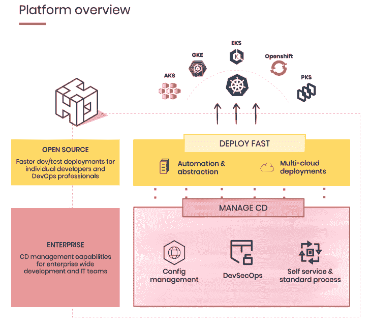

# HyScale 为 Kubernetes 提供开源应用交付自动化工具

> 原文：<https://thenewstack.io/hyscale-offers-open-source-application-delivery-automation-tool-for-kubernetes/>

应用交付平台提供商 [Hyscale](https://www.hyscale.io/) 已经[开源了其核心应用交付自动化工具](https://github.com/hyscale/hyscale)，并对其进行了重新配置，重点是将 Kubernetes 作为未来的容器编排工具。

“我们相信，围绕部署的所有复杂性都可以抽象出来，并最终完全消除。几乎所有这些都可以自动化，”HyScale 产品工程师 [Anoop Balakuntalam](https://www.linkedin.com/in/anooppb/) 。“我们还将 Kubernetes 作为首选平台，随着我们的发展，它将支持各种工作负载的部署。Balakuntalam 说:“因此，当我们谈论消除部署的所有复杂性以及需要手动执行的所有步骤时，我们也是在 Kubernetes 的背景下谈论它。

Balakuntalam 概述了 Kubernetes 的众多好处——成本、可移植性、可伸缩性等等——但也概述了流行的容器编排工具带来的复杂性。首先，Balakuntalam 指出了不同工具之间的“连线”,这是构建容器映像和与注册中心对话所必需的。然而，除此之外，还需要了解启动应用程序所必需的特定于 Kubernetes 的语言，这也是 HyScale 的部分工作重点。

“我们在 Kubernetes 看到的另一个复杂性就是它带来的语言。Balakuntalam 说:“这不是应用团队非常熟悉的东西，所以他们往往不得不处理许多新概念和术语。“为合理规模的微服务编写 Kubernetes 清单的工作量相当大。我们似乎看到了将 Kubernetes 完全抽象化并在其上构建一些东西的机会，这对于任何应用程序团队来说都是一种更加以应用程序为中心的方式来表达应用程序的需求。”

Balakuntalam 说，虽然开发人员可能理解存储或可扩展性的概念，但他们可能没有“持久卷声明”之类的术语，因此 HyScale 致力于“抽象出所有这些复杂性，并根据应用程序团队已经拥有的知识变得更容易理解，这样他们就不会试图学习新的东西。”

HyScale 将自动生成所有 Kubernetes 清单 YAML 文件和 Docker 文件，构建容器映像，并与 Kubernetes API 进行对话以部署应用程序。这是 HyScale 的开源核心，而企业版提供 GUI 界面、对原生服务的支持、用于多云部署的单一控制台，以及部署的统计、跟踪和历史。Balakuntalam 指出，除了帮助将应用程序自动部署到 Kubernetes 之外，HyScale 还消除了执行繁琐的手动过程时通常会出现的错误类型——例如编写和重写大量 YAML 文件，或者稍后将更改传播到这些文件。

来自 Pixabay 的 Valdas Miskinis 的特写图像。

<svg xmlns:xlink="http://www.w3.org/1999/xlink" viewBox="0 0 68 31" version="1.1"><title>Group</title> <desc>Created with Sketch.</desc></svg>