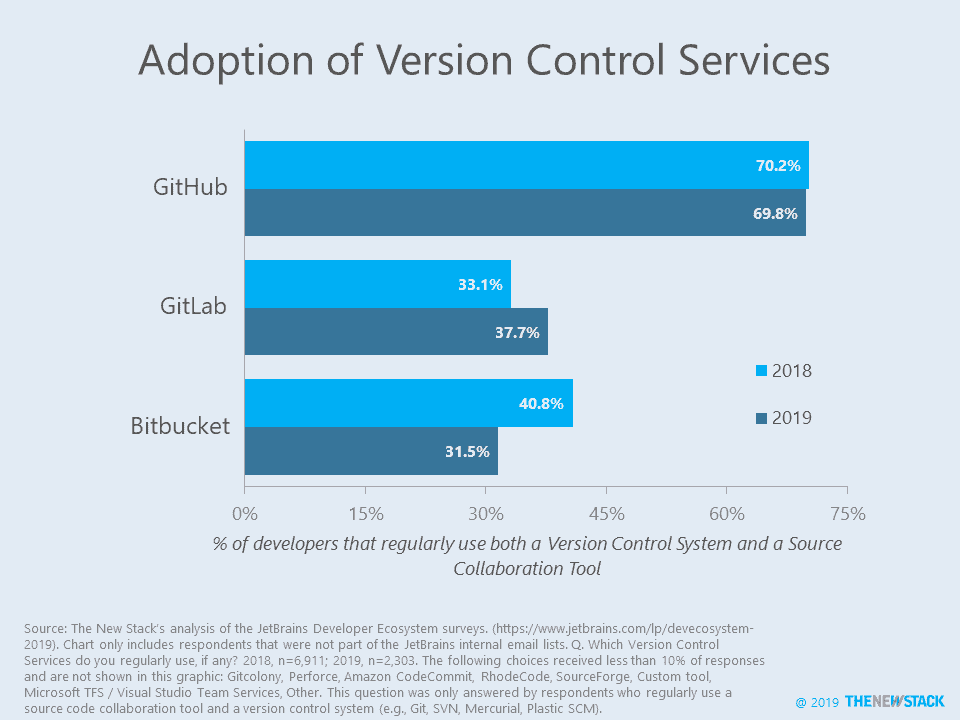

# 我不明白:追踪资源合作市场

> 原文：<https://thenewstack.io/i-dont-git-it-tracking-the-source-collaboration-market/>

在阅读了我们关于漏洞扫描服务的[帖子](/survey-says-gitlab-widely-used-for-software-scanning-github-looms-large/)后，[GitLab](https://about.gitlab.com/)CEO[Sid Sijbrandij](https://twitter.com/sytses)[问](https://twitter.com/sytses/status/1182692575599366144?s=20)我们，“所以 GitHub 在增长，GitLab 增长更快，git lab 和 BitBucket 在萎缩？….这怎么解释呢？”他想知道为什么 SmartBear 的研究发现公司越来越多地付费使用这些代码库之一，但我们的研究只看到 GitHub 的增加。下面是我们的解释。

面向公众的开源项目可能只是冰山一角；GitLab 的大部分增长可能与内部项目的管理及其全套服务有关。此外，从 30%降至 27%的降幅相对较小，并且没有区分哪些非 GitHub 公司被使用。幸运的是，[JetBrains](https://www.jetbrains.com/)’[开发者生态系统状态](https://www.jetbrains.com/lp/devecosystem-2019/)报告提供了更多细节。这项研究询问了“源代码协作工具”和“版本控制系统”的采用情况，然后查看了使用了哪些特定的“版本控制服务”。至少在这项研究中，Git 在某种程度上几乎被普遍使用，84%的时间都在使用一个源协作工具。GitHub 几乎没有变化，GitLab 从 33%上升到 38%，Bitbucket 作为定期使用的版本控制服务从 41%下降到 32%。GitLab 似乎以 Bitbucket 为代价获得了收益，但 JetBrains 的数据没有告诉我们这是来自付费用户还是免费版本的用户。

在比较多项研究时，我们认为 SmartBear 的发现可能夸大了 Git 使用的增长程度。其 2019 年的研究报告称，74%的公司使用 Git 进行软件配置管理(SCM)，高于 2018 年的 55%。问题选择与通常所说的源代码管理一致。尽管很明显 Git 已经成为主要的版本控制系统，但我们怀疑它是否每年增长 35%。深入研究 SmartBear 样本，我们发现，其最新调查显示，员工人数不超过 100 人的公司的受访者比例从 2018 年的 31%上升到 2019 年的 44%。

如果供应商和分析师能够就技术和市场的通用定义达成一致，那么每个人都会受益。例如，同行评审站点 G2 的源代码管理类别有五个不同的组件:1)同行代码评审，2)静态代码分析，3)版本控制客户端，4)版本控制主机，以及 5)版本控制系统。同时，让我们知道你把这些产品放在哪个桶里。

### 最近的相关研究

通过 Pixabay 的特征图像。

<svg xmlns:xlink="http://www.w3.org/1999/xlink" viewBox="0 0 68 31" version="1.1"><title>Group</title> <desc>Created with Sketch.</desc></svg>