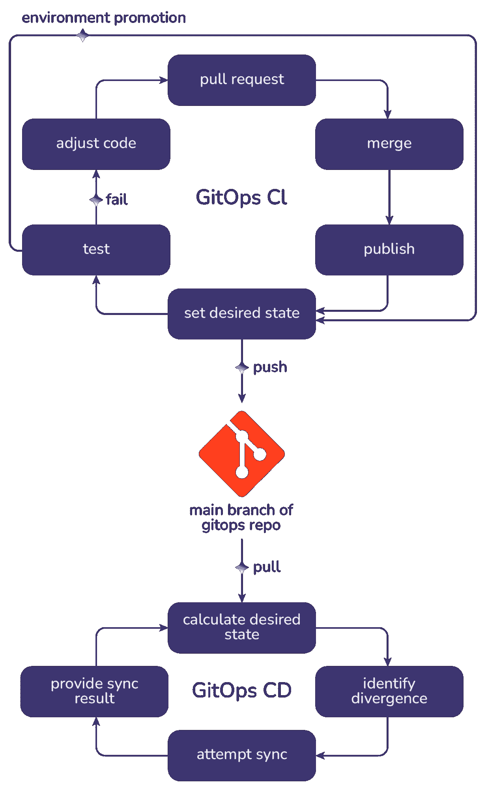
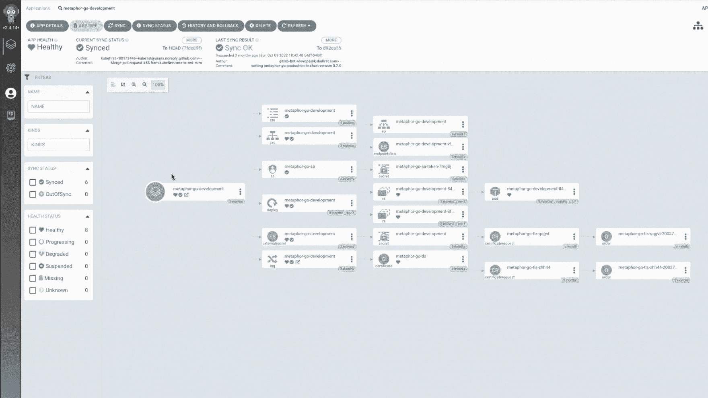
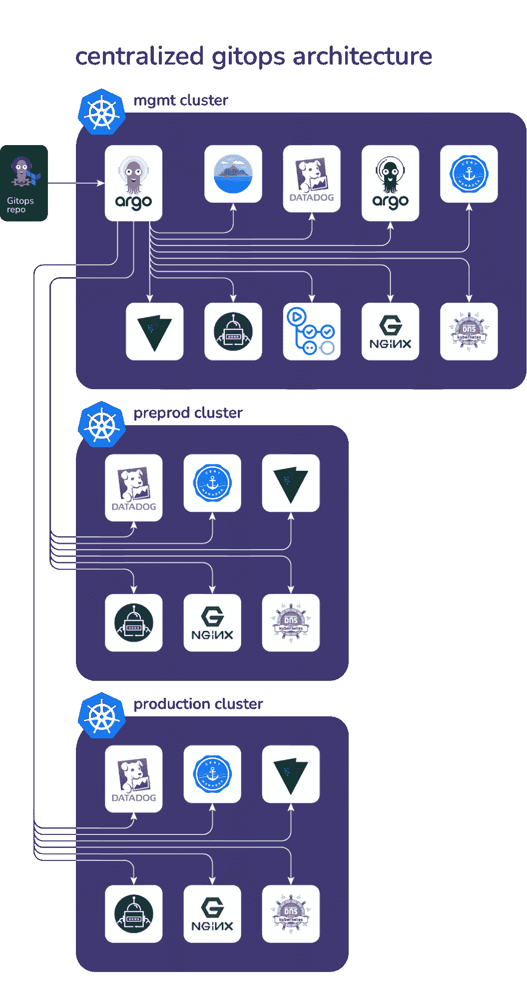

# 我想和你谈谈库伯内特斯·吉托普

> 原文：<https://thenewstack.io/i-need-to-talk-to-you-about-kubernetes-gitops/>

GitOps 是 Kubernetes 崛起过程中发生的最具影响力的变革之一。当我们发现 GitOps 时，我们已经花了一年多的时间来构建我们的 [kubefirst](https://kubefirst.io/) 即时云原生平台。它毁了我们。我们决定扔掉一堆工作，重新开始新的 GitOps 规程，这是正确的决定。

在一个微服务和微产品在平台生态系统中不断发展的世界中，随着时间的推移，管理这些数十个、数百个甚至数千个微组件变得越来越困难。但是 GitOps 能够通过简单的 git 存储库的一个分支和一些准确描述部署内容的文件，将所有这一切重新控制住。

让我们一起探索 Kubernetes GitOps。

## **什么 GitOps 不是**

当第一次读到 GitOps 这个术语时，许多人认为这是他们已经在做的事情。如果您使用 git，它会自动驱动您的 DevOps 管道——这是 GitOps，对吗？绝对不是。

以下是你没有做 GitOps 的一些迹象:

*   如果你不使用 Kubernetes，你很可能不做 GitOps。哦，别喊了。
*   如果您正在使用 Kubernetes，但是您有一个包含命令`kubectl apply`或`helm install`(或任何其他“将此任务推给 Kubernetes”脚本或“同步一切”任务)的交付管道，那么您正在做 GitOps 的前身，它最近被命名为 ScriptOps。
*   如果您正在使用 Kubernetes，但是您手动运行了一个`kubectl apply`或`helm install`来向您的集群交付内容，那么您正在进行 ClickOps(即使它是一个命令)。
*   即使你登录到 Argo CD 并使用 UI 将应用指向 git 目录，那个 UI 活动也是 ClickOps 操作，在做 GitOps 时应该避免。点击操作应该只在短暂的科技高峰环境下进行。

## **什么是 GitOps**

GitOps 将您的 git 提供者与您的 Kubernetes 引擎结合起来，并作为您希望的状态的应用程序控制平面，您将它保存在 git 中。如果设置正确，GitOps 商店可以在 git 存储库的一个主要分支中建立跨组织的所有 Kubernetes 资源的注册中心。

当考虑 GitOps 时，最好想象一堵无法穿透的墙将 CI(自动化管道)与 CD(交付)分开，而这道屏障就是这个 GitOps 的主分支。作为一名工程师，持续交付(CD)将不再是你的责任；这是你的 CD 引擎的工作。您在持续集成(CI)中唯一的交付角色是建立期望的状态。

## **为什么您应该致力于 gitop # git puns**

### **架构简单性**

Kubernetes 的操作是通过将你想要的东西以 YAML 格式交给 Kubernetes 来进行的。

Git 非常擅长对平面文件的分布式系统(如 YAML)进行版本控制，并跟踪它们何时以及为何发生变化。

当您添加一个 GitOps 引擎，它可以从 git 获取所需的状态，将其应用到集群，并在一个无休止的协调循环中报告同步状态，它会产生一个强大而简单的架构，该架构植根于您的工程师已经在使用的成熟的分布式技术。

### **可发现性**

Kubernetes 资产管理的 GitOps 方法以及跨集群扩展应用程序的方式优于任何其他选择。一个好的 GitOps 工程师可以走进一个新的 GitOps 环境，并且几乎立刻就有影响力。

该规程允许您在单个 git 存储库的单个主分支中注册一个应用程序树，表示为 YAML 文件。如果您以这种方式引导您的集群，任何熟悉 GitOps 的人都将能够跟随该树，发现所有期望的状态，并且已经知道内容是如何交付的。

由于集群注册表的可发现性，您的 GitOps 工程师将成为您组织中最有价值的成员之一，而且在某种程度上也是最可替代的成员。

这应该给 GitOps 注册中心的样子一个感觉:[https://github . com/kube first/GitOps-template/tree/1 . 10 . 9/registry](https://github.com/kubefirst/gitops-template/tree/1.10.9/registry)

### **安全**

CI 工具是坏人的常见攻击媒介。在违规期间，他们的任何访问权限都面临风险。有了 GitOps，您的 CI 工具将不再需要访问您的集群。相反，您的集群将使用到 GitOps git 存储库的只读连接来获取其部署和配置。保护那个 git 仓库成为新的游戏，它更容易管理，特别是如果你在 Terraform 中管理你的 [git 仓库。](https://github.com/kubefirst/gitops-template/blob/1.10.9/terraform/github/repos.tf#L16-L24)

### **系统审计日志**

如果对基础设施的每个更改都是因为单个存储库中的一个拉请求而被应用的，那么被应用的拉请求的历史就是曾经发生的所有事情的审计日志，包括谁批准了它以及 git 自己提供的所有其他内容。对于工程师来说，这是一个比 ScriptOps 组织通常所能提供的更方便的过程。

### **回滚**

在 git 中托管您声明的期望状态的另一个优点是，它能够回滚任何引入的问题，在许多情况下，只需恢复 GitOps 存储库中有问题的提交即可。这是一个简单的工程技能，现在可以解决一些大问题。

### **灾难恢复**

如果您的集群总是从单个 git repo 注册表获取并同步应用程序，替换该集群就像将新集群指向相同的注册表点一样简单，它会使自己成为相同的集群。主机名和流量并发在这些细节中存在一些问题，但这是您作为 GitOps 管理员的目标之一。

如果您在 Kubernetes 中手动删除一个部署，并且它是 GitOps 的一部分，它会立即返回。GitOps repo 主分支源将不断尝试成为实际状态，而不需要任何脚本作业。这是保持服务高可用性的一个很好的方法。

## **GitOps 如何运作**

### **Git 仓库**

您需要创建一个 GitOps 存储库，其中包含一个可以注册集群的文件夹。对于单个集群，您可以将该文件夹称为“注册表”

### **GitOps 引擎**

GitOps 的工作原理是在 Kubernetes 集群中放置一个 GitOps 引擎，如 Argo CD 或 Flux CD。您需要将引擎配置为对 GitOps git 存储库的只读访问。当您安装这个 GitOps 引擎时，您将把它指向这个目录，以便用应用程序充实您的集群。

## **GitOps 架构决策**

配置管理集群(管理和协调管理系统和基础设施的集中式集群)后，您需要对运行应用程序的工作负载集群(生产集群、预编程集群等)做出 GitOps 架构决策。)以及它们是应该各自拥有自己的 GitOps 引擎还是使用管理集群的引擎。

### **分布式 GitOps 架构**

分布式 GitOps 体系结构(有时称为引导或独立)是防止管理集群需要访问生产集群的唯一模型。对于安全性要求较高或受法规遵从性限制的组织来说，这是一种理想的状态。

分布式 GitOps 架构要求每个工作负载集群都有自己专用的 Argo CD 实例。如果您在 Argo CD 实例中实现了单点登录，这对您的管理员来说不会是很大的负担。

这种模式还将 Argo CD 上的资源需求分配给每个集群，允许集群在整个生态系统中横向扩展这些 GitOps 计算。调整 GitOps 发动机本身时，较小的爆炸半径也是一个很好的好处。

### **集中式 GitOps 架构**

一些组织采用集中式 GitOps 架构，其中管理集群 Argo CD 实例具有推送访问权限，以将所需的状态强加到下游工作负载集群上。这种架构允许您从一个 Argo CD 实例中查看所有环境的应用程序，这在许多方面都很方便，有助于 GitOps 模板技术，如 [ApplicationSets](https://argo-cd.readthedocs.io/en/stable/user-guide/application-set/) 。

### **在 GitOps 中提取秘密**

如果你的所有系统都是用 git 声明式定义的，你如何处理秘密？外部秘密操作符可能是解决这个问题的最佳工具。它提供了一个自定义资源定义(CRD ),允许您定义映射到您选择的秘密工具(如 Hashicorp Vault 或您的云秘密存储)的外部秘密资源。这允许您在 git 中引用您的秘密，而不实际将它们放在那里。

### **自动化 CI 渠道中的 GitOps 交付**

要将您的应用程序交付到 CI 管道中的环境中，您只需更新 GitOps 存储库中代表该应用程序实例的 YAML 文件。这就是术语“期望状态”的全部含义它是一个文件夹中的文件，在这里你可以定义 Kubernetes 中应该有什么。

### **选择您的 GitOps 技术**

设计新的 Kubernetes 平台时，选择正确的 GitOps 驱动程序是最重要的架构决策之一。 [OpenGitOps](https://opengitops.dev/) 提供了一套[原则](https://github.com/open-gitops/documents/blob/v0.1.0/PRINCIPLES.md)，以独立于供应商的方式定义了 GitOps 规则，帮助指导您完成决策过程。

## **在 5 分钟内本地查看 GitOps 自动化工作流程**

我们的 kubefirst CLI 提供免费的全自动云原生开源 GitOps 平台。

我们正在建立一个由用户组成的[社区](https://kubefirst.io/slack)，他们以同样的方式使用同样的免费开源云原生工具。这些用户可以贡献，互相帮助，并帮助产生一个无摩擦和完全自动化的云原生核心生态系统。

我们有一个本地平台和一组不断扩展的云平台，它们从一开始就是完全自动化的。我们提供的开源工具都是预先配置好的，可以很好地相互协作。您将能够探索可扩展的、未包装的开源工具，如 Argo CD、Argo Workflows、Vault、Terraform、Atlantis、External Secrets Operator、Cert Manager、External DNS 和许多其他工具。

因为我们的架构为您提供了您自己的 GitOps 存储库来支持您的新环境，所以您可以自由地将您的新平台带向您选择的任何方向，并且如果您愿意，您可以随时离开我们。我们不会妨碍你的。这是一个完全基于 GitOps 的产品，您可以删除我们的意见，并通过 pull 请求将您自己的意见添加到您现在拥有的 GitOps 存储库中。

检验该平台的最快方式是在 [kubefirst local](https://docs.kubefirst.io/kubefirst/local/install.html) 版本上，在那里你可以在自己的 [localhost](http://localhost) 上只需五分钟就拥有一个完整、免费的云原生生态系统。如果可以的话，给你的 Docker 运行时至少 5 个 CPU / 5 GB 内存。然后运行:

`brew install kubefirst/tools/kubefirst
kubefirst local`

我们的云平台细节和其他安装类型可以在[https://docs.kubefirst.io/](https://docs.kubefirst.io/)找到

cloud native platform 包括一个名为 metaphor-frontend 的示例应用程序，该应用程序演示了如何使用附带电池的 Argo 工作流运行 GitOps delivery 在本地集群中的私有 GitHub 运行程序上运行的预构建 GitHub 操作。我们提供了一些自动化来构建和发布容器和图表，设置 GitOps 所需的状态，并自动管理发布版本，甚至是本地版本。

隐喻-前端应用程序还演示了如何使用平台的其余部分，如利用保险库的秘密、头盔值覆盖、使用入口、TLS 证书自动化、DNS 管理自动化、发布管理自动化等等。

运行一个快速的[安装](https://kubefirst.io/download)，为我们拍摄一个免费管理平台的 [GitHub star](https://github.com/kubefirst/kubefirst) ，加入我们的[工作空间](https://kubefirst.io/slack)并帮助我们以同样的方式使用相同的近似云原生工具建立一个令人敬畏的工程师社区。你真的不会相信 Kubernetes GitOps 能做什么。

<svg xmlns:xlink="http://www.w3.org/1999/xlink" viewBox="0 0 68 31" version="1.1"><title>Group</title> <desc>Created with Sketch.</desc></svg>