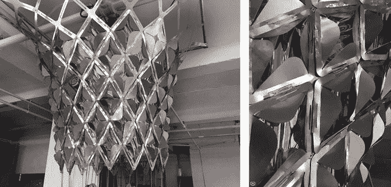
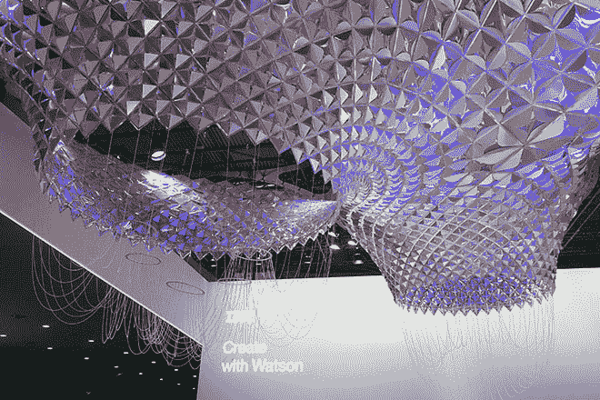
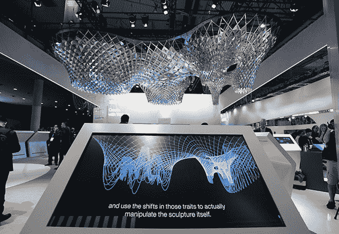
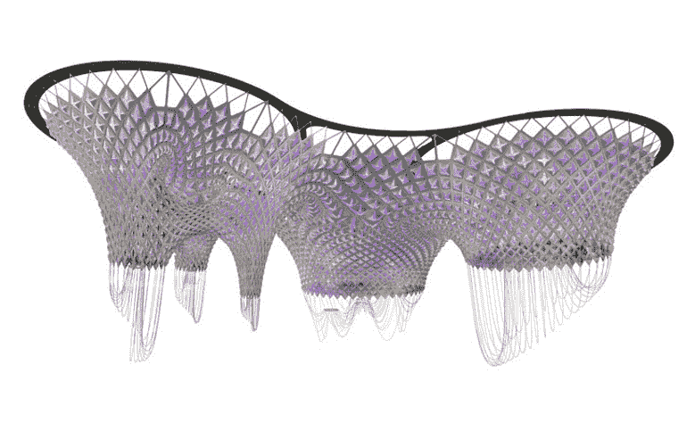
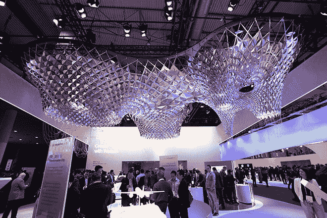

# IBM AI 帮助设计师创造交互式“思维雕塑”

> 原文：<https://thenewstack.io/ibm-ai-helps-designers-create-interactive-thinking-sculpture/>

如今，无论你走到哪里，似乎都能听到人工智能如何闯入这个或那个曾被认为是人类神圣领地的领域。从开发人工[想象力](https://thenewstack.io/google-ai-beats-human-champion-complex-game-ever-invented/)、[做梦](https://thenewstack.io/deep-learning-neural-networks-google-deep-dream/)，到[深度神经推理](https://thenewstack.io/googles-deepmind-ai-now-capable-deep-neural-reasoning/)，这些技术正在帮助机器做以前认为不可能的事情，比如[作曲](https://thenewstack.io/artificial-intelligence-todays-newest-hitmaker/)，写小说[在各种游戏中击败人类](https://thenewstack.io/computers-can-now-bluff/)，以及自主导航和学习复杂系统。人工智能有巨大的潜力在各种努力中帮助和协助人类——人工智能也可能帮助设计师和建筑师建造城市和其他未来的宜居环境吗？

这是完全可能的，正如这个大规模互动装置——由设计工作室 [SOFTlab](http://softlabnyc.com/) 在 IBM 的人工智能平台 [Watson](https://www.ibm.com/watson/) 的帮助下创建——所暗示的那样。这座建筑是为今年在巴塞罗那举行的[世界移动通信大会](https://www.mobileworldcongress.com/)建造的，它是使用数字和计算工具设计、制造和组装的，这本身并不独特。然而，这个项目的独特之处在于，人工智能被用来增强设计过程，“通知”形式的风格，使用巴塞罗那最著名的建筑师[安东尼奥·高迪](https://en.wikipedia.org/wiki/Antoni_Gaud%C3%AD)作为灵感。

https://youtu.be/fuZiZtmkRX4

## 收集意想不到的见解

高迪活跃于 19 世纪末，以构思至今仍在研究的富有表现力的有机形式而闻名。为了帮助 SOFTlab 创作出具有高迪风格的独特的 13 英尺高的雕塑，沃森获得了大量关于高迪生活和作品背后的历史以及巴塞罗那的建筑、艺术、文学和音乐的数据。

这种广泛的研究是设计师和建筑师在任何设计过程中通常会做的事情，尽管可能范围较小，速度可能较慢。通过将人工智能融入设计过程的概念阶段，并让它消化所有这些不同的信息，设计团队能够收集有价值的和意想不到的见解——例如高迪喜欢的调色板，并做出令人惊讶的观察，揭示螃蟹、贝壳和蜘蛛可能在高迪独特风格中发挥的作用。

沃森的 AlchemyLanguage 技术——一组通过自然语言处理提供文本分析的 APIs 被用来从海量数据中检测人类不会立即发现的模式。

“有了这个，沃森就能够成为高迪的专家，帮助我们理解一个世纪以来的灵感，从而重新激发我们的设计过程，”[写道](http://mobilebusinessinsights.com/2017/02/how-i-created-the-first-thinking-sculpture-with-ibm-watson/?cm_mmc=OSocial_Youtube-_-Leadership+Agenda_Leadership+Agenda+Telecom+Media+and+Entertainment-_-WW_WW-_-Making+Of+Sculpture+Video+YouTube+Annotation&cm_mmca1=000005VF&cm_mmca2=10004141) SOFTlab 的创始人迈克尔·西沃斯。

IBM 的人工智能还帮助设计团队做出关键的设计决策，比如决定使用哪种材料最能代表高迪的作品。虽然在这个现代版本中并不明显，但高迪经常依赖彩色陶瓷、瓷砖、玻璃和熟铁等材料，这种呼应可以在 SOFTlab 的鳞状贝壳状装置中看到，它利用了铝结构框架。

在分析了高迪的设计后，沃森还确定了高迪喜欢的颜色，包括群青、翠绿、黄色和橙色。这种全面的数据分析有助于设计人员选择闪烁的彩虹色二色性薄膜作为包层材料。

## 实时分析情绪语调

除了形式，沃森还通过分析社交媒体上相关推文的情感基调，为装置添加了互动元素，促使其制作者将其称为“思维雕塑”沃森的[音调分析器](https://www.ibm.com/watson/developercloud/tone-analyzer.html)使用语言分析来解释这些文字内容中的交流音调，自动触发连接在雕塑下边缘的链状卷须做出响应。

这个特殊的组成部分是高迪在设计过程中对比例模型(而不是图纸)偏好的明确参考。有趣的是，高迪的许多比例模型都配备了[链或加重弦](http://dataphys.org/list/gaudis-hanging-chain-models/)，这让他能够探索形式游戏背后固有的物理学。这种实时数据分析与装置本身的联系提供了工作及其更大背景的“大画面”视野。

该团队表示:“(这些链)是由沃森提供的实时数据分析激活的，这些数据分析涉及与巴塞罗那、技术和世界移动通信大会相关的各种主题。”。“每个连锁模型代表了沃森通过查询社交媒体渠道收集的情绪。链条模型伴随着一个现场界面，显示装置上下颠倒，很像高迪的重力驱动模型。装置本身充当了变化数据的空间表示，而界面使用倒置的 3D 装置模型作为图表，以显示更精确的指标和推动这些指标的社交媒体。”

通过融入人工智能的巨大能力，深入挖掘数据，并为表面带来新的见解，无论是在建筑细节还是编织到某人话语中的语气，这座雕塑都能够活灵活现，表达当下的精神。

同样，人们可以想象，城市及其建筑有一天可能会利用人工智能，让它们能够自动适应不断变化的条件。这是一个令人鼓舞的例子，表明人工智能在许多行业中可以多么强大:在这里，我们看到了一个人工智能在设计过程中不取代人类，而是扩展和增加已经存在的创造力的例子。

图片:IBM

<svg xmlns:xlink="http://www.w3.org/1999/xlink" viewBox="0 0 68 31" version="1.1"><title>Group</title> <desc>Created with Sketch.</desc></svg>