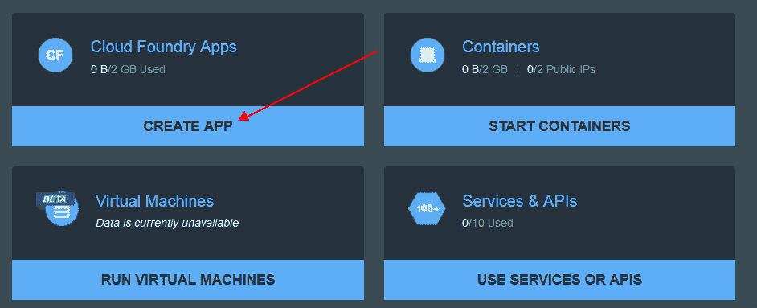

# IBM 的 Christopher Ferris 谈开源和容器编排

> 原文：<https://thenewstack.io/ibm-aims-unify-orchestration-open-source/>

 [克里斯托弗·费里斯

克里斯托弗·费里斯是 IBM 杰出的工程师，也是 IBM Cloud 开放技术的首席技术官。他全面负责 IBM 的所有战略性开放技术计划，包括 OpenStack、Cloud Foundry、Hyperledger 项目、开放容器计划、云本地计算基金会、Mesos 等。](https://developer.ibm.com/opentech/author/chrisfer/) 

一些组织可能会发现开源社区很难找到可用的解决方案，特别是在建立新的基础设施并使其有效运行的时候。IBM 希望为这些客户提供的解决方案不仅能在自己的生态系统中运行，还能与 IBM 的竞争对手协同工作。

在本期 [The New Stack Makers](/tag/the-new-stack-makers/) 播客中，New Stack 创始人 Alex Williams 采访了 IBM 杰出工程师兼开放技术首席技术官 Christopher Ferris，讨论 IBM 如何帮助改进编排以满足当今企业的需求，以及 Cloud Foundry 的 Diego 和 [OpenStack](https://www.openstack.org/) 如何帮助企业满足这些需求。

这次采访是我们下周出版的关于容器编排和自动化的新电子书系列的一部分。

[IBM 的克里斯托弗·费里斯谈创建开源生态系统](https://thenewstack.simplecast.com/episodes/ibms-christopher-ferris-on-creating-an-open-source-ecosystem)

该播客也可以在 [YouTube](https://www.youtube.com/watch?v=lpgMnFLlrUI&feature=youtu.be) 上看到。

Ferris 指出，对于如何接受对开源项目的贡献，通常没有一致认可的实践。Ferris 解释说，拥有一个像 [Puppet 的](https://puppet.com/)这样的半开放社区会剥夺创造力和协作，而创造力和协作是开源的基石，而 Chef 则对各种开发者的贡献开放。

“我认为 Chef 的成功很大程度上取决于，例如，它是开源的，他们邀请人们投稿，而 Puppet 则更封闭一些。它是开源的，但并不真正开放，”Ferris 说。

在使用开源时，编排可能是一个挑战，尤其是在设置基于容器的环境时。Ferris 解释说，IBM 从 Bluemix 必须与其他提供商相互联系的角度来看待 Bluemix 中的编排方法，因为他们最终拥有相似的目标。

IBM Bluemix:应用程序创建仪表板

“我认为我们看待这个问题的方式是，最终这些东西必须开始结合，走到一起，或者至少提供我们可以在 OpenStack 和 Kubernetes 之间集成的能力，”Ferris 说。

Cloud Foundry 的 [Diego](https://docs.cloudfoundry.org/concepts/diego/diego-architecture.html) 是一个例子，说明了当项目开发人员团结在一组共同目标周围以实现一个目标时会发生什么。当 Cloud Foundry 开始用 Garden 和 Run-C 代替 [Warden](https://docs.cloudfoundry.org/concepts/diego/dea-vs-diego.html) 的任务时，它没有创建自己的容器管理工具，而是选择使用社区中其他人正在使用的工具— [Docker](http://docker.com/) 。

“Docker 也将成为云本地计算基础的核心。“我们都在某种程度上向同一个核心容器管理器看齐，”Ferris 说。“我们希望开始在这些不同的项目中展开并获得更多的商品化和一致性。”

Cloud Foundry、Docker 和 IBM 是新堆栈的赞助商。

<svg xmlns:xlink="http://www.w3.org/1999/xlink" viewBox="0 0 68 31" version="1.1"><title>Group</title> <desc>Created with Sketch.</desc></svg>