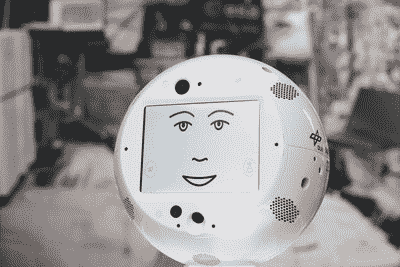
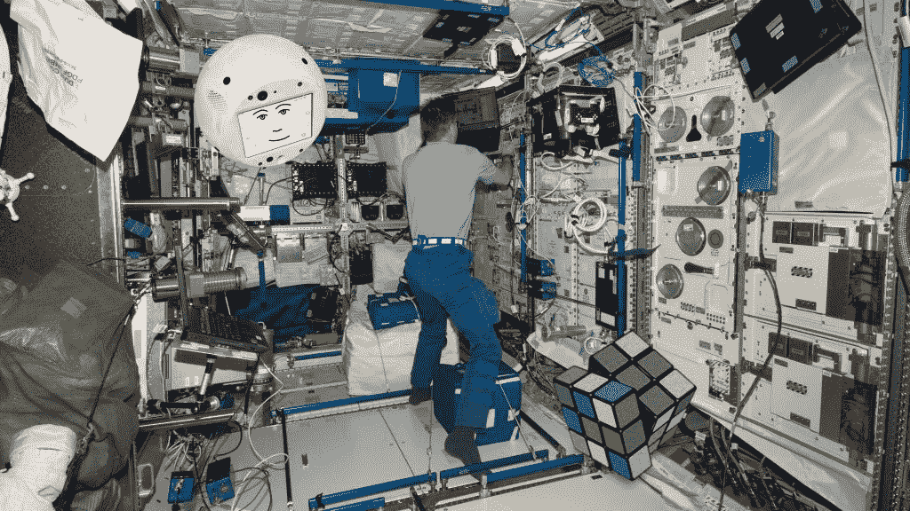

# IBM，空客将人工智能带到国际空间站

> 原文：<https://thenewstack.io/ibm-airbus-bring-ai-to-the-international-space-station/>

一个专门的团队正在将 IBM 基于云的技术扩展到外层空间，并使我们离智能说话助手机器人与宇航员合作的科幻未来更近一步。

6 月底，一枚 SpaceX 火箭为国际空间站上的 6 名宇航员携带了一个自主人工智能设备。据报道，这次历史性的发射携带了 5900 磅的货物，其中包括一份冰淇淋，加上一些新鲜的蓝莓和一些“超级咖啡因咖啡”

其中 11 磅是一个会说话的机器人，直径大约一英尺。

[https://www.youtube.com/embed/KnpJI3WeiBg?feature=oembed](https://www.youtube.com/embed/KnpJI3WeiBg?feature=oembed)

视频

它所有的塑料和金属都是由 3D 打印机生成的。“他最初是一个塑料圆球，”IBM 的项目杂志在[的第一项中写道——注意到最初工程师们只是称他为“太空球”但最终他们选择了 CIMON 这个名字——代表“船员互动移动伴侣”人工智能将协助 42 岁的宇航员亚历山大·格斯特，他甚至帮助挑选出它的动画脸和声音。](https://www.ibm.com/thought-leadership/smart/de-de/ai-in-space/journal/index.html#entry1)

“宇航员在太空中没有很多同伴，他们在那里工作时也没有很多帮助，”IBM 的一些说明材料解释说。因此 CIMON 将读出一步一步的指令，目前宇航员必须从笔记本电脑的屏幕上读出这些指令。这启发了路透社将 CIMON 描述为“[一个反应灵敏的免提伴侣](https://www.reuters.com/article/us-space-artificial-intelligence/hal-like-robot-to-help-astronaut-in-space-odyssey-idUSKBN1JP0WP)

“实验有时由 100 多个不同的步骤组成，”IBM 工程师 [Matthias Biniok](https://twitter.com/matthias_biniok?lang=en) 解释道，他是 CIMON 的首席架构师之一，[在 IBM 的 Think 博客](https://www.ibm.com/blogs/think/2018/02/watson-space/)上。“西门都知道。”这篇博客文章认为，这让宇航员与他们的新互动助手进行了“真正的对话”。

“负责 CIMON 的开发人员预测，这将有助于减轻宇航员的压力，同时提高效率。"

## 最优秀最聪明的人

CIMON 是来自空中客车公司、德国航天中心、IBM 和慕尼黑路德维希-马克西米利安大学的 50 人团队努力的结果，所有这些都由德国航空航天中心的航天局监督。

https://www.youtube.com/watch?v=LB0R3WTjtxY

除了学习所有宇航员的行话，西蒙还必须找到一种方法来定位人类的声音来自哪里。CIMON 的项目日志指出:“[那里很吵](https://www.ibm.com/thought-leadership/smart/de-de/ai-in-space/journal/index.html#entry4)”。IBM 还报告说，培训的一部分包括学习 Gerst 最喜欢的歌曲。但是识别每个宇航员独一无二的脸需要一个复杂(独特)的程序，所以这个团队想出了一个聪明的变通办法。利用“大量”的图像，他们确定了一个更简单的目标。“他们训练程序识别‘格斯特’和‘非格斯特’。”"

“目前，CIMON 在这个世界上唯一能识别的人是 Alexander Gerst——如果没有人在零重力下嫉妒，那就太可爱了。”

空中客车公司解释说，CIMON 正在利用 IBM 的沃森技术，并补充说，CIMON 不仅旨在帮助人类宇航员，而且还创造了“一种与船员交谈的感觉”CIMON 能够识别兴奋或不快等情绪线索。训练数据包括带有情感线索的短语和句子——快乐、悲伤、兴奋、孤独——使 CIMON 不仅能够对信息做出适当的反应，还能提供建议甚至情感支持。

佛罗里达州肯尼迪航天中心——6 月 29 日，第一个基于人工智能的自主助手 Project CIMON(乘员互动移动伴侣)将发射到国际空间站。CIMON 的人工智能由 IBM 开发，将作为宇航员助理加入国际空间站指挥官 Alexander Gerst，并帮助他为“地平线”任务进行科学实验。(图片来源:IBM) (PRNewsfoto/IBM)

希望最终使 CIMON 的功能不仅仅是一台机器。“CIMON 的数字面孔、声音和人工智能的使用使其成为船员的‘同事’”，Biniok 二月份在 IBM 的 Think 博客上写道。

空客首席系统工程师菲利普·舒利恩说，“它甚至有能力进行闲聊。”

## Alexa 在太空？

该项目的消息很快激发了我们这些地球人的想象力。

路透社称其为“一个讲英语的机器人，大约有篮球那么大……第一个在太空中由人工智能驱动的个人伴侣。”或者，正如商业内幕[所说](http://www.businessinsider.com/cimon-ibm-watson-artificial-intelligence-iss-2018-2)，开发团队正在“训练一个浮头做朋友”[空中客车公司微重力有效载荷负责人曼弗雷德·乔曼](https://www.linkedin.com/in/manfred-jaumann-2941a5147/)称 CIMON 为“一种飞行大脑”，空中客车公司的网站将 CIMON 描述为“T6”以人工智能为燃料的自由飞行器

《华盛顿邮报》将 CIMON 视为“[太空中的一种 Alexa](https://www.washingtonpost.com/news/the-switch/wp/2018/06/29/spacex-is-flying-an-artificially-intelligent-robot-named-cimon-to-the-international-space-station/)，能够帮助宇航员完成手册中概述的步骤，展示实验某些部分的图片，并回答相关问题。”

但与大多数语音助手不同，这款手机是移动的，而且是自主的，电池运行时间为两小时。IBM 喜欢指出它是第一个被允许在国际空间站自主移动的机器人。BBC 指出它有 14 个不同的内部风扇帮助它运转。据美联社报道，CIMON 将不断学习，它将无限期地留在空间站上，“通过 IBM 的云不断更新”尽管它还配备了一个“离线”按钮，据英国广播公司报道，“这使得 Gerst 避免在隐私时刻将音频传输到地球上的服务器。”

CIMON 计划进行三项实验。据空中客车公司称，其中一台 CIMON 将充当“一台‘智能’飞行摄像机”。路透社指出，CIMON 有八个不同的机载摄像头。另一个实验与水晶有关，第三个实验是看 CIMON 是否能帮助 Gerst 解开魔方。

虽然 CIMON 可以显示程序，但它也被设计为对问题的解决方案提出建议。此外，空客补充道，“它还可以作为技术问题的早期预警系统。”

**起源故事**

“我是太空中第一个互动的机组助理，”它在空中客车公司分享的视频中解释道。“我是一个自由飞行的智能体，提供各种数字服务。”

但是当然，当它的合成声音大声读出来时，听起来有点恐怖…

事实上，CIMON 是在斯坦利·库布里克的电影《2001:太空漫游》上映整整半个世纪后发射到太空的，这引发了一些更黑暗的比较。IBM 项目日志上的一个条目甚至指出，CIMON 拥有“来自‘2001:太空漫游’的 HAL 9000 的技术诀窍——只是，你知道，没有邪恶部分

[https://www.youtube.com/embed/ARJ8cAGm6JE?start=50&feature=oembed](https://www.youtube.com/embed/ARJ8cAGm6JE?start=50&feature=oembed)

视频

“Biniok 记得在开始制作 CIMON 之前第一次看后一部电影时，心想……哦。这将是一个大问题。"

“不像哈尔，它将无法打开舱门，”《华盛顿邮报》开玩笑说。事实上，如果你让它打开舱门，CIMON 实际上会回应，“对不起，我不能”——只是为了迷惑你。

但程序员尼娜·费舍尔(Nina Fischer)也从其他科幻电影中“载入”了人工智能，IBM project journal 将这些电影描述为供宇航员发现的复活节彩蛋——例如，这是对尤达的致敬。如果一名宇航员告诉西蒙“我会试一试，”西蒙回答，“做或不做。没有尝试。”

如果他们说什么给家里打电话，“他会对外星人外星人做一个还过得去的模仿。”

根据项目日志，最初 CIMON 的反应“从友好到完全暴躁”。心理学学生 Sophie Richter-Mendau 觉得 CIMON 需要一种更加一致的性格，并遵循了 Myers-Briggs 性格分类的指导方针——一种逻辑思维内向的人。她增加了幽默感，IBM 称赞她为“他的个性的建筑师”

“CIMON 必须学会理解人类的意图并采取行动，”项目杂志报道说。“目标很简单:西蒙必须是一个你真正想一起出去玩的对话伙伴……他可以在技术过程中帮助宇航员，或者在他们表示孤独时让他们振作起来。”

在谢菲尔德大学，人工智能专家 Noel Sharkey 告诉 BBC [说，机器人 T3 的未来岌岌可危。“目前它只处于实验阶段，如果它没有用处，没有哪个航天局会愿意浪费宝贵的空间。”但其他人预测，与机器的社会互动有朝一日可能会在未来的长期任务中发挥作用——例如，在前往火星的漫长旅程中。根据](https://www.bbc.com/news/technology-44655675) [CIMON 在空客网站](https://www.airbus.com/newsroom/press-releases/en/2018/02/hello--i-am-cimon-.html)上的页面，这可能只是个开始。“空中客车公司的开发者相信，在地球上，辅助系统的发展也可以在医院和社会护理中找到未来的用途。"

也许这一切都证明了科技可以把你引向意想不到的方向。在为 CIMON 工作之前，Biniok 使用 Watson 为保险公司评估受损汽车，并帮助 Watson 为银行和航空公司创建虚拟助手。“国际空间站需要一个虚拟助手，结合对话服务、工作协助、面部识别和导航功能，”CIMON 项目杂志解释说。

"比尼克觉得他一直在为这个挑战而训练，并着手建造一个原型."

* * *

# WebReduce

<svg xmlns:xlink="http://www.w3.org/1999/xlink" viewBox="0 0 68 31" version="1.1"><title>Group</title> <desc>Created with Sketch.</desc></svg>