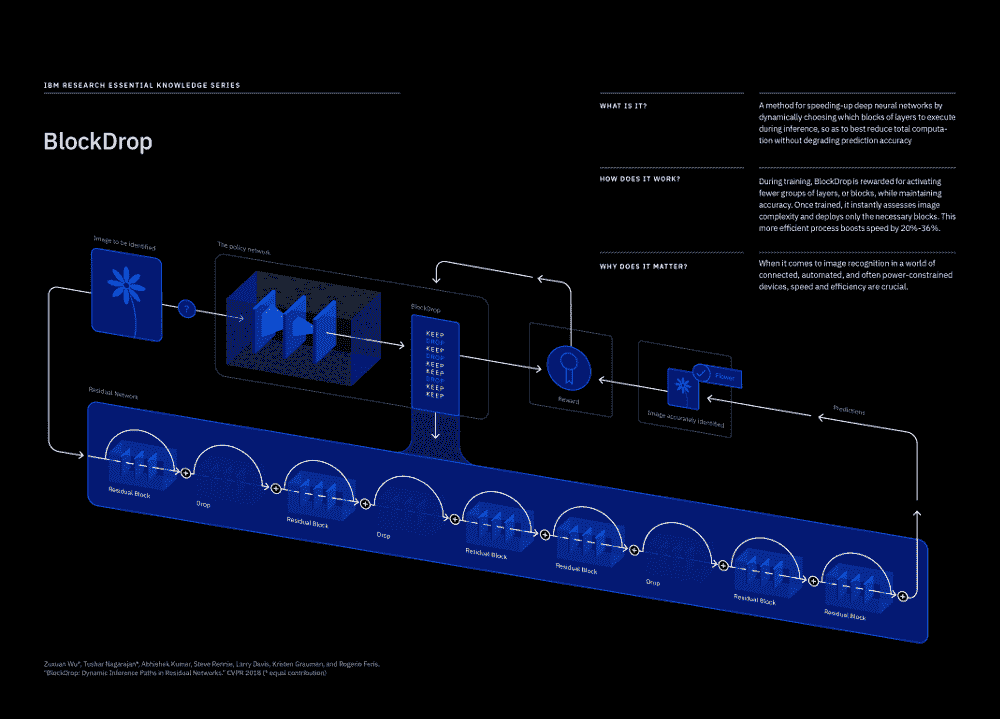

# IBM“block drop”研究加速神经网络

> 原文：<https://thenewstack.io/ibm-blockdrop-research-speeds-neural-networks/>

IBM Research 在德克萨斯大学奥斯汀分校和马里兰大学的帮助下，创造了一项名为 BlockDrop 的技术，该技术有望在不损失任何保真度的情况下加快卷积神经网络的运行。这可能会进一步超越神经网络的使用，特别是在计算能力有限的地方。

BlockDrop 的工作原理是在深层网络中寻找不需要计算来实现所需精确度的层，然后即时删除这些层，使系统能够以更有效的方式分配资源。根据 IBM 的数据，在测试中，BlockDrop 将标准 [ImageNet](http://www.image-net.org/) 数据集的神经网络图像识别速度平均提高了 20%，有些提高了 36%。

IBM 研究经理[罗杰奥·费里斯](https://researcher.watson.ibm.com/researcher/view.php?person=us-rsferis)将于本周在盐湖城举行的 2018 年计算机视觉和模式识别大会( [CVPR 2018](http://cvpr2018.thecvf.com/) )上展示 [BlockDrop 作品](https://arxiv.org/abs/1711.08393)。

虽然越来越多的组织正在深入研究用于图像识别和相关任务的神经网络，如自动车辆导航，但由于需要更高的准确性和清晰度，这种深度学习所需的计算要求可能会呈指数级增长，从而加重计算资源的负担。此外，越来越多的工作预计将由计算资源有限的平台来处理，如边缘计算节点和移动设备。

Feris 在接受新堆栈采访时表示，需要围绕提高人工智能和机器学习技术的可扩展性进行更多研究。今天的深度学习系统倾向于采取一刀切的方法，不管图像本身是复杂还是简单。神经网络通过数据“学习”识别物体，数据通过一系列节点[传递](https://www.quora.com/How-do-artificial-neural-networks-work)将图像与物体的模型进行比较。但研究人员发现，神经网络不一定要求每项工作都有相同数量的节点。

“如果你有一个非常简单的图像要处理，比如一只干净背景上的狗，我们真的需要运行 100 层神经网络来做出决定”来确定图像中的对象是否确实是一只狗？费里斯问道。

已经做了一些工作来简化神经网络，尽管在数据压缩方面已经做了很多，但这种方法仍然需要完成整个工作。相反，BlockDrop 确定正确分类给定输入图像所需的层或块的最小配置，删除那些没有唯一编码有意义的视觉信息的块。图像越简单，可以删除的图层越多，节省的时间就越多。

研究人员在论文中指出，这种方法大致模仿了人类大脑的工作方式。“人类感知系统的一个重要特征是它能够自适应地为视觉识别分配时间和检查。例如，一瞥足以识别一些物体和场景，而要清楚地理解被遮挡或复杂的物体和场景则需要更多的时间和注意力，”他们指出。

Feris 的工作是 IBM 为加速基于人工智能的计算机视觉操作而采取的一系列举措之一。在 CVPR，公司研究人员还将[向](http://researcher.watson.ibm.com/researcher/files/us-aandreo/cvpr2018.pdf)展示一个基于 IBM TrueNorth 神经形态芯片的实验系统的性能结果，该系统将一对视觉传感器连接在一起，就像一双眼睛一样。研究人员声称，该系统比使用传统硬件的可比系统每像素需要的功率少 200 倍。

<svg xmlns:xlink="http://www.w3.org/1999/xlink" viewBox="0 0 68 31" version="1.1"><title>Group</title> <desc>Created with Sketch.</desc></svg>