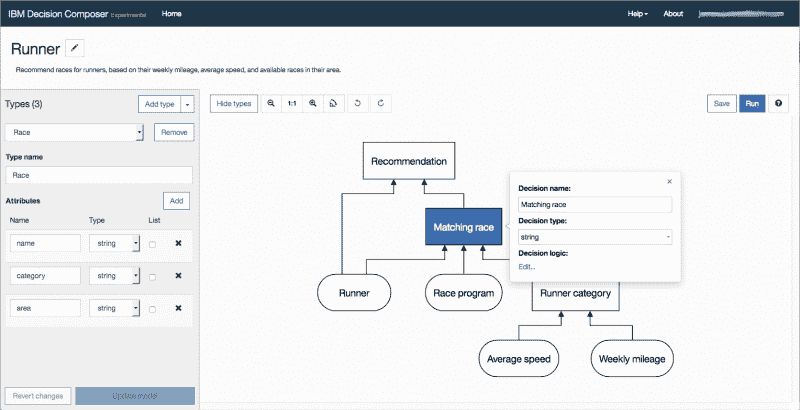
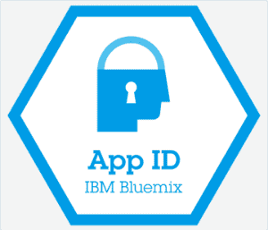

# IBM 为 Bluemix 带来了低代码应用程序开发

> 原文：<https://thenewstack.io/ibm-brings-low-code-app-development-bluemix/>

IBM 继续在其 Bluemix 云平台上堆积新的开发人员功能，为低代码应用程序开发提供支持，并在应用程序中添加安全授权等增强功能。

总的来说，IBM 的目标是让 Bluemix 成为所有类型开发人员的首选平台，从所谓的“公民开发人员”到构建企业应用程序和商业产品的专业开发团队。Bluemix 平台提供 150 多种工具和服务，涵盖认知智能、区块链、安全、物联网、DevOps 等领域。

为了简化开发过程，IBM 刚刚宣布了 Bluemix 上的一项新的实验性功能，称为 [Decision Composer](https://developer.ibm.com/dwblog/2017/ibm-launches-decision-composer-bluemix/) ，它可以帮助开发人员用更少的代码创建更智能的应用程序。

Decision Composer 服务使开发人员能够以图形方式建模数据和逻辑，这些数据和逻辑在应用程序中驱动决策。IBM 表示，这些模型取代了代码，允许开发人员使用数据来测试多种业务场景及其结果，然后将具体决策直接部署和自动化到运营中。这些决策包括从产品定价到面向客户的应用如何针对个人用户进行个性化定制。

IBM 决策管理高级产品经理[杰罗姆·儒贝尔在](https://www.linkedin.com/in/j%C3%A9r%C3%B4me-joubert-6474364/)[博客](https://www.ibm.com/blogs/bluemix/2017/03/business-rules-service-introduces-decision-composer/)中说:【通过 Decision Composer，IBM 正在探索表达和指定决策逻辑的新方法，并使决策建模更加简单，更容易为更多的受众所接受。

儒贝尔说，新服务的灵感来自于[决策模型和符号](http://www.omg.org/spec/DMN/) (DMN)标准，该标准专注于描述和建模可重复的决策。他说，这也得益于 IBM 在决策管理工具方面多年的专业知识。

“它汇集了所有重要的元素来模拟决策:驱动决策过程的输入数据，描述决策高层结构的图表，业务规则和定义逻辑核心部分的决策表，”他补充说。

儒贝尔说，Decision Composer 是 IBM 在 IBM Cloud 上的[业务规则服务](https://console.bluemix.net/catalog/services/business-rules/)的一个新部分，它本身可以帮助开发人员捕捉、自动化和管理频繁和可重复的业务决策。

“我们经常看到商业分析师愿意使用 DMN 和自上而下的方法，”他说。“我们希望与他们合作，分享他们喜欢使用的集成建模环境的想法。此外，我们认为建模决策应该能够被 IT 之外的更广泛的受众所理解。最终，决定权应该掌握在商人手中。导致复杂决策的思维过程具有挑战性。通过这个项目，我们想提出新的方法和技术，看看用户能合理地走多远。或许还能进一步简化流程。”

## 折扣建模

作为一个例子，IBM 引用了基于身份、位置、年龄或忠诚度等标准的客户折扣场景。使用 Decision Composer，可以对用于确定此类折扣的数据和逻辑进行建模和更改，而无需复杂的 IT 流程，从而使经验较少的开发人员能够参与构建此类应用程序。

Decision Composer 应用程序在 Bluemix 上“按原样”提供，并且可以从 Business Rules 服务中访问。但是，Decision Composer 不是受支持的工具，不应用于生产。然而，IBM 致力于支持低代码应用程序开发，并为所有技能水平的开发人员提供工具来发挥他们的技能。

在【Forrester 最近关于低代码开发市场的研究中，分析师 Jeffrey Hammond 写道:“移动低代码开发平台的市场正在增长，因为越来越多有抱负的、半专业的和专业的开发人员使用它们来缩小移动应用需求与创建它们的人才之间的差距。工具必须支持各种移动工作负载，以及不同技能水平的开发人员。”

该报告补充说，支持高保真、所见即所得(WYSIWYG)体验的多种工作负载的供应商将处于领先地位。此外，“能够提供简单而广泛的集成，支持移动特定功能(例如，通知或 TouchID)，并创建像素级完美用户界面的供应商将成为市场领导者，”报告称。

“我们疯狂地关注开发者，”IBM 云技术架构副总裁安吉尔·迪亚兹告诉《新堆栈》。我们可以支持快速应用程序开发，解决所谓的公民开发者问题，并以首席信息官满意的方式管理它。但我们可以更进一步，这不仅仅是使用低代码和无代码的快速应用程序开发，而是围绕认知、围绕数据清理、围绕非结构化数据的内容携带、围绕区块链等带来能力。"

迪亚兹说，IBM 正在与[激励](http://www.galvanize.com/)和 [TopCoder](https://www.topcoder.com/) 合作，投资建立这种技能组合。

## 扩展池

在最近的 IBM InterConnect 2017 大会上，IBM 和 aimed 宣布了一系列关于 IBM Cloud 的新的认知、云和数据科学培训计划，旨在扩大认知开发人员和数据科学家的人才库。

该声明扩展了两家公司之间的现有合作关系，并在 Bluemix 上提供了一个新的 IBM 认知课程。该合作还通过新的[认知建造者博览会倡议](https://developer.ibm.com/dwblog/interconnect-2017/)和认知建造者空间为培训和教育提供了物理空间。11 月，IBM [宣布与 TopCoder](https://www.topcoder.com/blog/topcoder-and-ibm-partner-to-bring-watson-to-the-topcoder-community/)合作，将 IBM 的 Watson 认知计算云服务带给 TopCoder 的 100 多万开发者社区。

新的 IBM 认知课程是一个在线、自我指导、为期四周的计划，将花费学生大约 40 个小时来涵盖各种领域，如机器学习和人工智能的介绍以及这些认知技术可以解决的商业问题；用 IBM Watson APIs 制作认知产品的原型；从架构师到开发人员和运营人员的新兴角色；以及构建一个完整的认知系统的挑战。

“对认知和人工智能开发技能的需求远远超过了目前的市场需求，”IBM 首席开发人员威利·特哈达在一份声明中说。“我们希望帮助开发人员获得从事一些最赚钱的技术工作所需的技能，同时通过增加人才库来支持业务。认知和人工智能革命即将到来，通过与像 Galvanize 这样的组织合作，我们可以推动技术创新的发展，并增加更多人的贡献。”

与此同时，IBM 还宣布了一项新的 Bluemix 服务——被称为[Bluemix App ID](https://www.ibm.com/blogs/bluemix/2017/03/introducing-ibm-bluemix-app-id-authentication-profiles-service-app-developers/)——这使得非安全专家的开发人员可以轻松地将第三方安全认证构建到他们的应用程序中。该服务允许用户使用现有的社交媒体凭证登录，如脸书、推特或谷歌。

由 [Jonatan Pie](https://unsplash.com/@r3dmax) 通过 [Unsplash](https://unsplash.com/?photo=3l3RwQdHRHg) 拍摄的特写图片。

<svg xmlns:xlink="http://www.w3.org/1999/xlink" viewBox="0 0 68 31" version="1.1"><title>Group</title> <desc>Created with Sketch.</desc></svg>