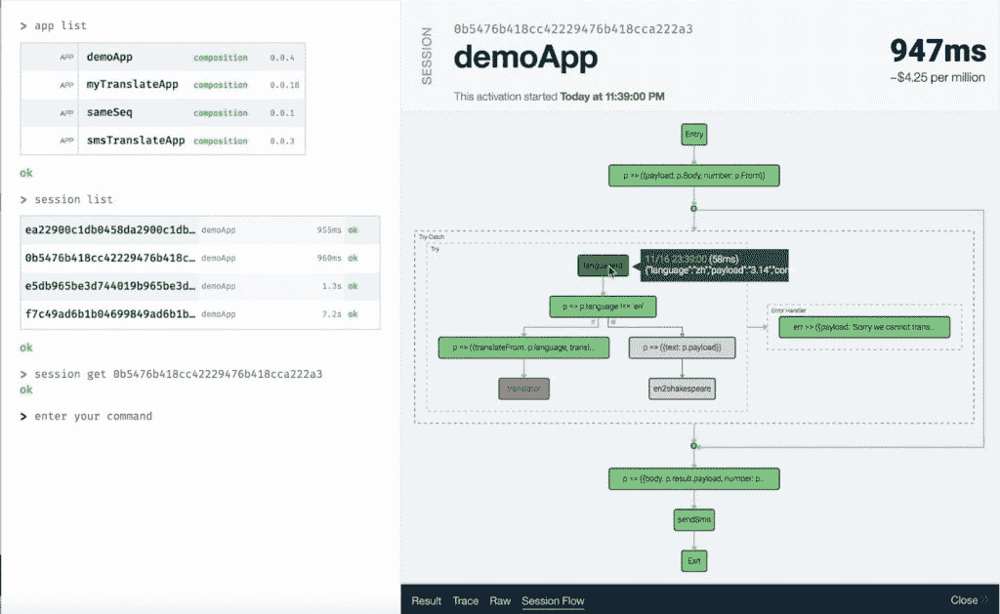
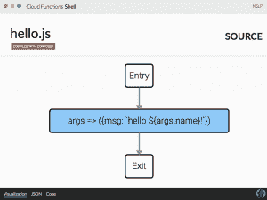

# IBM 利用开源的 Composer 工具深入研究了无服务器功能编排

> 原文：<https://thenewstack.io/ibm-composer-provides-way-orchestrate-multiple-serverless-functions/>

随着开发人员越来越习惯于使用基于云的[无服务器](/category/serverless/)或“功能即服务”服务，他们可能会发现协调他们的功能集合本身就是一项越来越艰巨的任务。

为此， [IBM Research](http://www.research.ibm.com/) 开发了一款名为 [Composer](https://github.com/ibm-functions/composer) 的新软件，它提供了一种方式来轻松编排运行在[IBM Cloud Functions](https://console.bluemix.net/openwhisk/)service 或 IBM 开源无服务器软件 [Apache OpenWhisk](https://github.com/apache/incubator-openwhisk) 上的许多无服务器作业的操作。与[非常相似，Kubernetes](/category/kubernetes/) 提供了一种编排大量容器操作的方法，因此 Composer 也可以将无服务器功能链接到复杂的应用程序中。

“构建复杂的应用程序不仅仅是编写简单的函数。你可能有几十个功能，”IBM Research 的研究人员 Paul Castro 说。开发人员必须找到一种“将这些功能缝合在一起”的方法，即通过指定功能如何协同工作的控制流，以及建立传递数据所需的管道。此外，开发人员将需要一种方法来显示多种功能和其他资源是如何组合在一起的。

Castro 说，在 Composer 之前，开发人员必须将协调代码写成客户端脚本，或者将控制流嵌入功能本身。Composer 不同于其他的，比如微软的 [Azure Functions](https://azure.microsoft.com/en-us/services/functions/) ，它不依赖函数直接调出其他函数。这种方法抽象出了整个应用程序的流程。

卡斯特罗说:“我们希望揭露这种逻辑，让人们清楚地了解正在发生的事情。”。

Castro 指出，Composer 提供了一个“简单的编程模型”，一个基于基于 JSON 的参数的模型，以指定函数如何协同工作。该模型支持 if-then 语句，用于逻辑分支、函数链接和错误捕捉功能。还有一些管理数据流的构造，比如向多个端点发送数据的能力。

卡斯特罗说，有了 composer，开发人员可以从独立的功能中构建整个应用程序，包括逻辑流程本身。该设置支持 OpenWhisk 或 IBM Cloud 函数识别的所有语言:JavaScript、Swift、Java、PHP、Python 或封装在 Docker 容器中的任何代码。

组合本身是用 JavaScript 编写的。这里有一个简单的例子[，来自 IBM 博客](https://www.ibm.com/blogs/bluemix/2017/10/serverless-composition-ibm-cloud-functions/) :

|  | 

作曲家 。 序列 ( //程序化作曲

' 当前温度'，  //调用云函数或者 API

作曲 。 如果 ( //条件控制流

结果=&gt； 结果 。&lt； 60 ，//mix inline JavaScript

'turnOnHeat')//第三方服务接口

)

 |

作曲家有两部分。一个是用于描述组合的库，目前在 Node.js 中呈现。为了帮助处理“组合”，IBM 还发布了[IBM Cloud Functions Shell](https://www.npmjs.com/package/@ibm-functions/shell)(FSH)，这是一个基于 [Electron](https://electronjs.org/) 的可视化 Shell 开发工具，运行在开发人员的机器上。它提供了可视化合成和运行时的能力，以及历史性能图，并能够深入到源代码。

显示控制流的 IBM Cloud Shell。

“我们认为这是在云中开发功能的一种更简单的方式，无需进行任何上下文切换。他们可以呆在一个地方创作他们的作品，”卡斯特罗说。这种方法还提供了潜在的成本节约，因为功能在需要时才被调用到运行时，而不是让它们在云服务上闲置，等待来自其他地方的工作。

一个应用程序的 JavaScript 组合，即函数调用的集合，被上传到 IBM Cloud Functions 或 OpenWhisk，并通过一个名为 Conductor 的组件呈现到一个有限状态机中，因此它可以在云中作为一个无服务器的函数执行自身。

Composer 是整体编程模型的参考实现，就像 IBM 的 OpenWhisk 开源版本一样，IBM 正在寻求社区的反馈。该公司希望其他公司能为该软件开发其他语言和运行时间的绑定。

卡斯特罗说:“我们希望人们尝试一下，并提供反馈，告诉我们如何做得更好。”

微软是新堆栈的赞助商。

由 [Unsplash 上的](https://unsplash.com/?utm_source=unsplash&utm_medium=referral&utm_content=creditCopyText)[Juss ara romo](https://unsplash.com/photos/3cM5Vw3UjaY?utm_source=unsplash&utm_medium=referral&utm_content=creditCopyText)拍摄的特写图片。

<svg xmlns:xlink="http://www.w3.org/1999/xlink" viewBox="0 0 68 31" version="1.1"><title>Group</title> <desc>Created with Sketch.</desc></svg>