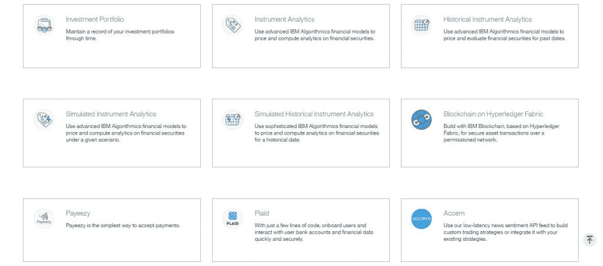

# IBM 为金融服务应用程序开发人员提供新的工具、服务

> 原文：<https://thenewstack.io/ibm-empowers-financial-services-app-developers-new-tools-services/>

IBM 推出了一系列新工具，供开发人员构建金融服务领域的应用程序，包括对认知、区块链和分析应用程序的支持。

金融服务领域长期以来一直是 IBM 的一个据点，该公司是该领域硬件、软件和服务的核心供应商。因此，IBM 以其基于沃森的认知计算技术领先。IBM 最初将沃森应用于医疗保健领域的客户，并很快成为肿瘤学家的顾问。现在，蓝色巨人正瞄准金融服务领域。

本周在拉斯维加斯举行的 [IBM InterConnect 2017](https://www.ibm.com/cloud-computing/us/en/interconnect/) 展会上宣布了新的 [IBM 金融服务云](https://developer.ibm.com/industries/finance/)，它为在 IBM 云上创建金融服务应用程序提供了工具、API 和构建模块。

IBM 声称，每个月都有超过 100，000 名来自金融服务行业的个人和企业开发人员来 IBM 寻求开发见解和支持。

然而，IBM 的新定制产品为金融科技(fintech)开发者提供了访问 API、数据和内容的权限，以便为金融科技公司、银行、财富管理公司和保险公司快速、大规模地构建和货币化认知支持的金融服务应用。

“我们发布了一系列围绕沃森服务构建的金融服务应用编程接口，目标是金融服务从业者可能感兴趣的特定领域，”IBM 的首席开发者倡导者[威利·特哈达](https://twitter.com/wtejada223)告诉新堆栈。“如果你了解沃森可以从认知能力中带来的见解，我们已经在一组 API 中实现了这些见解，但只是在非常特定于金融服务社区的用例中。”

此外，IBM 开发了一套初学者工具包来帮助开发人员开始构建金融服务应用程序。

“因此，举例来说，如果你试图做一些与项目组合管理模型相关的生产计划，这些东西实际上是如何应用的？这些工具包有助于这一点，”特哈达说。"当我们看一下将认知应用于行业时，金融服务只是一个例子."

特哈达说，初学者工具包“可以让你走得很远”，因为它们提供了非常具体的用例，可以直接应用于构建金融服务应用程序。他指出，IBM 将扩展这些初学者工具包，以涵盖越来越复杂的任务，但决定从“低挂水果”用例开始。

“这些套件和 API 是由我们从客户那里看到的东西驱动的，”特哈达说。“另一部分是我们看到的新兴事物。我们倾听客户对我们的要求，但我们也拍摄冰球的走向。我们的想法是，看看我们需要发展什么样的技能，或者我们需要生产什么样的入门套件。这将有助于开发人员在这些特定领域更轻松地完成工作。因此，我们听取了这两方面的意见，并提供了这些开发人员旅程和初学者工具包，让他们能够更快地完成工作。”

总的来说，IBM 在这里的目标是帮助缩小金融技术系统中所谓的技能差距。该公司的新工具现已推出测试版，以帮助开发人员构建客户洞察、监管合规性分析、安全性、隐私和合规性准备，从而减少开发和测试所需的时间。

这些工具帮助开发人员避开诸如数据选择、映射和集成等普通任务，使开发人员能够使用 IBM 服务或将它们与他们的数据结合起来。

“我们在金融服务领域拥有丰富的专业知识，全球 97%的大型银行都依赖于 IBM。与此同时，IBM 已经成为领先的商业人工智能平台，”IBM 工业平台高级副总裁布里奇特·范·克拉林根在一份声明中说。“我们在金融服务领域的经验，以及在企业和初创企业人工智能商业部署方面的经验，为这些新工具提供了信息。”

此外，IBM 宣布通过为其金融服务行业合作伙伴提供额外的好处和支持来扩展其当前的业务合作伙伴计划。最初在金融服务开发者云上提供以金融服务为重点的 API 的金融科技公司包括 Accern、Actiance、Bondevalue、Dow Jones、Eigencat、Envestnet | Yodlee、Opentopic、Plaid、PolicyPal、Quovo、Riskspan、TagniFi 和 Xignite。

[Plaid](https://plaid.com/company/) 的业务发展和战略负责人 [Sima Gandhi](https://www.linkedin.com/in/sima-gandhi-75bb999/) 在一份声明中表示:“与 IBM 合作使我们朝着建立包容性金融服务生态系统的目标更近了一步，通过将 IBM 的机构知识与 Plaid 的技术专长相结合，让行业机构及其客户能够访问关键的基础设施。

## 关注垂直市场

[Pund-IT](http://www.pund-it.com/) 的首席分析师查尔斯·金说，他相信 IBM 的金融服务开发商公告和新产品表明了该公司在企业软件开发方面的深厚历史和经验。

“新的金融服务特别有趣，因为它们反映了公司对金融行业客户核心需求的理解，”金说。这些公司通常已经与 IBM 合作了几十年，它们的业务正在被新的参与者、日益加剧的竞争和日益增加的监管限制所深刻地、根本性地颠覆。IBM 在这方面的重点是为金融机构提供他们需要的工具和服务，以快速、成功地适应不断变化的环境。这当然与 IBM 的技术创新有关，但它也深受该公司对其客户业务和需求的理解的影响。"

事实上，IBM 开发人员生态系统在这项工作中发挥了作用。特哈达表示，独立软件开发商在 IBM Cloud 上合作，提供云原生应用程序和支持云的现有应用程序。他们与 IBM 合作，帮助扩展他们的数据、微服务和内容，以覆盖业内更多的客户。

此外，IBM 还提供咨询服务来帮助 ISV，以及技术和销售支持、参考架构和对开发和使用 API 的支持。参与该计划并在 Bluemix 上构建和部署创新解决方案的 ISV 包括 Avoka、Majesco、TCS BaNCS 等。

此外，IBM 官员表示，位于伦敦、纽约、旧金山、新加坡、达拉斯、巴黎、尼斯、硅谷、斯图加特、圣保罗、班加罗尔和上海的 IBM 业务合作伙伴解决方案中心将帮助 IBM 合作伙伴利用该公司的认知和云技术实现金融服务解决方案的商业化。

就其本身而言，IBM 刚刚推出了其[新加坡金融科技中心](https://www.ibm.com/think/fintech/singapore/)，该中心与该公司的金融服务开发者云相连。蓝色巨人在新加坡中央银行新加坡金融管理局(MAS)的支持下推出了该中心，作为支持新加坡金融科技公司的催化剂。

MAS 首席金融科技官 Sopnendu Mohanty 在一份声明中表示:“该中心的启动将有助于加快新加坡金融科技公司的增长和影响力，使其成为全球 API 提供商生态系统的一部分。”。“他们的解决方案和 API 将面向全球开发者社区开放，将他们的市场覆盖范围扩大到新加坡以外。”

专题图片:IBM 董事长、总裁兼首席执行官 Ginni Rometty 启动 Interconnect 2017。图片由 IBM 提供。

<svg xmlns:xlink="http://www.w3.org/1999/xlink" viewBox="0 0 68 31" version="1.1"><title>Group</title> <desc>Created with Sketch.</desc></svg>