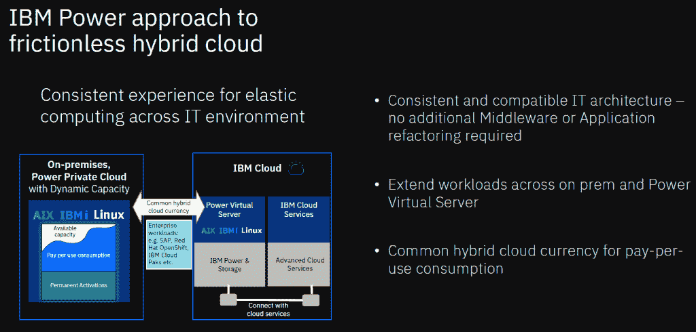
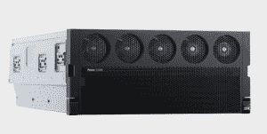

# IBM 通过 Power10 E1080 服务器扩展混合云产品组合

> 原文：<https://thenewstack.io/ibm-expands-hybrid-cloud-portfolio-with-power10-e1080-server/>

IBM 正在推出其第一款基于已有一年历史的 Power10 处理器的服务器，该系统相比其前身提供了显著的性能改进，并推进了该供应商围绕[混合云](https://thenewstack.io/why-hybrid-cloud-needs-virtualization/)和[人工智能](https://thenewstack.io/what-is-real-artificial-intelligence/) (AI)的雄心。

蓝色巨人已经为 Power10 E1080 配备了广泛的功能，官员们表示，这些功能将带来更多类似云的灵活性、可扩展性和成本降低功能，并且与 Power E980 的前身相比，性能将提高 50%，人工智能推理将提高 5 倍。它还承诺每个内核的容器化吞吐量是基于 x86 的服务器的 4.1 倍，并且安全性优于 E980。

13 个月前，IBM 经过 5 年的开发，推出了 7 纳米 Power10 架构，作为其混合云和人工智能努力的重要一步，该系统配备了一系列硬件、固件和安全功能，旨在帮助企业更容易地采用混合云战略。

E1080 可以在内部运行，并与供应商基于云的 Power 虚拟服务器配合使用，为组织提供从数据中心到云的一致基础架构。企业可以购买该系统并在数据中心运行，也可以租用该系统并在内部运行，或者通过云访问该系统。

## **拥抱 OpenShift**

与 Power10 本身一样，该系统也针对 [Red Hat 的 OpenShift Kubernetes 容器平台](https://www.openshift.com/try?utm_content=inline-mention)进行了优化，IBM 官员希望该平台成为企业混合云工作的基础。IBM [在 2019 年](https://thenewstack.io/turning-blue-ibm-to-acquire-red-hat/)以 340 亿美元收购了 Red Hat，使其成为该公司积极推进蓬勃发展的混合云领域的焦点。这笔交易是在 Ginni Rometty 担任 IBM 总裁兼首席执行官期间达成的，该公司只是在 Arvind Krishna 的领导下加速了其混合云和人工智能战略。

据 IBM Power 平台总经理肯·金(Ken King)称，IBM 在过去几年中一直在 Power 平台上进行重大投资，以推动该战略，包括在公共云和自己的 Power 私有云上推出 Power 虚拟服务器。此外，该平台还启用了 [OpenShift containers 和 Cloud Paks](https://www.ibm.com/docs/en/cloud-paks/cp-management/1.3.0?topic=SSFC4F_1.3.0/readmes/GA/cp_rh_version_compat.html) ，这是 IBM 的一揽子平台方法，用于在数据、网络和业务自动化等领域提供混合云，以及 [Watson AIOps](https://www.ibm.com/cloud/blog/watson-aiops-bringing-ai-to-it-operations-management) 。

King 在新闻发布会上说，该供应商已经“在我们推进企业、人工智能和混合云的过程中，建立了许多重要的基础元素”。“但随着我们进入 Power10，我们现在看到了混合云在该平台上的强劲增长势头。我们看到不断增长的 ISV 和应用程序工作负载，尤其是 SAP HANA 加速了企业 Linux 的增长。平台上的增长基础已经建立。”

## **基于 Power10 的构建**

下一步是“在此基础上，我们发布了具有大量新功能的 Power10。这些能力……将使我们能够响应我们的客户，更快地响应业务需求，以保护从处理器核心一直到云的数据，从而显著简化人工智能自动化，”他说。

随着 IBM Cloud 的出现，蓝色巨人成为了全球云领域的一员，这一领域被亚马逊网络服务、微软 Azure 和谷歌云这样的公司所主导。然而，Enderle Group 的首席分析师 Rob Enderle 表示，他们独立于这些提供商，并愿意与他们合作，这在竞争激烈的云领域是一种优势。

Enderle 告诉 The New Stack，“鉴于其类似云的大型机根源，IBM 本应在云领域占据主导地位，但鉴于这种背景，他们在概念上仍比顶级云供应商更有深度，”并补充说，该公司将自己定位为最独立于云提供商的公司，他们与云提供商合作，并以 IBM 云为基础，“作为专注于安全的优质产品”。他们利用自己深厚的知识以及与任何云提供商都没有排他性的关系，形成了独特的价值主张。这一主张是，他们将能够在任何多云部署中跨云供应商进行最佳优化，因为他们对任何一个供应商都是不可知的。”

他说，Power10 和将在其上运行的服务器正在针对混合云场景进行优化，这将内部环境作为多云系统的关键部分。这是有道理的，因为企业都在拥抱云。在其年度[云报告](https://info.flexera.com/CM-REPORT-State-of-the-Cloud?lead_source=Website%20Visitor&id=Flexera.com-PR)中，IT 管理解决方案提供商 Flexera 今年指出，92%的企业正在采用多云战略，而 80%的企业正在转向混合云。

## **数字说话**

 IBM 官员指出，这些数字支持他们的立场，即 Power10 架构和 E1080 是为新的以云为中心的世界而设计的。该系统可扩展至 16 个插槽，与 E980 相比，每内核性能提高了 30%,总容量提高了 50%以上，相当于在相同工作负载下功耗降低了 33%。它在 16 插槽配置中提供的性能是英特尔至强白金 8280L 的四倍。

Power10 芯片和 E1080 旨在将人工智能功能带到服务器上的数据位置。该芯片每个内核包括四个矩阵数学加速器引擎，IBM 官员表示，与 E980 相比，它可以提供五倍的人工智能推理性能。其他人工智能功能包括 Auto-AI 和无代码工具，为企业提供他们使用的模型的灵活性和对开放神经网络交换(ONNX)的支持，其中包括使用 [TensorFlow](https://thenewstack.io/tensorflow-model-deployment-and-inferencing-with-kubeflow/) 和 [PyTorch](https://searchsoftwarequality.techtarget.com/news/252450399/PyTorch-10-brings-developers-closer-to-cloud-services) 等框架训练的人工智能模型，可以从基于 x86 的系统部署到 E1080，而无需更改代码。

## **借力红帽**

IBM 也在 OpenShift 之外利用 Red Hat。它还包括诸如服务网格和管道、Red Hat 运行时和 [CodeReady 工作区](https://searchsoftwarequality.techtarget.com/news/252474373/Kubernetes-tools-vendors-vie-for-developer-mindshare)、Red Hat 的高级集群管理器、用于更快 OpenShift 部署的 Power 私有云机架和经认证的 Ansible 模块等附加组件。该公司还在其 Power 虚拟服务器上安装了 OpenShift，并使 Red Hat Enterprise Linux (RHEL)可用于其内部系统以及 Power 虚拟服务器。此外，在内部环境中，IBM 计划为 RHEL 和 OpenShift 提供按分钟计量和消费的功能，从而增强软件的云功能。

IBM 还增加了 E1080 的安全功能，这是一个重要因素，因为数据在云和内部之间移动，并且存储在传统数据中心之外。这些功能包括透明内存加密以减少管理设置，每个内核的加密引擎是 E980 的四倍(AES 加密速度是 E980 的 2.5 倍)，以及系统堆栈每个级别的安全软件。

该系统还支持量子安全加密和全同态加密(FHE)，允许工程师对加密数据运行分析功能。静态和传输中的数据加密是常见的。FHE 使数据即使在被分析时也能保持加密。

混合云系统和人工智能产品管理副总裁 [Dylan Boday](https://www.linkedin.com/in/dylan-boday-6651b615/) 在新闻发布会上说:“Power E1080 的设计和设计是为了应对我们今天需要的敏捷环境。”。“能够更快地响应各种业务需求和动态变化的环境，保护您的信息安全，并从客户目前拥有的可用数据中提取新的见解，最终以极大的信心和能力完成这一切，并具有高可靠性和可用性。当我们谈到能够更快地响应时，我们对 E1080 的整体性能感到非常兴奋。”

<svg xmlns:xlink="http://www.w3.org/1999/xlink" viewBox="0 0 68 31" version="1.1"><title>Group</title> <desc>Created with Sketch.</desc></svg>