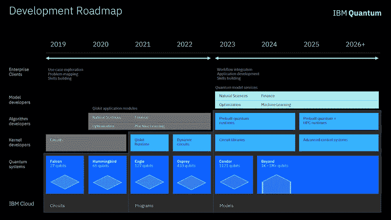
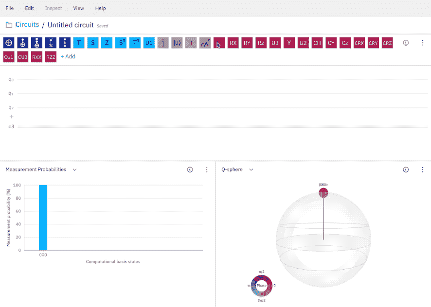
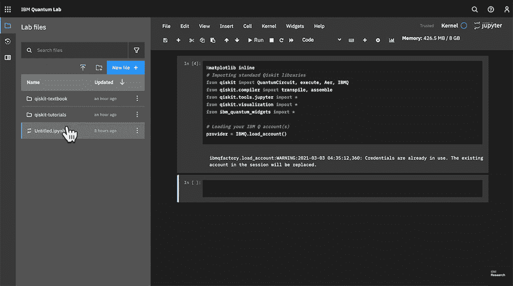

# IBM 推出新工具简化量子计算开发

> 原文：<https://thenewstack.io/ibm-launches-new-tools-to-ease-quantum-computing-development/>

许多专家预计[量子计算](https://thenewstack.io/quantum-computings-challenging-liftoff-to-commercialization/)总有一天会超越经典计算。这种转变可能会彻底改变一切——这之所以成为可能，是因为量子计算利用了量子力学[的非凡定律](https://uwaterloo.ca/institute-for-quantum-computing/quantum-computing-101)，从而允许量子位(或“量子位”)以多种[叠加状态](https://medium.com/@ScottAmyx/quantum-computing-series-part-4-superposition-in-quantum-mechanics-381b98180f62)对信息进行编码和处理——这远远超过了经典计算中只有 1 或 0 的有限二进制编码的可能性。

但这种范式转变需要在集体层面上进行大量的合作努力。在过去的几年里，各种科技公司，如[亚马逊](https://thenewstack.io/amazon-web-services-launches-quantum-computing-as-a-service/)、[微软](https://thenewstack.io/week-programming-get-quantum-q-sharp/)、[谷歌](https://thenewstack.io/quantum-computers-are-here-but-what-to-do-with-them/)和 [Rigetti](https://thenewstack.io/nascent-quantum-computing-development-rigettis-new-forest-api/) 都建立了自己的量子计算系统和服务。IBM 是量子计算竞赛中的另一个行业领导者，几年前推出了自己的量子计算服务 Quantum Experience。去年年底，IBM 公布了一份雄心勃勃的五年路线图，概述了其到 2023 年发布 1121 量子位设备的目标，以及进一步开发和扩大基于开源软件的量子生态系统的最新计划。

IBM 自己的方法是围绕这项技术建立一个社区，让世界上最优秀和最聪明的人参与进来，并向更广泛的用户开放新兴的量子计算行业。

“构建有用的量子电路需要我们如何看待计算设备中的信息的根本范式转变，”他解释道[IBM 量子平台负责人 Blake Johnson](https://www.linkedin.com/in/blake-johnson-b8747417b/) 。“这不像学习一门新的编程语言或框架，在那里必须学习新的单词来表达现有的想法。相反，人们真的必须以完全不同的方式思考，以便利用干涉和纠缠等量子现象来构建计算。因此，至关重要的是，我们要构建易于使用的工具，其后端功能对用户来说几乎是不可见的，以使开发人员能够专注于实际的困难问题，而不是从工具本身制造新的障碍。”

## “无摩擦”量子发展

实现这一目标的一个重要步骤是，IBM 通过推出两个新的编程工具来取代其量子体验平台，从而使其量子计算更容易实现， [IBM Quantum Composer](https://quantum-computing.ibm.com/composer) 和 [IBM Quantum Lab](https://quantum-computing.ibm.com/lab) ，这两个工具允许用户构建量子电路，并在其上运行实验量子算法。其目的是创造无缝体验，同时将量子计算引入更广泛的用户。

“在 IBM，我们已经接受了‘无摩擦开发’的哲学，以使尽可能广泛的研究人员和开发人员社区能够参与量子系统，”约翰逊解释道。该公司还在开发一个开源量子计算框架 Qiskit(T8)，用于联系新的受众。

去年，该公司发布了 Qiskit 优化模块，这是一个让优化专家开始探索量子计算的包。不久，该公司将发布其他 Qiskit 应用程序模块，以连接其他应用程序域。

特别是 Quantum Composer 的拖放式图形界面，使得开发人员可以轻松构建量子电路。“Quantum Composer 有几个内置的可视化功能，可以帮助电路开发人员推理电路的影响，”Johnson 说。“一旦你构建了一个电路，你就可以在 IBM Quantum systems 上执行它，或者以几种格式导出它，包括 Qiskit Python 代码，以便进一步操作或集成到一个更大的项目中。”

用 IBM Quantum Composer 构建电路和可视化量子位状态。

为了补充 Quantum Composer 的电路构建功能，IBM 的云托管量子实验室允许用户编写结合 Qiskit 代码、方程、可视化和叙事文本的脚本，同时还考虑到了[量子“噪声】](https://phys.org/news/2019-09-advance-noise-cancelling-quantum.html)对电路和算法的潜在影响。除了解决这些实际问题，IBM 还旨在促进更广泛社区内的合作，目标是通过民主化量子系统的访问来加速开发。

“量子实验室是一个托管的开发环境，使研究人员和开发人员能够与 IBM 量子系统进行交互，”约翰逊说。“今天，它主要包含一个预装 Qiskit 的 Jupyter 笔记本环境。然而，我们将在未来建立和扩展量子实验室，以包括对与量子系统交互的日常体验有用的其他功能。”

例如，该公司正在开发一个数据服务扩展原型，以允许用户轻松共享分析过的实验，以及研究实时可视化，以提供对大型作业操作的洞察，允许用户在检测到问题时中断或取消作业。

IBM 量子实验室允许用户编写量子电路，在模拟器和真实的量子硬件上执行，并可视化结果。

目前，IBM 运营着超过 24 个量子计算系统。它们都基于 [transmon](https://quantumcomputing.stackexchange.com/questions/1529/what-is-the-difference-between-transmon-and-xmon-qubits) 超导量子位架构，大小从 1 到 65 个量子位不等，超过 28 万注册用户每天执行约 10 亿个硬件电路。IBM 的全栈量子系统旨在使量子内核开发人员更容易组成量子电路，并帮助量子算法开发人员和量子模型开发人员在栈中创建创新的量子算法，这些算法可以应用于量子模型，以解决化学，金融，机器学习等领域的复杂问题。

约翰逊指出，IBM 的量子系统通过与传统计算系统的紧密集成进行了优化，这意味着根据问题的类型更有效地分配资源。

“这是因为量子处理器在所有方面都不比经典处理器好，”他说。“对于某些任务，量子硬件没有优势。例如，如果你只需要将两个数字相乘，这是经典处理器非常擅长的事情，在量子硬件上可能会慢得多。只有在某些领域，量子硬件可能会提供加速。”

为了进一步开发这种无缝的经典-量子集成，IBM 的路线图暗示将在未来两年内引入[动态电路](https://www.ibm.com/blogs/research/2021/02/quantum-mid-circuit-measurement/)，这将是有效切断量子系统固有噪声以纠正潜在错误的关键。

“关于在实际问题上实现量子优势需要什么，还有很多东西需要学习，”约翰逊补充道。“然而，到目前为止，我们的探索已经揭示了量子平台需要三样东西才能有用:质量、容量和多样性。质量很重要，因为量子系统必须能够忠实地执行足够大的电路，以代表感兴趣的问题和解决这些问题的算法。容量是至关重要的，因为许多算法不仅需要一个电路，而且需要许多电路与经典处理器完成的计算交互执行。多样性是指我们可以运行的电路种类，我们对动态电路以有限的量子资源获得更高性能的承诺特别感兴趣。”

除了着眼于动态电路，IBM 最近还发布了 [Qiskit Runtime](https://www.ibm.com/blogs/research/2021/04/qiskit-application-modules/) ，它提供了一种更高效地执行量子经典工作负载的新方法，从而显著增加了其系统的容量。一些分析师估计，到 2030 年，量子计算将成为一个价值 650 亿美元的产业，作为回应，IBM 还推出了世界上第一个量子开发者认证，这将为程序员提供一个导航这个新兴领域的可能途径。

你可以在这里注册免费使用 IBM 的量子系统。

[https://www.youtube.com/embed/KGtWFJxGfpo?feature=oembed](https://www.youtube.com/embed/KGtWFJxGfpo?feature=oembed)

视频

<svg xmlns:xlink="http://www.w3.org/1999/xlink" viewBox="0 0 68 31" version="1.1"><title>Group</title> <desc>Created with Sketch.</desc></svg>